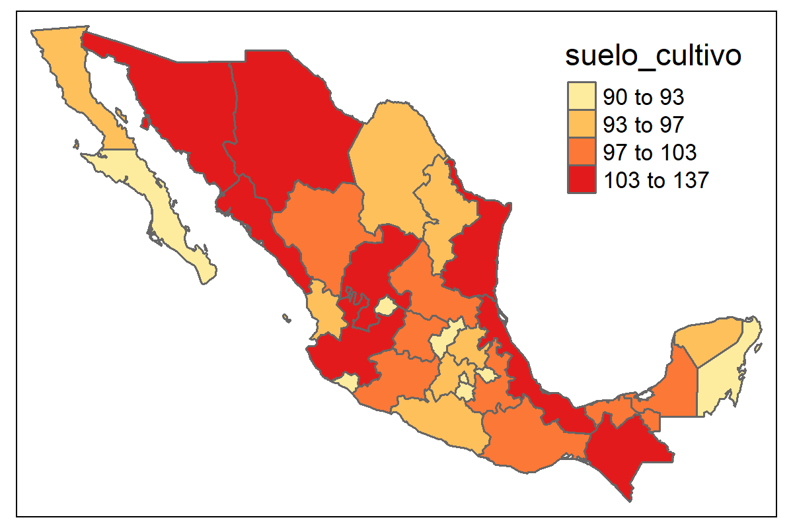
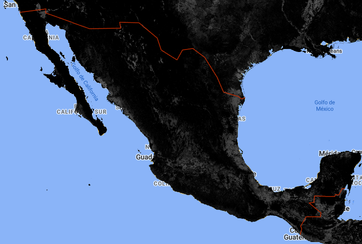
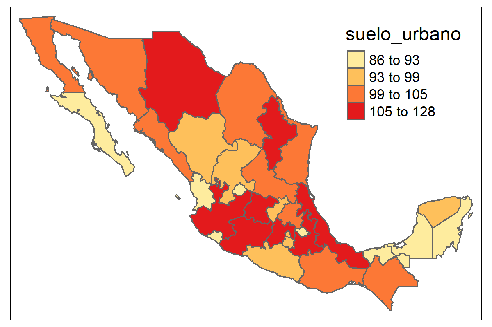
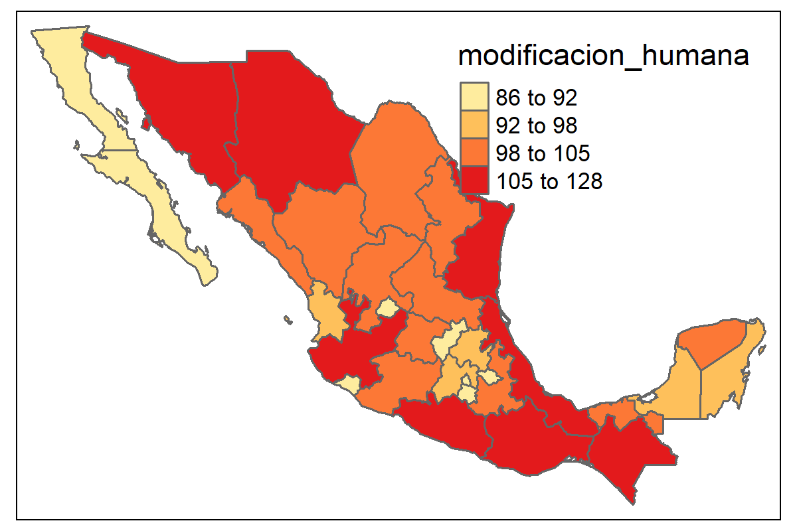
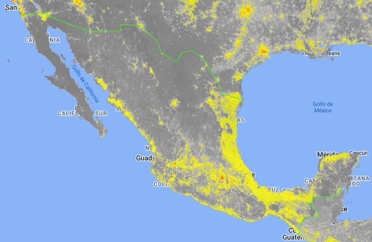
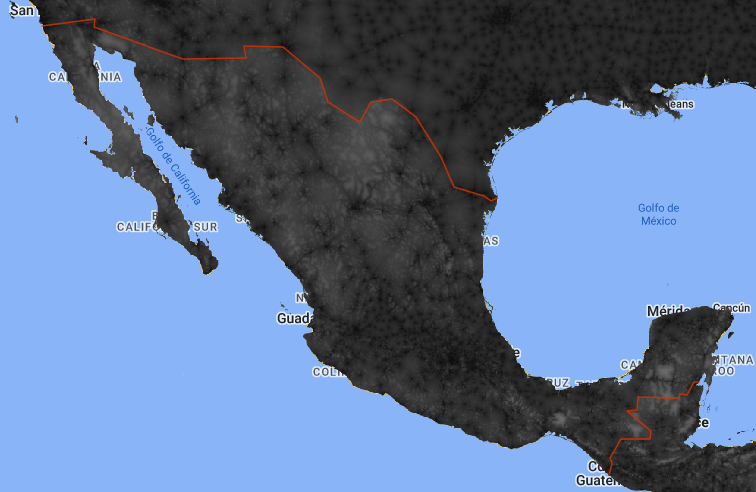
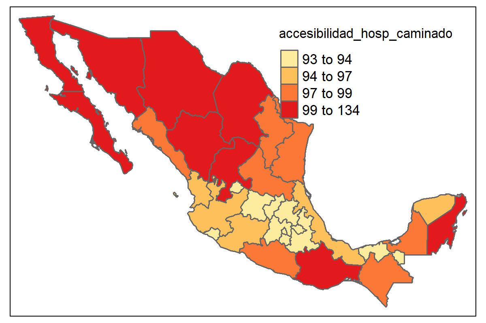

# Día 1 - Sesión 2- Censo e información satelital


## Uso de imágenes satelitales y SAE

Uno de los artículo pioneros de estimación de áreas pequeñas fue el artículo de Singh, R, et. al. (2002) el cual abordó la estimación del rendimiento de cultivos para los tehsil (unidad subadministrativa)  del distriyo Rohtak district en Haryana (India). 


Las imágenes raster representan el mundo mediante un conjunto de celdas contiguas igualmente espaciadas conocidas como pixeles, estas imágenes tienen información como un sistema de información geográfico, Un sistema de referencia de coordenadas. Las imágenes almacenan un identificador, un valor en cada pixel (o un vector con diferentes valores) y cada celda tiene asociada una escala de colores.

Las imágenes pueden obtenerse crudas y procesadas, estas primeras contienen solamente las capas de colores, las segundas contienen también valores que han sido procesados en cada celda (índices de vegetación, intensidad lumínica, tipo de vegetación). 

La información cruda puede utilizarse para entrenar características que se desean entrenar (carreteras, tipo de cultivo, bosque / no bosque), afortunadamente en Google Earth Engine encontramos muchos indicadores  procesadas asociadas a un pixel. Estos indicadores pueden agregarse a nivel de un área geográfica.


### Fuentes de datos de imágenes satelitales

Algunas de las principales fuentes de imágenes satelitales son: 

  * http://earthexplorer.usgs.gov/

  * https://lpdaacsvc.cr.usgs.gov/appeears/

  * https://search.earthdata.nasa.gov/search

  * https://scihub.coGTMnicus.eu/

  * https://aws.amazon.com/public-data-sets/landsat/

Sin embargo la mayor parte de estas fuentes están centralizadas en **Google Earth Engine** que permite buscar fuentes de datos provenientes de imágenes satelitales. GEE se puede manejar por medio de APIS en diferentes lenguajes de programación: Javascript (por defecto), Python y R (paquete rgee).


## Google Earth Eninge


Crear una cuenta en [link](https://earthengine.google.com/), una vez que se ingrese a la cuenta puede buscarse los conjuntos de datos de interés:


* Una vez se busque el conjunto de datos se puede abrir un editor de código brindado por google en  Javascript. 

*  Copiar y pegar la sintaxis que brinda el buscador de conjunto de datos para visualizar la imagen raster y disponer de sentencias que GTMmitan la obtención  del conjunto de datos de interés posteriormente en R


## Instalación de rgee

*  Descargar e instalar anaconda o conda. (<https://www.anaconda.com/products/individual>)

*  Abrir **Anaconda prompt** y configurar ambiente de trabajo (ambiente python MEX2023) con las siguientes sentencias:


```python
conda env list
conda create -n MEX2023 python=3.9
activate MEX2023
pip install google-api-python-client
pip install earthengine-api
pip install numpy
```

*  Listar los ambientes de Python disponibles en anaconda prompt


```python
conda env list
```


*   Una vez identificado la ruta del ambiente ambiente MEX2023 definirla en R (**no se debe olvidar cambiar \\ por /**). 
*   Instalar `reticulate` y `rgee`, cargar paquetes para procesamiento espacial y configurar el ambiente de trabajo como sigue:


```r
library(reticulate) # Conexión con Python
library(rgee) # Conexión con Google Earth Engine
library(sf) # Paquete para manejar datos geográficos
library(dplyr) # Paquete para procesamiento de datos
library(magrittr)

rgee_environment_dir = "C:/Users/gnieto/Anaconda3/envs/MEX2023/python.exe"

# Configurar python (Algunas veces no es detectado y se debe reiniciar R)
reticulate::use_python(rgee_environment_dir, required=T)

rgee::ee_install_set_pyenv(py_path = rgee_environment_dir, py_env = "MEX2023")

Sys.setenv(RETICULATE_PYTHON = rgee_environment_dir)
Sys.setenv(EARTHENGINE_PYTHON = rgee_environment_dir)
```

*  Una vez configurado el ambiente puede iniciarlizarse una sesión de Google Earth Engine como sigue:


```r
rgee::ee_Initialize(drive = T)
```


**Notas:** 

-   Se debe inicializar cada sesión con el comando `rgee::ee_Initialize(drive = T)`. 

-   Los comandos de javascript que invoquen métodos con "." se sustituyen por signo peso ($), por ejemplo:


```r
ee.ImageCollection().filterDate()  # Javascript
ee$ImageCollection()$filterDate()  # R
```

### Descargar información satelital

*   **Paso 1**: disponer de los shapefile 


```r
shape <- read_sf("Recursos/Día1/Sesion2/Shape/MEX_dam.shp") 
#shape <- read_sf("Recursos/Día1/Sesion2/Shape/MEX_dam2.shp")
plot(shape["geometry"])
```


*   **Paso 2**: Seleccionar el archivo de imágenes  que desea procesar, para nuestro ejemplo **luces nocturnas**.  


```r
luces <- ee$ImageCollection("NOAA/DMSP-OLS/NIGHTTIME_LIGHTS") %>%
  ee$ImageCollection$filterDate("2013-01-01", "2014-01-01") %>%
  ee$ImageCollection$map(function(x) x$select("stable_lights")) %>%
  ee$ImageCollection$toBands()
```

* **Paso 3**: Descargar la información


```r
## Tiempo 10 minutos 
shape_luces <- map(unique(shape$dam),
                 ~tryCatch(ee_extract(
                   x = luces,
                   y = shape["dam"] %>% filter(dam == .x),
                   ee$Reducer$mean(),
                   sf = FALSE
                 ) %>% mutate(dam = .x),
                 error = function(e)data.frame(dam = .x)))

shape_luces %<>% bind_rows()

tba(shape_luces, cap = "Promedio de luces nocturnasa")
```

<table class="table table-striped lightable-classic" style="margin-left: auto; margin-right: auto; font-family: Arial Narrow; margin-left: auto; margin-right: auto;">
<caption>(\#tab:unnamed-chunk-13)Promedio de luces nocturnas estandarizada</caption>
 <thead>
  <tr>
   <th style="text-align:left;"> dam </th>
   <th style="text-align:right;"> luces_nocturnas </th>
  </tr>
 </thead>
<tbody>
  <tr>
   <td style="text-align:left;"> 02 </td>
   <td style="text-align:right;"> 98.1895 </td>
  </tr>
  <tr>
   <td style="text-align:left;"> 03 </td>
   <td style="text-align:right;"> 88.4394 </td>
  </tr>
  <tr>
   <td style="text-align:left;"> 18 </td>
   <td style="text-align:right;"> 88.7521 </td>
  </tr>
  <tr>
   <td style="text-align:left;"> 14 </td>
   <td style="text-align:right;"> 117.8567 </td>
  </tr>
  <tr>
   <td style="text-align:left;"> 01 </td>
   <td style="text-align:right;"> 89.4560 </td>
  </tr>
  <tr>
   <td style="text-align:left;"> 11 </td>
   <td style="text-align:right;"> 116.0198 </td>
  </tr>
  <tr>
   <td style="text-align:left;"> 22 </td>
   <td style="text-align:right;"> 94.6416 </td>
  </tr>
  <tr>
   <td style="text-align:left;"> 13 </td>
   <td style="text-align:right;"> 101.5930 </td>
  </tr>
  <tr>
   <td style="text-align:left;"> 16 </td>
   <td style="text-align:right;"> 103.8342 </td>
  </tr>
  <tr>
   <td style="text-align:left;"> 15 </td>
   <td style="text-align:right;"> 126.0225 </td>
  </tr>
  <tr>
   <td style="text-align:left;"> 09 </td>
   <td style="text-align:right;"> 89.1780 </td>
  </tr>
  <tr>
   <td style="text-align:left;"> 06 </td>
   <td style="text-align:right;"> 87.1353 </td>
  </tr>
  <tr>
   <td style="text-align:left;"> 17 </td>
   <td style="text-align:right;"> 93.3744 </td>
  </tr>
  <tr>
   <td style="text-align:left;"> 31 </td>
   <td style="text-align:right;"> 95.1464 </td>
  </tr>
  <tr>
   <td style="text-align:left;"> 04 </td>
   <td style="text-align:right;"> 90.4240 </td>
  </tr>
  <tr>
   <td style="text-align:left;"> 21 </td>
   <td style="text-align:right;"> 110.1384 </td>
  </tr>
  <tr>
   <td style="text-align:left;"> 23 </td>
   <td style="text-align:right;"> 90.7170 </td>
  </tr>
  <tr>
   <td style="text-align:left;"> 29 </td>
   <td style="text-align:right;"> 90.3565 </td>
  </tr>
  <tr>
   <td style="text-align:left;"> 12 </td>
   <td style="text-align:right;"> 98.6019 </td>
  </tr>
  <tr>
   <td style="text-align:left;"> 20 </td>
   <td style="text-align:right;"> 100.0054 </td>
  </tr>
  <tr>
   <td style="text-align:left;"> 27 </td>
   <td style="text-align:right;"> 101.5690 </td>
  </tr>
  <tr>
   <td style="text-align:left;"> 07 </td>
   <td style="text-align:right;"> 107.1431 </td>
  </tr>
  <tr>
   <td style="text-align:left;"> 26 </td>
   <td style="text-align:right;"> 103.5783 </td>
  </tr>
  <tr>
   <td style="text-align:left;"> 08 </td>
   <td style="text-align:right;"> 104.0508 </td>
  </tr>
  <tr>
   <td style="text-align:left;"> 05 </td>
   <td style="text-align:right;"> 100.0359 </td>
  </tr>
  <tr>
   <td style="text-align:left;"> 25 </td>
   <td style="text-align:right;"> 100.8792 </td>
  </tr>
  <tr>
   <td style="text-align:left;"> 10 </td>
   <td style="text-align:right;"> 93.7401 </td>
  </tr>
  <tr>
   <td style="text-align:left;"> 32 </td>
   <td style="text-align:right;"> 96.9760 </td>
  </tr>
  <tr>
   <td style="text-align:left;"> 24 </td>
   <td style="text-align:right;"> 95.8973 </td>
  </tr>
  <tr>
   <td style="text-align:left;"> 19 </td>
   <td style="text-align:right;"> 103.5633 </td>
  </tr>
  <tr>
   <td style="text-align:left;"> 28 </td>
   <td style="text-align:right;"> 99.4590 </td>
  </tr>
  <tr>
   <td style="text-align:left;"> 30 </td>
   <td style="text-align:right;"> 123.2261 </td>
  </tr>
</tbody>
</table>

Repetir la rutina para: 

-   Tipo de suelo: **crops-coverfraction** (Porcentaje de cubrimiento cultivos) y **urban-coverfraction** (Porcentaje de cobertura urbana) disponibles en <https://develoGTMs.google.com/earth-engine/datasets/catalog/COGTMNICUS_Landcover_100m_Proba-V-C3_Global#description> 


- Tiempo de viaje al hospital o clínica más cercana (**accessibility**) y tiempo de viaje al hospital o clínica más cercana utilizando transporte no motorizado (**accessibility_walking_only**) información disponible en <https://develoGTMs.google.com/earth-engine/datasets/catalog/Oxford_MAP_accessibility_to_healthcare_2019> 

- Modificación humana, donde se consideran los asentamiento humano, la agricultura, el transporte, la minería y producción de energía e infraestructura eléctrica. En el siguiente link encuentra la información satelital  <https://develoGTMs.google.com/earth-engine/datasets/catalog/CSP_HM_GlobalHumanModification#description>


* **Paso 4**  consolidar la información. 

<table class="table table-striped lightable-classic" style="margin-left: auto; margin-right: auto; font-family: Arial Narrow; margin-left: auto; margin-right: auto;">
<caption>(\#tab:unnamed-chunk-14)Predictores satelitales estandarizados</caption>
 <thead>
  <tr>
   <th style="text-align:left;"> dam </th>
   <th style="text-align:right;"> luces_nocturnas </th>
   <th style="text-align:right;"> suelo_cultivo </th>
   <th style="text-align:right;"> suelo_urbano </th>
   <th style="text-align:right;"> modificacion_humana </th>
   <th style="text-align:right;"> accesibilidad_hospitales </th>
   <th style="text-align:right;"> accesibilidad_hosp_caminado </th>
  </tr>
 </thead>
<tbody>
  <tr>
   <td style="text-align:left;"> 02 </td>
   <td style="text-align:right;"> 98.1895 </td>
   <td style="text-align:right;"> 93.6670 </td>
   <td style="text-align:right;"> 102.6645 </td>
   <td style="text-align:right;"> 90.7414 </td>
   <td style="text-align:right;"> 112.6403 </td>
   <td style="text-align:right;"> 113.6432 </td>
  </tr>
  <tr>
   <td style="text-align:left;"> 03 </td>
   <td style="text-align:right;"> 88.4394 </td>
   <td style="text-align:right;"> 91.1942 </td>
   <td style="text-align:right;"> 87.6937 </td>
   <td style="text-align:right;"> 90.3823 </td>
   <td style="text-align:right;"> 106.3704 </td>
   <td style="text-align:right;"> 108.0033 </td>
  </tr>
  <tr>
   <td style="text-align:left;"> 18 </td>
   <td style="text-align:right;"> 88.7521 </td>
   <td style="text-align:right;"> 94.3308 </td>
   <td style="text-align:right;"> 89.0983 </td>
   <td style="text-align:right;"> 93.4305 </td>
   <td style="text-align:right;"> 95.3447 </td>
   <td style="text-align:right;"> 95.1180 </td>
  </tr>
  <tr>
   <td style="text-align:left;"> 14 </td>
   <td style="text-align:right;"> 117.8567 </td>
   <td style="text-align:right;"> 109.1871 </td>
   <td style="text-align:right;"> 115.4318 </td>
   <td style="text-align:right;"> 111.4279 </td>
   <td style="text-align:right;"> 96.6370 </td>
   <td style="text-align:right;"> 96.8989 </td>
  </tr>
  <tr>
   <td style="text-align:left;"> 01 </td>
   <td style="text-align:right;"> 89.4560 </td>
   <td style="text-align:right;"> 91.4337 </td>
   <td style="text-align:right;"> 88.7284 </td>
   <td style="text-align:right;"> 87.5749 </td>
   <td style="text-align:right;"> 92.5297 </td>
   <td style="text-align:right;"> 92.8327 </td>
  </tr>
  <tr>
   <td style="text-align:left;"> 11 </td>
   <td style="text-align:right;"> 116.0198 </td>
   <td style="text-align:right;"> 101.9790 </td>
   <td style="text-align:right;"> 110.8788 </td>
   <td style="text-align:right;"> 98.1615 </td>
   <td style="text-align:right;"> 93.3039 </td>
   <td style="text-align:right;"> 93.7549 </td>
  </tr>
  <tr>
   <td style="text-align:left;"> 22 </td>
   <td style="text-align:right;"> 94.6416 </td>
   <td style="text-align:right;"> 91.8641 </td>
   <td style="text-align:right;"> 94.3658 </td>
   <td style="text-align:right;"> 89.7262 </td>
   <td style="text-align:right;"> 92.8276 </td>
   <td style="text-align:right;"> 93.1459 </td>
  </tr>
  <tr>
   <td style="text-align:left;"> 13 </td>
   <td style="text-align:right;"> 101.5930 </td>
   <td style="text-align:right;"> 94.5173 </td>
   <td style="text-align:right;"> 99.3851 </td>
   <td style="text-align:right;"> 94.5405 </td>
   <td style="text-align:right;"> 92.9706 </td>
   <td style="text-align:right;"> 93.3128 </td>
  </tr>
  <tr>
   <td style="text-align:left;"> 16 </td>
   <td style="text-align:right;"> 103.8342 </td>
   <td style="text-align:right;"> 99.8159 </td>
   <td style="text-align:right;"> 106.5804 </td>
   <td style="text-align:right;"> 104.7533 </td>
   <td style="text-align:right;"> 95.5144 </td>
   <td style="text-align:right;"> 96.1129 </td>
  </tr>
  <tr>
   <td style="text-align:left;"> 15 </td>
   <td style="text-align:right;"> 126.0225 </td>
   <td style="text-align:right;"> 96.7277 </td>
   <td style="text-align:right;"> 128.4589 </td>
   <td style="text-align:right;"> 96.6770 </td>
   <td style="text-align:right;"> 92.7404 </td>
   <td style="text-align:right;"> 93.0623 </td>
  </tr>
</tbody>
</table>

Los resultados se muestran en los siguientes mapas


### Luces nocturnas 


### Cubrimiento cultivos 




### Cubrimiento urbanos




### Modificación humana 



### Tiempo promedio al hospital 



### Tiempo promedio al hospital en vehiculo no motorizado




## Censos de población y vivienda

Es necesario definir las variables del país con los que se desea trabajar. De acuerdo a esto, como primer paso se debe tener acceso al censo del país, para ello puede acceder desde el siguiente enlace <https://redatam.org/en/microdata> en el cual dispondrá de un archivo *.zip* con los microdatos del país. Ahora bien, para leer el conjunto de datos, es necesario emplear la función *redatam.open* de la librería `redatam`, la cual depende directamente del diccionario censal del software REDATAM, este es un archivo con extensión dicx y que debe encontrarse en la carpeta sobre los datos que se están leyendo. Así, es como se crea un objeto dentro de `R` que hace la respectiva unión del diccionario con los microdatos de la base de datos censal. La siguiente sintaxis muestra la lectura del diccionario en `R` y los cálculos iniciales

 


```r
library(redatam)
mexico <- redatam.open("Recursos/Día1/Sesion2/Data/cpv2020mex-cde.dicX")

CONTEOS <- redatam.query(
  mexico,
    "freq   ENT.REDCODEN
       by     VIVIENDA.area
       by   PERSONA.sexo
       by   PERSONA.edad
       by   PERSONA.pbloper
       by   PERSONA.ESCOACUM
       by   PERSONA.disres",
  tot.omit = FALSE
)
# Eliminando totales de la tabla
CONTEOS2 <-
  CONTEOS %>% filter_at(vars(matches("_label")), 
                        all_vars(. !=  "__tot__"))
```

Después de realizar algunas validaciones se estandarizan las variables como muestra el siguiente código.


```r
censo_mrp <- CONTEOS2 %>% transmute(
  dam = str_pad(
    string = REDCODEN1_value,
    width = 2,
    pad = "0"
  ),
  area = case_when(area2_value == 1 ~ "1", # 1 = Urbana
                   TRUE ~ "0"),    # 0 = Rural
  sexo = as.character(sexo3_value),
  edad = case_when(
    edad4_value %in% 0:14 ~ "1",       # 5 a 14
    edad4_value %in% 15:29 ~ "2",      # 15 a 29
    edad4_value %in% 30:44 ~ "3",      # 30 a 44
    edad4_value %in% 45:64 ~ "4",      # 45 a 64
    TRUE ~ "5"
  ),     # 65 o mas


  anoest = case_when(
    edad4_value < 2| is.na(ESCOACUM6_value) ~ "98",     # No aplica
    ESCOACUM6_value == 99 ~ "99", #NS/NR
    ESCOACUM6_value %in% 0 ~ "1",  # Sin educacion
    ESCOACUM6_value %in% c(1:6) ~ "2",  # 1-6
    ESCOACUM6_value %in% c(7:12) ~ "3",  # 7-12
    ESCOACUM6_value > 12 ~ "4" ,  # 12 o mas
    TRUE ~ "Error"
  ),


  etnia = case_when(
    pbloper5_value == 1 ~ "1",    # Indigena
    pbloper5_value %in% c(5, 2)  ~ "2", # Afro,
    TRUE ~ "3" # Otro
  ),
  discapacidad = case_when(
    disres7_value == 8 ~ "0",    # No discapacitado
    TRUE ~ "1" # Discapacitado
  ),
  value
) %>% group_by(depto, area, etnia, sexo, edad, anoest, discapacidad) %>%
  summarise(n = sum(value), .groups = "drop")
```

A partir de la base estandarizada es posible construir algunas covariables para el departamento. 


```r
censo_mrp <- readRDS("Recursos/Día1/Sesion2/Data/censo_mrp_dam.rds") 
tasa_censo <- model.matrix(dam ~ -1 +.,
                           data = censo_mrp %>% select(-n)) %>% 
  data.frame() %>%
  mutate(dam = censo_mrp$dam, 
         n = censo_mrp$n) %>% 
  group_by(dam) %>%
  summarise_all(~weighted.mean(x = .,w = n)) %>%
  mutate(etnia1 = 1-etnia3-etnia2) %>% 
  select(-area0, -anoest98,-anoest99,-etnia3,-n) 
tba(tasa_censo)
```

<table class="table table-striped lightable-classic" style="margin-left: auto; margin-right: auto; font-family: Arial Narrow; margin-left: auto; margin-right: auto;">
 <thead>
  <tr>
   <th style="text-align:left;"> dam </th>
   <th style="text-align:right;"> area1 </th>
   <th style="text-align:right;"> etnia2 </th>
   <th style="text-align:right;"> sexo2 </th>
   <th style="text-align:right;"> edad2 </th>
   <th style="text-align:right;"> edad3 </th>
   <th style="text-align:right;"> edad4 </th>
   <th style="text-align:right;"> edad5 </th>
   <th style="text-align:right;"> anoest2 </th>
   <th style="text-align:right;"> anoest3 </th>
   <th style="text-align:right;"> anoest4 </th>
   <th style="text-align:right;"> discapacidad1 </th>
   <th style="text-align:right;"> etnia1 </th>
  </tr>
 </thead>
<tbody>
  <tr>
   <td style="text-align:left;"> 01 </td>
   <td style="text-align:right;"> 0.8448 </td>
   <td style="text-align:right;"> 0.0125 </td>
   <td style="text-align:right;"> 0.5142 </td>
   <td style="text-align:right;"> 0.2645 </td>
   <td style="text-align:right;"> 0.2106 </td>
   <td style="text-align:right;"> 0.1854 </td>
   <td style="text-align:right;"> 0.0655 </td>
   <td style="text-align:right;"> 0.2341 </td>
   <td style="text-align:right;"> 0.4255 </td>
   <td style="text-align:right;"> 0.1886 </td>
   <td style="text-align:right;"> 0.0576 </td>
   <td style="text-align:right;"> 0.0547 </td>
  </tr>
  <tr>
   <td style="text-align:left;"> 02 </td>
   <td style="text-align:right;"> 0.9534 </td>
   <td style="text-align:right;"> 0.0229 </td>
   <td style="text-align:right;"> 0.4955 </td>
   <td style="text-align:right;"> 0.2616 </td>
   <td style="text-align:right;"> 0.2301 </td>
   <td style="text-align:right;"> 0.2047 </td>
   <td style="text-align:right;"> 0.0634 </td>
   <td style="text-align:right;"> 0.2357 </td>
   <td style="text-align:right;"> 0.4697 </td>
   <td style="text-align:right;"> 0.1531 </td>
   <td style="text-align:right;"> 0.0529 </td>
   <td style="text-align:right;"> 0.0696 </td>
  </tr>
  <tr>
   <td style="text-align:left;"> 03 </td>
   <td style="text-align:right;"> 0.9041 </td>
   <td style="text-align:right;"> 0.0287 </td>
   <td style="text-align:right;"> 0.4960 </td>
   <td style="text-align:right;"> 0.2486 </td>
   <td style="text-align:right;"> 0.2440 </td>
   <td style="text-align:right;"> 0.1943 </td>
   <td style="text-align:right;"> 0.0606 </td>
   <td style="text-align:right;"> 0.2363 </td>
   <td style="text-align:right;"> 0.4564 </td>
   <td style="text-align:right;"> 0.1661 </td>
   <td style="text-align:right;"> 0.0483 </td>
   <td style="text-align:right;"> 0.1025 </td>
  </tr>
  <tr>
   <td style="text-align:left;"> 04 </td>
   <td style="text-align:right;"> 0.7731 </td>
   <td style="text-align:right;"> 0.0323 </td>
   <td style="text-align:right;"> 0.5084 </td>
   <td style="text-align:right;"> 0.2421 </td>
   <td style="text-align:right;"> 0.2224 </td>
   <td style="text-align:right;"> 0.2017 </td>
   <td style="text-align:right;"> 0.0724 </td>
   <td style="text-align:right;"> 0.2451 </td>
   <td style="text-align:right;"> 0.3923 </td>
   <td style="text-align:right;"> 0.1686 </td>
   <td style="text-align:right;"> 0.0795 </td>
   <td style="text-align:right;"> 0.4275 </td>
  </tr>
  <tr>
   <td style="text-align:left;"> 05 </td>
   <td style="text-align:right;"> 0.9182 </td>
   <td style="text-align:right;"> 0.0085 </td>
   <td style="text-align:right;"> 0.5018 </td>
   <td style="text-align:right;"> 0.2467 </td>
   <td style="text-align:right;"> 0.2079 </td>
   <td style="text-align:right;"> 0.2061 </td>
   <td style="text-align:right;"> 0.0764 </td>
   <td style="text-align:right;"> 0.2274 </td>
   <td style="text-align:right;"> 0.4522 </td>
   <td style="text-align:right;"> 0.1677 </td>
   <td style="text-align:right;"> 0.0467 </td>
   <td style="text-align:right;"> 0.0189 </td>
  </tr>
  <tr>
   <td style="text-align:left;"> 06 </td>
   <td style="text-align:right;"> 0.9002 </td>
   <td style="text-align:right;"> 0.0130 </td>
   <td style="text-align:right;"> 0.5105 </td>
   <td style="text-align:right;"> 0.2451 </td>
   <td style="text-align:right;"> 0.2250 </td>
   <td style="text-align:right;"> 0.2092 </td>
   <td style="text-align:right;"> 0.0819 </td>
   <td style="text-align:right;"> 0.2509 </td>
   <td style="text-align:right;"> 0.4208 </td>
   <td style="text-align:right;"> 0.1762 </td>
   <td style="text-align:right;"> 0.0566 </td>
   <td style="text-align:right;"> 0.1211 </td>
  </tr>
  <tr>
   <td style="text-align:left;"> 07 </td>
   <td style="text-align:right;"> 0.4933 </td>
   <td style="text-align:right;"> 0.0078 </td>
   <td style="text-align:right;"> 0.5127 </td>
   <td style="text-align:right;"> 0.2574 </td>
   <td style="text-align:right;"> 0.1964 </td>
   <td style="text-align:right;"> 0.1597 </td>
   <td style="text-align:right;"> 0.0625 </td>
   <td style="text-align:right;"> 0.3446 </td>
   <td style="text-align:right;"> 0.3093 </td>
   <td style="text-align:right;"> 0.0882 </td>
   <td style="text-align:right;"> 0.0452 </td>
   <td style="text-align:right;"> 0.3416 </td>
  </tr>
  <tr>
   <td style="text-align:left;"> 08 </td>
   <td style="text-align:right;"> 0.8727 </td>
   <td style="text-align:right;"> 0.0097 </td>
   <td style="text-align:right;"> 0.5057 </td>
   <td style="text-align:right;"> 0.2494 </td>
   <td style="text-align:right;"> 0.2098 </td>
   <td style="text-align:right;"> 0.2059 </td>
   <td style="text-align:right;"> 0.0748 </td>
   <td style="text-align:right;"> 0.2632 </td>
   <td style="text-align:right;"> 0.4235 </td>
   <td style="text-align:right;"> 0.1646 </td>
   <td style="text-align:right;"> 0.0501 </td>
   <td style="text-align:right;"> 0.0971 </td>
  </tr>
  <tr>
   <td style="text-align:left;"> 09 </td>
   <td style="text-align:right;"> 0.9945 </td>
   <td style="text-align:right;"> 0.0201 </td>
   <td style="text-align:right;"> 0.5227 </td>
   <td style="text-align:right;"> 0.2292 </td>
   <td style="text-align:right;"> 0.2279 </td>
   <td style="text-align:right;"> 0.2476 </td>
   <td style="text-align:right;"> 0.1137 </td>
   <td style="text-align:right;"> 0.1828 </td>
   <td style="text-align:right;"> 0.4417 </td>
   <td style="text-align:right;"> 0.2730 </td>
   <td style="text-align:right;"> 0.0607 </td>
   <td style="text-align:right;"> 0.0842 </td>
  </tr>
  <tr>
   <td style="text-align:left;"> 10 </td>
   <td style="text-align:right;"> 0.7435 </td>
   <td style="text-align:right;"> 0.0101 </td>
   <td style="text-align:right;"> 0.5074 </td>
   <td style="text-align:right;"> 0.2521 </td>
   <td style="text-align:right;"> 0.1954 </td>
   <td style="text-align:right;"> 0.1927 </td>
   <td style="text-align:right;"> 0.0742 </td>
   <td style="text-align:right;"> 0.2730 </td>
   <td style="text-align:right;"> 0.4356 </td>
   <td style="text-align:right;"> 0.1333 </td>
   <td style="text-align:right;"> 0.0573 </td>
   <td style="text-align:right;"> 0.0810 </td>
  </tr>
  <tr>
   <td style="text-align:left;"> 11 </td>
   <td style="text-align:right;"> 0.7389 </td>
   <td style="text-align:right;"> 0.0105 </td>
   <td style="text-align:right;"> 0.5153 </td>
   <td style="text-align:right;"> 0.2603 </td>
   <td style="text-align:right;"> 0.2097 </td>
   <td style="text-align:right;"> 0.1848 </td>
   <td style="text-align:right;"> 0.0742 </td>
   <td style="text-align:right;"> 0.2889 </td>
   <td style="text-align:right;"> 0.4287 </td>
   <td style="text-align:right;"> 0.1030 </td>
   <td style="text-align:right;"> 0.0551 </td>
   <td style="text-align:right;"> 0.0574 </td>
  </tr>
  <tr>
   <td style="text-align:left;"> 12 </td>
   <td style="text-align:right;"> 0.6151 </td>
   <td style="text-align:right;"> 0.0887 </td>
   <td style="text-align:right;"> 0.5187 </td>
   <td style="text-align:right;"> 0.2439 </td>
   <td style="text-align:right;"> 0.1892 </td>
   <td style="text-align:right;"> 0.1812 </td>
   <td style="text-align:right;"> 0.0900 </td>
   <td style="text-align:right;"> 0.3101 </td>
   <td style="text-align:right;"> 0.3576 </td>
   <td style="text-align:right;"> 0.1062 </td>
   <td style="text-align:right;"> 0.0649 </td>
   <td style="text-align:right;"> 0.2727 </td>
  </tr>
  <tr>
   <td style="text-align:left;"> 13 </td>
   <td style="text-align:right;"> 0.5742 </td>
   <td style="text-align:right;"> 0.0261 </td>
   <td style="text-align:right;"> 0.5197 </td>
   <td style="text-align:right;"> 0.2411 </td>
   <td style="text-align:right;"> 0.2107 </td>
   <td style="text-align:right;"> 0.2031 </td>
   <td style="text-align:right;"> 0.0874 </td>
   <td style="text-align:right;"> 0.2653 </td>
   <td style="text-align:right;"> 0.4351 </td>
   <td style="text-align:right;"> 0.1348 </td>
   <td style="text-align:right;"> 0.0578 </td>
   <td style="text-align:right;"> 0.3354 </td>
  </tr>
  <tr>
   <td style="text-align:left;"> 14 </td>
   <td style="text-align:right;"> 0.8848 </td>
   <td style="text-align:right;"> 0.0128 </td>
   <td style="text-align:right;"> 0.5115 </td>
   <td style="text-align:right;"> 0.2515 </td>
   <td style="text-align:right;"> 0.2135 </td>
   <td style="text-align:right;"> 0.1962 </td>
   <td style="text-align:right;"> 0.0831 </td>
   <td style="text-align:right;"> 0.2704 </td>
   <td style="text-align:right;"> 0.4136 </td>
   <td style="text-align:right;"> 0.1648 </td>
   <td style="text-align:right;"> 0.0521 </td>
   <td style="text-align:right;"> 0.0632 </td>
  </tr>
  <tr>
   <td style="text-align:left;"> 15 </td>
   <td style="text-align:right;"> 0.8796 </td>
   <td style="text-align:right;"> 0.0180 </td>
   <td style="text-align:right;"> 0.5152 </td>
   <td style="text-align:right;"> 0.2505 </td>
   <td style="text-align:right;"> 0.2170 </td>
   <td style="text-align:right;"> 0.2135 </td>
   <td style="text-align:right;"> 0.0750 </td>
   <td style="text-align:right;"> 0.2404 </td>
   <td style="text-align:right;"> 0.4631 </td>
   <td style="text-align:right;"> 0.1525 </td>
   <td style="text-align:right;"> 0.0515 </td>
   <td style="text-align:right;"> 0.1441 </td>
  </tr>
  <tr>
   <td style="text-align:left;"> 16 </td>
   <td style="text-align:right;"> 0.7332 </td>
   <td style="text-align:right;"> 0.0119 </td>
   <td style="text-align:right;"> 0.5152 </td>
   <td style="text-align:right;"> 0.2461 </td>
   <td style="text-align:right;"> 0.1989 </td>
   <td style="text-align:right;"> 0.1919 </td>
   <td style="text-align:right;"> 0.0913 </td>
   <td style="text-align:right;"> 0.3274 </td>
   <td style="text-align:right;"> 0.3604 </td>
   <td style="text-align:right;"> 0.1206 </td>
   <td style="text-align:right;"> 0.0593 </td>
   <td style="text-align:right;"> 0.1913 </td>
  </tr>
  <tr>
   <td style="text-align:left;"> 17 </td>
   <td style="text-align:right;"> 0.8235 </td>
   <td style="text-align:right;"> 0.0218 </td>
   <td style="text-align:right;"> 0.5165 </td>
   <td style="text-align:right;"> 0.2454 </td>
   <td style="text-align:right;"> 0.2066 </td>
   <td style="text-align:right;"> 0.2144 </td>
   <td style="text-align:right;"> 0.0943 </td>
   <td style="text-align:right;"> 0.2453 </td>
   <td style="text-align:right;"> 0.4334 </td>
   <td style="text-align:right;"> 0.1698 </td>
   <td style="text-align:right;"> 0.0611 </td>
   <td style="text-align:right;"> 0.2250 </td>
  </tr>
  <tr>
   <td style="text-align:left;"> 18 </td>
   <td style="text-align:right;"> 0.7033 </td>
   <td style="text-align:right;"> 0.0097 </td>
   <td style="text-align:right;"> 0.5049 </td>
   <td style="text-align:right;"> 0.2389 </td>
   <td style="text-align:right;"> 0.2050 </td>
   <td style="text-align:right;"> 0.1964 </td>
   <td style="text-align:right;"> 0.0888 </td>
   <td style="text-align:right;"> 0.2677 </td>
   <td style="text-align:right;"> 0.4163 </td>
   <td style="text-align:right;"> 0.1513 </td>
   <td style="text-align:right;"> 0.0593 </td>
   <td style="text-align:right;"> 0.1475 </td>
  </tr>
  <tr>
   <td style="text-align:left;"> 19 </td>
   <td style="text-align:right;"> 0.9619 </td>
   <td style="text-align:right;"> 0.0188 </td>
   <td style="text-align:right;"> 0.4995 </td>
   <td style="text-align:right;"> 0.2521 </td>
   <td style="text-align:right;"> 0.2199 </td>
   <td style="text-align:right;"> 0.2094 </td>
   <td style="text-align:right;"> 0.0792 </td>
   <td style="text-align:right;"> 0.2053 </td>
   <td style="text-align:right;"> 0.4658 </td>
   <td style="text-align:right;"> 0.1895 </td>
   <td style="text-align:right;"> 0.0489 </td>
   <td style="text-align:right;"> 0.0574 </td>
  </tr>
  <tr>
   <td style="text-align:left;"> 20 </td>
   <td style="text-align:right;"> 0.5094 </td>
   <td style="text-align:right;"> 0.0502 </td>
   <td style="text-align:right;"> 0.5220 </td>
   <td style="text-align:right;"> 0.2357 </td>
   <td style="text-align:right;"> 0.2004 </td>
   <td style="text-align:right;"> 0.1899 </td>
   <td style="text-align:right;"> 0.0966 </td>
   <td style="text-align:right;"> 0.3442 </td>
   <td style="text-align:right;"> 0.3486 </td>
   <td style="text-align:right;"> 0.0993 </td>
   <td style="text-align:right;"> 0.0698 </td>
   <td style="text-align:right;"> 0.6241 </td>
  </tr>
  <tr>
   <td style="text-align:left;"> 21 </td>
   <td style="text-align:right;"> 0.7305 </td>
   <td style="text-align:right;"> 0.0209 </td>
   <td style="text-align:right;"> 0.5189 </td>
   <td style="text-align:right;"> 0.2575 </td>
   <td style="text-align:right;"> 0.2066 </td>
   <td style="text-align:right;"> 0.1830 </td>
   <td style="text-align:right;"> 0.0789 </td>
   <td style="text-align:right;"> 0.3115 </td>
   <td style="text-align:right;"> 0.3680 </td>
   <td style="text-align:right;"> 0.1395 </td>
   <td style="text-align:right;"> 0.0502 </td>
   <td style="text-align:right;"> 0.3031 </td>
  </tr>
  <tr>
   <td style="text-align:left;"> 22 </td>
   <td style="text-align:right;"> 0.8054 </td>
   <td style="text-align:right;"> 0.0171 </td>
   <td style="text-align:right;"> 0.5123 </td>
   <td style="text-align:right;"> 0.2584 </td>
   <td style="text-align:right;"> 0.2293 </td>
   <td style="text-align:right;"> 0.1930 </td>
   <td style="text-align:right;"> 0.0712 </td>
   <td style="text-align:right;"> 0.2328 </td>
   <td style="text-align:right;"> 0.4082 </td>
   <td style="text-align:right;"> 0.2056 </td>
   <td style="text-align:right;"> 0.0448 </td>
   <td style="text-align:right;"> 0.1192 </td>
  </tr>
  <tr>
   <td style="text-align:left;"> 23 </td>
   <td style="text-align:right;"> 0.8915 </td>
   <td style="text-align:right;"> 0.0269 </td>
   <td style="text-align:right;"> 0.4975 </td>
   <td style="text-align:right;"> 0.2673 </td>
   <td style="text-align:right;"> 0.2547 </td>
   <td style="text-align:right;"> 0.1780 </td>
   <td style="text-align:right;"> 0.0454 </td>
   <td style="text-align:right;"> 0.2236 </td>
   <td style="text-align:right;"> 0.4797 </td>
   <td style="text-align:right;"> 0.1419 </td>
   <td style="text-align:right;"> 0.0401 </td>
   <td style="text-align:right;"> 0.3023 </td>
  </tr>
  <tr>
   <td style="text-align:left;"> 24 </td>
   <td style="text-align:right;"> 0.6681 </td>
   <td style="text-align:right;"> 0.0131 </td>
   <td style="text-align:right;"> 0.5135 </td>
   <td style="text-align:right;"> 0.2501 </td>
   <td style="text-align:right;"> 0.2060 </td>
   <td style="text-align:right;"> 0.1955 </td>
   <td style="text-align:right;"> 0.0908 </td>
   <td style="text-align:right;"> 0.2611 </td>
   <td style="text-align:right;"> 0.4255 </td>
   <td style="text-align:right;"> 0.1500 </td>
   <td style="text-align:right;"> 0.0566 </td>
   <td style="text-align:right;"> 0.1881 </td>
  </tr>
  <tr>
   <td style="text-align:left;"> 25 </td>
   <td style="text-align:right;"> 0.7769 </td>
   <td style="text-align:right;"> 0.0099 </td>
   <td style="text-align:right;"> 0.5092 </td>
   <td style="text-align:right;"> 0.2489 </td>
   <td style="text-align:right;"> 0.2026 </td>
   <td style="text-align:right;"> 0.2094 </td>
   <td style="text-align:right;"> 0.0916 </td>
   <td style="text-align:right;"> 0.2618 </td>
   <td style="text-align:right;"> 0.3947 </td>
   <td style="text-align:right;"> 0.1984 </td>
   <td style="text-align:right;"> 0.0575 </td>
   <td style="text-align:right;"> 0.0861 </td>
  </tr>
  <tr>
   <td style="text-align:left;"> 26 </td>
   <td style="text-align:right;"> 0.8861 </td>
   <td style="text-align:right;"> 0.0185 </td>
   <td style="text-align:right;"> 0.5040 </td>
   <td style="text-align:right;"> 0.2459 </td>
   <td style="text-align:right;"> 0.2126 </td>
   <td style="text-align:right;"> 0.2122 </td>
   <td style="text-align:right;"> 0.0819 </td>
   <td style="text-align:right;"> 0.2243 </td>
   <td style="text-align:right;"> 0.4678 </td>
   <td style="text-align:right;"> 0.1729 </td>
   <td style="text-align:right;"> 0.0562 </td>
   <td style="text-align:right;"> 0.1230 </td>
  </tr>
  <tr>
   <td style="text-align:left;"> 27 </td>
   <td style="text-align:right;"> 0.6269 </td>
   <td style="text-align:right;"> 0.0112 </td>
   <td style="text-align:right;"> 0.5146 </td>
   <td style="text-align:right;"> 0.2390 </td>
   <td style="text-align:right;"> 0.2204 </td>
   <td style="text-align:right;"> 0.1958 </td>
   <td style="text-align:right;"> 0.0742 </td>
   <td style="text-align:right;"> 0.2665 </td>
   <td style="text-align:right;"> 0.4170 </td>
   <td style="text-align:right;"> 0.1516 </td>
   <td style="text-align:right;"> 0.0653 </td>
   <td style="text-align:right;"> 0.1975 </td>
  </tr>
  <tr>
   <td style="text-align:left;"> 28 </td>
   <td style="text-align:right;"> 0.8985 </td>
   <td style="text-align:right;"> 0.0081 </td>
   <td style="text-align:right;"> 0.5079 </td>
   <td style="text-align:right;"> 0.2424 </td>
   <td style="text-align:right;"> 0.2134 </td>
   <td style="text-align:right;"> 0.2143 </td>
   <td style="text-align:right;"> 0.0827 </td>
   <td style="text-align:right;"> 0.2482 </td>
   <td style="text-align:right;"> 0.4414 </td>
   <td style="text-align:right;"> 0.1699 </td>
   <td style="text-align:right;"> 0.0537 </td>
   <td style="text-align:right;"> 0.0613 </td>
  </tr>
  <tr>
   <td style="text-align:left;"> 29 </td>
   <td style="text-align:right;"> 0.8316 </td>
   <td style="text-align:right;"> 0.0160 </td>
   <td style="text-align:right;"> 0.5153 </td>
   <td style="text-align:right;"> 0.2548 </td>
   <td style="text-align:right;"> 0.2127 </td>
   <td style="text-align:right;"> 0.1930 </td>
   <td style="text-align:right;"> 0.0751 </td>
   <td style="text-align:right;"> 0.2570 </td>
   <td style="text-align:right;"> 0.4355 </td>
   <td style="text-align:right;"> 0.1445 </td>
   <td style="text-align:right;"> 0.0587 </td>
   <td style="text-align:right;"> 0.1502 </td>
  </tr>
  <tr>
   <td style="text-align:left;"> 30 </td>
   <td style="text-align:right;"> 0.6236 </td>
   <td style="text-align:right;"> 0.0241 </td>
   <td style="text-align:right;"> 0.5203 </td>
   <td style="text-align:right;"> 0.2312 </td>
   <td style="text-align:right;"> 0.2047 </td>
   <td style="text-align:right;"> 0.2184 </td>
   <td style="text-align:right;"> 0.1013 </td>
   <td style="text-align:right;"> 0.3181 </td>
   <td style="text-align:right;"> 0.3722 </td>
   <td style="text-align:right;"> 0.1319 </td>
   <td style="text-align:right;"> 0.0619 </td>
   <td style="text-align:right;"> 0.2459 </td>
  </tr>
  <tr>
   <td style="text-align:left;"> 31 </td>
   <td style="text-align:right;"> 0.8595 </td>
   <td style="text-align:right;"> 0.0352 </td>
   <td style="text-align:right;"> 0.5068 </td>
   <td style="text-align:right;"> 0.2517 </td>
   <td style="text-align:right;"> 0.2218 </td>
   <td style="text-align:right;"> 0.1987 </td>
   <td style="text-align:right;"> 0.0885 </td>
   <td style="text-align:right;"> 0.2727 </td>
   <td style="text-align:right;"> 0.3975 </td>
   <td style="text-align:right;"> 0.1705 </td>
   <td style="text-align:right;"> 0.0644 </td>
   <td style="text-align:right;"> 0.5956 </td>
  </tr>
  <tr>
   <td style="text-align:left;"> 32 </td>
   <td style="text-align:right;"> 0.6562 </td>
   <td style="text-align:right;"> 0.0083 </td>
   <td style="text-align:right;"> 0.5132 </td>
   <td style="text-align:right;"> 0.2383 </td>
   <td style="text-align:right;"> 0.2025 </td>
   <td style="text-align:right;"> 0.1882 </td>
   <td style="text-align:right;"> 0.0855 </td>
   <td style="text-align:right;"> 0.2944 </td>
   <td style="text-align:right;"> 0.4119 </td>
   <td style="text-align:right;"> 0.1261 </td>
   <td style="text-align:right;"> 0.0610 </td>
   <td style="text-align:right;"> 0.0436 </td>
  </tr>
</tbody>
</table>

El indicador también es posible definirlo a partir de una variable del censo, haciendo que el proceso sea más corto, para este caso es empleada la variable `VIVIENDA.PISOS`, agregada por dam 

En el primer bloque que código usando la función `redatam.query()` se realiza el conteo de viviendas por el material del piso. Seguido de esto, eliminamos los registros que no son de interés, por ejemplo, el total en el dam o total nacional, los cuales se identifican dentro de la base con la etiqueta `__tot__`. 

El siguiente paso es contar el número de viviendas por dam que tienen los *pisos de tierra*  en el censo (`Pobx`) y el total de viviendas que respondieron a la pregunta (`PobT`), para finalmente realizar el cociente de estas dos preguntas.  


```r
CONTEOS <- redatam.query(mexico,
                         "freq  ENT.REDCODEN
                          by  VIVIENDA.PISOS",
                         tot.omit = FALSE)

PISO <- CONTEOS %>%
  filter_at(vars(matches("_label")),
            all_vars(!. %in%  c("__tot__", "__mv__")))

tasa_piso <- PISO %>%
  mutate(Pobx = ifelse(PISOS2_value %in% c(1), value, 0),
         PobT = value) %>%
  group_by(depto = str_pad(
    string = REDCODEN1_value,
    width = 2,
    pad = "0"
  )) %>%
  summarise(PobT = sum(PobT),
            Pobx = sum(Pobx)) %>%
  transmute(depto,
            piso_tierra = Pobx / PobT)
```

La tabla resultante se muestra a continuación. 

<table class="table table-striped lightable-classic" style="margin-left: auto; margin-right: auto; font-family: Arial Narrow; margin-left: auto; margin-right: auto;">
 <thead>
  <tr>
   <th style="text-align:left;"> dam </th>
   <th style="text-align:right;"> piso_tierra </th>
  </tr>
 </thead>
<tbody>
  <tr>
   <td style="text-align:left;"> 01 </td>
   <td style="text-align:right;"> 0.0034 </td>
  </tr>
  <tr>
   <td style="text-align:left;"> 02 </td>
   <td style="text-align:right;"> 0.0151 </td>
  </tr>
  <tr>
   <td style="text-align:left;"> 03 </td>
   <td style="text-align:right;"> 0.0321 </td>
  </tr>
  <tr>
   <td style="text-align:left;"> 04 </td>
   <td style="text-align:right;"> 0.0229 </td>
  </tr>
  <tr>
   <td style="text-align:left;"> 05 </td>
   <td style="text-align:right;"> 0.0058 </td>
  </tr>
  <tr>
   <td style="text-align:left;"> 06 </td>
   <td style="text-align:right;"> 0.0169 </td>
  </tr>
  <tr>
   <td style="text-align:left;"> 07 </td>
   <td style="text-align:right;"> 0.1102 </td>
  </tr>
  <tr>
   <td style="text-align:left;"> 08 </td>
   <td style="text-align:right;"> 0.0171 </td>
  </tr>
  <tr>
   <td style="text-align:left;"> 09 </td>
   <td style="text-align:right;"> 0.0033 </td>
  </tr>
  <tr>
   <td style="text-align:left;"> 10 </td>
   <td style="text-align:right;"> 0.0328 </td>
  </tr>
  <tr>
   <td style="text-align:left;"> 11 </td>
   <td style="text-align:right;"> 0.0136 </td>
  </tr>
  <tr>
   <td style="text-align:left;"> 12 </td>
   <td style="text-align:right;"> 0.1218 </td>
  </tr>
  <tr>
   <td style="text-align:left;"> 13 </td>
   <td style="text-align:right;"> 0.0251 </td>
  </tr>
  <tr>
   <td style="text-align:left;"> 14 </td>
   <td style="text-align:right;"> 0.0107 </td>
  </tr>
  <tr>
   <td style="text-align:left;"> 15 </td>
   <td style="text-align:right;"> 0.0140 </td>
  </tr>
  <tr>
   <td style="text-align:left;"> 16 </td>
   <td style="text-align:right;"> 0.0388 </td>
  </tr>
  <tr>
   <td style="text-align:left;"> 17 </td>
   <td style="text-align:right;"> 0.0300 </td>
  </tr>
  <tr>
   <td style="text-align:left;"> 18 </td>
   <td style="text-align:right;"> 0.0303 </td>
  </tr>
  <tr>
   <td style="text-align:left;"> 19 </td>
   <td style="text-align:right;"> 0.0050 </td>
  </tr>
  <tr>
   <td style="text-align:left;"> 20 </td>
   <td style="text-align:right;"> 0.1174 </td>
  </tr>
  <tr>
   <td style="text-align:left;"> 21 </td>
   <td style="text-align:right;"> 0.0457 </td>
  </tr>
  <tr>
   <td style="text-align:left;"> 22 </td>
   <td style="text-align:right;"> 0.0108 </td>
  </tr>
  <tr>
   <td style="text-align:left;"> 23 </td>
   <td style="text-align:right;"> 0.0154 </td>
  </tr>
  <tr>
   <td style="text-align:left;"> 24 </td>
   <td style="text-align:right;"> 0.0430 </td>
  </tr>
  <tr>
   <td style="text-align:left;"> 25 </td>
   <td style="text-align:right;"> 0.0204 </td>
  </tr>
  <tr>
   <td style="text-align:left;"> 26 </td>
   <td style="text-align:right;"> 0.0200 </td>
  </tr>
  <tr>
   <td style="text-align:left;"> 27 </td>
   <td style="text-align:right;"> 0.0316 </td>
  </tr>
  <tr>
   <td style="text-align:left;"> 28 </td>
   <td style="text-align:right;"> 0.0113 </td>
  </tr>
  <tr>
   <td style="text-align:left;"> 29 </td>
   <td style="text-align:right;"> 0.0129 </td>
  </tr>
  <tr>
   <td style="text-align:left;"> 30 </td>
   <td style="text-align:right;"> 0.0546 </td>
  </tr>
  <tr>
   <td style="text-align:left;"> 31 </td>
   <td style="text-align:right;"> 0.0119 </td>
  </tr>
  <tr>
   <td style="text-align:left;"> 32 </td>
   <td style="text-align:right;"> 0.0098 </td>
  </tr>
</tbody>
</table>


El proceso se repite con otras preguntas del censo hasta consolidar la tabla siguiente. 


```r
predictors_censo_dam <- readRDS("Recursos/Día1/Sesion2/Data/predictors_satelital_dam.rds") %>% 
  select(-c(luces_nocturnas:accesibilidad_hosp_caminado))
tba(predictors_censo_dam)
```

<table class="table table-striped lightable-classic" style="margin-left: auto; margin-right: auto; font-family: Arial Narrow; margin-left: auto; margin-right: auto;">
 <thead>
  <tr>
   <th style="text-align:left;"> dam </th>
   <th style="text-align:right;"> area1 </th>
   <th style="text-align:right;"> etnia2 </th>
   <th style="text-align:right;"> sexo2 </th>
   <th style="text-align:right;"> edad2 </th>
   <th style="text-align:right;"> edad3 </th>
   <th style="text-align:right;"> edad4 </th>
   <th style="text-align:right;"> edad5 </th>
   <th style="text-align:right;"> anoest2 </th>
   <th style="text-align:right;"> anoest3 </th>
   <th style="text-align:right;"> anoest4 </th>
   <th style="text-align:right;"> discapacidad1 </th>
   <th style="text-align:right;"> etnia1 </th>
   <th style="text-align:right;"> tiene_sanitario </th>
   <th style="text-align:right;"> tiene_electricidad </th>
   <th style="text-align:right;"> tiene_acueducto </th>
   <th style="text-align:right;"> tiene_gas </th>
   <th style="text-align:right;"> eliminar_basura </th>
   <th style="text-align:right;"> tiene_internet </th>
   <th style="text-align:right;"> piso_tierra </th>
   <th style="text-align:right;"> material_paredes </th>
   <th style="text-align:right;"> material_techo </th>
   <th style="text-align:right;"> rezago_escolar </th>
   <th style="text-align:right;"> alfabeta </th>
   <th style="text-align:right;"> hacinamiento </th>
   <th style="text-align:right;"> tasa_desocupacion </th>
  </tr>
 </thead>
<tbody>
  <tr>
   <td style="text-align:left;"> 02 </td>
   <td style="text-align:right;"> 0.9534 </td>
   <td style="text-align:right;"> 0.0229 </td>
   <td style="text-align:right;"> 0.4955 </td>
   <td style="text-align:right;"> 0.2616 </td>
   <td style="text-align:right;"> 0.2301 </td>
   <td style="text-align:right;"> 0.2047 </td>
   <td style="text-align:right;"> 0.0634 </td>
   <td style="text-align:right;"> 0.2357 </td>
   <td style="text-align:right;"> 0.4697 </td>
   <td style="text-align:right;"> 0.1531 </td>
   <td style="text-align:right;"> 0.0529 </td>
   <td style="text-align:right;"> 0.0696 </td>
   <td style="text-align:right;"> 0.0065 </td>
   <td style="text-align:right;"> 0.5651 </td>
   <td style="text-align:right;"> 0.0661 </td>
   <td style="text-align:right;"> 0.0421 </td>
   <td style="text-align:right;"> 0.0412 </td>
   <td style="text-align:right;"> 0.3004 </td>
   <td style="text-align:right;"> 0.0151 </td>
   <td style="text-align:right;"> 0.1804 </td>
   <td style="text-align:right;"> 0.3994 </td>
   <td style="text-align:right;"> 0.2318 </td>
   <td style="text-align:right;"> 0.0456 </td>
   <td style="text-align:right;"> 0.2259 </td>
   <td style="text-align:right;"> 0.0228 </td>
  </tr>
  <tr>
   <td style="text-align:left;"> 03 </td>
   <td style="text-align:right;"> 0.9041 </td>
   <td style="text-align:right;"> 0.0287 </td>
   <td style="text-align:right;"> 0.4960 </td>
   <td style="text-align:right;"> 0.2486 </td>
   <td style="text-align:right;"> 0.2440 </td>
   <td style="text-align:right;"> 0.1943 </td>
   <td style="text-align:right;"> 0.0606 </td>
   <td style="text-align:right;"> 0.2363 </td>
   <td style="text-align:right;"> 0.4564 </td>
   <td style="text-align:right;"> 0.1661 </td>
   <td style="text-align:right;"> 0.0483 </td>
   <td style="text-align:right;"> 0.1025 </td>
   <td style="text-align:right;"> 0.0065 </td>
   <td style="text-align:right;"> 0.6135 </td>
   <td style="text-align:right;"> 0.1014 </td>
   <td style="text-align:right;"> 0.0840 </td>
   <td style="text-align:right;"> 0.0368 </td>
   <td style="text-align:right;"> 0.3336 </td>
   <td style="text-align:right;"> 0.0321 </td>
   <td style="text-align:right;"> 0.0824 </td>
   <td style="text-align:right;"> 0.1956 </td>
   <td style="text-align:right;"> 0.2478 </td>
   <td style="text-align:right;"> 0.0512 </td>
   <td style="text-align:right;"> 0.2404 </td>
   <td style="text-align:right;"> 0.0232 </td>
  </tr>
  <tr>
   <td style="text-align:left;"> 18 </td>
   <td style="text-align:right;"> 0.7033 </td>
   <td style="text-align:right;"> 0.0097 </td>
   <td style="text-align:right;"> 0.5049 </td>
   <td style="text-align:right;"> 0.2389 </td>
   <td style="text-align:right;"> 0.2050 </td>
   <td style="text-align:right;"> 0.1964 </td>
   <td style="text-align:right;"> 0.0888 </td>
   <td style="text-align:right;"> 0.2677 </td>
   <td style="text-align:right;"> 0.4163 </td>
   <td style="text-align:right;"> 0.1513 </td>
   <td style="text-align:right;"> 0.0593 </td>
   <td style="text-align:right;"> 0.1475 </td>
   <td style="text-align:right;"> 0.0352 </td>
   <td style="text-align:right;"> 0.7995 </td>
   <td style="text-align:right;"> 0.1430 </td>
   <td style="text-align:right;"> 0.1536 </td>
   <td style="text-align:right;"> 0.1522 </td>
   <td style="text-align:right;"> 0.5236 </td>
   <td style="text-align:right;"> 0.0303 </td>
   <td style="text-align:right;"> 0.0866 </td>
   <td style="text-align:right;"> 0.1657 </td>
   <td style="text-align:right;"> 0.2304 </td>
   <td style="text-align:right;"> 0.0753 </td>
   <td style="text-align:right;"> 0.2526 </td>
   <td style="text-align:right;"> 0.0204 </td>
  </tr>
  <tr>
   <td style="text-align:left;"> 14 </td>
   <td style="text-align:right;"> 0.8848 </td>
   <td style="text-align:right;"> 0.0128 </td>
   <td style="text-align:right;"> 0.5115 </td>
   <td style="text-align:right;"> 0.2515 </td>
   <td style="text-align:right;"> 0.2135 </td>
   <td style="text-align:right;"> 0.1962 </td>
   <td style="text-align:right;"> 0.0831 </td>
   <td style="text-align:right;"> 0.2704 </td>
   <td style="text-align:right;"> 0.4136 </td>
   <td style="text-align:right;"> 0.1648 </td>
   <td style="text-align:right;"> 0.0521 </td>
   <td style="text-align:right;"> 0.0632 </td>
   <td style="text-align:right;"> 0.0073 </td>
   <td style="text-align:right;"> 0.6678 </td>
   <td style="text-align:right;"> 0.0931 </td>
   <td style="text-align:right;"> 0.0624 </td>
   <td style="text-align:right;"> 0.0155 </td>
   <td style="text-align:right;"> 0.3628 </td>
   <td style="text-align:right;"> 0.0107 </td>
   <td style="text-align:right;"> 0.0487 </td>
   <td style="text-align:right;"> 0.0500 </td>
   <td style="text-align:right;"> 0.2490 </td>
   <td style="text-align:right;"> 0.0570 </td>
   <td style="text-align:right;"> 0.2130 </td>
   <td style="text-align:right;"> 0.0240 </td>
  </tr>
  <tr>
   <td style="text-align:left;"> 01 </td>
   <td style="text-align:right;"> 0.8448 </td>
   <td style="text-align:right;"> 0.0125 </td>
   <td style="text-align:right;"> 0.5142 </td>
   <td style="text-align:right;"> 0.2645 </td>
   <td style="text-align:right;"> 0.2106 </td>
   <td style="text-align:right;"> 0.1854 </td>
   <td style="text-align:right;"> 0.0655 </td>
   <td style="text-align:right;"> 0.2341 </td>
   <td style="text-align:right;"> 0.4255 </td>
   <td style="text-align:right;"> 0.1886 </td>
   <td style="text-align:right;"> 0.0576 </td>
   <td style="text-align:right;"> 0.0547 </td>
   <td style="text-align:right;"> 0.0056 </td>
   <td style="text-align:right;"> 0.5739 </td>
   <td style="text-align:right;"> 0.0761 </td>
   <td style="text-align:right;"> 0.0367 </td>
   <td style="text-align:right;"> 0.0110 </td>
   <td style="text-align:right;"> 0.3627 </td>
   <td style="text-align:right;"> 0.0034 </td>
   <td style="text-align:right;"> 0.0480 </td>
   <td style="text-align:right;"> 0.0239 </td>
   <td style="text-align:right;"> 0.2925 </td>
   <td style="text-align:right;"> 0.0458 </td>
   <td style="text-align:right;"> 0.2063 </td>
   <td style="text-align:right;"> 0.0289 </td>
  </tr>
  <tr>
   <td style="text-align:left;"> 11 </td>
   <td style="text-align:right;"> 0.7389 </td>
   <td style="text-align:right;"> 0.0105 </td>
   <td style="text-align:right;"> 0.5153 </td>
   <td style="text-align:right;"> 0.2603 </td>
   <td style="text-align:right;"> 0.2097 </td>
   <td style="text-align:right;"> 0.1848 </td>
   <td style="text-align:right;"> 0.0742 </td>
   <td style="text-align:right;"> 0.2889 </td>
   <td style="text-align:right;"> 0.4287 </td>
   <td style="text-align:right;"> 0.1030 </td>
   <td style="text-align:right;"> 0.0551 </td>
   <td style="text-align:right;"> 0.0574 </td>
   <td style="text-align:right;"> 0.0234 </td>
   <td style="text-align:right;"> 0.6324 </td>
   <td style="text-align:right;"> 0.2444 </td>
   <td style="text-align:right;"> 0.0840 </td>
   <td style="text-align:right;"> 0.0477 </td>
   <td style="text-align:right;"> 0.5050 </td>
   <td style="text-align:right;"> 0.0136 </td>
   <td style="text-align:right;"> 0.0357 </td>
   <td style="text-align:right;"> 0.0911 </td>
   <td style="text-align:right;"> 0.1598 </td>
   <td style="text-align:right;"> 0.0780 </td>
   <td style="text-align:right;"> 0.2699 </td>
   <td style="text-align:right;"> 0.0363 </td>
  </tr>
  <tr>
   <td style="text-align:left;"> 22 </td>
   <td style="text-align:right;"> 0.8054 </td>
   <td style="text-align:right;"> 0.0171 </td>
   <td style="text-align:right;"> 0.5123 </td>
   <td style="text-align:right;"> 0.2584 </td>
   <td style="text-align:right;"> 0.2293 </td>
   <td style="text-align:right;"> 0.1930 </td>
   <td style="text-align:right;"> 0.0712 </td>
   <td style="text-align:right;"> 0.2328 </td>
   <td style="text-align:right;"> 0.4082 </td>
   <td style="text-align:right;"> 0.2056 </td>
   <td style="text-align:right;"> 0.0448 </td>
   <td style="text-align:right;"> 0.1192 </td>
   <td style="text-align:right;"> 0.0198 </td>
   <td style="text-align:right;"> 0.7170 </td>
   <td style="text-align:right;"> 0.1123 </td>
   <td style="text-align:right;"> 0.0867 </td>
   <td style="text-align:right;"> 0.0173 </td>
   <td style="text-align:right;"> 0.3516 </td>
   <td style="text-align:right;"> 0.0108 </td>
   <td style="text-align:right;"> 0.0183 </td>
   <td style="text-align:right;"> 0.0784 </td>
   <td style="text-align:right;"> 0.3066 </td>
   <td style="text-align:right;"> 0.0570 </td>
   <td style="text-align:right;"> 0.2184 </td>
   <td style="text-align:right;"> 0.0320 </td>
  </tr>
  <tr>
   <td style="text-align:left;"> 13 </td>
   <td style="text-align:right;"> 0.5742 </td>
   <td style="text-align:right;"> 0.0261 </td>
   <td style="text-align:right;"> 0.5197 </td>
   <td style="text-align:right;"> 0.2411 </td>
   <td style="text-align:right;"> 0.2107 </td>
   <td style="text-align:right;"> 0.2031 </td>
   <td style="text-align:right;"> 0.0874 </td>
   <td style="text-align:right;"> 0.2653 </td>
   <td style="text-align:right;"> 0.4351 </td>
   <td style="text-align:right;"> 0.1348 </td>
   <td style="text-align:right;"> 0.0578 </td>
   <td style="text-align:right;"> 0.3354 </td>
   <td style="text-align:right;"> 0.0274 </td>
   <td style="text-align:right;"> 0.7899 </td>
   <td style="text-align:right;"> 0.2174 </td>
   <td style="text-align:right;"> 0.2145 </td>
   <td style="text-align:right;"> 0.1435 </td>
   <td style="text-align:right;"> 0.6082 </td>
   <td style="text-align:right;"> 0.0251 </td>
   <td style="text-align:right;"> 0.0456 </td>
   <td style="text-align:right;"> 0.1515 </td>
   <td style="text-align:right;"> 0.1998 </td>
   <td style="text-align:right;"> 0.0841 </td>
   <td style="text-align:right;"> 0.2612 </td>
   <td style="text-align:right;"> 0.0309 </td>
  </tr>
  <tr>
   <td style="text-align:left;"> 16 </td>
   <td style="text-align:right;"> 0.7332 </td>
   <td style="text-align:right;"> 0.0119 </td>
   <td style="text-align:right;"> 0.5152 </td>
   <td style="text-align:right;"> 0.2461 </td>
   <td style="text-align:right;"> 0.1989 </td>
   <td style="text-align:right;"> 0.1919 </td>
   <td style="text-align:right;"> 0.0913 </td>
   <td style="text-align:right;"> 0.3274 </td>
   <td style="text-align:right;"> 0.3604 </td>
   <td style="text-align:right;"> 0.1206 </td>
   <td style="text-align:right;"> 0.0593 </td>
   <td style="text-align:right;"> 0.1913 </td>
   <td style="text-align:right;"> 0.0172 </td>
   <td style="text-align:right;"> 0.6654 </td>
   <td style="text-align:right;"> 0.1993 </td>
   <td style="text-align:right;"> 0.1733 </td>
   <td style="text-align:right;"> 0.0890 </td>
   <td style="text-align:right;"> 0.5346 </td>
   <td style="text-align:right;"> 0.0388 </td>
   <td style="text-align:right;"> 0.1195 </td>
   <td style="text-align:right;"> 0.1977 </td>
   <td style="text-align:right;"> 0.1831 </td>
   <td style="text-align:right;"> 0.0976 </td>
   <td style="text-align:right;"> 0.2639 </td>
   <td style="text-align:right;"> 0.0283 </td>
  </tr>
  <tr>
   <td style="text-align:left;"> 15 </td>
   <td style="text-align:right;"> 0.8796 </td>
   <td style="text-align:right;"> 0.0180 </td>
   <td style="text-align:right;"> 0.5152 </td>
   <td style="text-align:right;"> 0.2505 </td>
   <td style="text-align:right;"> 0.2170 </td>
   <td style="text-align:right;"> 0.2135 </td>
   <td style="text-align:right;"> 0.0750 </td>
   <td style="text-align:right;"> 0.2404 </td>
   <td style="text-align:right;"> 0.4631 </td>
   <td style="text-align:right;"> 0.1525 </td>
   <td style="text-align:right;"> 0.0515 </td>
   <td style="text-align:right;"> 0.1441 </td>
   <td style="text-align:right;"> 0.0145 </td>
   <td style="text-align:right;"> 0.5008 </td>
   <td style="text-align:right;"> 0.1643 </td>
   <td style="text-align:right;"> 0.0741 </td>
   <td style="text-align:right;"> 0.0581 </td>
   <td style="text-align:right;"> 0.4246 </td>
   <td style="text-align:right;"> 0.0140 </td>
   <td style="text-align:right;"> 0.0347 </td>
   <td style="text-align:right;"> 0.0901 </td>
   <td style="text-align:right;"> 0.2242 </td>
   <td style="text-align:right;"> 0.0509 </td>
   <td style="text-align:right;"> 0.2802 </td>
   <td style="text-align:right;"> 0.0430 </td>
  </tr>
  <tr>
   <td style="text-align:left;"> 09 </td>
   <td style="text-align:right;"> 0.9945 </td>
   <td style="text-align:right;"> 0.0201 </td>
   <td style="text-align:right;"> 0.5227 </td>
   <td style="text-align:right;"> 0.2292 </td>
   <td style="text-align:right;"> 0.2279 </td>
   <td style="text-align:right;"> 0.2476 </td>
   <td style="text-align:right;"> 0.1137 </td>
   <td style="text-align:right;"> 0.1828 </td>
   <td style="text-align:right;"> 0.4417 </td>
   <td style="text-align:right;"> 0.2730 </td>
   <td style="text-align:right;"> 0.0607 </td>
   <td style="text-align:right;"> 0.0842 </td>
   <td style="text-align:right;"> 0.0021 </td>
   <td style="text-align:right;"> 0.1082 </td>
   <td style="text-align:right;"> 0.0392 </td>
   <td style="text-align:right;"> 0.0352 </td>
   <td style="text-align:right;"> 0.0051 </td>
   <td style="text-align:right;"> 0.2263 </td>
   <td style="text-align:right;"> 0.0033 </td>
   <td style="text-align:right;"> 0.0118 </td>
   <td style="text-align:right;"> 0.0552 </td>
   <td style="text-align:right;"> 0.3654 </td>
   <td style="text-align:right;"> 0.0312 </td>
   <td style="text-align:right;"> 0.1945 </td>
   <td style="text-align:right;"> 0.0358 </td>
  </tr>
  <tr>
   <td style="text-align:left;"> 06 </td>
   <td style="text-align:right;"> 0.9002 </td>
   <td style="text-align:right;"> 0.0130 </td>
   <td style="text-align:right;"> 0.5105 </td>
   <td style="text-align:right;"> 0.2451 </td>
   <td style="text-align:right;"> 0.2250 </td>
   <td style="text-align:right;"> 0.2092 </td>
   <td style="text-align:right;"> 0.0819 </td>
   <td style="text-align:right;"> 0.2509 </td>
   <td style="text-align:right;"> 0.4208 </td>
   <td style="text-align:right;"> 0.1762 </td>
   <td style="text-align:right;"> 0.0566 </td>
   <td style="text-align:right;"> 0.1211 </td>
   <td style="text-align:right;"> 0.0041 </td>
   <td style="text-align:right;"> 0.5624 </td>
   <td style="text-align:right;"> 0.0274 </td>
   <td style="text-align:right;"> 0.1100 </td>
   <td style="text-align:right;"> 0.0204 </td>
   <td style="text-align:right;"> 0.3942 </td>
   <td style="text-align:right;"> 0.0169 </td>
   <td style="text-align:right;"> 0.0267 </td>
   <td style="text-align:right;"> 0.1826 </td>
   <td style="text-align:right;"> 0.2598 </td>
   <td style="text-align:right;"> 0.0587 </td>
   <td style="text-align:right;"> 0.2182 </td>
   <td style="text-align:right;"> 0.0202 </td>
  </tr>
  <tr>
   <td style="text-align:left;"> 17 </td>
   <td style="text-align:right;"> 0.8235 </td>
   <td style="text-align:right;"> 0.0218 </td>
   <td style="text-align:right;"> 0.5165 </td>
   <td style="text-align:right;"> 0.2454 </td>
   <td style="text-align:right;"> 0.2066 </td>
   <td style="text-align:right;"> 0.2144 </td>
   <td style="text-align:right;"> 0.0943 </td>
   <td style="text-align:right;"> 0.2453 </td>
   <td style="text-align:right;"> 0.4334 </td>
   <td style="text-align:right;"> 0.1698 </td>
   <td style="text-align:right;"> 0.0611 </td>
   <td style="text-align:right;"> 0.2250 </td>
   <td style="text-align:right;"> 0.0120 </td>
   <td style="text-align:right;"> 0.4688 </td>
   <td style="text-align:right;"> 0.1835 </td>
   <td style="text-align:right;"> 0.1219 </td>
   <td style="text-align:right;"> 0.0416 </td>
   <td style="text-align:right;"> 0.4111 </td>
   <td style="text-align:right;"> 0.0300 </td>
   <td style="text-align:right;"> 0.0534 </td>
   <td style="text-align:right;"> 0.1661 </td>
   <td style="text-align:right;"> 0.2484 </td>
   <td style="text-align:right;"> 0.0660 </td>
   <td style="text-align:right;"> 0.2564 </td>
   <td style="text-align:right;"> 0.0332 </td>
  </tr>
  <tr>
   <td style="text-align:left;"> 31 </td>
   <td style="text-align:right;"> 0.8595 </td>
   <td style="text-align:right;"> 0.0352 </td>
   <td style="text-align:right;"> 0.5068 </td>
   <td style="text-align:right;"> 0.2517 </td>
   <td style="text-align:right;"> 0.2218 </td>
   <td style="text-align:right;"> 0.1987 </td>
   <td style="text-align:right;"> 0.0885 </td>
   <td style="text-align:right;"> 0.2727 </td>
   <td style="text-align:right;"> 0.3975 </td>
   <td style="text-align:right;"> 0.1705 </td>
   <td style="text-align:right;"> 0.0644 </td>
   <td style="text-align:right;"> 0.5956 </td>
   <td style="text-align:right;"> 0.0645 </td>
   <td style="text-align:right;"> 0.8017 </td>
   <td style="text-align:right;"> 0.0635 </td>
   <td style="text-align:right;"> 0.3560 </td>
   <td style="text-align:right;"> 0.1736 </td>
   <td style="text-align:right;"> 0.4484 </td>
   <td style="text-align:right;"> 0.0119 </td>
   <td style="text-align:right;"> 0.0319 </td>
   <td style="text-align:right;"> 0.0747 </td>
   <td style="text-align:right;"> 0.2498 </td>
   <td style="text-align:right;"> 0.0825 </td>
   <td style="text-align:right;"> 0.3299 </td>
   <td style="text-align:right;"> 0.0166 </td>
  </tr>
  <tr>
   <td style="text-align:left;"> 04 </td>
   <td style="text-align:right;"> 0.7731 </td>
   <td style="text-align:right;"> 0.0323 </td>
   <td style="text-align:right;"> 0.5084 </td>
   <td style="text-align:right;"> 0.2421 </td>
   <td style="text-align:right;"> 0.2224 </td>
   <td style="text-align:right;"> 0.2017 </td>
   <td style="text-align:right;"> 0.0724 </td>
   <td style="text-align:right;"> 0.2451 </td>
   <td style="text-align:right;"> 0.3923 </td>
   <td style="text-align:right;"> 0.1686 </td>
   <td style="text-align:right;"> 0.0795 </td>
   <td style="text-align:right;"> 0.4275 </td>
   <td style="text-align:right;"> 0.0475 </td>
   <td style="text-align:right;"> 0.3700 </td>
   <td style="text-align:right;"> 0.1682 </td>
   <td style="text-align:right;"> 0.3201 </td>
   <td style="text-align:right;"> 0.2263 </td>
   <td style="text-align:right;"> 0.5100 </td>
   <td style="text-align:right;"> 0.0229 </td>
   <td style="text-align:right;"> 0.1469 </td>
   <td style="text-align:right;"> 0.3977 </td>
   <td style="text-align:right;"> 0.2731 </td>
   <td style="text-align:right;"> 0.0850 </td>
   <td style="text-align:right;"> 0.3585 </td>
   <td style="text-align:right;"> 0.0241 </td>
  </tr>
  <tr>
   <td style="text-align:left;"> 21 </td>
   <td style="text-align:right;"> 0.7305 </td>
   <td style="text-align:right;"> 0.0209 </td>
   <td style="text-align:right;"> 0.5189 </td>
   <td style="text-align:right;"> 0.2575 </td>
   <td style="text-align:right;"> 0.2066 </td>
   <td style="text-align:right;"> 0.1830 </td>
   <td style="text-align:right;"> 0.0789 </td>
   <td style="text-align:right;"> 0.3115 </td>
   <td style="text-align:right;"> 0.3680 </td>
   <td style="text-align:right;"> 0.1395 </td>
   <td style="text-align:right;"> 0.0502 </td>
   <td style="text-align:right;"> 0.3031 </td>
   <td style="text-align:right;"> 0.0165 </td>
   <td style="text-align:right;"> 0.7313 </td>
   <td style="text-align:right;"> 0.2116 </td>
   <td style="text-align:right;"> 0.2361 </td>
   <td style="text-align:right;"> 0.1291 </td>
   <td style="text-align:right;"> 0.5776 </td>
   <td style="text-align:right;"> 0.0457 </td>
   <td style="text-align:right;"> 0.0696 </td>
   <td style="text-align:right;"> 0.1903 </td>
   <td style="text-align:right;"> 0.2148 </td>
   <td style="text-align:right;"> 0.0921 </td>
   <td style="text-align:right;"> 0.3378 </td>
   <td style="text-align:right;"> 0.0295 </td>
  </tr>
  <tr>
   <td style="text-align:left;"> 23 </td>
   <td style="text-align:right;"> 0.8915 </td>
   <td style="text-align:right;"> 0.0269 </td>
   <td style="text-align:right;"> 0.4975 </td>
   <td style="text-align:right;"> 0.2673 </td>
   <td style="text-align:right;"> 0.2547 </td>
   <td style="text-align:right;"> 0.1780 </td>
   <td style="text-align:right;"> 0.0454 </td>
   <td style="text-align:right;"> 0.2236 </td>
   <td style="text-align:right;"> 0.4797 </td>
   <td style="text-align:right;"> 0.1419 </td>
   <td style="text-align:right;"> 0.0401 </td>
   <td style="text-align:right;"> 0.3023 </td>
   <td style="text-align:right;"> 0.0153 </td>
   <td style="text-align:right;"> 0.6734 </td>
   <td style="text-align:right;"> 0.0873 </td>
   <td style="text-align:right;"> 0.1771 </td>
   <td style="text-align:right;"> 0.0842 </td>
   <td style="text-align:right;"> 0.4125 </td>
   <td style="text-align:right;"> 0.0154 </td>
   <td style="text-align:right;"> 0.0589 </td>
   <td style="text-align:right;"> 0.0871 </td>
   <td style="text-align:right;"> 0.2188 </td>
   <td style="text-align:right;"> 0.0556 </td>
   <td style="text-align:right;"> 0.3267 </td>
   <td style="text-align:right;"> 0.0187 </td>
  </tr>
  <tr>
   <td style="text-align:left;"> 29 </td>
   <td style="text-align:right;"> 0.8316 </td>
   <td style="text-align:right;"> 0.0160 </td>
   <td style="text-align:right;"> 0.5153 </td>
   <td style="text-align:right;"> 0.2548 </td>
   <td style="text-align:right;"> 0.2127 </td>
   <td style="text-align:right;"> 0.1930 </td>
   <td style="text-align:right;"> 0.0751 </td>
   <td style="text-align:right;"> 0.2570 </td>
   <td style="text-align:right;"> 0.4355 </td>
   <td style="text-align:right;"> 0.1445 </td>
   <td style="text-align:right;"> 0.0587 </td>
   <td style="text-align:right;"> 0.1502 </td>
   <td style="text-align:right;"> 0.0278 </td>
   <td style="text-align:right;"> 0.2229 </td>
   <td style="text-align:right;"> 0.1070 </td>
   <td style="text-align:right;"> 0.1055 </td>
   <td style="text-align:right;"> 0.0416 </td>
   <td style="text-align:right;"> 0.5676 </td>
   <td style="text-align:right;"> 0.0129 </td>
   <td style="text-align:right;"> 0.0621 </td>
   <td style="text-align:right;"> 0.0575 </td>
   <td style="text-align:right;"> 0.2265 </td>
   <td style="text-align:right;"> 0.0573 </td>
   <td style="text-align:right;"> 0.3033 </td>
   <td style="text-align:right;"> 0.0471 </td>
  </tr>
  <tr>
   <td style="text-align:left;"> 12 </td>
   <td style="text-align:right;"> 0.6151 </td>
   <td style="text-align:right;"> 0.0887 </td>
   <td style="text-align:right;"> 0.5187 </td>
   <td style="text-align:right;"> 0.2439 </td>
   <td style="text-align:right;"> 0.1892 </td>
   <td style="text-align:right;"> 0.1812 </td>
   <td style="text-align:right;"> 0.0900 </td>
   <td style="text-align:right;"> 0.3101 </td>
   <td style="text-align:right;"> 0.3576 </td>
   <td style="text-align:right;"> 0.1062 </td>
   <td style="text-align:right;"> 0.0649 </td>
   <td style="text-align:right;"> 0.2727 </td>
   <td style="text-align:right;"> 0.0819 </td>
   <td style="text-align:right;"> 0.7850 </td>
   <td style="text-align:right;"> 0.3264 </td>
   <td style="text-align:right;"> 0.4461 </td>
   <td style="text-align:right;"> 0.3372 </td>
   <td style="text-align:right;"> 0.6799 </td>
   <td style="text-align:right;"> 0.1218 </td>
   <td style="text-align:right;"> 0.2705 </td>
   <td style="text-align:right;"> 0.3482 </td>
   <td style="text-align:right;"> 0.1706 </td>
   <td style="text-align:right;"> 0.1423 </td>
   <td style="text-align:right;"> 0.3988 </td>
   <td style="text-align:right;"> 0.0347 </td>
  </tr>
  <tr>
   <td style="text-align:left;"> 20 </td>
   <td style="text-align:right;"> 0.5094 </td>
   <td style="text-align:right;"> 0.0502 </td>
   <td style="text-align:right;"> 0.5220 </td>
   <td style="text-align:right;"> 0.2357 </td>
   <td style="text-align:right;"> 0.2004 </td>
   <td style="text-align:right;"> 0.1899 </td>
   <td style="text-align:right;"> 0.0966 </td>
   <td style="text-align:right;"> 0.3442 </td>
   <td style="text-align:right;"> 0.3486 </td>
   <td style="text-align:right;"> 0.0993 </td>
   <td style="text-align:right;"> 0.0698 </td>
   <td style="text-align:right;"> 0.6241 </td>
   <td style="text-align:right;"> 0.0254 </td>
   <td style="text-align:right;"> 0.8382 </td>
   <td style="text-align:right;"> 0.3150 </td>
   <td style="text-align:right;"> 0.4952 </td>
   <td style="text-align:right;"> 0.3200 </td>
   <td style="text-align:right;"> 0.6950 </td>
   <td style="text-align:right;"> 0.1174 </td>
   <td style="text-align:right;"> 0.2275 </td>
   <td style="text-align:right;"> 0.4466 </td>
   <td style="text-align:right;"> 0.1531 </td>
   <td style="text-align:right;"> 0.1332 </td>
   <td style="text-align:right;"> 0.3634 </td>
   <td style="text-align:right;"> 0.0292 </td>
  </tr>
  <tr>
   <td style="text-align:left;"> 27 </td>
   <td style="text-align:right;"> 0.6269 </td>
   <td style="text-align:right;"> 0.0112 </td>
   <td style="text-align:right;"> 0.5146 </td>
   <td style="text-align:right;"> 0.2390 </td>
   <td style="text-align:right;"> 0.2204 </td>
   <td style="text-align:right;"> 0.1958 </td>
   <td style="text-align:right;"> 0.0742 </td>
   <td style="text-align:right;"> 0.2665 </td>
   <td style="text-align:right;"> 0.4170 </td>
   <td style="text-align:right;"> 0.1516 </td>
   <td style="text-align:right;"> 0.0653 </td>
   <td style="text-align:right;"> 0.1975 </td>
   <td style="text-align:right;"> 0.0231 </td>
   <td style="text-align:right;"> 0.6747 </td>
   <td style="text-align:right;"> 0.3255 </td>
   <td style="text-align:right;"> 0.3038 </td>
   <td style="text-align:right;"> 0.2462 </td>
   <td style="text-align:right;"> 0.6171 </td>
   <td style="text-align:right;"> 0.0316 </td>
   <td style="text-align:right;"> 0.0860 </td>
   <td style="text-align:right;"> 0.5613 </td>
   <td style="text-align:right;"> 0.2278 </td>
   <td style="text-align:right;"> 0.0752 </td>
   <td style="text-align:right;"> 0.3424 </td>
   <td style="text-align:right;"> 0.0591 </td>
  </tr>
  <tr>
   <td style="text-align:left;"> 07 </td>
   <td style="text-align:right;"> 0.4933 </td>
   <td style="text-align:right;"> 0.0078 </td>
   <td style="text-align:right;"> 0.5127 </td>
   <td style="text-align:right;"> 0.2574 </td>
   <td style="text-align:right;"> 0.1964 </td>
   <td style="text-align:right;"> 0.1597 </td>
   <td style="text-align:right;"> 0.0625 </td>
   <td style="text-align:right;"> 0.3446 </td>
   <td style="text-align:right;"> 0.3093 </td>
   <td style="text-align:right;"> 0.0882 </td>
   <td style="text-align:right;"> 0.0452 </td>
   <td style="text-align:right;"> 0.3416 </td>
   <td style="text-align:right;"> 0.0335 </td>
   <td style="text-align:right;"> 0.7851 </td>
   <td style="text-align:right;"> 0.3423 </td>
   <td style="text-align:right;"> 0.5200 </td>
   <td style="text-align:right;"> 0.3459 </td>
   <td style="text-align:right;"> 0.7706 </td>
   <td style="text-align:right;"> 0.1102 </td>
   <td style="text-align:right;"> 0.2195 </td>
   <td style="text-align:right;"> 0.6238 </td>
   <td style="text-align:right;"> 0.1495 </td>
   <td style="text-align:right;"> 0.1734 </td>
   <td style="text-align:right;"> 0.4423 </td>
   <td style="text-align:right;"> 0.0467 </td>
  </tr>
  <tr>
   <td style="text-align:left;"> 26 </td>
   <td style="text-align:right;"> 0.8861 </td>
   <td style="text-align:right;"> 0.0185 </td>
   <td style="text-align:right;"> 0.5040 </td>
   <td style="text-align:right;"> 0.2459 </td>
   <td style="text-align:right;"> 0.2126 </td>
   <td style="text-align:right;"> 0.2122 </td>
   <td style="text-align:right;"> 0.0819 </td>
   <td style="text-align:right;"> 0.2243 </td>
   <td style="text-align:right;"> 0.4678 </td>
   <td style="text-align:right;"> 0.1729 </td>
   <td style="text-align:right;"> 0.0562 </td>
   <td style="text-align:right;"> 0.1230 </td>
   <td style="text-align:right;"> 0.0106 </td>
   <td style="text-align:right;"> 0.6896 </td>
   <td style="text-align:right;"> 0.0597 </td>
   <td style="text-align:right;"> 0.0687 </td>
   <td style="text-align:right;"> 0.0778 </td>
   <td style="text-align:right;"> 0.3824 </td>
   <td style="text-align:right;"> 0.0200 </td>
   <td style="text-align:right;"> 0.0785 </td>
   <td style="text-align:right;"> 0.2462 </td>
   <td style="text-align:right;"> 0.2552 </td>
   <td style="text-align:right;"> 0.0516 </td>
   <td style="text-align:right;"> 0.2421 </td>
   <td style="text-align:right;"> 0.0341 </td>
  </tr>
  <tr>
   <td style="text-align:left;"> 08 </td>
   <td style="text-align:right;"> 0.8727 </td>
   <td style="text-align:right;"> 0.0097 </td>
   <td style="text-align:right;"> 0.5057 </td>
   <td style="text-align:right;"> 0.2494 </td>
   <td style="text-align:right;"> 0.2098 </td>
   <td style="text-align:right;"> 0.2059 </td>
   <td style="text-align:right;"> 0.0748 </td>
   <td style="text-align:right;"> 0.2632 </td>
   <td style="text-align:right;"> 0.4235 </td>
   <td style="text-align:right;"> 0.1646 </td>
   <td style="text-align:right;"> 0.0501 </td>
   <td style="text-align:right;"> 0.0971 </td>
   <td style="text-align:right;"> 0.0153 </td>
   <td style="text-align:right;"> 0.8879 </td>
   <td style="text-align:right;"> 0.0852 </td>
   <td style="text-align:right;"> 0.0772 </td>
   <td style="text-align:right;"> 0.0555 </td>
   <td style="text-align:right;"> 0.4189 </td>
   <td style="text-align:right;"> 0.0171 </td>
   <td style="text-align:right;"> 0.1695 </td>
   <td style="text-align:right;"> 0.3581 </td>
   <td style="text-align:right;"> 0.2461 </td>
   <td style="text-align:right;"> 0.0579 </td>
   <td style="text-align:right;"> 0.2010 </td>
   <td style="text-align:right;"> 0.0323 </td>
  </tr>
  <tr>
   <td style="text-align:left;"> 05 </td>
   <td style="text-align:right;"> 0.9182 </td>
   <td style="text-align:right;"> 0.0085 </td>
   <td style="text-align:right;"> 0.5018 </td>
   <td style="text-align:right;"> 0.2467 </td>
   <td style="text-align:right;"> 0.2079 </td>
   <td style="text-align:right;"> 0.2061 </td>
   <td style="text-align:right;"> 0.0764 </td>
   <td style="text-align:right;"> 0.2274 </td>
   <td style="text-align:right;"> 0.4522 </td>
   <td style="text-align:right;"> 0.1677 </td>
   <td style="text-align:right;"> 0.0467 </td>
   <td style="text-align:right;"> 0.0189 </td>
   <td style="text-align:right;"> 0.0056 </td>
   <td style="text-align:right;"> 0.5310 </td>
   <td style="text-align:right;"> 0.0474 </td>
   <td style="text-align:right;"> 0.0326 </td>
   <td style="text-align:right;"> 0.0523 </td>
   <td style="text-align:right;"> 0.4265 </td>
   <td style="text-align:right;"> 0.0058 </td>
   <td style="text-align:right;"> 0.0948 </td>
   <td style="text-align:right;"> 0.0993 </td>
   <td style="text-align:right;"> 0.2523 </td>
   <td style="text-align:right;"> 0.0472 </td>
   <td style="text-align:right;"> 0.2140 </td>
   <td style="text-align:right;"> 0.0421 </td>
  </tr>
  <tr>
   <td style="text-align:left;"> 25 </td>
   <td style="text-align:right;"> 0.7769 </td>
   <td style="text-align:right;"> 0.0099 </td>
   <td style="text-align:right;"> 0.5092 </td>
   <td style="text-align:right;"> 0.2489 </td>
   <td style="text-align:right;"> 0.2026 </td>
   <td style="text-align:right;"> 0.2094 </td>
   <td style="text-align:right;"> 0.0916 </td>
   <td style="text-align:right;"> 0.2618 </td>
   <td style="text-align:right;"> 0.3947 </td>
   <td style="text-align:right;"> 0.1984 </td>
   <td style="text-align:right;"> 0.0575 </td>
   <td style="text-align:right;"> 0.0861 </td>
   <td style="text-align:right;"> 0.0208 </td>
   <td style="text-align:right;"> 0.7730 </td>
   <td style="text-align:right;"> 0.0721 </td>
   <td style="text-align:right;"> 0.0885 </td>
   <td style="text-align:right;"> 0.1084 </td>
   <td style="text-align:right;"> 0.4526 </td>
   <td style="text-align:right;"> 0.0204 </td>
   <td style="text-align:right;"> 0.0328 </td>
   <td style="text-align:right;"> 0.0477 </td>
   <td style="text-align:right;"> 0.2889 </td>
   <td style="text-align:right;"> 0.0571 </td>
   <td style="text-align:right;"> 0.2744 </td>
   <td style="text-align:right;"> 0.0300 </td>
  </tr>
  <tr>
   <td style="text-align:left;"> 10 </td>
   <td style="text-align:right;"> 0.7435 </td>
   <td style="text-align:right;"> 0.0101 </td>
   <td style="text-align:right;"> 0.5074 </td>
   <td style="text-align:right;"> 0.2521 </td>
   <td style="text-align:right;"> 0.1954 </td>
   <td style="text-align:right;"> 0.1927 </td>
   <td style="text-align:right;"> 0.0742 </td>
   <td style="text-align:right;"> 0.2730 </td>
   <td style="text-align:right;"> 0.4356 </td>
   <td style="text-align:right;"> 0.1333 </td>
   <td style="text-align:right;"> 0.0573 </td>
   <td style="text-align:right;"> 0.0810 </td>
   <td style="text-align:right;"> 0.0282 </td>
   <td style="text-align:right;"> 0.8958 </td>
   <td style="text-align:right;"> 0.1638 </td>
   <td style="text-align:right;"> 0.1313 </td>
   <td style="text-align:right;"> 0.1463 </td>
   <td style="text-align:right;"> 0.5273 </td>
   <td style="text-align:right;"> 0.0328 </td>
   <td style="text-align:right;"> 0.2497 </td>
   <td style="text-align:right;"> 0.1717 </td>
   <td style="text-align:right;"> 0.2082 </td>
   <td style="text-align:right;"> 0.0591 </td>
   <td style="text-align:right;"> 0.2571 </td>
   <td style="text-align:right;"> 0.0444 </td>
  </tr>
  <tr>
   <td style="text-align:left;"> 32 </td>
   <td style="text-align:right;"> 0.6562 </td>
   <td style="text-align:right;"> 0.0083 </td>
   <td style="text-align:right;"> 0.5132 </td>
   <td style="text-align:right;"> 0.2383 </td>
   <td style="text-align:right;"> 0.2025 </td>
   <td style="text-align:right;"> 0.1882 </td>
   <td style="text-align:right;"> 0.0855 </td>
   <td style="text-align:right;"> 0.2944 </td>
   <td style="text-align:right;"> 0.4119 </td>
   <td style="text-align:right;"> 0.1261 </td>
   <td style="text-align:right;"> 0.0610 </td>
   <td style="text-align:right;"> 0.0436 </td>
   <td style="text-align:right;"> 0.0263 </td>
   <td style="text-align:right;"> 0.8465 </td>
   <td style="text-align:right;"> 0.1582 </td>
   <td style="text-align:right;"> 0.0632 </td>
   <td style="text-align:right;"> 0.1471 </td>
   <td style="text-align:right;"> 0.5192 </td>
   <td style="text-align:right;"> 0.0098 </td>
   <td style="text-align:right;"> 0.2558 </td>
   <td style="text-align:right;"> 0.1372 </td>
   <td style="text-align:right;"> 0.1944 </td>
   <td style="text-align:right;"> 0.0663 </td>
   <td style="text-align:right;"> 0.2408 </td>
   <td style="text-align:right;"> 0.0367 </td>
  </tr>
  <tr>
   <td style="text-align:left;"> 24 </td>
   <td style="text-align:right;"> 0.6681 </td>
   <td style="text-align:right;"> 0.0131 </td>
   <td style="text-align:right;"> 0.5135 </td>
   <td style="text-align:right;"> 0.2501 </td>
   <td style="text-align:right;"> 0.2060 </td>
   <td style="text-align:right;"> 0.1955 </td>
   <td style="text-align:right;"> 0.0908 </td>
   <td style="text-align:right;"> 0.2611 </td>
   <td style="text-align:right;"> 0.4255 </td>
   <td style="text-align:right;"> 0.1500 </td>
   <td style="text-align:right;"> 0.0566 </td>
   <td style="text-align:right;"> 0.1881 </td>
   <td style="text-align:right;"> 0.0212 </td>
   <td style="text-align:right;"> 0.8686 </td>
   <td style="text-align:right;"> 0.2583 </td>
   <td style="text-align:right;"> 0.2121 </td>
   <td style="text-align:right;"> 0.2065 </td>
   <td style="text-align:right;"> 0.5264 </td>
   <td style="text-align:right;"> 0.0430 </td>
   <td style="text-align:right;"> 0.1160 </td>
   <td style="text-align:right;"> 0.1841 </td>
   <td style="text-align:right;"> 0.2255 </td>
   <td style="text-align:right;"> 0.0740 </td>
   <td style="text-align:right;"> 0.2446 </td>
   <td style="text-align:right;"> 0.0311 </td>
  </tr>
  <tr>
   <td style="text-align:left;"> 19 </td>
   <td style="text-align:right;"> 0.9619 </td>
   <td style="text-align:right;"> 0.0188 </td>
   <td style="text-align:right;"> 0.4995 </td>
   <td style="text-align:right;"> 0.2521 </td>
   <td style="text-align:right;"> 0.2199 </td>
   <td style="text-align:right;"> 0.2094 </td>
   <td style="text-align:right;"> 0.0792 </td>
   <td style="text-align:right;"> 0.2053 </td>
   <td style="text-align:right;"> 0.4658 </td>
   <td style="text-align:right;"> 0.1895 </td>
   <td style="text-align:right;"> 0.0489 </td>
   <td style="text-align:right;"> 0.0574 </td>
   <td style="text-align:right;"> 0.0028 </td>
   <td style="text-align:right;"> 0.5360 </td>
   <td style="text-align:right;"> 0.0327 </td>
   <td style="text-align:right;"> 0.0394 </td>
   <td style="text-align:right;"> 0.0206 </td>
   <td style="text-align:right;"> 0.2899 </td>
   <td style="text-align:right;"> 0.0050 </td>
   <td style="text-align:right;"> 0.0215 </td>
   <td style="text-align:right;"> 0.0480 </td>
   <td style="text-align:right;"> 0.2778 </td>
   <td style="text-align:right;"> 0.0385 </td>
   <td style="text-align:right;"> 0.2144 </td>
   <td style="text-align:right;"> 0.0311 </td>
  </tr>
  <tr>
   <td style="text-align:left;"> 28 </td>
   <td style="text-align:right;"> 0.8985 </td>
   <td style="text-align:right;"> 0.0081 </td>
   <td style="text-align:right;"> 0.5079 </td>
   <td style="text-align:right;"> 0.2424 </td>
   <td style="text-align:right;"> 0.2134 </td>
   <td style="text-align:right;"> 0.2143 </td>
   <td style="text-align:right;"> 0.0827 </td>
   <td style="text-align:right;"> 0.2482 </td>
   <td style="text-align:right;"> 0.4414 </td>
   <td style="text-align:right;"> 0.1699 </td>
   <td style="text-align:right;"> 0.0537 </td>
   <td style="text-align:right;"> 0.0613 </td>
   <td style="text-align:right;"> 0.0050 </td>
   <td style="text-align:right;"> 0.6650 </td>
   <td style="text-align:right;"> 0.0693 </td>
   <td style="text-align:right;"> 0.0654 </td>
   <td style="text-align:right;"> 0.0724 </td>
   <td style="text-align:right;"> 0.4207 </td>
   <td style="text-align:right;"> 0.0113 </td>
   <td style="text-align:right;"> 0.0627 </td>
   <td style="text-align:right;"> 0.1211 </td>
   <td style="text-align:right;"> 0.2468 </td>
   <td style="text-align:right;"> 0.0497 </td>
   <td style="text-align:right;"> 0.2487 </td>
   <td style="text-align:right;"> 0.0407 </td>
  </tr>
  <tr>
   <td style="text-align:left;"> 30 </td>
   <td style="text-align:right;"> 0.6236 </td>
   <td style="text-align:right;"> 0.0241 </td>
   <td style="text-align:right;"> 0.5203 </td>
   <td style="text-align:right;"> 0.2312 </td>
   <td style="text-align:right;"> 0.2047 </td>
   <td style="text-align:right;"> 0.2184 </td>
   <td style="text-align:right;"> 0.1013 </td>
   <td style="text-align:right;"> 0.3181 </td>
   <td style="text-align:right;"> 0.3722 </td>
   <td style="text-align:right;"> 0.1319 </td>
   <td style="text-align:right;"> 0.0619 </td>
   <td style="text-align:right;"> 0.2459 </td>
   <td style="text-align:right;"> 0.0189 </td>
   <td style="text-align:right;"> 0.7740 </td>
   <td style="text-align:right;"> 0.2791 </td>
   <td style="text-align:right;"> 0.2865 </td>
   <td style="text-align:right;"> 0.2421 </td>
   <td style="text-align:right;"> 0.5909 </td>
   <td style="text-align:right;"> 0.0546 </td>
   <td style="text-align:right;"> 0.1136 </td>
   <td style="text-align:right;"> 0.4469 </td>
   <td style="text-align:right;"> 0.1920 </td>
   <td style="text-align:right;"> 0.1040 </td>
   <td style="text-align:right;"> 0.2914 </td>
   <td style="text-align:right;"> 0.0365 </td>
  </tr>
</tbody>
</table>


### Mapas de las variables con información censal. 


```r
temp2 <- predictors_censo_dam %>% select(-dam) %>% names()
temp2 <- paste0("Recursos/Día1/Sesion2/0Recursos/", temp2, " .png")
knitr::include_graphics(temp2)
```


