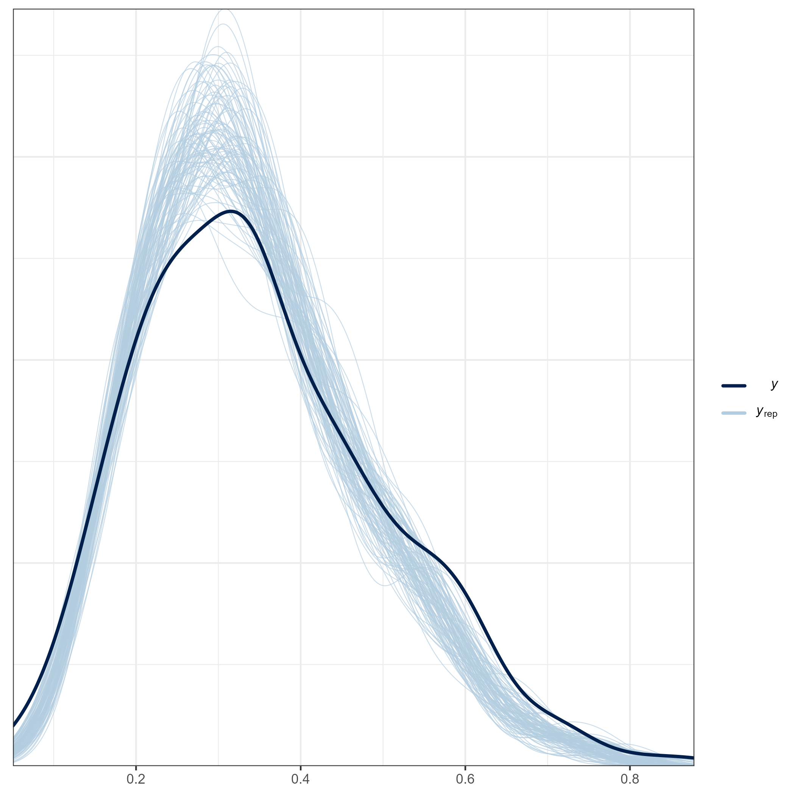
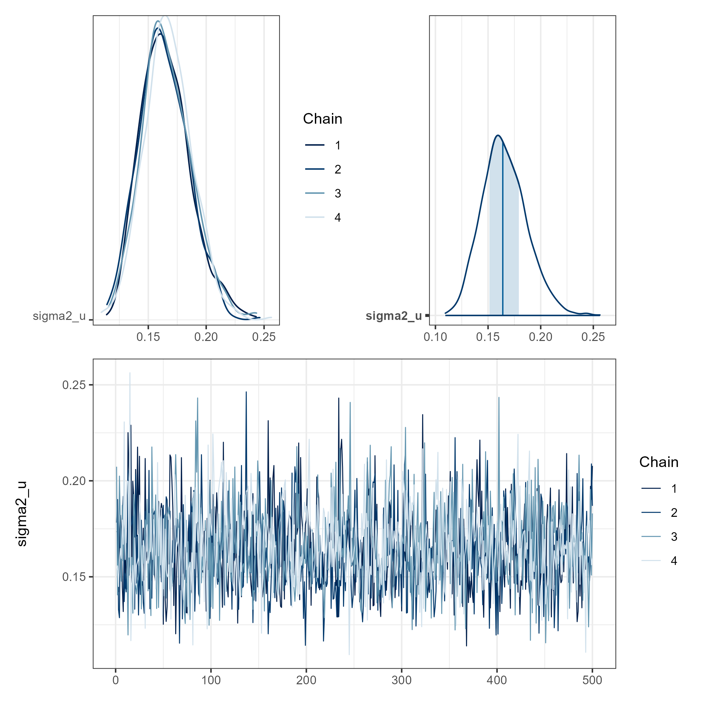
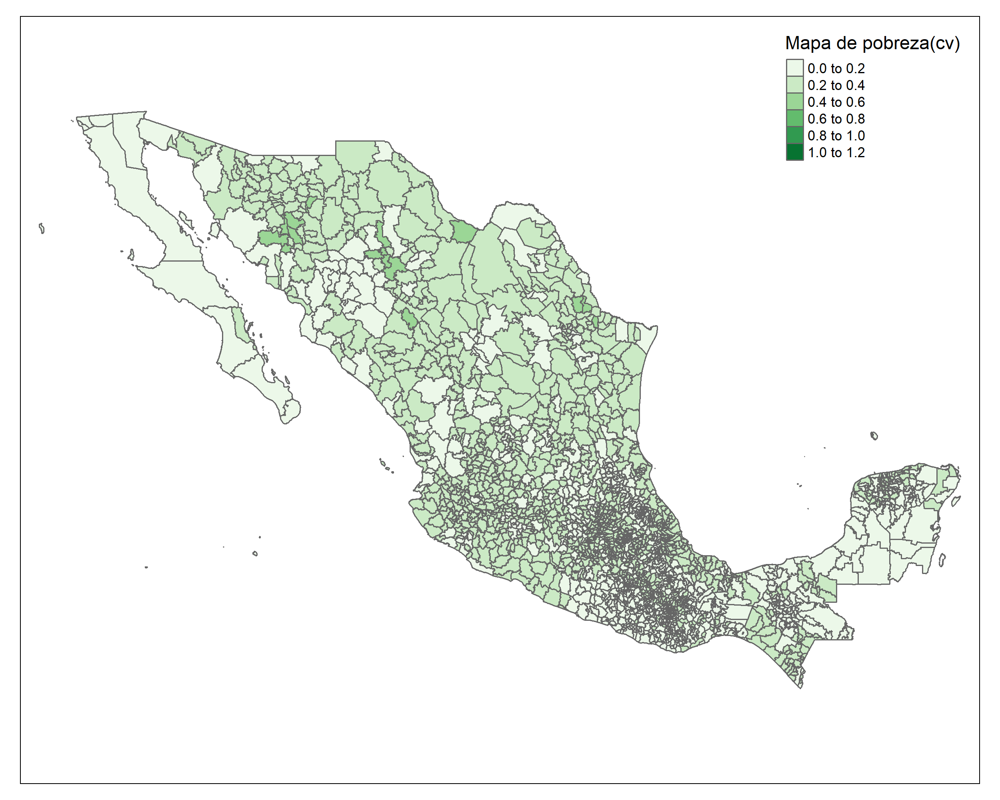

# Día 2 - Sesión 3- Modelos de área - Estimación de la pobreza en familia beta y binomial

## Modelos de área con variable respuesta Beta. 


El modelo beta-logístico fue inicialmente considerado por Jiang y Lahiri (2006b) para un enfoque EBP en uno de sus ejemplos ilustrativos para estimar medias de dominio de población finita. 


El modelo Fay Herriot beta-logístico estaría dado por las siguientes expresiones 
$$
\begin{eqnarray*}
\hat{P}_{d} \mid P_d & \sim & beta(a_d, b_d)\\
\end{eqnarray*}
$$
La función del enlace es 
$$
\begin{eqnarray*}
logit(P_{d}) \mid \boldsymbol{\beta}, \sigma^2_u  & \sim & N(\boldsymbol{x}_d^T\boldsymbol{\beta},\sigma^2_u)\\
\end{eqnarray*}
$$
Los parámetros $a_d$ y $b_d$ son estimados así: 
$$
\begin{eqnarray*}
a_d &=& P_d \times \phi_d\\
b_d &=& (1 - P_d) \times \phi_d\\
\end{eqnarray*}
$$ donde

$$\phi_d = \frac{n_d}{\widehat{DEFF}_d} -1 = n_{d,efecctivo} -1$$
#### Nota {#Nota}
La distribución Beta tiene la siguiente forma: 


$$
\begin{equation}
p(\theta \mid a, b)=
\frac{1}{Beta(a,b)}\theta^{a-1}(1-\theta)^{b-1}I_{[0,1]}(\theta).
\end{equation}
$$
donde 
  $E(\theta) = \frac{a}{a+b}$ y $Var(\theta) = \frac{ab}{(a+b)^2(a+b+1)}$

Las distribuciones previas para $\boldsymbol{\beta}$ y $\sigma^2_u$

$$
\begin{eqnarray*}
\beta_k &\sim& N(0, 10000)\\
\sigma^2_u &\sim& IG(0.0001,0.0001)
\end{eqnarray*}
$$

### Procedimiento de estimación

Lectura de la base de datos que resultó en el paso anterior y selección de las columnas de interés

```r
library(tidyverse)
library(magrittr)

base_FH <- readRDS("Recursos/Día2/Sesion3/Data/base_FH_2020.rds") %>% 
  select(dam2, pobreza, n_eff_FGV)
```

Lectura de las covariables, las cuales son obtenidas previamente. Dado la diferencia entre las escalas de las variables  es necesario hacer un ajuste a estas. 


```r
statelevel_predictors_df <- readRDS("Recursos/Día2/Sesion3/Data/predictors_satelital_dam2.rds")
```

Uniendo las dos bases de datos. 


```r
base_FH <- full_join(base_FH,statelevel_predictors_df, by = "dam2" )
tba(base_FH[,1:8] %>% head(10))
```

<table class="table table-striped lightable-classic" style="width: auto !important; margin-left: auto; margin-right: auto; font-family: Arial Narrow; width: auto !important; margin-left: auto; margin-right: auto;">
 <thead>
  <tr>
   <th style="text-align:left;"> dam2 </th>
   <th style="text-align:right;"> pobreza </th>
   <th style="text-align:right;"> n_eff_FGV </th>
   <th style="text-align:left;"> dam </th>
   <th style="text-align:right;"> luces_nocturnas </th>
   <th style="text-align:right;"> suelo_cultivo </th>
   <th style="text-align:right;"> suelo_urbano </th>
   <th style="text-align:right;"> modificacion_humana </th>
  </tr>
 </thead>
<tbody>
  <tr>
   <td style="text-align:left;"> 01001 </td>
   <td style="text-align:right;"> 0.2387 </td>
   <td style="text-align:right;"> 3058.5618 </td>
   <td style="text-align:left;"> 01 </td>
   <td style="text-align:right;"> 127.0742 </td>
   <td style="text-align:right;"> 105.4925 </td>
   <td style="text-align:right;"> 128.6893 </td>
   <td style="text-align:right;"> 106.7313 </td>
  </tr>
  <tr>
   <td style="text-align:left;"> 01003 </td>
   <td style="text-align:right;"> 0.3220 </td>
   <td style="text-align:right;"> 357.3147 </td>
   <td style="text-align:left;"> 01 </td>
   <td style="text-align:right;"> 102.5703 </td>
   <td style="text-align:right;"> 100.2905 </td>
   <td style="text-align:right;"> 100.6374 </td>
   <td style="text-align:right;"> 101.8864 </td>
  </tr>
  <tr>
   <td style="text-align:left;"> 01005 </td>
   <td style="text-align:right;"> 0.2653 </td>
   <td style="text-align:right;"> 318.9757 </td>
   <td style="text-align:left;"> 01 </td>
   <td style="text-align:right;"> 107.6633 </td>
   <td style="text-align:right;"> 100.5877 </td>
   <td style="text-align:right;"> 104.8903 </td>
   <td style="text-align:right;"> 100.5953 </td>
  </tr>
  <tr>
   <td style="text-align:left;"> 01006 </td>
   <td style="text-align:right;"> 0.2348 </td>
   <td style="text-align:right;"> 222.3658 </td>
   <td style="text-align:left;"> 01 </td>
   <td style="text-align:right;"> 101.2918 </td>
   <td style="text-align:right;"> 99.5395 </td>
   <td style="text-align:right;"> 99.7443 </td>
   <td style="text-align:right;"> 98.6083 </td>
  </tr>
  <tr>
   <td style="text-align:left;"> 01007 </td>
   <td style="text-align:right;"> 0.2809 </td>
   <td style="text-align:right;"> 272.1059 </td>
   <td style="text-align:left;"> 01 </td>
   <td style="text-align:right;"> 102.6725 </td>
   <td style="text-align:right;"> 100.9469 </td>
   <td style="text-align:right;"> 100.5439 </td>
   <td style="text-align:right;"> 99.5256 </td>
  </tr>
  <tr>
   <td style="text-align:left;"> 01011 </td>
   <td style="text-align:right;"> 0.2593 </td>
   <td style="text-align:right;"> 282.9142 </td>
   <td style="text-align:left;"> 01 </td>
   <td style="text-align:right;"> 102.5554 </td>
   <td style="text-align:right;"> 98.6332 </td>
   <td style="text-align:right;"> 100.3694 </td>
   <td style="text-align:right;"> 98.0801 </td>
  </tr>
  <tr>
   <td style="text-align:left;"> 02001 </td>
   <td style="text-align:right;"> 0.1537 </td>
   <td style="text-align:right;"> 478.2311 </td>
   <td style="text-align:left;"> 02 </td>
   <td style="text-align:right;"> 134.1608 </td>
   <td style="text-align:right;"> 111.9291 </td>
   <td style="text-align:right;"> 137.4761 </td>
   <td style="text-align:right;"> 128.0117 </td>
  </tr>
  <tr>
   <td style="text-align:left;"> 02002 </td>
   <td style="text-align:right;"> 0.1987 </td>
   <td style="text-align:right;"> 865.4328 </td>
   <td style="text-align:left;"> 02 </td>
   <td style="text-align:right;"> 177.6958 </td>
   <td style="text-align:right;"> 151.0492 </td>
   <td style="text-align:right;"> 166.6009 </td>
   <td style="text-align:right;"> 137.4847 </td>
  </tr>
  <tr>
   <td style="text-align:left;"> 02003 </td>
   <td style="text-align:right;"> 0.1253 </td>
   <td style="text-align:right;"> 176.1543 </td>
   <td style="text-align:left;"> 02 </td>
   <td style="text-align:right;"> 109.6961 </td>
   <td style="text-align:right;"> 97.8580 </td>
   <td style="text-align:right;"> 106.8797 </td>
   <td style="text-align:right;"> 104.3917 </td>
  </tr>
  <tr>
   <td style="text-align:left;"> 02004 </td>
   <td style="text-align:right;"> 0.1764 </td>
   <td style="text-align:right;"> 426.4288 </td>
   <td style="text-align:left;"> 02 </td>
   <td style="text-align:right;"> 140.2065 </td>
   <td style="text-align:right;"> 97.8905 </td>
   <td style="text-align:right;"> 167.4086 </td>
   <td style="text-align:right;"> 107.1455 </td>
  </tr>
</tbody>
</table>

Seleccionando las covariables para el modelo. 


```r
names_cov <- c(
  "sexo2" ,
  "anoest2" ,
  "anoest3",
  "anoest4",
  "edad2" ,
  "edad3" ,
  "edad4" ,
  "edad5" ,
  "etnia1",
  "etnia2" ,
  "tasa_desocupacion" ,
  "suelo_urbano" ,
  "suelo_cultivo" ,
  "modificacion_humana",
  "alfabeta"
)
```

### Preparando los insumos para `STAN`

  1.    Dividir la base de datos en dominios observados y no observados

Dominios observados.

```r
data_dir <- base_FH %>% filter(!is.na(pobreza))
```

Dominios NO observados.

```r
data_syn <-
  base_FH %>% anti_join(data_dir %>% select(dam2))
tba(data_syn[,1:8] %>% slice(1:10))
```

<table class="table table-striped lightable-classic" style="width: auto !important; margin-left: auto; margin-right: auto; font-family: Arial Narrow; width: auto !important; margin-left: auto; margin-right: auto;">
 <thead>
  <tr>
   <th style="text-align:left;"> dam2 </th>
   <th style="text-align:right;"> pobreza </th>
   <th style="text-align:right;"> n_eff_FGV </th>
   <th style="text-align:left;"> dam </th>
   <th style="text-align:right;"> luces_nocturnas </th>
   <th style="text-align:right;"> suelo_cultivo </th>
   <th style="text-align:right;"> suelo_urbano </th>
   <th style="text-align:right;"> modificacion_humana </th>
  </tr>
 </thead>
<tbody>
  <tr>
   <td style="text-align:left;"> 01002 </td>
   <td style="text-align:right;"> NA </td>
   <td style="text-align:right;"> NA </td>
   <td style="text-align:left;"> 01 </td>
   <td style="text-align:right;"> 103.2847 </td>
   <td style="text-align:right;"> 101.3865 </td>
   <td style="text-align:right;"> 101.7692 </td>
   <td style="text-align:right;"> 100.7418 </td>
  </tr>
  <tr>
   <td style="text-align:left;"> 01004 </td>
   <td style="text-align:right;"> NA </td>
   <td style="text-align:right;"> NA </td>
   <td style="text-align:left;"> 01 </td>
   <td style="text-align:right;"> 99.2927 </td>
   <td style="text-align:right;"> 98.8613 </td>
   <td style="text-align:right;"> 98.8818 </td>
   <td style="text-align:right;"> 97.8499 </td>
  </tr>
  <tr>
   <td style="text-align:left;"> 01008 </td>
   <td style="text-align:right;"> NA </td>
   <td style="text-align:right;"> NA </td>
   <td style="text-align:left;"> 01 </td>
   <td style="text-align:right;"> 99.7144 </td>
   <td style="text-align:right;"> 100.2844 </td>
   <td style="text-align:right;"> 98.6047 </td>
   <td style="text-align:right;"> 99.5866 </td>
  </tr>
  <tr>
   <td style="text-align:left;"> 01009 </td>
   <td style="text-align:right;"> NA </td>
   <td style="text-align:right;"> NA </td>
   <td style="text-align:left;"> 01 </td>
   <td style="text-align:right;"> 100.4092 </td>
   <td style="text-align:right;"> 99.1593 </td>
   <td style="text-align:right;"> 99.8478 </td>
   <td style="text-align:right;"> 98.6020 </td>
  </tr>
  <tr>
   <td style="text-align:left;"> 01010 </td>
   <td style="text-align:right;"> NA </td>
   <td style="text-align:right;"> NA </td>
   <td style="text-align:left;"> 01 </td>
   <td style="text-align:right;"> 101.4046 </td>
   <td style="text-align:right;"> 102.5622 </td>
   <td style="text-align:right;"> 99.7574 </td>
   <td style="text-align:right;"> 99.7674 </td>
  </tr>
  <tr>
   <td style="text-align:left;"> 03009 </td>
   <td style="text-align:right;"> NA </td>
   <td style="text-align:right;"> NA </td>
   <td style="text-align:left;"> 03 </td>
   <td style="text-align:right;"> 99.8661 </td>
   <td style="text-align:right;"> 98.1378 </td>
   <td style="text-align:right;"> 100.0069 </td>
   <td style="text-align:right;"> 101.0845 </td>
  </tr>
  <tr>
   <td style="text-align:left;"> 04005 </td>
   <td style="text-align:right;"> NA </td>
   <td style="text-align:right;"> NA </td>
   <td style="text-align:left;"> 04 </td>
   <td style="text-align:right;"> 102.8203 </td>
   <td style="text-align:right;"> 101.5725 </td>
   <td style="text-align:right;"> 99.8653 </td>
   <td style="text-align:right;"> 103.0741 </td>
  </tr>
  <tr>
   <td style="text-align:left;"> 04007 </td>
   <td style="text-align:right;"> NA </td>
   <td style="text-align:right;"> NA </td>
   <td style="text-align:left;"> 04 </td>
   <td style="text-align:right;"> 99.7119 </td>
   <td style="text-align:right;"> 102.8452 </td>
   <td style="text-align:right;"> 98.2200 </td>
   <td style="text-align:right;"> 108.2876 </td>
  </tr>
  <tr>
   <td style="text-align:left;"> 04008 </td>
   <td style="text-align:right;"> NA </td>
   <td style="text-align:right;"> NA </td>
   <td style="text-align:left;"> 04 </td>
   <td style="text-align:right;"> 99.6681 </td>
   <td style="text-align:right;"> 99.9763 </td>
   <td style="text-align:right;"> 98.6357 </td>
   <td style="text-align:right;"> 99.8922 </td>
  </tr>
  <tr>
   <td style="text-align:left;"> 16100 </td>
   <td style="text-align:right;"> NA </td>
   <td style="text-align:right;"> NA </td>
   <td style="text-align:left;"> 16 </td>
   <td style="text-align:right;"> 98.9878 </td>
   <td style="text-align:right;"> 98.7013 </td>
   <td style="text-align:right;"> 98.4484 </td>
   <td style="text-align:right;"> 97.8097 </td>
  </tr>
</tbody>
</table>

  2.    Definir matriz de efectos fijos.


```r
## Dominios observados
Xdat <- data_dir[,names_cov]

## Dominios no observados
Xs <- data_syn[,names_cov]
```


  3.    Creando lista de parámetros para `STAN`


```r
sample_data <- list(
  N1 = nrow(Xdat),   # Observados.
  N2 = nrow(Xs),   # NO Observados.
  p  = ncol(Xdat),       # Número de regresores.
  X  = as.matrix(Xdat),  # Covariables Observados.
  Xs = as.matrix(Xs),    # Covariables NO Observados
  y  = as.numeric(data_dir$pobreza),
  phi = data_dir$n_eff_FGV - 1 
)
```

  4.    Compilando el modelo en `STAN`

```r
library(rstan)
fit_FH_beta_logitic <- "Recursos/Día2/Sesion3/Data/modelosStan/16FH_beta_logitc.stan"
rstan::rstan_options(auto_write = TRUE) # speed up running time 
options(mc.cores = parallel::detectCores())
model_FH_beta_logitic <- stan(
  file = fit_FH_beta_logitic,  
  data = sample_data,   
  verbose = FALSE,
  warmup = 2500,         
  iter = 3000,            
  cores = 4              
)
saveRDS(model_FH_beta_logitic, file = "Recursos/Día2/Sesion3/Data/model_FH_beta_logitic.rds")
```


```r
model_FH_beta_logitic <- readRDS("Recursos/Día2/Sesion3/Data/model_FH_beta_logitic.rds")
```

#### Resultados del modelo para los dominios observados. 

En este código, se cargan las librerías `bayesplot`, `posterior` y `patchwork`, que se utilizan para realizar gráficos y visualizaciones de los resultados del modelo.

A continuación, se utiliza la función `as.array()` y `as_draws_matrix()` para extraer las muestras de la distribución posterior del parámetro `theta` del modelo, y se seleccionan aleatoriamente 100 filas de estas muestras utilizando la función `sample()`, lo que resulta en la matriz `y_pred2.`

Finalmente, se utiliza la función `ppc_dens_overlay()` de `bayesplot` para graficar una comparación entre la distribución empírica de la variable observada pobreza en los datos (`data_dir$pobreza`) y las distribuciones predictivas posteriores simuladas para la misma variable (`y_pred2`). La función `ppc_dens_overlay()` produce un gráfico de densidad para ambas distribuciones, lo que permite visualizar cómo se comparan.


```r
library(bayesplot)
library(patchwork)
library(posterior)
y_pred_B <- as.array(model_FH_beta_logitic, pars = "theta") %>% 
  as_draws_matrix()
rowsrandom <- sample(nrow(y_pred_B), 100)
y_pred2 <- y_pred_B[rowsrandom, ]
p1 <- ppc_dens_overlay(y = as.numeric(data_dir$pobreza), y_pred2)

ggsave(plot = p1,
       filename = "Recursos/Día2/Sesion3/0Recursos/Beta1.PNG",
       scale = 2)
p1
```



Análisis gráfico de la convergencia de las cadenas de $\sigma^2_u$.


```r
posterior_sigma2_u <- as.array(model_FH_beta_logitic, pars = "sigma2_u")
p1 <- (mcmc_dens_chains(posterior_sigma2_u) +
    mcmc_areas(posterior_sigma2_u) ) / 
  mcmc_trace(posterior_sigma2_u)
ggsave(plot = p1,
       filename = "Recursos/Día2/Sesion3/0Recursos/Beta2.PNG",
       scale = 2)
p1
```



Estimación del FH de la pobreza en los dominios observados. 


```r
theta_FH <-   summary(model_FH_beta_logitic,pars =  "theta")$summary %>%
  data.frame()
data_dir %<>% mutate(pred_beta_logit = theta_FH$mean, 
                     pred_beta_logit_EE = theta_FH$sd,
                     Cv_pred = pred_beta_logit_EE/pred_beta_logit)
```

Estimación del FH de la pobreza en los dominios NO observados. 


```r
theta_FH_pred <-   summary(model_FH_beta_logitic,pars =  "thetapred")$summary %>%
  data.frame()

data_syn <- data_syn %>% 
  mutate(pred_beta_logit = theta_FH_pred$mean,
         pred_beta_logit_EE = theta_FH_pred$sd,
         Cv_pred = pred_beta_logit_EE/pred_beta_logit)
```

#### Mapa de pobreza


El mapa muestra el nivel de pobreza en diferentes áreas de Colombia, basado en dos variables, `pobreza` y `pred_beta_logit`.

Primero, se cargan los paquetes necesarios `sp`, `sf` y `tmap.` Luego, se lee la información de los datos en R y se combinan utilizando la función `rbind()`.


```r
library(sf)
library(tmap)

data_map <- rbind(data_dir, data_syn) %>% 
  select(dam2, pobreza, pred_beta_logit, pred_beta_logit_EE,Cv_pred ) 


## Leer Shapefile del país
ShapeSAE <- read_sf("Shape/MEX_dam2.shp") 

mapa <- tm_shape(ShapeSAE %>%
                   left_join(data_map,  by = "dam2"))

brks_lp <- c(0,0.15, 0.3, 0.45, 0.6, 1)
tmap_options(check.and.fix = TRUE)
Mapa_lp <-
  mapa + tm_polygons(
    c("pobreza", "pred_beta_logit"),
    breaks = brks_lp,
    title = "Mapa de pobreza",
    palette = "YlOrRd",
    colorNA = "white"
  ) + tm_layout(asp = 1.5)

tmap_save(
  Mapa_lp,
  filename = "Recursos/Día2/Sesion3/0Recursos/Beta.PNG",
  width = 2500,
  height = 2000,
  asp = 0
)


Mapa_lp
```


#### Mapa del coeficiente de variación.  

Ahora, se crea un segundo mapa temático (tmap) llamado Mapa_cv. Utiliza la misma estructura del primer mapa (mapa) creado anteriormente y agrega una capa utilizando la función tm_polygons(). El mapa representa la variable Cv_pred, utilizando una paleta de colores llamada “YlOrRd” y establece el título del mapa con el parámetro title. La función tm_layout() establece algunos parámetros de diseño del mapa, como la relación de aspecto (asp). Finalmente, el mapa Mapa_cv se muestra en la consola de R.


```r
Mapa_cv <-
  mapa + tm_polygons(
    c("Cv_pred"),
     title = "Mapa de pobreza(cv)",
    palette = "Greens",
    colorNA = "white"
  ) + tm_layout(asp = 2.5)

tmap_save(
  Mapa_cv,
  filename = "Recursos/Día2/Sesion3/0Recursos/Beta_cv.PNG",
  width = 2500,
  height = 2000,
  asp = 0
)


Mapa_cv
```

**NOTA:** Dado que la estimación del modelo y  el error de estimación son pequeño, entonces, el coeficiente de variación no es una buena medida de la calidad de la estimación.  




