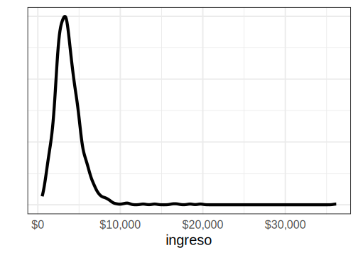
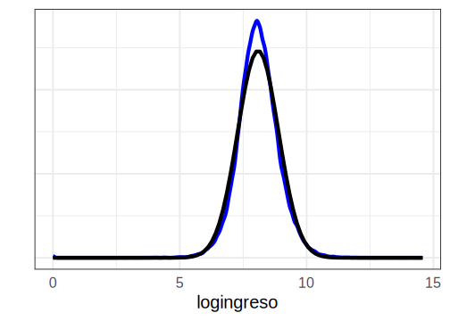

# Día 2 - Sesión 4- Modelo de unidad para la estimación del ingreso medio


Uno de los primeros problemas a los que debemos enfrentarnos es la estimación del ingreso medio, la cual en una variable no simétrica que toma valores en los positivos. Sin embargo, empleando los métodos Bayesiano es posible obtener estimaciones de esta sin realizar una transformación 

<div class="figure">

<p class="caption">(\#fig:unnamed-chunk-1)Distribución del ingreso medio por dam2</p>
</div>


#### Obejtivo {-}

Estimar el ingreso medio de las personas, es decir, 
$$
\bar{Y}_d = \frac{\sum_{U_d}y_{di}}{N_d}
$$
donde $y_{di}$ es el ingreso de cada personas

Note que, 

$$
\begin{equation*}
\bar{Y}_d =  \frac{\sum_{s_d}y_{di} + \sum_{s^c_d}y_{di}}{N_d} 
\end{equation*}
$$

Ahora, el estimador de $\bar{Y}$ esta dado por: 

$$
\hat{\bar{Y}}_d = \frac{\sum_{s_d}y_{di} + \sum_{s^c_d}\hat{y}_{di}}{N_d}
$$

donde

$$\hat{y}_{di}=E_{\mathscr{M}}\left(y_{di}\mid\boldsymbol{x}_{d},\boldsymbol{\beta}\right)$$,

donde $\mathscr{M}$ hace referencia a la medida de probabilidad inducida por el modelamiento. 
De esta forma se tiene que, 

$$
\hat{\bar{Y}}_d = \frac{\sum_{U_{d}}\hat{y}_{di}}{N_d}
$$


## Modelo bayesiano.

Para realizar la predicción del ingreso medio en dam2 no observadas se asume que: 

$$
\begin{eqnarray*}
Y_{di} &\sim & N\left(\mu_{di},\sigma_e^{2}\right)\\
\mu_{di}&=&\boldsymbol{x}_{di}^{T}\boldsymbol{\beta}+u_{d}+e_{di} 
\end{eqnarray*}
$$


Donde $Y_{di}$ representa el ingreso medio de la $i-ésima$ persona en el $d-ésimo$ domino, $\boldsymbol{X}$ es la información disponible para la $i-ésima$ persona del $d-ésimo$ domino, $\boldsymbol{\beta}$ es el vector de parámetros $u_d$ es el efecto introducido por el $d-ésimo$ dominio y $e_{di}$ es el error de estimación para la $i-ésima$ personas del $d-ésimo$ dominio.

Note, que $u_{d}\sim N\left(0,\sigma^2_{u}\right)$ y $e_{di}\sim N\left(0,\sigma_{e}^{2}\right)$.

Para este caso se asumen las distribuciones previas

$$
\begin{eqnarray*}
\beta_k & \sim   & N(0, 1000)\\
\sigma^2_y &\sim & IG(0.0001,0.0001)
\end{eqnarray*}
$$ las cuales se toman no informativas.

A continuación se muestra el proceso realizado para la obtención de la predicción del ingreso medio en dominios no observados.

## Proceso de estimación en `R`

Para desarrollar la metodología se hace uso de las siguientes librerías.


```r
# Interprete de STAN en R
library(rstan)
library(rstanarm)
# Manejo de bases de datos.
library(tidyverse)
# Gráficas de los modelos. 
library(bayesplot)
library(patchwork)
# Organizar la presentación de las tablas
library(kableExtra)
library(printr)
```

Un conjunto de funciones desarrolladas para realizar de forma simplificada los procesos están consignadas en la siguiente rutina.


```r
source("Recursos/Día2/Sesion4/0Recursos/funciones_mrp.R")
```

Entre las funciones incluidas en el archivo encuentra

-   *plot_interaction*: Esta crea un diagrama de lineas donde se estudia la interacción entre las variables, en el caso de presentar un traslape de las lineas se recomienda incluir el interacción en el modelo.

-   *Plot_Compare* Puesto que es necesario realizar una homologar la información del censo y la encuesta es conveniente llevar a cabo una validación de las variables que han sido homologadas, por tanto, se espera que las proporciones resultantes del censo y la encuesta estén cercanas entre sí.

-   *Aux_Agregado*: Esta es función permite obtener estimaciones a diferentes niveles de agregación, toma mucha relevancia cuando se realiza un proceso repetitivo.

**Las funciones están diseñada específicamente  para este  proceso**

### Encuesta de hogares

Los datos empleados en esta ocasión corresponden a la ultima encuesta de hogares, la cual ha sido estandarizada por *CEPAL* y se encuentra disponible en *BADEHOG*


```r
encuesta <- readRDS("Recursos/Día2/Sesion4/Data/encuestaMEX20N1.rds")

encuesta_mrp <- encuesta %>% 
  transmute(
    dam, dam2,  
    ingreso = ingcorte,lp,li,
    logingreso = log(ingcorte + 1),
  area = case_when(haven::as_factor(areageo2,"value") == 1 ~ "1", TRUE ~ "0"),
  sexo = case_when(sexo == "Mujer" ~ "1", TRUE ~ "2"),
  
anoest = case_when(
    edad < 2 | anoest == -1   ~ "98"  , #No aplica
    anoest == 99 ~ "99", #NS/NR
    anoest == 0  ~ "1", # Sin educacion
    anoest %in% c(1:6) ~ "2",       # 1 - 6
    anoest %in% c(7:12) ~ "3",      # 7 - 12
    anoest > 12 ~ "4",      # mas de 12
    TRUE ~ "Error"  ),
  
  

  edad = case_when(
    edad < 15 ~ "1",
    edad < 30 ~ "2",
    edad < 45 ~ "3",
    edad < 65 ~ "4",
    TRUE ~ "5"),
  discapacidad,
  etnia = etnia_ee,
  fep
) 

tba(encuesta_mrp %>% head(10)) 
```

<table class="table table-striped lightable-classic" style="width: auto !important; margin-left: auto; margin-right: auto; font-family: Arial Narrow; width: auto !important; margin-left: auto; margin-right: auto;">
 <thead>
  <tr>
   <th style="text-align:left;"> dam </th>
   <th style="text-align:left;"> dam2 </th>
   <th style="text-align:right;"> ingreso </th>
   <th style="text-align:right;"> lp </th>
   <th style="text-align:right;"> li </th>
   <th style="text-align:right;"> logingreso </th>
   <th style="text-align:left;"> area </th>
   <th style="text-align:left;"> sexo </th>
   <th style="text-align:left;"> anoest </th>
   <th style="text-align:left;"> edad </th>
   <th style="text-align:left;"> discapacidad </th>
   <th style="text-align:left;"> etnia </th>
   <th style="text-align:right;"> fep </th>
  </tr>
 </thead>
<tbody>
  <tr>
   <td style="text-align:left;"> 01 </td>
   <td style="text-align:left;"> 01001 </td>
   <td style="text-align:right;"> 1803.277 </td>
   <td style="text-align:right;"> 2787 </td>
   <td style="text-align:right;"> 1342 </td>
   <td style="text-align:right;"> 7.4979 </td>
   <td style="text-align:left;"> 1 </td>
   <td style="text-align:left;"> 1 </td>
   <td style="text-align:left;"> 4 </td>
   <td style="text-align:left;"> 4 </td>
   <td style="text-align:left;"> 0 </td>
   <td style="text-align:left;"> 3 </td>
   <td style="text-align:right;"> 190 </td>
  </tr>
  <tr>
   <td style="text-align:left;"> 01 </td>
   <td style="text-align:left;"> 01001 </td>
   <td style="text-align:right;"> 1803.277 </td>
   <td style="text-align:right;"> 2787 </td>
   <td style="text-align:right;"> 1342 </td>
   <td style="text-align:right;"> 7.4979 </td>
   <td style="text-align:left;"> 1 </td>
   <td style="text-align:left;"> 1 </td>
   <td style="text-align:left;"> 3 </td>
   <td style="text-align:left;"> 2 </td>
   <td style="text-align:left;"> 0 </td>
   <td style="text-align:left;"> 3 </td>
   <td style="text-align:right;"> 190 </td>
  </tr>
  <tr>
   <td style="text-align:left;"> 01 </td>
   <td style="text-align:left;"> 01001 </td>
   <td style="text-align:right;"> 1803.277 </td>
   <td style="text-align:right;"> 2787 </td>
   <td style="text-align:right;"> 1342 </td>
   <td style="text-align:right;"> 7.4979 </td>
   <td style="text-align:left;"> 1 </td>
   <td style="text-align:left;"> 2 </td>
   <td style="text-align:left;"> 3 </td>
   <td style="text-align:left;"> 1 </td>
   <td style="text-align:left;"> 0 </td>
   <td style="text-align:left;"> 3 </td>
   <td style="text-align:right;"> 190 </td>
  </tr>
  <tr>
   <td style="text-align:left;"> 01 </td>
   <td style="text-align:left;"> 01001 </td>
   <td style="text-align:right;"> 2618.807 </td>
   <td style="text-align:right;"> 2787 </td>
   <td style="text-align:right;"> 1342 </td>
   <td style="text-align:right;"> 7.8709 </td>
   <td style="text-align:left;"> 1 </td>
   <td style="text-align:left;"> 2 </td>
   <td style="text-align:left;"> 3 </td>
   <td style="text-align:left;"> 4 </td>
   <td style="text-align:left;"> 0 </td>
   <td style="text-align:left;"> 3 </td>
   <td style="text-align:right;"> 190 </td>
  </tr>
  <tr>
   <td style="text-align:left;"> 01 </td>
   <td style="text-align:left;"> 01001 </td>
   <td style="text-align:right;"> 2618.807 </td>
   <td style="text-align:right;"> 2787 </td>
   <td style="text-align:right;"> 1342 </td>
   <td style="text-align:right;"> 7.8709 </td>
   <td style="text-align:left;"> 1 </td>
   <td style="text-align:left;"> 1 </td>
   <td style="text-align:left;"> 3 </td>
   <td style="text-align:left;"> 3 </td>
   <td style="text-align:left;"> 0 </td>
   <td style="text-align:left;"> 3 </td>
   <td style="text-align:right;"> 190 </td>
  </tr>
  <tr>
   <td style="text-align:left;"> 01 </td>
   <td style="text-align:left;"> 01001 </td>
   <td style="text-align:right;"> 2618.807 </td>
   <td style="text-align:right;"> 2787 </td>
   <td style="text-align:right;"> 1342 </td>
   <td style="text-align:right;"> 7.8709 </td>
   <td style="text-align:left;"> 1 </td>
   <td style="text-align:left;"> 2 </td>
   <td style="text-align:left;"> 3 </td>
   <td style="text-align:left;"> 2 </td>
   <td style="text-align:left;"> 0 </td>
   <td style="text-align:left;"> 3 </td>
   <td style="text-align:right;"> 190 </td>
  </tr>
  <tr>
   <td style="text-align:left;"> 01 </td>
   <td style="text-align:left;"> 01001 </td>
   <td style="text-align:right;"> 2618.807 </td>
   <td style="text-align:right;"> 2787 </td>
   <td style="text-align:right;"> 1342 </td>
   <td style="text-align:right;"> 7.8709 </td>
   <td style="text-align:left;"> 1 </td>
   <td style="text-align:left;"> 2 </td>
   <td style="text-align:left;"> 2 </td>
   <td style="text-align:left;"> 1 </td>
   <td style="text-align:left;"> 0 </td>
   <td style="text-align:left;"> 3 </td>
   <td style="text-align:right;"> 190 </td>
  </tr>
  <tr>
   <td style="text-align:left;"> 01 </td>
   <td style="text-align:left;"> 01001 </td>
   <td style="text-align:right;"> 5663.193 </td>
   <td style="text-align:right;"> 2787 </td>
   <td style="text-align:right;"> 1342 </td>
   <td style="text-align:right;"> 8.6419 </td>
   <td style="text-align:left;"> 1 </td>
   <td style="text-align:left;"> 2 </td>
   <td style="text-align:left;"> 4 </td>
   <td style="text-align:left;"> 2 </td>
   <td style="text-align:left;"> 0 </td>
   <td style="text-align:left;"> 3 </td>
   <td style="text-align:right;"> 189 </td>
  </tr>
  <tr>
   <td style="text-align:left;"> 01 </td>
   <td style="text-align:left;"> 01001 </td>
   <td style="text-align:right;"> 5663.193 </td>
   <td style="text-align:right;"> 2787 </td>
   <td style="text-align:right;"> 1342 </td>
   <td style="text-align:right;"> 8.6419 </td>
   <td style="text-align:left;"> 1 </td>
   <td style="text-align:left;"> 1 </td>
   <td style="text-align:left;"> 4 </td>
   <td style="text-align:left;"> 2 </td>
   <td style="text-align:left;"> 0 </td>
   <td style="text-align:left;"> 3 </td>
   <td style="text-align:right;"> 189 </td>
  </tr>
  <tr>
   <td style="text-align:left;"> 01 </td>
   <td style="text-align:left;"> 01001 </td>
   <td style="text-align:right;"> 11926.229 </td>
   <td style="text-align:right;"> 2787 </td>
   <td style="text-align:right;"> 1342 </td>
   <td style="text-align:right;"> 9.3866 </td>
   <td style="text-align:left;"> 1 </td>
   <td style="text-align:left;"> 2 </td>
   <td style="text-align:left;"> 4 </td>
   <td style="text-align:left;"> 2 </td>
   <td style="text-align:left;"> 0 </td>
   <td style="text-align:left;"> 3 </td>
   <td style="text-align:right;"> 189 </td>
  </tr>
</tbody>
</table>

La base de datos de la encuesta tiene la siguientes columnas: 

-   *dam*: Corresponde al código asignado a la división administrativa mayor del país.

-   *dam2*: Corresponde al código asignado a la segunda división administrativa del país.

-   *lp* y *li* lineas de pobreza y pobreza extrema definidas por CEPAL. 

-   *área* división geográfica (Urbano y Rural). 

-   *sexo* Hombre y Mujer. 

-   *etnia* En estas variable se definen tres grupos:  afrodescendientes, indígenas y Otros. 

-   *anoest* Años de escolaridad  

-   *edad* Rangos de edad 

-   *fep* Factor de expansión por persona


## Validación de encuesta frente al censo.


```r
library(survey)
library(srvyr)
library(patchwork)
censo_dam2 <- readRDS("Recursos/Día2/Sesion4/Data/censo_mrp_dam2.rds")

p1_dam <- Plot_Compare(dat_encuesta = encuesta_mrp,
             dat_censo = censo_dam2,
             by = "dam")
p1_anotes <- Plot_Compare(dat_encuesta = encuesta_mrp,
             dat_censo = censo_dam2,
             by = "anoest")
p1_edad <- Plot_Compare(dat_encuesta = encuesta_mrp,
             dat_censo = censo_dam2,
             by = "edad")
p1 <- (p1_dam)/(p1_anotes + p1_edad)

# ggsave(plot = p1,
#        filename = "Recursos/Día2/Sesion4/0Recursos/plot_comp.png",
#        scale = 2)
```


Evaluando interacciones en la encuesta 


```r
encuesta_mrp$pobreza <- encuesta_mrp$logingreso
(plot_interaction(dat_encuesta = encuesta_mrp, by = "sexo",by2 = "area")/
plot_interaction(dat_encuesta = encuesta_mrp, by = "sexo",by2 = "anoest"))
```


```r
(plot_interaction(dat_encuesta = encuesta_mrp, by = "sexo",by2 = "edad")/
plot_interaction(dat_encuesta = encuesta_mrp, by = "anoest",by2 = "edad")
)
```


Ahora, inspeccionamos el comportamiento de la variable de interés: 


```r
media <- mean(encuesta_mrp$logingreso)
Sd <- sd(encuesta_mrp$logingreso)

ggplot(data = encuesta_mrp, aes(x = logingreso)) +
  geom_density(size =2, color = "blue") + labs(y = "") +
  stat_function(fun = dnorm, 
                args = list(mean = media, sd = Sd),
                size =2) +
  theme_bw(base_size = 20) +
  theme(axis.text.y = element_blank(),
        axis.ticks = element_blank())
```

<div class="figure">

<p class="caption">(\#fig:unnamed-chunk-9)Distribuición del ingreso de las personas encuestadas</p>
</div>


La información auxiliar disponible ha sido extraída del censo  e imágenes satelitales


```r
statelevel_predictors_df <-
  readRDS("Recursos/Día2/Sesion4/Data/predictors_satelital_dam2.rds")
tba(statelevel_predictors_df  %>%  head(10))
```

<table class="table table-striped lightable-classic" style="width: auto !important; margin-left: auto; margin-right: auto; font-family: Arial Narrow; width: auto !important; margin-left: auto; margin-right: auto;">
 <thead>
  <tr>
   <th style="text-align:left;"> dam </th>
   <th style="text-align:left;"> dam2 </th>
   <th style="text-align:right;"> luces_nocturnas </th>
   <th style="text-align:right;"> suelo_cultivo </th>
   <th style="text-align:right;"> suelo_urbano </th>
   <th style="text-align:right;"> modificacion_humana </th>
   <th style="text-align:right;"> accesibilidad_hospitales </th>
   <th style="text-align:right;"> accesibilidad_hosp_caminado </th>
   <th style="text-align:right;"> area1 </th>
   <th style="text-align:right;"> etnia2 </th>
   <th style="text-align:right;"> sexo2 </th>
   <th style="text-align:right;"> edad2 </th>
   <th style="text-align:right;"> edad3 </th>
   <th style="text-align:right;"> edad4 </th>
   <th style="text-align:right;"> edad5 </th>
   <th style="text-align:right;"> anoest2 </th>
   <th style="text-align:right;"> anoest3 </th>
   <th style="text-align:right;"> anoest4 </th>
   <th style="text-align:right;"> discapacidad1 </th>
   <th style="text-align:right;"> etnia1 </th>
   <th style="text-align:right;"> tiene_sanitario </th>
   <th style="text-align:right;"> tiene_electricidad </th>
   <th style="text-align:right;"> tiene_acueducto </th>
   <th style="text-align:right;"> tiene_gas </th>
   <th style="text-align:right;"> eliminar_basura </th>
   <th style="text-align:right;"> tiene_internet </th>
   <th style="text-align:right;"> piso_tierra </th>
   <th style="text-align:right;"> material_paredes </th>
   <th style="text-align:right;"> material_techo </th>
   <th style="text-align:right;"> rezago_escolar </th>
   <th style="text-align:right;"> alfabeta </th>
   <th style="text-align:right;"> hacinamiento </th>
   <th style="text-align:right;"> tasa_desocupacion </th>
  </tr>
 </thead>
<tbody>
  <tr>
   <td style="text-align:left;"> 01 </td>
   <td style="text-align:left;"> 01001 </td>
   <td style="text-align:right;"> 127.0742 </td>
   <td style="text-align:right;"> 105.4925 </td>
   <td style="text-align:right;"> 128.6893 </td>
   <td style="text-align:right;"> 106.7313 </td>
   <td style="text-align:right;"> 99.2730 </td>
   <td style="text-align:right;"> 99.4086 </td>
   <td style="text-align:right;"> 0.9453 </td>
   <td style="text-align:right;"> 0.0116 </td>
   <td style="text-align:right;"> 0.5180 </td>
   <td style="text-align:right;"> 0.2656 </td>
   <td style="text-align:right;"> 0.2129 </td>
   <td style="text-align:right;"> 0.1962 </td>
   <td style="text-align:right;"> 0.0671 </td>
   <td style="text-align:right;"> 0.2101 </td>
   <td style="text-align:right;"> 0.4280 </td>
   <td style="text-align:right;"> 0.2258 </td>
   <td style="text-align:right;"> 0.0574 </td>
   <td style="text-align:right;"> 0.0595 </td>
   <td style="text-align:right;"> 0.0020 </td>
   <td style="text-align:right;"> 0.3925 </td>
   <td style="text-align:right;"> 0.0303 </td>
   <td style="text-align:right;"> 0.0301 </td>
   <td style="text-align:right;"> 0.0058 </td>
   <td style="text-align:right;"> 0.2946 </td>
   <td style="text-align:right;"> 0.0022 </td>
   <td style="text-align:right;"> 0.0211 </td>
   <td style="text-align:right;"> 0.0098 </td>
   <td style="text-align:right;"> 0.3419 </td>
   <td style="text-align:right;"> 0.0381 </td>
   <td style="text-align:right;"> 0.1690 </td>
   <td style="text-align:right;"> 0.0284 </td>
  </tr>
  <tr>
   <td style="text-align:left;"> 01 </td>
   <td style="text-align:left;"> 01002 </td>
   <td style="text-align:right;"> 103.2847 </td>
   <td style="text-align:right;"> 101.3865 </td>
   <td style="text-align:right;"> 101.7692 </td>
   <td style="text-align:right;"> 100.7418 </td>
   <td style="text-align:right;"> 99.2012 </td>
   <td style="text-align:right;"> 99.2972 </td>
   <td style="text-align:right;"> 0.4106 </td>
   <td style="text-align:right;"> 0.0030 </td>
   <td style="text-align:right;"> 0.5082 </td>
   <td style="text-align:right;"> 0.2690 </td>
   <td style="text-align:right;"> 0.1853 </td>
   <td style="text-align:right;"> 0.1703 </td>
   <td style="text-align:right;"> 0.0665 </td>
   <td style="text-align:right;"> 0.3188 </td>
   <td style="text-align:right;"> 0.4404 </td>
   <td style="text-align:right;"> 0.0666 </td>
   <td style="text-align:right;"> 0.0706 </td>
   <td style="text-align:right;"> 0.0318 </td>
   <td style="text-align:right;"> 0.0448 </td>
   <td style="text-align:right;"> 0.5895 </td>
   <td style="text-align:right;"> 0.4913 </td>
   <td style="text-align:right;"> 0.0650 </td>
   <td style="text-align:right;"> 0.1084 </td>
   <td style="text-align:right;"> 0.6548 </td>
   <td style="text-align:right;"> 0.0118 </td>
   <td style="text-align:right;"> 0.2598 </td>
   <td style="text-align:right;"> 0.1648 </td>
   <td style="text-align:right;"> 0.1003 </td>
   <td style="text-align:right;"> 0.0648 </td>
   <td style="text-align:right;"> 0.3137 </td>
   <td style="text-align:right;"> 0.0436 </td>
  </tr>
  <tr>
   <td style="text-align:left;"> 01 </td>
   <td style="text-align:left;"> 01003 </td>
   <td style="text-align:right;"> 102.5703 </td>
   <td style="text-align:right;"> 100.2905 </td>
   <td style="text-align:right;"> 100.6374 </td>
   <td style="text-align:right;"> 101.8864 </td>
   <td style="text-align:right;"> 99.4002 </td>
   <td style="text-align:right;"> 99.4182 </td>
   <td style="text-align:right;"> 0.5802 </td>
   <td style="text-align:right;"> 0.0039 </td>
   <td style="text-align:right;"> 0.5117 </td>
   <td style="text-align:right;"> 0.2438 </td>
   <td style="text-align:right;"> 0.1828 </td>
   <td style="text-align:right;"> 0.1920 </td>
   <td style="text-align:right;"> 0.0990 </td>
   <td style="text-align:right;"> 0.3647 </td>
   <td style="text-align:right;"> 0.4001 </td>
   <td style="text-align:right;"> 0.0665 </td>
   <td style="text-align:right;"> 0.0865 </td>
   <td style="text-align:right;"> 0.0387 </td>
   <td style="text-align:right;"> 0.0116 </td>
   <td style="text-align:right;"> 1.0000 </td>
   <td style="text-align:right;"> 0.0776 </td>
   <td style="text-align:right;"> 0.0909 </td>
   <td style="text-align:right;"> 0.0035 </td>
   <td style="text-align:right;"> 0.5350 </td>
   <td style="text-align:right;"> 0.0096 </td>
   <td style="text-align:right;"> 0.1028 </td>
   <td style="text-align:right;"> 0.0070 </td>
   <td style="text-align:right;"> 0.0996 </td>
   <td style="text-align:right;"> 0.0630 </td>
   <td style="text-align:right;"> 0.2553 </td>
   <td style="text-align:right;"> 0.0647 </td>
  </tr>
  <tr>
   <td style="text-align:left;"> 01 </td>
   <td style="text-align:left;"> 01004 </td>
   <td style="text-align:right;"> 99.2927 </td>
   <td style="text-align:right;"> 98.8613 </td>
   <td style="text-align:right;"> 98.8818 </td>
   <td style="text-align:right;"> 97.8499 </td>
   <td style="text-align:right;"> 99.1040 </td>
   <td style="text-align:right;"> 99.1727 </td>
   <td style="text-align:right;"> 0.5490 </td>
   <td style="text-align:right;"> 0.0042 </td>
   <td style="text-align:right;"> 0.5139 </td>
   <td style="text-align:right;"> 0.2730 </td>
   <td style="text-align:right;"> 0.2032 </td>
   <td style="text-align:right;"> 0.1587 </td>
   <td style="text-align:right;"> 0.0610 </td>
   <td style="text-align:right;"> 0.2666 </td>
   <td style="text-align:right;"> 0.4727 </td>
   <td style="text-align:right;"> 0.0785 </td>
   <td style="text-align:right;"> 0.0603 </td>
   <td style="text-align:right;"> 0.0585 </td>
   <td style="text-align:right;"> 0.0258 </td>
   <td style="text-align:right;"> 0.5185 </td>
   <td style="text-align:right;"> 0.1752 </td>
   <td style="text-align:right;"> 0.0544 </td>
   <td style="text-align:right;"> 0.0123 </td>
   <td style="text-align:right;"> 0.7144 </td>
   <td style="text-align:right;"> 0.0079 </td>
   <td style="text-align:right;"> 0.2572 </td>
   <td style="text-align:right;"> 0.0861 </td>
   <td style="text-align:right;"> 0.1261 </td>
   <td style="text-align:right;"> 0.0592 </td>
   <td style="text-align:right;"> 0.3578 </td>
   <td style="text-align:right;"> 0.0303 </td>
  </tr>
  <tr>
   <td style="text-align:left;"> 01 </td>
   <td style="text-align:left;"> 01005 </td>
   <td style="text-align:right;"> 107.6633 </td>
   <td style="text-align:right;"> 100.5877 </td>
   <td style="text-align:right;"> 104.8903 </td>
   <td style="text-align:right;"> 100.5953 </td>
   <td style="text-align:right;"> 99.1894 </td>
   <td style="text-align:right;"> 99.2677 </td>
   <td style="text-align:right;"> 0.7330 </td>
   <td style="text-align:right;"> 0.0255 </td>
   <td style="text-align:right;"> 0.5014 </td>
   <td style="text-align:right;"> 0.2524 </td>
   <td style="text-align:right;"> 0.2309 </td>
   <td style="text-align:right;"> 0.1629 </td>
   <td style="text-align:right;"> 0.0569 </td>
   <td style="text-align:right;"> 0.2359 </td>
   <td style="text-align:right;"> 0.3886 </td>
   <td style="text-align:right;"> 0.1761 </td>
   <td style="text-align:right;"> 0.0511 </td>
   <td style="text-align:right;"> 0.0525 </td>
   <td style="text-align:right;"> 0.0050 </td>
   <td style="text-align:right;"> 0.9308 </td>
   <td style="text-align:right;"> 0.2182 </td>
   <td style="text-align:right;"> 0.0302 </td>
   <td style="text-align:right;"> 0.0013 </td>
   <td style="text-align:right;"> 0.3709 </td>
   <td style="text-align:right;"> 0.0039 </td>
   <td style="text-align:right;"> 0.0329 </td>
   <td style="text-align:right;"> 0.0200 </td>
   <td style="text-align:right;"> 0.2858 </td>
   <td style="text-align:right;"> 0.0538 </td>
   <td style="text-align:right;"> 0.2565 </td>
   <td style="text-align:right;"> 0.0162 </td>
  </tr>
  <tr>
   <td style="text-align:left;"> 01 </td>
   <td style="text-align:left;"> 01006 </td>
   <td style="text-align:right;"> 101.2918 </td>
   <td style="text-align:right;"> 99.5395 </td>
   <td style="text-align:right;"> 99.7443 </td>
   <td style="text-align:right;"> 98.6083 </td>
   <td style="text-align:right;"> 99.0990 </td>
   <td style="text-align:right;"> 99.1562 </td>
   <td style="text-align:right;"> 0.7530 </td>
   <td style="text-align:right;"> 0.0111 </td>
   <td style="text-align:right;"> 0.5086 </td>
   <td style="text-align:right;"> 0.2595 </td>
   <td style="text-align:right;"> 0.1996 </td>
   <td style="text-align:right;"> 0.1806 </td>
   <td style="text-align:right;"> 0.0706 </td>
   <td style="text-align:right;"> 0.2497 </td>
   <td style="text-align:right;"> 0.4258 </td>
   <td style="text-align:right;"> 0.1650 </td>
   <td style="text-align:right;"> 0.0576 </td>
   <td style="text-align:right;"> 0.0210 </td>
   <td style="text-align:right;"> 0.0043 </td>
   <td style="text-align:right;"> 0.6154 </td>
   <td style="text-align:right;"> 0.0544 </td>
   <td style="text-align:right;"> 0.0303 </td>
   <td style="text-align:right;"> 0.0183 </td>
   <td style="text-align:right;"> 0.4093 </td>
   <td style="text-align:right;"> 0.0032 </td>
   <td style="text-align:right;"> 0.0464 </td>
   <td style="text-align:right;"> 0.0215 </td>
   <td style="text-align:right;"> 0.2584 </td>
   <td style="text-align:right;"> 0.0582 </td>
   <td style="text-align:right;"> 0.2585 </td>
   <td style="text-align:right;"> 0.0197 </td>
  </tr>
  <tr>
   <td style="text-align:left;"> 01 </td>
   <td style="text-align:left;"> 01007 </td>
   <td style="text-align:right;"> 102.6725 </td>
   <td style="text-align:right;"> 100.9469 </td>
   <td style="text-align:right;"> 100.5439 </td>
   <td style="text-align:right;"> 99.5256 </td>
   <td style="text-align:right;"> 99.1553 </td>
   <td style="text-align:right;"> 99.2049 </td>
   <td style="text-align:right;"> 0.7223 </td>
   <td style="text-align:right;"> 0.0028 </td>
   <td style="text-align:right;"> 0.5125 </td>
   <td style="text-align:right;"> 0.2738 </td>
   <td style="text-align:right;"> 0.1898 </td>
   <td style="text-align:right;"> 0.1566 </td>
   <td style="text-align:right;"> 0.0620 </td>
   <td style="text-align:right;"> 0.2593 </td>
   <td style="text-align:right;"> 0.4439 </td>
   <td style="text-align:right;"> 0.1062 </td>
   <td style="text-align:right;"> 0.0500 </td>
   <td style="text-align:right;"> 0.0373 </td>
   <td style="text-align:right;"> 0.0107 </td>
   <td style="text-align:right;"> 0.6809 </td>
   <td style="text-align:right;"> 0.0585 </td>
   <td style="text-align:right;"> 0.0444 </td>
   <td style="text-align:right;"> 0.0432 </td>
   <td style="text-align:right;"> 0.5551 </td>
   <td style="text-align:right;"> 0.0057 </td>
   <td style="text-align:right;"> 0.1440 </td>
   <td style="text-align:right;"> 0.0729 </td>
   <td style="text-align:right;"> 0.1765 </td>
   <td style="text-align:right;"> 0.0728 </td>
   <td style="text-align:right;"> 0.3470 </td>
   <td style="text-align:right;"> 0.0192 </td>
  </tr>
  <tr>
   <td style="text-align:left;"> 01 </td>
   <td style="text-align:left;"> 01008 </td>
   <td style="text-align:right;"> 99.7144 </td>
   <td style="text-align:right;"> 100.2844 </td>
   <td style="text-align:right;"> 98.6047 </td>
   <td style="text-align:right;"> 99.5866 </td>
   <td style="text-align:right;"> 99.6891 </td>
   <td style="text-align:right;"> 99.6227 </td>
   <td style="text-align:right;"> 0.4434 </td>
   <td style="text-align:right;"> 0.1588 </td>
   <td style="text-align:right;"> 0.5210 </td>
   <td style="text-align:right;"> 0.2681 </td>
   <td style="text-align:right;"> 0.1871 </td>
   <td style="text-align:right;"> 0.1591 </td>
   <td style="text-align:right;"> 0.0641 </td>
   <td style="text-align:right;"> 0.2909 </td>
   <td style="text-align:right;"> 0.4598 </td>
   <td style="text-align:right;"> 0.0736 </td>
   <td style="text-align:right;"> 0.0479 </td>
   <td style="text-align:right;"> 0.0382 </td>
   <td style="text-align:right;"> 0.0136 </td>
   <td style="text-align:right;"> 0.6316 </td>
   <td style="text-align:right;"> 0.1688 </td>
   <td style="text-align:right;"> 0.0853 </td>
   <td style="text-align:right;"> 0.0085 </td>
   <td style="text-align:right;"> 0.7140 </td>
   <td style="text-align:right;"> 0.0072 </td>
   <td style="text-align:right;"> 0.3095 </td>
   <td style="text-align:right;"> 0.0818 </td>
   <td style="text-align:right;"> 0.1224 </td>
   <td style="text-align:right;"> 0.0563 </td>
   <td style="text-align:right;"> 0.3412 </td>
   <td style="text-align:right;"> 0.0217 </td>
  </tr>
  <tr>
   <td style="text-align:left;"> 01 </td>
   <td style="text-align:left;"> 01009 </td>
   <td style="text-align:right;"> 100.4092 </td>
   <td style="text-align:right;"> 99.1593 </td>
   <td style="text-align:right;"> 99.8478 </td>
   <td style="text-align:right;"> 98.6020 </td>
   <td style="text-align:right;"> 99.1182 </td>
   <td style="text-align:right;"> 99.1724 </td>
   <td style="text-align:right;"> 0.4175 </td>
   <td style="text-align:right;"> 0.0026 </td>
   <td style="text-align:right;"> 0.5112 </td>
   <td style="text-align:right;"> 0.2794 </td>
   <td style="text-align:right;"> 0.1917 </td>
   <td style="text-align:right;"> 0.1578 </td>
   <td style="text-align:right;"> 0.0689 </td>
   <td style="text-align:right;"> 0.3231 </td>
   <td style="text-align:right;"> 0.4423 </td>
   <td style="text-align:right;"> 0.0661 </td>
   <td style="text-align:right;"> 0.0544 </td>
   <td style="text-align:right;"> 0.0264 </td>
   <td style="text-align:right;"> 0.0306 </td>
   <td style="text-align:right;"> 0.7288 </td>
   <td style="text-align:right;"> 0.3110 </td>
   <td style="text-align:right;"> 0.0362 </td>
   <td style="text-align:right;"> 0.0308 </td>
   <td style="text-align:right;"> 0.5720 </td>
   <td style="text-align:right;"> 0.0101 </td>
   <td style="text-align:right;"> 0.1213 </td>
   <td style="text-align:right;"> 0.0847 </td>
   <td style="text-align:right;"> 0.1039 </td>
   <td style="text-align:right;"> 0.0731 </td>
   <td style="text-align:right;"> 0.3582 </td>
   <td style="text-align:right;"> 0.0841 </td>
  </tr>
  <tr>
   <td style="text-align:left;"> 01 </td>
   <td style="text-align:left;"> 01010 </td>
   <td style="text-align:right;"> 101.4046 </td>
   <td style="text-align:right;"> 102.5622 </td>
   <td style="text-align:right;"> 99.7574 </td>
   <td style="text-align:right;"> 99.7674 </td>
   <td style="text-align:right;"> 99.1833 </td>
   <td style="text-align:right;"> 99.2439 </td>
   <td style="text-align:right;"> 0.2279 </td>
   <td style="text-align:right;"> 0.0128 </td>
   <td style="text-align:right;"> 0.5002 </td>
   <td style="text-align:right;"> 0.2671 </td>
   <td style="text-align:right;"> 0.1919 </td>
   <td style="text-align:right;"> 0.1627 </td>
   <td style="text-align:right;"> 0.0680 </td>
   <td style="text-align:right;"> 0.3292 </td>
   <td style="text-align:right;"> 0.4268 </td>
   <td style="text-align:right;"> 0.0533 </td>
   <td style="text-align:right;"> 0.0480 </td>
   <td style="text-align:right;"> 0.0353 </td>
   <td style="text-align:right;"> 0.0389 </td>
   <td style="text-align:right;"> 0.9180 </td>
   <td style="text-align:right;"> 0.1160 </td>
   <td style="text-align:right;"> 0.0563 </td>
   <td style="text-align:right;"> 0.0315 </td>
   <td style="text-align:right;"> 0.7420 </td>
   <td style="text-align:right;"> 0.0136 </td>
   <td style="text-align:right;"> 0.4060 </td>
   <td style="text-align:right;"> 0.3097 </td>
   <td style="text-align:right;"> 0.0851 </td>
   <td style="text-align:right;"> 0.0743 </td>
   <td style="text-align:right;"> 0.3758 </td>
   <td style="text-align:right;"> 0.0399 </td>
  </tr>
</tbody>
</table>


### Niveles de agregación para colapsar la encuesta

Después de realizar una investigación en la literatura especializada y realizar estudios de simulación fue posible evidenciar que las predicciones obtenidas con la muestra sin agregar y la muestra agregada convergen a la media del dominio. Sin embargo, el realizar estas estimaciones con la muestra agregada reduce el tiempo computacional necesario para la convergencia de las cadenas MCMC.  Con esto en mente se se realiza la identificación de las variables por las cuales se agregará la encuesta.


```r
byAgrega <- c("dam2",  "area", 
              "sexo",   "anoest", "edad")
```

### Creando base con la encuesta agregada

El resultado de agregar la base de dato se muestra a continuación:


```r
encuesta_df_agg <-
  encuesta_mrp %>%                    # Encuesta  
  group_by_at(all_of(byAgrega)) %>%   # Agrupar por el listado de variables
  summarise(n = n(),                  # Número de observaciones
  # Ingreso medio de las personas con características similares.           
             logingreso = mean(logingreso), 
            .groups = "drop") %>%     
  arrange(desc(n))                    # Ordenar la base.
```

La tabla obtenida es la siguiente: 

<table class="table table-striped lightable-classic" style="width: auto !important; margin-left: auto; margin-right: auto; font-family: Arial Narrow; width: auto !important; margin-left: auto; margin-right: auto;">
 <thead>
  <tr>
   <th style="text-align:left;"> dam2 </th>
   <th style="text-align:left;"> area </th>
   <th style="text-align:left;"> sexo </th>
   <th style="text-align:left;"> anoest </th>
   <th style="text-align:left;"> edad </th>
   <th style="text-align:right;"> n </th>
   <th style="text-align:right;"> logingreso </th>
  </tr>
 </thead>
<tbody>
  <tr>
   <td style="text-align:left;"> 08037 </td>
   <td style="text-align:left;"> 1 </td>
   <td style="text-align:left;"> 1 </td>
   <td style="text-align:left;"> 3 </td>
   <td style="text-align:left;"> 2 </td>
   <td style="text-align:right;"> 491 </td>
   <td style="text-align:right;"> 8.2663 </td>
  </tr>
  <tr>
   <td style="text-align:left;"> 08037 </td>
   <td style="text-align:left;"> 1 </td>
   <td style="text-align:left;"> 2 </td>
   <td style="text-align:left;"> 3 </td>
   <td style="text-align:left;"> 2 </td>
   <td style="text-align:right;"> 416 </td>
   <td style="text-align:right;"> 8.3813 </td>
  </tr>
  <tr>
   <td style="text-align:left;"> 01001 </td>
   <td style="text-align:left;"> 1 </td>
   <td style="text-align:left;"> 1 </td>
   <td style="text-align:left;"> 3 </td>
   <td style="text-align:left;"> 2 </td>
   <td style="text-align:right;"> 379 </td>
   <td style="text-align:right;"> 8.2301 </td>
  </tr>
  <tr>
   <td style="text-align:left;"> 01001 </td>
   <td style="text-align:left;"> 1 </td>
   <td style="text-align:left;"> 2 </td>
   <td style="text-align:left;"> 3 </td>
   <td style="text-align:left;"> 2 </td>
   <td style="text-align:right;"> 379 </td>
   <td style="text-align:right;"> 8.3168 </td>
  </tr>
  <tr>
   <td style="text-align:left;"> 02004 </td>
   <td style="text-align:left;"> 1 </td>
   <td style="text-align:left;"> 2 </td>
   <td style="text-align:left;"> 3 </td>
   <td style="text-align:left;"> 2 </td>
   <td style="text-align:right;"> 326 </td>
   <td style="text-align:right;"> 8.5024 </td>
  </tr>
  <tr>
   <td style="text-align:left;"> 23005 </td>
   <td style="text-align:left;"> 1 </td>
   <td style="text-align:left;"> 2 </td>
   <td style="text-align:left;"> 3 </td>
   <td style="text-align:left;"> 2 </td>
   <td style="text-align:right;"> 308 </td>
   <td style="text-align:right;"> 8.1430 </td>
  </tr>
  <tr>
   <td style="text-align:left;"> 02004 </td>
   <td style="text-align:left;"> 1 </td>
   <td style="text-align:left;"> 1 </td>
   <td style="text-align:left;"> 3 </td>
   <td style="text-align:left;"> 2 </td>
   <td style="text-align:right;"> 306 </td>
   <td style="text-align:right;"> 8.4478 </td>
  </tr>
  <tr>
   <td style="text-align:left;"> 08037 </td>
   <td style="text-align:left;"> 1 </td>
   <td style="text-align:left;"> 1 </td>
   <td style="text-align:left;"> 3 </td>
   <td style="text-align:left;"> 3 </td>
   <td style="text-align:right;"> 299 </td>
   <td style="text-align:right;"> 8.2545 </td>
  </tr>
  <tr>
   <td style="text-align:left;"> 25006 </td>
   <td style="text-align:left;"> 1 </td>
   <td style="text-align:left;"> 2 </td>
   <td style="text-align:left;"> 3 </td>
   <td style="text-align:left;"> 2 </td>
   <td style="text-align:right;"> 294 </td>
   <td style="text-align:right;"> 8.3635 </td>
  </tr>
  <tr>
   <td style="text-align:left;"> 25006 </td>
   <td style="text-align:left;"> 1 </td>
   <td style="text-align:left;"> 1 </td>
   <td style="text-align:left;"> 3 </td>
   <td style="text-align:left;"> 2 </td>
   <td style="text-align:right;"> 289 </td>
   <td style="text-align:right;"> 8.3257 </td>
  </tr>
</tbody>
</table>
El paso a seguir es unificar las tablas creadas. 


```r
encuesta_df_agg <- inner_join(encuesta_df_agg, statelevel_predictors_df)
```

## Definiendo el modelo multinivel.

Después de haber ordenado la encuesta, podemos pasar a la definición del modelo.


```r
options(MC.cores=parallel::detectCores()) # Permite procesar en paralelo. 
fit <- stan_lmer(
  logingreso ~                               # Ingreso medio (Y)
    (1 | dam2) +                          # Efecto aleatorio (ud)
    edad +                               # Efecto fijo (Variables X)
    sexo  + 
    tasa_desocupacion +
   luces_nocturnas +
   suelo_cultivo +
   suelo_urbano +
   modificacion_humana  ,
                  weights = n,            # Número de observaciones. 
                  data = encuesta_df_agg, # Encuesta agregada 
                  verbose = TRUE,         # Muestre el avance del proceso
                  chains = 4,             # Número de cadenas.
                 iter = 1000              # Número de realizaciones de la cadena
                )
saveRDS(fit, file = "Recursos/Día2/Sesion4/Data/fit_ingresos.rds")
```

Después de esperar un tiempo prudente se obtiene el siguiente modelo.


```r
fit <- readRDS("Recursos/Día2/Sesion4/Data/fit_ingresos.rds")
tba(coef(fit)$dam2 %>% head(10))
```

<table class="table table-striped lightable-classic" style="width: auto !important; margin-left: auto; margin-right: auto; font-family: Arial Narrow; width: auto !important; margin-left: auto; margin-right: auto;">
 <thead>
  <tr>
   <th style="text-align:left;">   </th>
   <th style="text-align:right;"> (Intercept) </th>
   <th style="text-align:right;"> edad2 </th>
   <th style="text-align:right;"> edad3 </th>
   <th style="text-align:right;"> edad4 </th>
   <th style="text-align:right;"> edad5 </th>
   <th style="text-align:right;"> sexo2 </th>
   <th style="text-align:right;"> tasa_desocupacion </th>
   <th style="text-align:right;"> luces_nocturnas </th>
   <th style="text-align:right;"> suelo_cultivo </th>
   <th style="text-align:right;"> suelo_urbano </th>
   <th style="text-align:right;"> modificacion_humana </th>
  </tr>
 </thead>
<tbody>
  <tr>
   <td style="text-align:left;"> 01001 </td>
   <td style="text-align:right;"> 5.7629 </td>
   <td style="text-align:right;"> 0.2342 </td>
   <td style="text-align:right;"> 0.231 </td>
   <td style="text-align:right;"> 0.3991 </td>
   <td style="text-align:right;"> 0.4775 </td>
   <td style="text-align:right;"> 0.0351 </td>
   <td style="text-align:right;"> -1.98 </td>
   <td style="text-align:right;"> 0.0091 </td>
   <td style="text-align:right;"> 0.0071 </td>
   <td style="text-align:right;"> 0.0132 </td>
   <td style="text-align:right;"> -0.0109 </td>
  </tr>
  <tr>
   <td style="text-align:left;"> 01002 </td>
   <td style="text-align:right;"> 5.9340 </td>
   <td style="text-align:right;"> 0.2342 </td>
   <td style="text-align:right;"> 0.231 </td>
   <td style="text-align:right;"> 0.3991 </td>
   <td style="text-align:right;"> 0.4775 </td>
   <td style="text-align:right;"> 0.0351 </td>
   <td style="text-align:right;"> -1.98 </td>
   <td style="text-align:right;"> 0.0091 </td>
   <td style="text-align:right;"> 0.0071 </td>
   <td style="text-align:right;"> 0.0132 </td>
   <td style="text-align:right;"> -0.0109 </td>
  </tr>
  <tr>
   <td style="text-align:left;"> 01003 </td>
   <td style="text-align:right;"> 6.0320 </td>
   <td style="text-align:right;"> 0.2342 </td>
   <td style="text-align:right;"> 0.231 </td>
   <td style="text-align:right;"> 0.3991 </td>
   <td style="text-align:right;"> 0.4775 </td>
   <td style="text-align:right;"> 0.0351 </td>
   <td style="text-align:right;"> -1.98 </td>
   <td style="text-align:right;"> 0.0091 </td>
   <td style="text-align:right;"> 0.0071 </td>
   <td style="text-align:right;"> 0.0132 </td>
   <td style="text-align:right;"> -0.0109 </td>
  </tr>
  <tr>
   <td style="text-align:left;"> 01004 </td>
   <td style="text-align:right;"> 6.0625 </td>
   <td style="text-align:right;"> 0.2342 </td>
   <td style="text-align:right;"> 0.231 </td>
   <td style="text-align:right;"> 0.3991 </td>
   <td style="text-align:right;"> 0.4775 </td>
   <td style="text-align:right;"> 0.0351 </td>
   <td style="text-align:right;"> -1.98 </td>
   <td style="text-align:right;"> 0.0091 </td>
   <td style="text-align:right;"> 0.0071 </td>
   <td style="text-align:right;"> 0.0132 </td>
   <td style="text-align:right;"> -0.0109 </td>
  </tr>
  <tr>
   <td style="text-align:left;"> 01005 </td>
   <td style="text-align:right;"> 6.0895 </td>
   <td style="text-align:right;"> 0.2342 </td>
   <td style="text-align:right;"> 0.231 </td>
   <td style="text-align:right;"> 0.3991 </td>
   <td style="text-align:right;"> 0.4775 </td>
   <td style="text-align:right;"> 0.0351 </td>
   <td style="text-align:right;"> -1.98 </td>
   <td style="text-align:right;"> 0.0091 </td>
   <td style="text-align:right;"> 0.0071 </td>
   <td style="text-align:right;"> 0.0132 </td>
   <td style="text-align:right;"> -0.0109 </td>
  </tr>
  <tr>
   <td style="text-align:left;"> 01006 </td>
   <td style="text-align:right;"> 6.0810 </td>
   <td style="text-align:right;"> 0.2342 </td>
   <td style="text-align:right;"> 0.231 </td>
   <td style="text-align:right;"> 0.3991 </td>
   <td style="text-align:right;"> 0.4775 </td>
   <td style="text-align:right;"> 0.0351 </td>
   <td style="text-align:right;"> -1.98 </td>
   <td style="text-align:right;"> 0.0091 </td>
   <td style="text-align:right;"> 0.0071 </td>
   <td style="text-align:right;"> 0.0132 </td>
   <td style="text-align:right;"> -0.0109 </td>
  </tr>
  <tr>
   <td style="text-align:left;"> 01007 </td>
   <td style="text-align:right;"> 6.0218 </td>
   <td style="text-align:right;"> 0.2342 </td>
   <td style="text-align:right;"> 0.231 </td>
   <td style="text-align:right;"> 0.3991 </td>
   <td style="text-align:right;"> 0.4775 </td>
   <td style="text-align:right;"> 0.0351 </td>
   <td style="text-align:right;"> -1.98 </td>
   <td style="text-align:right;"> 0.0091 </td>
   <td style="text-align:right;"> 0.0071 </td>
   <td style="text-align:right;"> 0.0132 </td>
   <td style="text-align:right;"> -0.0109 </td>
  </tr>
  <tr>
   <td style="text-align:left;"> 01008 </td>
   <td style="text-align:right;"> 6.3261 </td>
   <td style="text-align:right;"> 0.2342 </td>
   <td style="text-align:right;"> 0.231 </td>
   <td style="text-align:right;"> 0.3991 </td>
   <td style="text-align:right;"> 0.4775 </td>
   <td style="text-align:right;"> 0.0351 </td>
   <td style="text-align:right;"> -1.98 </td>
   <td style="text-align:right;"> 0.0091 </td>
   <td style="text-align:right;"> 0.0071 </td>
   <td style="text-align:right;"> 0.0132 </td>
   <td style="text-align:right;"> -0.0109 </td>
  </tr>
  <tr>
   <td style="text-align:left;"> 01009 </td>
   <td style="text-align:right;"> 6.2116 </td>
   <td style="text-align:right;"> 0.2342 </td>
   <td style="text-align:right;"> 0.231 </td>
   <td style="text-align:right;"> 0.3991 </td>
   <td style="text-align:right;"> 0.4775 </td>
   <td style="text-align:right;"> 0.0351 </td>
   <td style="text-align:right;"> -1.98 </td>
   <td style="text-align:right;"> 0.0091 </td>
   <td style="text-align:right;"> 0.0071 </td>
   <td style="text-align:right;"> 0.0132 </td>
   <td style="text-align:right;"> -0.0109 </td>
  </tr>
  <tr>
   <td style="text-align:left;"> 01010 </td>
   <td style="text-align:right;"> 5.8172 </td>
   <td style="text-align:right;"> 0.2342 </td>
   <td style="text-align:right;"> 0.231 </td>
   <td style="text-align:right;"> 0.3991 </td>
   <td style="text-align:right;"> 0.4775 </td>
   <td style="text-align:right;"> 0.0351 </td>
   <td style="text-align:right;"> -1.98 </td>
   <td style="text-align:right;"> 0.0091 </td>
   <td style="text-align:right;"> 0.0071 </td>
   <td style="text-align:right;"> 0.0132 </td>
   <td style="text-align:right;"> -0.0109 </td>
  </tr>
</tbody>
</table>

Validación del modelo 


```r
library(posterior)
library(bayesplot)
encuesta_mrp2 <- inner_join(encuesta_mrp, statelevel_predictors_df)
y_pred_B <- posterior_epred(fit, newdata = encuesta_mrp2)
rowsrandom <- sample(nrow(y_pred_B), 100)
y_pred2 <- y_pred_B[rowsrandom, ]

p1 <- ppc_dens_overlay(y = as.numeric(encuesta_mrp2$logingreso),
                       y_pred2) /
  ppc_dens_overlay(y = exp(as.numeric(encuesta_mrp2$logingreso)) - 1,
                   (exp(y_pred2) - 1)) + xlim(0, 10000)

ggsave(plot = p1,
       filename = "Recursos/Día2/Sesion4/0Recursos/Ingreso.PNG",
       scale = 2)
```


```r
p1 <- (mcmc_dens_chains(fit,pars = "sigma") +
    mcmc_areas(fit,pars = "sigma"))/
  mcmc_trace(fit,pars = "sigma")
# ggsave(plot = p1,
#        filename = "Recursos/Día2/Sesion4/0Recursos/Ingreso1.PNG",
#        scale = 2)
```


```r
var_names <- c(
  "edad2",
  "edad3",
  "edad4",
  "edad5",
  "sexo2",
  "luces_nocturnas",
  "suelo_urbano",
  "suelo_cultivo",
  "modificacion_humana"
)
p1 <- mcmc_areas(fit, pars = var_names)
 # ggsave(plot = p1,
 #        filename = "Recursos/Día2/Sesion4/0Recursos/Ingreso2.PNG",
 #        scale = 2)
```


```r
p1 <- mcmc_trace(fit,pars = var_names)
ggsave(plot = p1,
       filename = "Recursos/Día2/Sesion4/0Recursos/Ingreso3.PNG",
       scale = 2)
```


## Proceso de estimación y predicción

Obtener el modelo es solo un paso más, ahora se debe realizar la predicción en el censo, el cual a sido previamente estandarizado y homologado con la encuesta. 


```r
poststrat_df <- readRDS("Recursos/Día2/Sesion4/Data/censo_mrp_dam2.rds") %>% 
     inner_join(statelevel_predictors_df) 
tba( poststrat_df %>% arrange(desc(n)) %>% head(10))
```

<table class="table table-striped lightable-classic" style="width: auto !important; margin-left: auto; margin-right: auto; font-family: Arial Narrow; width: auto !important; margin-left: auto; margin-right: auto;">
 <thead>
  <tr>
   <th style="text-align:left;"> dam </th>
   <th style="text-align:left;"> dam2 </th>
   <th style="text-align:left;"> area </th>
   <th style="text-align:left;"> etnia </th>
   <th style="text-align:left;"> sexo </th>
   <th style="text-align:left;"> edad </th>
   <th style="text-align:left;"> anoest </th>
   <th style="text-align:left;"> discapacidad </th>
   <th style="text-align:right;"> n </th>
   <th style="text-align:right;"> luces_nocturnas </th>
   <th style="text-align:right;"> suelo_cultivo </th>
   <th style="text-align:right;"> suelo_urbano </th>
   <th style="text-align:right;"> modificacion_humana </th>
   <th style="text-align:right;"> accesibilidad_hospitales </th>
   <th style="text-align:right;"> accesibilidad_hosp_caminado </th>
   <th style="text-align:right;"> area1 </th>
   <th style="text-align:right;"> etnia2 </th>
   <th style="text-align:right;"> sexo2 </th>
   <th style="text-align:right;"> edad2 </th>
   <th style="text-align:right;"> edad3 </th>
   <th style="text-align:right;"> edad4 </th>
   <th style="text-align:right;"> edad5 </th>
   <th style="text-align:right;"> anoest2 </th>
   <th style="text-align:right;"> anoest3 </th>
   <th style="text-align:right;"> anoest4 </th>
   <th style="text-align:right;"> discapacidad1 </th>
   <th style="text-align:right;"> etnia1 </th>
   <th style="text-align:right;"> tiene_sanitario </th>
   <th style="text-align:right;"> tiene_electricidad </th>
   <th style="text-align:right;"> tiene_acueducto </th>
   <th style="text-align:right;"> tiene_gas </th>
   <th style="text-align:right;"> eliminar_basura </th>
   <th style="text-align:right;"> tiene_internet </th>
   <th style="text-align:right;"> piso_tierra </th>
   <th style="text-align:right;"> material_paredes </th>
   <th style="text-align:right;"> material_techo </th>
   <th style="text-align:right;"> rezago_escolar </th>
   <th style="text-align:right;"> alfabeta </th>
   <th style="text-align:right;"> hacinamiento </th>
   <th style="text-align:right;"> tasa_desocupacion </th>
  </tr>
 </thead>
<tbody>
  <tr>
   <td style="text-align:left;"> 02 </td>
   <td style="text-align:left;"> 02004 </td>
   <td style="text-align:left;"> 1 </td>
   <td style="text-align:left;"> 3 </td>
   <td style="text-align:left;"> 1 </td>
   <td style="text-align:left;"> 2 </td>
   <td style="text-align:left;"> 3 </td>
   <td style="text-align:left;"> 0 </td>
   <td style="text-align:right;"> 171484 </td>
   <td style="text-align:right;"> 140.2065 </td>
   <td style="text-align:right;"> 97.8905 </td>
   <td style="text-align:right;"> 167.4086 </td>
   <td style="text-align:right;"> 107.1455 </td>
   <td style="text-align:right;"> 99.3947 </td>
   <td style="text-align:right;"> 99.4554 </td>
   <td style="text-align:right;"> 0.9966 </td>
   <td style="text-align:right;"> 0.0268 </td>
   <td style="text-align:right;"> 0.4902 </td>
   <td style="text-align:right;"> 0.2696 </td>
   <td style="text-align:right;"> 0.2385 </td>
   <td style="text-align:right;"> 0.1970 </td>
   <td style="text-align:right;"> 0.0468 </td>
   <td style="text-align:right;"> 0.2458 </td>
   <td style="text-align:right;"> 0.4823 </td>
   <td style="text-align:right;"> 0.1274 </td>
   <td style="text-align:right;"> 0.0512 </td>
   <td style="text-align:right;"> 0.0597 </td>
   <td style="text-align:right;"> 0.0068 </td>
   <td style="text-align:right;"> 0.5761 </td>
   <td style="text-align:right;"> 0.0145 </td>
   <td style="text-align:right;"> 0.0386 </td>
   <td style="text-align:right;"> 0.0213 </td>
   <td style="text-align:right;"> 0.2865 </td>
   <td style="text-align:right;"> 0.0096 </td>
   <td style="text-align:right;"> 0.1836 </td>
   <td style="text-align:right;"> 0.2989 </td>
   <td style="text-align:right;"> 0.2037 </td>
   <td style="text-align:right;"> 0.0429 </td>
   <td style="text-align:right;"> 0.2514 </td>
   <td style="text-align:right;"> 0.0219 </td>
  </tr>
  <tr>
   <td style="text-align:left;"> 02 </td>
   <td style="text-align:left;"> 02004 </td>
   <td style="text-align:left;"> 1 </td>
   <td style="text-align:left;"> 3 </td>
   <td style="text-align:left;"> 2 </td>
   <td style="text-align:left;"> 2 </td>
   <td style="text-align:left;"> 3 </td>
   <td style="text-align:left;"> 0 </td>
   <td style="text-align:right;"> 157532 </td>
   <td style="text-align:right;"> 140.2065 </td>
   <td style="text-align:right;"> 97.8905 </td>
   <td style="text-align:right;"> 167.4086 </td>
   <td style="text-align:right;"> 107.1455 </td>
   <td style="text-align:right;"> 99.3947 </td>
   <td style="text-align:right;"> 99.4554 </td>
   <td style="text-align:right;"> 0.9966 </td>
   <td style="text-align:right;"> 0.0268 </td>
   <td style="text-align:right;"> 0.4902 </td>
   <td style="text-align:right;"> 0.2696 </td>
   <td style="text-align:right;"> 0.2385 </td>
   <td style="text-align:right;"> 0.1970 </td>
   <td style="text-align:right;"> 0.0468 </td>
   <td style="text-align:right;"> 0.2458 </td>
   <td style="text-align:right;"> 0.4823 </td>
   <td style="text-align:right;"> 0.1274 </td>
   <td style="text-align:right;"> 0.0512 </td>
   <td style="text-align:right;"> 0.0597 </td>
   <td style="text-align:right;"> 0.0068 </td>
   <td style="text-align:right;"> 0.5761 </td>
   <td style="text-align:right;"> 0.0145 </td>
   <td style="text-align:right;"> 0.0386 </td>
   <td style="text-align:right;"> 0.0213 </td>
   <td style="text-align:right;"> 0.2865 </td>
   <td style="text-align:right;"> 0.0096 </td>
   <td style="text-align:right;"> 0.1836 </td>
   <td style="text-align:right;"> 0.2989 </td>
   <td style="text-align:right;"> 0.2037 </td>
   <td style="text-align:right;"> 0.0429 </td>
   <td style="text-align:right;"> 0.2514 </td>
   <td style="text-align:right;"> 0.0219 </td>
  </tr>
  <tr>
   <td style="text-align:left;"> 11 </td>
   <td style="text-align:left;"> 11020 </td>
   <td style="text-align:left;"> 1 </td>
   <td style="text-align:left;"> 3 </td>
   <td style="text-align:left;"> 2 </td>
   <td style="text-align:left;"> 2 </td>
   <td style="text-align:left;"> 3 </td>
   <td style="text-align:left;"> 0 </td>
   <td style="text-align:right;"> 144757 </td>
   <td style="text-align:right;"> 140.4057 </td>
   <td style="text-align:right;"> 105.1877 </td>
   <td style="text-align:right;"> 142.3702 </td>
   <td style="text-align:right;"> 107.8847 </td>
   <td style="text-align:right;"> 99.2487 </td>
   <td style="text-align:right;"> 99.3674 </td>
   <td style="text-align:right;"> 0.9686 </td>
   <td style="text-align:right;"> 0.0139 </td>
   <td style="text-align:right;"> 0.5121 </td>
   <td style="text-align:right;"> 0.2730 </td>
   <td style="text-align:right;"> 0.2171 </td>
   <td style="text-align:right;"> 0.1779 </td>
   <td style="text-align:right;"> 0.0539 </td>
   <td style="text-align:right;"> 0.2817 </td>
   <td style="text-align:right;"> 0.4281 </td>
   <td style="text-align:right;"> 0.1188 </td>
   <td style="text-align:right;"> 0.0621 </td>
   <td style="text-align:right;"> 0.0724 </td>
   <td style="text-align:right;"> 0.0043 </td>
   <td style="text-align:right;"> 0.4528 </td>
   <td style="text-align:right;"> 0.1018 </td>
   <td style="text-align:right;"> 0.0544 </td>
   <td style="text-align:right;"> 0.0132 </td>
   <td style="text-align:right;"> 0.3999 </td>
   <td style="text-align:right;"> 0.0082 </td>
   <td style="text-align:right;"> 0.0146 </td>
   <td style="text-align:right;"> 0.0336 </td>
   <td style="text-align:right;"> 0.1899 </td>
   <td style="text-align:right;"> 0.0661 </td>
   <td style="text-align:right;"> 0.2872 </td>
   <td style="text-align:right;"> 0.0301 </td>
  </tr>
  <tr>
   <td style="text-align:left;"> 09 </td>
   <td style="text-align:left;"> 09007 </td>
   <td style="text-align:left;"> 1 </td>
   <td style="text-align:left;"> 3 </td>
   <td style="text-align:left;"> 1 </td>
   <td style="text-align:left;"> 2 </td>
   <td style="text-align:left;"> 3 </td>
   <td style="text-align:left;"> 0 </td>
   <td style="text-align:right;"> 143600 </td>
   <td style="text-align:right;"> 105.8486 </td>
   <td style="text-align:right;"> 97.8787 </td>
   <td style="text-align:right;"> 119.8566 </td>
   <td style="text-align:right;"> 98.3316 </td>
   <td style="text-align:right;"> 99.0787 </td>
   <td style="text-align:right;"> 99.1309 </td>
   <td style="text-align:right;"> 1.0000 </td>
   <td style="text-align:right;"> 0.0156 </td>
   <td style="text-align:right;"> 0.5185 </td>
   <td style="text-align:right;"> 0.2449 </td>
   <td style="text-align:right;"> 0.2134 </td>
   <td style="text-align:right;"> 0.2398 </td>
   <td style="text-align:right;"> 0.0995 </td>
   <td style="text-align:right;"> 0.2150 </td>
   <td style="text-align:right;"> 0.4953 </td>
   <td style="text-align:right;"> 0.1796 </td>
   <td style="text-align:right;"> 0.0582 </td>
   <td style="text-align:right;"> 0.0850 </td>
   <td style="text-align:right;"> 0.0012 </td>
   <td style="text-align:right;"> 0.0489 </td>
   <td style="text-align:right;"> 0.0126 </td>
   <td style="text-align:right;"> 0.0368 </td>
   <td style="text-align:right;"> 0.0040 </td>
   <td style="text-align:right;"> 0.2720 </td>
   <td style="text-align:right;"> 0.0036 </td>
   <td style="text-align:right;"> 0.0078 </td>
   <td style="text-align:right;"> 0.0551 </td>
   <td style="text-align:right;"> 0.2474 </td>
   <td style="text-align:right;"> 0.0395 </td>
   <td style="text-align:right;"> 0.2573 </td>
   <td style="text-align:right;"> 0.0399 </td>
  </tr>
  <tr>
   <td style="text-align:left;"> 09 </td>
   <td style="text-align:left;"> 09007 </td>
   <td style="text-align:left;"> 1 </td>
   <td style="text-align:left;"> 3 </td>
   <td style="text-align:left;"> 2 </td>
   <td style="text-align:left;"> 2 </td>
   <td style="text-align:left;"> 3 </td>
   <td style="text-align:left;"> 0 </td>
   <td style="text-align:right;"> 141503 </td>
   <td style="text-align:right;"> 105.8486 </td>
   <td style="text-align:right;"> 97.8787 </td>
   <td style="text-align:right;"> 119.8566 </td>
   <td style="text-align:right;"> 98.3316 </td>
   <td style="text-align:right;"> 99.0787 </td>
   <td style="text-align:right;"> 99.1309 </td>
   <td style="text-align:right;"> 1.0000 </td>
   <td style="text-align:right;"> 0.0156 </td>
   <td style="text-align:right;"> 0.5185 </td>
   <td style="text-align:right;"> 0.2449 </td>
   <td style="text-align:right;"> 0.2134 </td>
   <td style="text-align:right;"> 0.2398 </td>
   <td style="text-align:right;"> 0.0995 </td>
   <td style="text-align:right;"> 0.2150 </td>
   <td style="text-align:right;"> 0.4953 </td>
   <td style="text-align:right;"> 0.1796 </td>
   <td style="text-align:right;"> 0.0582 </td>
   <td style="text-align:right;"> 0.0850 </td>
   <td style="text-align:right;"> 0.0012 </td>
   <td style="text-align:right;"> 0.0489 </td>
   <td style="text-align:right;"> 0.0126 </td>
   <td style="text-align:right;"> 0.0368 </td>
   <td style="text-align:right;"> 0.0040 </td>
   <td style="text-align:right;"> 0.2720 </td>
   <td style="text-align:right;"> 0.0036 </td>
   <td style="text-align:right;"> 0.0078 </td>
   <td style="text-align:right;"> 0.0551 </td>
   <td style="text-align:right;"> 0.2474 </td>
   <td style="text-align:right;"> 0.0395 </td>
   <td style="text-align:right;"> 0.2573 </td>
   <td style="text-align:right;"> 0.0399 </td>
  </tr>
  <tr>
   <td style="text-align:left;"> 11 </td>
   <td style="text-align:left;"> 11020 </td>
   <td style="text-align:left;"> 1 </td>
   <td style="text-align:left;"> 3 </td>
   <td style="text-align:left;"> 1 </td>
   <td style="text-align:left;"> 2 </td>
   <td style="text-align:left;"> 3 </td>
   <td style="text-align:left;"> 0 </td>
   <td style="text-align:right;"> 138958 </td>
   <td style="text-align:right;"> 140.4057 </td>
   <td style="text-align:right;"> 105.1877 </td>
   <td style="text-align:right;"> 142.3702 </td>
   <td style="text-align:right;"> 107.8847 </td>
   <td style="text-align:right;"> 99.2487 </td>
   <td style="text-align:right;"> 99.3674 </td>
   <td style="text-align:right;"> 0.9686 </td>
   <td style="text-align:right;"> 0.0139 </td>
   <td style="text-align:right;"> 0.5121 </td>
   <td style="text-align:right;"> 0.2730 </td>
   <td style="text-align:right;"> 0.2171 </td>
   <td style="text-align:right;"> 0.1779 </td>
   <td style="text-align:right;"> 0.0539 </td>
   <td style="text-align:right;"> 0.2817 </td>
   <td style="text-align:right;"> 0.4281 </td>
   <td style="text-align:right;"> 0.1188 </td>
   <td style="text-align:right;"> 0.0621 </td>
   <td style="text-align:right;"> 0.0724 </td>
   <td style="text-align:right;"> 0.0043 </td>
   <td style="text-align:right;"> 0.4528 </td>
   <td style="text-align:right;"> 0.1018 </td>
   <td style="text-align:right;"> 0.0544 </td>
   <td style="text-align:right;"> 0.0132 </td>
   <td style="text-align:right;"> 0.3999 </td>
   <td style="text-align:right;"> 0.0082 </td>
   <td style="text-align:right;"> 0.0146 </td>
   <td style="text-align:right;"> 0.0336 </td>
   <td style="text-align:right;"> 0.1899 </td>
   <td style="text-align:right;"> 0.0661 </td>
   <td style="text-align:right;"> 0.2872 </td>
   <td style="text-align:right;"> 0.0301 </td>
  </tr>
  <tr>
   <td style="text-align:left;"> 08 </td>
   <td style="text-align:left;"> 08037 </td>
   <td style="text-align:left;"> 1 </td>
   <td style="text-align:left;"> 3 </td>
   <td style="text-align:left;"> 1 </td>
   <td style="text-align:left;"> 2 </td>
   <td style="text-align:left;"> 3 </td>
   <td style="text-align:left;"> 0 </td>
   <td style="text-align:right;"> 130852 </td>
   <td style="text-align:right;"> 151.0448 </td>
   <td style="text-align:right;"> 98.5664 </td>
   <td style="text-align:right;"> 167.8694 </td>
   <td style="text-align:right;"> 109.8990 </td>
   <td style="text-align:right;"> 101.1600 </td>
   <td style="text-align:right;"> 101.6602 </td>
   <td style="text-align:right;"> 0.9945 </td>
   <td style="text-align:right;"> 0.0115 </td>
   <td style="text-align:right;"> 0.4988 </td>
   <td style="text-align:right;"> 0.2582 </td>
   <td style="text-align:right;"> 0.2153 </td>
   <td style="text-align:right;"> 0.1970 </td>
   <td style="text-align:right;"> 0.0628 </td>
   <td style="text-align:right;"> 0.2606 </td>
   <td style="text-align:right;"> 0.4589 </td>
   <td style="text-align:right;"> 0.1451 </td>
   <td style="text-align:right;"> 0.0477 </td>
   <td style="text-align:right;"> 0.0544 </td>
   <td style="text-align:right;"> 0.0042 </td>
   <td style="text-align:right;"> 0.4465 </td>
   <td style="text-align:right;"> 0.0234 </td>
   <td style="text-align:right;"> 0.0224 </td>
   <td style="text-align:right;"> 0.0045 </td>
   <td style="text-align:right;"> 0.3587 </td>
   <td style="text-align:right;"> 0.0040 </td>
   <td style="text-align:right;"> 0.1036 </td>
   <td style="text-align:right;"> 0.2928 </td>
   <td style="text-align:right;"> 0.2212 </td>
   <td style="text-align:right;"> 0.0509 </td>
   <td style="text-align:right;"> 0.2409 </td>
   <td style="text-align:right;"> 0.0220 </td>
  </tr>
  <tr>
   <td style="text-align:left;"> 15 </td>
   <td style="text-align:left;"> 15033 </td>
   <td style="text-align:left;"> 1 </td>
   <td style="text-align:left;"> 3 </td>
   <td style="text-align:left;"> 1 </td>
   <td style="text-align:left;"> 2 </td>
   <td style="text-align:left;"> 3 </td>
   <td style="text-align:left;"> 0 </td>
   <td style="text-align:right;"> 129305 </td>
   <td style="text-align:right;"> 108.9309 </td>
   <td style="text-align:right;"> 97.9617 </td>
   <td style="text-align:right;"> 123.5294 </td>
   <td style="text-align:right;"> 98.7935 </td>
   <td style="text-align:right;"> 99.0817 </td>
   <td style="text-align:right;"> 99.1339 </td>
   <td style="text-align:right;"> 0.9990 </td>
   <td style="text-align:right;"> 0.0133 </td>
   <td style="text-align:right;"> 0.5202 </td>
   <td style="text-align:right;"> 0.2457 </td>
   <td style="text-align:right;"> 0.2088 </td>
   <td style="text-align:right;"> 0.2408 </td>
   <td style="text-align:right;"> 0.0839 </td>
   <td style="text-align:right;"> 0.2222 </td>
   <td style="text-align:right;"> 0.4900 </td>
   <td style="text-align:right;"> 0.1584 </td>
   <td style="text-align:right;"> 0.0632 </td>
   <td style="text-align:right;"> 0.0706 </td>
   <td style="text-align:right;"> 0.0039 </td>
   <td style="text-align:right;"> 0.2136 </td>
   <td style="text-align:right;"> 0.0808 </td>
   <td style="text-align:right;"> 0.0285 </td>
   <td style="text-align:right;"> 0.0134 </td>
   <td style="text-align:right;"> 0.3435 </td>
   <td style="text-align:right;"> 0.0088 </td>
   <td style="text-align:right;"> 0.0125 </td>
   <td style="text-align:right;"> 0.0569 </td>
   <td style="text-align:right;"> 0.2266 </td>
   <td style="text-align:right;"> 0.0395 </td>
   <td style="text-align:right;"> 0.2307 </td>
   <td style="text-align:right;"> 0.0447 </td>
  </tr>
  <tr>
   <td style="text-align:left;"> 08 </td>
   <td style="text-align:left;"> 08037 </td>
   <td style="text-align:left;"> 1 </td>
   <td style="text-align:left;"> 3 </td>
   <td style="text-align:left;"> 2 </td>
   <td style="text-align:left;"> 2 </td>
   <td style="text-align:left;"> 3 </td>
   <td style="text-align:left;"> 0 </td>
   <td style="text-align:right;"> 127546 </td>
   <td style="text-align:right;"> 151.0448 </td>
   <td style="text-align:right;"> 98.5664 </td>
   <td style="text-align:right;"> 167.8694 </td>
   <td style="text-align:right;"> 109.8990 </td>
   <td style="text-align:right;"> 101.1600 </td>
   <td style="text-align:right;"> 101.6602 </td>
   <td style="text-align:right;"> 0.9945 </td>
   <td style="text-align:right;"> 0.0115 </td>
   <td style="text-align:right;"> 0.4988 </td>
   <td style="text-align:right;"> 0.2582 </td>
   <td style="text-align:right;"> 0.2153 </td>
   <td style="text-align:right;"> 0.1970 </td>
   <td style="text-align:right;"> 0.0628 </td>
   <td style="text-align:right;"> 0.2606 </td>
   <td style="text-align:right;"> 0.4589 </td>
   <td style="text-align:right;"> 0.1451 </td>
   <td style="text-align:right;"> 0.0477 </td>
   <td style="text-align:right;"> 0.0544 </td>
   <td style="text-align:right;"> 0.0042 </td>
   <td style="text-align:right;"> 0.4465 </td>
   <td style="text-align:right;"> 0.0234 </td>
   <td style="text-align:right;"> 0.0224 </td>
   <td style="text-align:right;"> 0.0045 </td>
   <td style="text-align:right;"> 0.3587 </td>
   <td style="text-align:right;"> 0.0040 </td>
   <td style="text-align:right;"> 0.1036 </td>
   <td style="text-align:right;"> 0.2928 </td>
   <td style="text-align:right;"> 0.2212 </td>
   <td style="text-align:right;"> 0.0509 </td>
   <td style="text-align:right;"> 0.2409 </td>
   <td style="text-align:right;"> 0.0220 </td>
  </tr>
  <tr>
   <td style="text-align:left;"> 15 </td>
   <td style="text-align:left;"> 15033 </td>
   <td style="text-align:left;"> 1 </td>
   <td style="text-align:left;"> 3 </td>
   <td style="text-align:left;"> 2 </td>
   <td style="text-align:left;"> 2 </td>
   <td style="text-align:left;"> 3 </td>
   <td style="text-align:left;"> 0 </td>
   <td style="text-align:right;"> 124495 </td>
   <td style="text-align:right;"> 108.9309 </td>
   <td style="text-align:right;"> 97.9617 </td>
   <td style="text-align:right;"> 123.5294 </td>
   <td style="text-align:right;"> 98.7935 </td>
   <td style="text-align:right;"> 99.0817 </td>
   <td style="text-align:right;"> 99.1339 </td>
   <td style="text-align:right;"> 0.9990 </td>
   <td style="text-align:right;"> 0.0133 </td>
   <td style="text-align:right;"> 0.5202 </td>
   <td style="text-align:right;"> 0.2457 </td>
   <td style="text-align:right;"> 0.2088 </td>
   <td style="text-align:right;"> 0.2408 </td>
   <td style="text-align:right;"> 0.0839 </td>
   <td style="text-align:right;"> 0.2222 </td>
   <td style="text-align:right;"> 0.4900 </td>
   <td style="text-align:right;"> 0.1584 </td>
   <td style="text-align:right;"> 0.0632 </td>
   <td style="text-align:right;"> 0.0706 </td>
   <td style="text-align:right;"> 0.0039 </td>
   <td style="text-align:right;"> 0.2136 </td>
   <td style="text-align:right;"> 0.0808 </td>
   <td style="text-align:right;"> 0.0285 </td>
   <td style="text-align:right;"> 0.0134 </td>
   <td style="text-align:right;"> 0.3435 </td>
   <td style="text-align:right;"> 0.0088 </td>
   <td style="text-align:right;"> 0.0125 </td>
   <td style="text-align:right;"> 0.0569 </td>
   <td style="text-align:right;"> 0.2266 </td>
   <td style="text-align:right;"> 0.0395 </td>
   <td style="text-align:right;"> 0.2307 </td>
   <td style="text-align:right;"> 0.0447 </td>
  </tr>
</tbody>
</table>
Note que la información del censo esta agregada.

### Distribución posterior.

Para obtener una distribución posterior de cada observación se hace uso de la función *posterior_epred* de la siguiente forma.


```r
epred_mat <- posterior_epred(fit, newdata = poststrat_df,  type = "response")
```

Como el interés es realizar comparaciones entre los países de la región se presenta la estimación del ingreso medio en términos de lineas de pobreza. Para esto procedemos así:

-   Obteniendo las lineas de pobreza por cada post-estrato


```r
(lp <- encuesta_mrp %>% distinct(area,lp,li)) %>% 
  tba()
```

<table class="table table-striped lightable-classic" style="width: auto !important; margin-left: auto; margin-right: auto; font-family: Arial Narrow; width: auto !important; margin-left: auto; margin-right: auto;">
 <thead>
  <tr>
   <th style="text-align:left;"> area </th>
   <th style="text-align:right;"> lp </th>
   <th style="text-align:right;"> li </th>
  </tr>
 </thead>
<tbody>
  <tr>
   <td style="text-align:left;"> 1 </td>
   <td style="text-align:right;"> 2787 </td>
   <td style="text-align:right;"> 1342 </td>
  </tr>
  <tr>
   <td style="text-align:left;"> 0 </td>
   <td style="text-align:right;"> 2095 </td>
   <td style="text-align:right;"> 1101 </td>
  </tr>
</tbody>
</table>

-   Ingreso en términos de lineas de pobreza.


```r
lp <- inner_join(poststrat_df,lp,by = "area") %>% select(lp)
epred_mat <- (exp(epred_mat)-1)/lp$lp
```

## Estimación del ingreso medio nacional


```r
n_filtered <- poststrat_df$n
mrp_estimates <- epred_mat %*% n_filtered / sum(n_filtered)

(temp_ing <- data.frame(
  mrp_estimate = mean(mrp_estimates),
  mrp_estimate_se = sd(mrp_estimates)
) ) %>% tba()
```
<table class="table table-striped lightable-classic" style="width: auto !important; margin-left: auto; margin-right: auto; font-family: Arial Narrow; width: auto !important; margin-left: auto; margin-right: auto;">
 <thead>
  <tr>
   <th style="text-align:right;"> mrp_estimate </th>
   <th style="text-align:right;"> mrp_estimate_se </th>
  </tr>
 </thead>
<tbody>
  <tr>
   <td style="text-align:right;"> 1.4858 </td>
   <td style="text-align:right;"> 0.0589 </td>
  </tr>
</tbody>
</table>


El resultado nos indica que el ingreso medio nacional es 1.49 lineas de pobreza

### Estimación para el dam == "05".

Es importante siempre conservar el orden de la base, dado que relación entre la predicción y el censo en uno a uno.


```r
temp <- poststrat_df %>%  mutate(Posi = 1:n())
temp <- filter(temp, dam == "05") %>% select(n, Posi)
n_filtered <- temp$n
temp_epred_mat <- epred_mat[, temp$Posi]

## Estimando el CME
mrp_estimates <- temp_epred_mat %*% n_filtered / sum(n_filtered)

(temp_dam05 <- data.frame(
  mrp_estimate = mean(mrp_estimates),
  mrp_estimate_se = sd(mrp_estimates)
) ) %>% tba()
```

<table class="table table-striped lightable-classic" style="width: auto !important; margin-left: auto; margin-right: auto; font-family: Arial Narrow; width: auto !important; margin-left: auto; margin-right: auto;">
 <thead>
  <tr>
   <th style="text-align:right;"> mrp_estimate </th>
   <th style="text-align:right;"> mrp_estimate_se </th>
  </tr>
 </thead>
<tbody>
  <tr>
   <td style="text-align:right;"> 1.6972 </td>
   <td style="text-align:right;"> 0.0236 </td>
  </tr>
</tbody>
</table>

El resultado nos indica que el ingreso medio en el dam 05 es 1.7 lineas de pobreza

### Estimación para la dam2 == "05001"


```r
temp <- poststrat_df %>%  mutate(Posi = 1:n())
temp <-
  filter(temp, dam2 == "05001") %>% select(n, Posi)
n_filtered <- temp$n
temp_epred_mat <- epred_mat[, temp$Posi]
## Estimando el CME
mrp_estimates <- temp_epred_mat %*% n_filtered / sum(n_filtered)

(temp_dam2_05001 <- data.frame(
  mrp_estimate = mean(mrp_estimates),
  mrp_estimate_se = sd(mrp_estimates)
) ) %>% tba()
```


<table class="table table-striped lightable-classic" style="width: auto !important; margin-left: auto; margin-right: auto; font-family: Arial Narrow; width: auto !important; margin-left: auto; margin-right: auto;">
 <thead>
  <tr>
   <th style="text-align:right;"> mrp_estimate </th>
   <th style="text-align:right;"> mrp_estimate_se </th>
  </tr>
 </thead>
<tbody>
  <tr>
   <td style="text-align:right;"> 1.1885 </td>
   <td style="text-align:right;"> 0.4653 </td>
  </tr>
</tbody>
</table>
El resultado nos indica que el ingreso medio en la dam2 05001 es 1.19 lineas de pobreza

Después de comprender la forma en que se realiza la estimación de los dominios no observados procedemos el uso de la función *Aux_Agregado* que es desarrollada para este fin.


```r
(mrp_estimate_Ingresolp <-
  Aux_Agregado(poststrat = poststrat_df,
             epredmat = epred_mat,
             byMap = NULL)
) %>% tba()
```

<table class="table table-striped lightable-classic" style="width: auto !important; margin-left: auto; margin-right: auto; font-family: Arial Narrow; width: auto !important; margin-left: auto; margin-right: auto;">
 <thead>
  <tr>
   <th style="text-align:left;"> Nacional </th>
   <th style="text-align:right;"> mrp_estimate </th>
   <th style="text-align:right;"> mrp_estimate_se </th>
  </tr>
 </thead>
<tbody>
  <tr>
   <td style="text-align:left;"> Nacional </td>
   <td style="text-align:right;"> 1.4858 </td>
   <td style="text-align:right;"> 0.0589 </td>
  </tr>
</tbody>
</table>

El resultado nos indica que el ingreso medio nacional es 1 lineas de pobreza

De forma similar es posible obtener los resultados para las divisiones administrativas. 


```r
mrp_estimate_dam <-
  Aux_Agregado(poststrat = poststrat_df,
             epredmat = epred_mat,
             byMap = "dam")
tba(mrp_estimate_dam %>% head(10) )
```
<table class="table table-striped lightable-classic" style="width: auto !important; margin-left: auto; margin-right: auto; font-family: Arial Narrow; width: auto !important; margin-left: auto; margin-right: auto;">
 <thead>
  <tr>
   <th style="text-align:left;"> dam </th>
   <th style="text-align:right;"> mrp_estimate </th>
   <th style="text-align:right;"> mrp_estimate_se </th>
  </tr>
 </thead>
<tbody>
  <tr>
   <td style="text-align:left;"> 01 </td>
   <td style="text-align:right;"> 1.6481 </td>
   <td style="text-align:right;"> 0.0270 </td>
  </tr>
  <tr>
   <td style="text-align:left;"> 02 </td>
   <td style="text-align:right;"> 1.9452 </td>
   <td style="text-align:right;"> 0.0412 </td>
  </tr>
  <tr>
   <td style="text-align:left;"> 03 </td>
   <td style="text-align:right;"> 1.9317 </td>
   <td style="text-align:right;"> 0.0228 </td>
  </tr>
  <tr>
   <td style="text-align:left;"> 04 </td>
   <td style="text-align:right;"> 1.3795 </td>
   <td style="text-align:right;"> 0.0160 </td>
  </tr>
  <tr>
   <td style="text-align:left;"> 05 </td>
   <td style="text-align:right;"> 1.6972 </td>
   <td style="text-align:right;"> 0.0236 </td>
  </tr>
  <tr>
   <td style="text-align:left;"> 06 </td>
   <td style="text-align:right;"> 1.8084 </td>
   <td style="text-align:right;"> 0.0198 </td>
  </tr>
  <tr>
   <td style="text-align:left;"> 07 </td>
   <td style="text-align:right;"> 0.9211 </td>
   <td style="text-align:right;"> 0.1291 </td>
  </tr>
  <tr>
   <td style="text-align:left;"> 08 </td>
   <td style="text-align:right;"> 1.8629 </td>
   <td style="text-align:right;"> 0.0336 </td>
  </tr>
  <tr>
   <td style="text-align:left;"> 09 </td>
   <td style="text-align:right;"> 1.9366 </td>
   <td style="text-align:right;"> 0.0155 </td>
  </tr>
  <tr>
   <td style="text-align:left;"> 10 </td>
   <td style="text-align:right;"> 1.3266 </td>
   <td style="text-align:right;"> 0.0307 </td>
  </tr>
</tbody>
</table>


```r
mrp_estimate_dam2 <-
  Aux_Agregado(poststrat = poststrat_df,
             epredmat = epred_mat,
             byMap = "dam2")

tba(mrp_estimate_dam2 %>% head(10) )
```

<table class="table table-striped lightable-classic" style="width: auto !important; margin-left: auto; margin-right: auto; font-family: Arial Narrow; width: auto !important; margin-left: auto; margin-right: auto;">
 <thead>
  <tr>
   <th style="text-align:left;"> dam2 </th>
   <th style="text-align:right;"> mrp_estimate </th>
   <th style="text-align:right;"> mrp_estimate_se </th>
  </tr>
 </thead>
<tbody>
  <tr>
   <td style="text-align:left;"> 01001 </td>
   <td style="text-align:right;"> 1.7740 </td>
   <td style="text-align:right;"> 0.0405 </td>
  </tr>
  <tr>
   <td style="text-align:left;"> 01002 </td>
   <td style="text-align:right;"> 1.2209 </td>
   <td style="text-align:right;"> 0.0363 </td>
  </tr>
  <tr>
   <td style="text-align:left;"> 01003 </td>
   <td style="text-align:right;"> 1.2377 </td>
   <td style="text-align:right;"> 0.0421 </td>
  </tr>
  <tr>
   <td style="text-align:left;"> 01004 </td>
   <td style="text-align:right;"> 1.3223 </td>
   <td style="text-align:right;"> 0.0659 </td>
  </tr>
  <tr>
   <td style="text-align:left;"> 01005 </td>
   <td style="text-align:right;"> 1.5968 </td>
   <td style="text-align:right;"> 0.0404 </td>
  </tr>
  <tr>
   <td style="text-align:left;"> 01006 </td>
   <td style="text-align:right;"> 1.4139 </td>
   <td style="text-align:right;"> 0.0408 </td>
  </tr>
  <tr>
   <td style="text-align:left;"> 01007 </td>
   <td style="text-align:right;"> 1.3518 </td>
   <td style="text-align:right;"> 0.0337 </td>
  </tr>
  <tr>
   <td style="text-align:left;"> 01008 </td>
   <td style="text-align:right;"> 1.7199 </td>
   <td style="text-align:right;"> 0.0877 </td>
  </tr>
  <tr>
   <td style="text-align:left;"> 01009 </td>
   <td style="text-align:right;"> 1.4134 </td>
   <td style="text-align:right;"> 0.0564 </td>
  </tr>
  <tr>
   <td style="text-align:left;"> 01010 </td>
   <td style="text-align:right;"> 1.0566 </td>
   <td style="text-align:right;"> 0.0600 </td>
  </tr>
</tbody>
</table>


El mapa resultante es el siguiente


```r
mrp_estimate_etnia_anoes <-
  Aux_Agregado(poststrat = poststrat_df,
             epredmat = epred_mat,
             byMap = c("dam","anoest","etnia"))

## Leer Shapefile del país
ShapeSAE <- read_sf("Recursos/Día2/Sesion4/Shape/MEX_dam.shp") %>% rename(depto = dam)
p1 <- Aux_Maps(
  Shape = ShapeSAE,
  dat_df =  mrp_estimate_etnia_anoes%>% rename(depto = dam),
  fnames = "etnia",
  cnames = "anoest",
  brks = brks_lp,
  outPaht = "Recursos/Día2/Sesion4/0Recursos/Mosaico.png"
)
```


