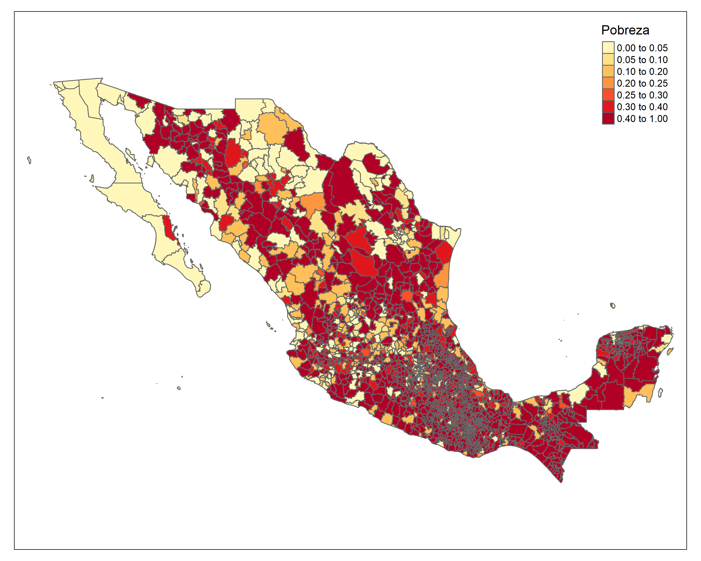
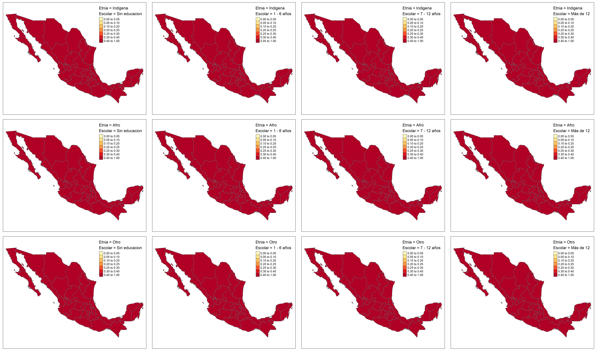

# Día 3 - Sesión 1- Estimación de la pobreza a partir del ingreso


Sea 
$$
y_{ji}=\begin{cases}
1 & ingreso_{ji}\le lp\\
0 & e.o.c.
\end{cases}
$$ 
donde $ingreso_{ji}$ representa el ingreso de la $i$-ésima persona en el $j$-ésimo post-estrato y $lp$ es un valor limite, en particular la linea de pobreza. 

Ahora, Suponga que el ingreso de las personas se obtiene mediante el modelo de unidad estimado previamente.  

#### Obejtivo {-}

Estimar la proporción de personas que están por debajo de la linea pobreza, es decir, 
$$
P_d = \frac{\sum_{U_d}y_{di}}{N_d}
$$
donde $y_{di}$ toma el valor de 1 cuando el ingreso de la persona es menor a la linea de pobreza 0 en caso contrario. 

Note que, 

$$
\begin{equation*}
\bar{Y}_d = P_d =  \frac{\sum_{s_d}y_{di} + \sum_{s^c_d}y_{di}}{N_d} 
\end{equation*}
$$

Ahora, el estimador de $P$ esta dado por: 

$$
\hat{P} = \frac{\sum_{s_d}y_{di} + \sum_{s^c_d}\hat{y}_{di}}{N_d}
$$

donde

$$\hat{y}_{di}=E_{\mathscr{M}}\left(y_{di}\mid\boldsymbol{x}_{d},\boldsymbol{\beta}\right)$$,

donde $\mathscr{M}$ hace referencia a la medida de probabilidad inducida por el modelamiento. 
De esta forma se tiene que, 

$$
\hat{P} = \frac{\sum_{U_{d}}\hat{y}_{di}}{N_d}
$$


## Proceso de estimación y predicción


```r
source("Recursos/Día3/Sesion1/0Recursos/funciones_mrp.R")
fit <- readRDS("Recursos/Día3/Sesion1/Data/fit_ingresos.rds")
```


La información auxiliar disponible ha sido extraída del censo  e imágenes satelitales


```r
statelevel_predictors_df <-   readRDS("Recursos/Día3/Sesion1/Data/predictors_satelital_dam2.rds")
```


Obtener el modelo es solo un paso más, ahora se debe realizar la predicción en el censo, el cual a sido previamente estandarizado y homologado con la encuesta. 


```r
poststrat_df <- readRDS("Recursos/Día3/Sesion1/Data/censo_mrp_dam2.rds") %>% 
     inner_join(statelevel_predictors_df) 
tba( poststrat_df %>% arrange(desc(n)) %>% head(10))
```

<table class="table table-striped lightable-classic" style="width: auto !important; margin-left: auto; margin-right: auto; font-family: Arial Narrow; width: auto !important; margin-left: auto; margin-right: auto;">
 <thead>
  <tr>
   <th style="text-align:left;"> dam </th>
   <th style="text-align:left;"> dam2 </th>
   <th style="text-align:left;"> area </th>
   <th style="text-align:left;"> etnia </th>
   <th style="text-align:left;"> sexo </th>
   <th style="text-align:left;"> edad </th>
   <th style="text-align:left;"> anoest </th>
   <th style="text-align:left;"> discapacidad </th>
   <th style="text-align:right;"> n </th>
   <th style="text-align:right;"> luces_nocturnas </th>
   <th style="text-align:right;"> suelo_cultivo </th>
   <th style="text-align:right;"> suelo_urbano </th>
   <th style="text-align:right;"> modificacion_humana </th>
   <th style="text-align:right;"> accesibilidad_hospitales </th>
   <th style="text-align:right;"> accesibilidad_hosp_caminado </th>
   <th style="text-align:right;"> area1 </th>
   <th style="text-align:right;"> etnia2 </th>
   <th style="text-align:right;"> sexo2 </th>
   <th style="text-align:right;"> edad2 </th>
   <th style="text-align:right;"> edad3 </th>
   <th style="text-align:right;"> edad4 </th>
   <th style="text-align:right;"> edad5 </th>
   <th style="text-align:right;"> anoest2 </th>
   <th style="text-align:right;"> anoest3 </th>
   <th style="text-align:right;"> anoest4 </th>
   <th style="text-align:right;"> discapacidad1 </th>
   <th style="text-align:right;"> etnia1 </th>
   <th style="text-align:right;"> tiene_sanitario </th>
   <th style="text-align:right;"> tiene_electricidad </th>
   <th style="text-align:right;"> tiene_acueducto </th>
   <th style="text-align:right;"> tiene_gas </th>
   <th style="text-align:right;"> eliminar_basura </th>
   <th style="text-align:right;"> tiene_internet </th>
   <th style="text-align:right;"> piso_tierra </th>
   <th style="text-align:right;"> material_paredes </th>
   <th style="text-align:right;"> material_techo </th>
   <th style="text-align:right;"> rezago_escolar </th>
   <th style="text-align:right;"> alfabeta </th>
   <th style="text-align:right;"> hacinamiento </th>
   <th style="text-align:right;"> tasa_desocupacion </th>
  </tr>
 </thead>
<tbody>
  <tr>
   <td style="text-align:left;"> 02 </td>
   <td style="text-align:left;"> 02004 </td>
   <td style="text-align:left;"> 1 </td>
   <td style="text-align:left;"> 3 </td>
   <td style="text-align:left;"> 1 </td>
   <td style="text-align:left;"> 2 </td>
   <td style="text-align:left;"> 3 </td>
   <td style="text-align:left;"> 0 </td>
   <td style="text-align:right;"> 171484 </td>
   <td style="text-align:right;"> 140.2065 </td>
   <td style="text-align:right;"> 97.8905 </td>
   <td style="text-align:right;"> 167.4086 </td>
   <td style="text-align:right;"> 107.1455 </td>
   <td style="text-align:right;"> 99.3947 </td>
   <td style="text-align:right;"> 99.4554 </td>
   <td style="text-align:right;"> 0.9966 </td>
   <td style="text-align:right;"> 0.0268 </td>
   <td style="text-align:right;"> 0.4902 </td>
   <td style="text-align:right;"> 0.2696 </td>
   <td style="text-align:right;"> 0.2385 </td>
   <td style="text-align:right;"> 0.1970 </td>
   <td style="text-align:right;"> 0.0468 </td>
   <td style="text-align:right;"> 0.2458 </td>
   <td style="text-align:right;"> 0.4823 </td>
   <td style="text-align:right;"> 0.1274 </td>
   <td style="text-align:right;"> 0.0512 </td>
   <td style="text-align:right;"> 0.0597 </td>
   <td style="text-align:right;"> 0.0068 </td>
   <td style="text-align:right;"> 0.5761 </td>
   <td style="text-align:right;"> 0.0145 </td>
   <td style="text-align:right;"> 0.0386 </td>
   <td style="text-align:right;"> 0.0213 </td>
   <td style="text-align:right;"> 0.2865 </td>
   <td style="text-align:right;"> 0.0096 </td>
   <td style="text-align:right;"> 0.1836 </td>
   <td style="text-align:right;"> 0.2989 </td>
   <td style="text-align:right;"> 0.2037 </td>
   <td style="text-align:right;"> 0.0429 </td>
   <td style="text-align:right;"> 0.2514 </td>
   <td style="text-align:right;"> 0.0219 </td>
  </tr>
  <tr>
   <td style="text-align:left;"> 02 </td>
   <td style="text-align:left;"> 02004 </td>
   <td style="text-align:left;"> 1 </td>
   <td style="text-align:left;"> 3 </td>
   <td style="text-align:left;"> 2 </td>
   <td style="text-align:left;"> 2 </td>
   <td style="text-align:left;"> 3 </td>
   <td style="text-align:left;"> 0 </td>
   <td style="text-align:right;"> 157532 </td>
   <td style="text-align:right;"> 140.2065 </td>
   <td style="text-align:right;"> 97.8905 </td>
   <td style="text-align:right;"> 167.4086 </td>
   <td style="text-align:right;"> 107.1455 </td>
   <td style="text-align:right;"> 99.3947 </td>
   <td style="text-align:right;"> 99.4554 </td>
   <td style="text-align:right;"> 0.9966 </td>
   <td style="text-align:right;"> 0.0268 </td>
   <td style="text-align:right;"> 0.4902 </td>
   <td style="text-align:right;"> 0.2696 </td>
   <td style="text-align:right;"> 0.2385 </td>
   <td style="text-align:right;"> 0.1970 </td>
   <td style="text-align:right;"> 0.0468 </td>
   <td style="text-align:right;"> 0.2458 </td>
   <td style="text-align:right;"> 0.4823 </td>
   <td style="text-align:right;"> 0.1274 </td>
   <td style="text-align:right;"> 0.0512 </td>
   <td style="text-align:right;"> 0.0597 </td>
   <td style="text-align:right;"> 0.0068 </td>
   <td style="text-align:right;"> 0.5761 </td>
   <td style="text-align:right;"> 0.0145 </td>
   <td style="text-align:right;"> 0.0386 </td>
   <td style="text-align:right;"> 0.0213 </td>
   <td style="text-align:right;"> 0.2865 </td>
   <td style="text-align:right;"> 0.0096 </td>
   <td style="text-align:right;"> 0.1836 </td>
   <td style="text-align:right;"> 0.2989 </td>
   <td style="text-align:right;"> 0.2037 </td>
   <td style="text-align:right;"> 0.0429 </td>
   <td style="text-align:right;"> 0.2514 </td>
   <td style="text-align:right;"> 0.0219 </td>
  </tr>
  <tr>
   <td style="text-align:left;"> 11 </td>
   <td style="text-align:left;"> 11020 </td>
   <td style="text-align:left;"> 1 </td>
   <td style="text-align:left;"> 3 </td>
   <td style="text-align:left;"> 2 </td>
   <td style="text-align:left;"> 2 </td>
   <td style="text-align:left;"> 3 </td>
   <td style="text-align:left;"> 0 </td>
   <td style="text-align:right;"> 144757 </td>
   <td style="text-align:right;"> 140.4057 </td>
   <td style="text-align:right;"> 105.1877 </td>
   <td style="text-align:right;"> 142.3702 </td>
   <td style="text-align:right;"> 107.8847 </td>
   <td style="text-align:right;"> 99.2487 </td>
   <td style="text-align:right;"> 99.3674 </td>
   <td style="text-align:right;"> 0.9686 </td>
   <td style="text-align:right;"> 0.0139 </td>
   <td style="text-align:right;"> 0.5121 </td>
   <td style="text-align:right;"> 0.2730 </td>
   <td style="text-align:right;"> 0.2171 </td>
   <td style="text-align:right;"> 0.1779 </td>
   <td style="text-align:right;"> 0.0539 </td>
   <td style="text-align:right;"> 0.2817 </td>
   <td style="text-align:right;"> 0.4281 </td>
   <td style="text-align:right;"> 0.1188 </td>
   <td style="text-align:right;"> 0.0621 </td>
   <td style="text-align:right;"> 0.0724 </td>
   <td style="text-align:right;"> 0.0043 </td>
   <td style="text-align:right;"> 0.4528 </td>
   <td style="text-align:right;"> 0.1018 </td>
   <td style="text-align:right;"> 0.0544 </td>
   <td style="text-align:right;"> 0.0132 </td>
   <td style="text-align:right;"> 0.3999 </td>
   <td style="text-align:right;"> 0.0082 </td>
   <td style="text-align:right;"> 0.0146 </td>
   <td style="text-align:right;"> 0.0336 </td>
   <td style="text-align:right;"> 0.1899 </td>
   <td style="text-align:right;"> 0.0661 </td>
   <td style="text-align:right;"> 0.2872 </td>
   <td style="text-align:right;"> 0.0301 </td>
  </tr>
  <tr>
   <td style="text-align:left;"> 09 </td>
   <td style="text-align:left;"> 09007 </td>
   <td style="text-align:left;"> 1 </td>
   <td style="text-align:left;"> 3 </td>
   <td style="text-align:left;"> 1 </td>
   <td style="text-align:left;"> 2 </td>
   <td style="text-align:left;"> 3 </td>
   <td style="text-align:left;"> 0 </td>
   <td style="text-align:right;"> 143600 </td>
   <td style="text-align:right;"> 105.8486 </td>
   <td style="text-align:right;"> 97.8787 </td>
   <td style="text-align:right;"> 119.8566 </td>
   <td style="text-align:right;"> 98.3316 </td>
   <td style="text-align:right;"> 99.0787 </td>
   <td style="text-align:right;"> 99.1309 </td>
   <td style="text-align:right;"> 1.0000 </td>
   <td style="text-align:right;"> 0.0156 </td>
   <td style="text-align:right;"> 0.5185 </td>
   <td style="text-align:right;"> 0.2449 </td>
   <td style="text-align:right;"> 0.2134 </td>
   <td style="text-align:right;"> 0.2398 </td>
   <td style="text-align:right;"> 0.0995 </td>
   <td style="text-align:right;"> 0.2150 </td>
   <td style="text-align:right;"> 0.4953 </td>
   <td style="text-align:right;"> 0.1796 </td>
   <td style="text-align:right;"> 0.0582 </td>
   <td style="text-align:right;"> 0.0850 </td>
   <td style="text-align:right;"> 0.0012 </td>
   <td style="text-align:right;"> 0.0489 </td>
   <td style="text-align:right;"> 0.0126 </td>
   <td style="text-align:right;"> 0.0368 </td>
   <td style="text-align:right;"> 0.0040 </td>
   <td style="text-align:right;"> 0.2720 </td>
   <td style="text-align:right;"> 0.0036 </td>
   <td style="text-align:right;"> 0.0078 </td>
   <td style="text-align:right;"> 0.0551 </td>
   <td style="text-align:right;"> 0.2474 </td>
   <td style="text-align:right;"> 0.0395 </td>
   <td style="text-align:right;"> 0.2573 </td>
   <td style="text-align:right;"> 0.0399 </td>
  </tr>
  <tr>
   <td style="text-align:left;"> 09 </td>
   <td style="text-align:left;"> 09007 </td>
   <td style="text-align:left;"> 1 </td>
   <td style="text-align:left;"> 3 </td>
   <td style="text-align:left;"> 2 </td>
   <td style="text-align:left;"> 2 </td>
   <td style="text-align:left;"> 3 </td>
   <td style="text-align:left;"> 0 </td>
   <td style="text-align:right;"> 141503 </td>
   <td style="text-align:right;"> 105.8486 </td>
   <td style="text-align:right;"> 97.8787 </td>
   <td style="text-align:right;"> 119.8566 </td>
   <td style="text-align:right;"> 98.3316 </td>
   <td style="text-align:right;"> 99.0787 </td>
   <td style="text-align:right;"> 99.1309 </td>
   <td style="text-align:right;"> 1.0000 </td>
   <td style="text-align:right;"> 0.0156 </td>
   <td style="text-align:right;"> 0.5185 </td>
   <td style="text-align:right;"> 0.2449 </td>
   <td style="text-align:right;"> 0.2134 </td>
   <td style="text-align:right;"> 0.2398 </td>
   <td style="text-align:right;"> 0.0995 </td>
   <td style="text-align:right;"> 0.2150 </td>
   <td style="text-align:right;"> 0.4953 </td>
   <td style="text-align:right;"> 0.1796 </td>
   <td style="text-align:right;"> 0.0582 </td>
   <td style="text-align:right;"> 0.0850 </td>
   <td style="text-align:right;"> 0.0012 </td>
   <td style="text-align:right;"> 0.0489 </td>
   <td style="text-align:right;"> 0.0126 </td>
   <td style="text-align:right;"> 0.0368 </td>
   <td style="text-align:right;"> 0.0040 </td>
   <td style="text-align:right;"> 0.2720 </td>
   <td style="text-align:right;"> 0.0036 </td>
   <td style="text-align:right;"> 0.0078 </td>
   <td style="text-align:right;"> 0.0551 </td>
   <td style="text-align:right;"> 0.2474 </td>
   <td style="text-align:right;"> 0.0395 </td>
   <td style="text-align:right;"> 0.2573 </td>
   <td style="text-align:right;"> 0.0399 </td>
  </tr>
  <tr>
   <td style="text-align:left;"> 11 </td>
   <td style="text-align:left;"> 11020 </td>
   <td style="text-align:left;"> 1 </td>
   <td style="text-align:left;"> 3 </td>
   <td style="text-align:left;"> 1 </td>
   <td style="text-align:left;"> 2 </td>
   <td style="text-align:left;"> 3 </td>
   <td style="text-align:left;"> 0 </td>
   <td style="text-align:right;"> 138958 </td>
   <td style="text-align:right;"> 140.4057 </td>
   <td style="text-align:right;"> 105.1877 </td>
   <td style="text-align:right;"> 142.3702 </td>
   <td style="text-align:right;"> 107.8847 </td>
   <td style="text-align:right;"> 99.2487 </td>
   <td style="text-align:right;"> 99.3674 </td>
   <td style="text-align:right;"> 0.9686 </td>
   <td style="text-align:right;"> 0.0139 </td>
   <td style="text-align:right;"> 0.5121 </td>
   <td style="text-align:right;"> 0.2730 </td>
   <td style="text-align:right;"> 0.2171 </td>
   <td style="text-align:right;"> 0.1779 </td>
   <td style="text-align:right;"> 0.0539 </td>
   <td style="text-align:right;"> 0.2817 </td>
   <td style="text-align:right;"> 0.4281 </td>
   <td style="text-align:right;"> 0.1188 </td>
   <td style="text-align:right;"> 0.0621 </td>
   <td style="text-align:right;"> 0.0724 </td>
   <td style="text-align:right;"> 0.0043 </td>
   <td style="text-align:right;"> 0.4528 </td>
   <td style="text-align:right;"> 0.1018 </td>
   <td style="text-align:right;"> 0.0544 </td>
   <td style="text-align:right;"> 0.0132 </td>
   <td style="text-align:right;"> 0.3999 </td>
   <td style="text-align:right;"> 0.0082 </td>
   <td style="text-align:right;"> 0.0146 </td>
   <td style="text-align:right;"> 0.0336 </td>
   <td style="text-align:right;"> 0.1899 </td>
   <td style="text-align:right;"> 0.0661 </td>
   <td style="text-align:right;"> 0.2872 </td>
   <td style="text-align:right;"> 0.0301 </td>
  </tr>
  <tr>
   <td style="text-align:left;"> 08 </td>
   <td style="text-align:left;"> 08037 </td>
   <td style="text-align:left;"> 1 </td>
   <td style="text-align:left;"> 3 </td>
   <td style="text-align:left;"> 1 </td>
   <td style="text-align:left;"> 2 </td>
   <td style="text-align:left;"> 3 </td>
   <td style="text-align:left;"> 0 </td>
   <td style="text-align:right;"> 130852 </td>
   <td style="text-align:right;"> 151.0448 </td>
   <td style="text-align:right;"> 98.5664 </td>
   <td style="text-align:right;"> 167.8694 </td>
   <td style="text-align:right;"> 109.8990 </td>
   <td style="text-align:right;"> 101.1600 </td>
   <td style="text-align:right;"> 101.6602 </td>
   <td style="text-align:right;"> 0.9945 </td>
   <td style="text-align:right;"> 0.0115 </td>
   <td style="text-align:right;"> 0.4988 </td>
   <td style="text-align:right;"> 0.2582 </td>
   <td style="text-align:right;"> 0.2153 </td>
   <td style="text-align:right;"> 0.1970 </td>
   <td style="text-align:right;"> 0.0628 </td>
   <td style="text-align:right;"> 0.2606 </td>
   <td style="text-align:right;"> 0.4589 </td>
   <td style="text-align:right;"> 0.1451 </td>
   <td style="text-align:right;"> 0.0477 </td>
   <td style="text-align:right;"> 0.0544 </td>
   <td style="text-align:right;"> 0.0042 </td>
   <td style="text-align:right;"> 0.4465 </td>
   <td style="text-align:right;"> 0.0234 </td>
   <td style="text-align:right;"> 0.0224 </td>
   <td style="text-align:right;"> 0.0045 </td>
   <td style="text-align:right;"> 0.3587 </td>
   <td style="text-align:right;"> 0.0040 </td>
   <td style="text-align:right;"> 0.1036 </td>
   <td style="text-align:right;"> 0.2928 </td>
   <td style="text-align:right;"> 0.2212 </td>
   <td style="text-align:right;"> 0.0509 </td>
   <td style="text-align:right;"> 0.2409 </td>
   <td style="text-align:right;"> 0.0220 </td>
  </tr>
  <tr>
   <td style="text-align:left;"> 15 </td>
   <td style="text-align:left;"> 15033 </td>
   <td style="text-align:left;"> 1 </td>
   <td style="text-align:left;"> 3 </td>
   <td style="text-align:left;"> 1 </td>
   <td style="text-align:left;"> 2 </td>
   <td style="text-align:left;"> 3 </td>
   <td style="text-align:left;"> 0 </td>
   <td style="text-align:right;"> 129305 </td>
   <td style="text-align:right;"> 108.9309 </td>
   <td style="text-align:right;"> 97.9617 </td>
   <td style="text-align:right;"> 123.5294 </td>
   <td style="text-align:right;"> 98.7935 </td>
   <td style="text-align:right;"> 99.0817 </td>
   <td style="text-align:right;"> 99.1339 </td>
   <td style="text-align:right;"> 0.9990 </td>
   <td style="text-align:right;"> 0.0133 </td>
   <td style="text-align:right;"> 0.5202 </td>
   <td style="text-align:right;"> 0.2457 </td>
   <td style="text-align:right;"> 0.2088 </td>
   <td style="text-align:right;"> 0.2408 </td>
   <td style="text-align:right;"> 0.0839 </td>
   <td style="text-align:right;"> 0.2222 </td>
   <td style="text-align:right;"> 0.4900 </td>
   <td style="text-align:right;"> 0.1584 </td>
   <td style="text-align:right;"> 0.0632 </td>
   <td style="text-align:right;"> 0.0706 </td>
   <td style="text-align:right;"> 0.0039 </td>
   <td style="text-align:right;"> 0.2136 </td>
   <td style="text-align:right;"> 0.0808 </td>
   <td style="text-align:right;"> 0.0285 </td>
   <td style="text-align:right;"> 0.0134 </td>
   <td style="text-align:right;"> 0.3435 </td>
   <td style="text-align:right;"> 0.0088 </td>
   <td style="text-align:right;"> 0.0125 </td>
   <td style="text-align:right;"> 0.0569 </td>
   <td style="text-align:right;"> 0.2266 </td>
   <td style="text-align:right;"> 0.0395 </td>
   <td style="text-align:right;"> 0.2307 </td>
   <td style="text-align:right;"> 0.0447 </td>
  </tr>
  <tr>
   <td style="text-align:left;"> 08 </td>
   <td style="text-align:left;"> 08037 </td>
   <td style="text-align:left;"> 1 </td>
   <td style="text-align:left;"> 3 </td>
   <td style="text-align:left;"> 2 </td>
   <td style="text-align:left;"> 2 </td>
   <td style="text-align:left;"> 3 </td>
   <td style="text-align:left;"> 0 </td>
   <td style="text-align:right;"> 127546 </td>
   <td style="text-align:right;"> 151.0448 </td>
   <td style="text-align:right;"> 98.5664 </td>
   <td style="text-align:right;"> 167.8694 </td>
   <td style="text-align:right;"> 109.8990 </td>
   <td style="text-align:right;"> 101.1600 </td>
   <td style="text-align:right;"> 101.6602 </td>
   <td style="text-align:right;"> 0.9945 </td>
   <td style="text-align:right;"> 0.0115 </td>
   <td style="text-align:right;"> 0.4988 </td>
   <td style="text-align:right;"> 0.2582 </td>
   <td style="text-align:right;"> 0.2153 </td>
   <td style="text-align:right;"> 0.1970 </td>
   <td style="text-align:right;"> 0.0628 </td>
   <td style="text-align:right;"> 0.2606 </td>
   <td style="text-align:right;"> 0.4589 </td>
   <td style="text-align:right;"> 0.1451 </td>
   <td style="text-align:right;"> 0.0477 </td>
   <td style="text-align:right;"> 0.0544 </td>
   <td style="text-align:right;"> 0.0042 </td>
   <td style="text-align:right;"> 0.4465 </td>
   <td style="text-align:right;"> 0.0234 </td>
   <td style="text-align:right;"> 0.0224 </td>
   <td style="text-align:right;"> 0.0045 </td>
   <td style="text-align:right;"> 0.3587 </td>
   <td style="text-align:right;"> 0.0040 </td>
   <td style="text-align:right;"> 0.1036 </td>
   <td style="text-align:right;"> 0.2928 </td>
   <td style="text-align:right;"> 0.2212 </td>
   <td style="text-align:right;"> 0.0509 </td>
   <td style="text-align:right;"> 0.2409 </td>
   <td style="text-align:right;"> 0.0220 </td>
  </tr>
  <tr>
   <td style="text-align:left;"> 15 </td>
   <td style="text-align:left;"> 15033 </td>
   <td style="text-align:left;"> 1 </td>
   <td style="text-align:left;"> 3 </td>
   <td style="text-align:left;"> 2 </td>
   <td style="text-align:left;"> 2 </td>
   <td style="text-align:left;"> 3 </td>
   <td style="text-align:left;"> 0 </td>
   <td style="text-align:right;"> 124495 </td>
   <td style="text-align:right;"> 108.9309 </td>
   <td style="text-align:right;"> 97.9617 </td>
   <td style="text-align:right;"> 123.5294 </td>
   <td style="text-align:right;"> 98.7935 </td>
   <td style="text-align:right;"> 99.0817 </td>
   <td style="text-align:right;"> 99.1339 </td>
   <td style="text-align:right;"> 0.9990 </td>
   <td style="text-align:right;"> 0.0133 </td>
   <td style="text-align:right;"> 0.5202 </td>
   <td style="text-align:right;"> 0.2457 </td>
   <td style="text-align:right;"> 0.2088 </td>
   <td style="text-align:right;"> 0.2408 </td>
   <td style="text-align:right;"> 0.0839 </td>
   <td style="text-align:right;"> 0.2222 </td>
   <td style="text-align:right;"> 0.4900 </td>
   <td style="text-align:right;"> 0.1584 </td>
   <td style="text-align:right;"> 0.0632 </td>
   <td style="text-align:right;"> 0.0706 </td>
   <td style="text-align:right;"> 0.0039 </td>
   <td style="text-align:right;"> 0.2136 </td>
   <td style="text-align:right;"> 0.0808 </td>
   <td style="text-align:right;"> 0.0285 </td>
   <td style="text-align:right;"> 0.0134 </td>
   <td style="text-align:right;"> 0.3435 </td>
   <td style="text-align:right;"> 0.0088 </td>
   <td style="text-align:right;"> 0.0125 </td>
   <td style="text-align:right;"> 0.0569 </td>
   <td style="text-align:right;"> 0.2266 </td>
   <td style="text-align:right;"> 0.0395 </td>
   <td style="text-align:right;"> 0.2307 </td>
   <td style="text-align:right;"> 0.0447 </td>
  </tr>
</tbody>
</table>
Note que la información del censo esta agregada.

### Distribución posterior.

Para obtener una distribución posterior de cada observación se hace uso de la función *posterior_epred* de la siguiente forma.


```r
epred_mat <- posterior_epred(fit, newdata = poststrat_df, type = "response")
dim(epred_mat)
dim(poststrat_df)
```
Como el interés es realizar comparaciones entre los países de la región se presenta la estimación del ingreso medio en términos de lineas de pobreza. Para esto procedemos así:

-   Obteniendo las lineas de pobreza por cada post-estrato


```r
(
  lp <-
    readRDS("Recursos/Día3/Sesion1/Data/encuestaMEX20N1.rds") %>% distinct(areageo2, lp, li) %>%
    mutate(
      area = ifelse(
        haven::as_factor(areageo2, levels = "values") == 1 , "1", "0"),
      areageo2 = NULL
    )
) %>%
  tba()
```

<table class="table table-striped lightable-classic" style="width: auto !important; margin-left: auto; margin-right: auto; font-family: Arial Narrow; width: auto !important; margin-left: auto; margin-right: auto;">
 <thead>
  <tr>
   <th style="text-align:right;"> lp </th>
   <th style="text-align:right;"> li </th>
   <th style="text-align:left;"> area </th>
  </tr>
 </thead>
<tbody>
  <tr>
   <td style="text-align:right;"> 2787 </td>
   <td style="text-align:right;"> 1342 </td>
   <td style="text-align:left;"> 1 </td>
  </tr>
  <tr>
   <td style="text-align:right;"> 2095 </td>
   <td style="text-align:right;"> 1101 </td>
   <td style="text-align:left;"> 0 </td>
  </tr>
</tbody>
</table>

-   Ingreso en términos de lineas de pobreza.


```r
lp <- inner_join(poststrat_df,lp,by = "area") %>% select(lp)
epred_mat_pobreza_lp <- (exp(epred_mat)-1) <= lp$lp
# epred_mat_pobreza_li <- (exp(epred_mat)-1) <= lp$li
```

## Estimación de la pobreza


```r
n_filtered <- poststrat_df$n
mrp_estimates <- epred_mat_pobreza_lp %*% n_filtered / sum(n_filtered)

(temp_ing <- data.frame(
  mrp_estimate = mean(mrp_estimates),
  mrp_estimate_se = sd(mrp_estimates)
) ) %>% tba()
```

<table class="table table-striped lightable-classic" style="width: auto !important; margin-left: auto; margin-right: auto; font-family: Arial Narrow; width: auto !important; margin-left: auto; margin-right: auto;">
 <thead>
  <tr>
   <th style="text-align:right;"> mrp_estimate </th>
   <th style="text-align:right;"> mrp_estimate_se </th>
  </tr>
 </thead>
<tbody>
  <tr>
   <td style="text-align:right;"> 0.2082 </td>
   <td style="text-align:right;"> 0.0455 </td>
  </tr>
</tbody>
</table>


El resultado nos indica que el ingreso medio nacional es 0.21 lineas de pobreza

### Estimación para el dam == "05".

Es importante siempre conservar el orden de la base, dado que relación entre la predicción y el censo en uno a uno.


```r
temp <- poststrat_df %>%  mutate(Posi = 1:n())
temp <- filter(temp, dam == "05") %>% select(n, Posi)
n_filtered <- temp$n
temp_epred_mat <- epred_mat_pobreza_lp[, temp$Posi]

## Estimando el CME
mrp_estimates <- temp_epred_mat %*% n_filtered / sum(n_filtered)

(temp_dam05 <- data.frame(
  mrp_estimate = mean(mrp_estimates),
  mrp_estimate_se = sd(mrp_estimates)
) ) %>% tba()
```

<table class="table table-striped lightable-classic" style="width: auto !important; margin-left: auto; margin-right: auto; font-family: Arial Narrow; width: auto !important; margin-left: auto; margin-right: auto;">
 <thead>
  <tr>
   <th style="text-align:right;"> mrp_estimate </th>
   <th style="text-align:right;"> mrp_estimate_se </th>
  </tr>
 </thead>
<tbody>
  <tr>
   <td style="text-align:right;"> 0.051 </td>
   <td style="text-align:right;"> 0.0108 </td>
  </tr>
</tbody>
</table>

El resultado nos indica que el ingreso medio en el dam 05 es 0.05 lineas de pobreza

### Estimación para la dam2 == "05001"


```r
temp <- poststrat_df %>%  mutate(Posi = 1:n())
temp <-
  filter(temp, dam2 == "05001") %>% select(n, Posi)
n_filtered <- temp$n
temp_epred_mat <- epred_mat_pobreza_lp[, temp$Posi]
## Estimando el CME
mrp_estimates <- temp_epred_mat %*% n_filtered / sum(n_filtered)

(temp_dam2_05001 <- data.frame(
  mrp_estimate = mean(mrp_estimates),
  mrp_estimate_se = sd(mrp_estimates)
) ) %>% tba()
```


<table class="table table-striped lightable-classic" style="width: auto !important; margin-left: auto; margin-right: auto; font-family: Arial Narrow; width: auto !important; margin-left: auto; margin-right: auto;">
 <thead>
  <tr>
   <th style="text-align:right;"> mrp_estimate </th>
   <th style="text-align:right;"> mrp_estimate_se </th>
  </tr>
 </thead>
<tbody>
  <tr>
   <td style="text-align:right;"> 0.4241 </td>
   <td style="text-align:right;"> 0.3616 </td>
  </tr>
</tbody>
</table>

El resultado nos indica que el ingreso medio en la dam2 05001 es 0.42 lineas de pobreza

Después de comprender la forma en que se realiza la estimación de los dominios no observados procedemos el uso de la función *Aux_Agregado* que es desarrollada para este fin.


```r
(mrp_estimate_Ingresolp <-
  Aux_Agregado(poststrat = poststrat_df,
             epredmat = epred_mat_pobreza_lp,
             byMap = NULL)
)
```

<table class="table table-striped lightable-classic" style="width: auto !important; margin-left: auto; margin-right: auto; font-family: Arial Narrow; width: auto !important; margin-left: auto; margin-right: auto;">
 <thead>
  <tr>
   <th style="text-align:left;"> Nacional </th>
   <th style="text-align:right;"> mrp_estimate </th>
   <th style="text-align:right;"> mrp_estimate_se </th>
  </tr>
 </thead>
<tbody>
  <tr>
   <td style="text-align:left;"> Nacional </td>
   <td style="text-align:right;"> 0.2082 </td>
   <td style="text-align:right;"> 0.0455 </td>
  </tr>
</tbody>
</table>


De forma similar es posible obtener los resultados para las divisiones administrativas. 


```r
mrp_estimate_dam <-
  Aux_Agregado(poststrat = poststrat_df,
             epredmat = epred_mat_pobreza_lp,
             byMap = "dam")
tba(mrp_estimate_dam %>% head(10))
```

<table class="table table-striped lightable-classic" style="width: auto !important; margin-left: auto; margin-right: auto; font-family: Arial Narrow; width: auto !important; margin-left: auto; margin-right: auto;">
 <thead>
  <tr>
   <th style="text-align:left;"> dam2 </th>
   <th style="text-align:right;"> mrp_estimate </th>
   <th style="text-align:right;"> mrp_estimate_se </th>
  </tr>
 </thead>
<tbody>
  <tr>
   <td style="text-align:left;"> 01001 </td>
   <td style="text-align:right;"> 0.0000 </td>
   <td style="text-align:right;"> 0.0000 </td>
  </tr>
  <tr>
   <td style="text-align:left;"> 01002 </td>
   <td style="text-align:right;"> 0.1603 </td>
   <td style="text-align:right;"> 0.0530 </td>
  </tr>
  <tr>
   <td style="text-align:left;"> 01003 </td>
   <td style="text-align:right;"> 0.1457 </td>
   <td style="text-align:right;"> 0.0445 </td>
  </tr>
  <tr>
   <td style="text-align:left;"> 01004 </td>
   <td style="text-align:right;"> 0.1320 </td>
   <td style="text-align:right;"> 0.0409 </td>
  </tr>
  <tr>
   <td style="text-align:left;"> 01005 </td>
   <td style="text-align:right;"> 0.0000 </td>
   <td style="text-align:right;"> 0.0000 </td>
  </tr>
  <tr>
   <td style="text-align:left;"> 01006 </td>
   <td style="text-align:right;"> 0.1323 </td>
   <td style="text-align:right;"> 0.0549 </td>
  </tr>
  <tr>
   <td style="text-align:left;"> 01007 </td>
   <td style="text-align:right;"> 0.1405 </td>
   <td style="text-align:right;"> 0.0425 </td>
  </tr>
  <tr>
   <td style="text-align:left;"> 01008 </td>
   <td style="text-align:right;"> 0.0001 </td>
   <td style="text-align:right;"> 0.0023 </td>
  </tr>
  <tr>
   <td style="text-align:left;"> 01009 </td>
   <td style="text-align:right;"> 0.1133 </td>
   <td style="text-align:right;"> 0.0592 </td>
  </tr>
  <tr>
   <td style="text-align:left;"> 01010 </td>
   <td style="text-align:right;"> 0.4717 </td>
   <td style="text-align:right;"> 0.1202 </td>
  </tr>
</tbody>
</table>


```r
mrp_estimate_dam2 <-
  Aux_Agregado(poststrat = poststrat_df,
             epredmat = epred_mat_pobreza_lp,
             byMap = "dam2")

tba(mrp_estimate_dam2 %>% head(10) )
```

<table class="table table-striped lightable-classic" style="width: auto !important; margin-left: auto; margin-right: auto; font-family: Arial Narrow; width: auto !important; margin-left: auto; margin-right: auto;">
 <thead>
  <tr>
   <th style="text-align:left;"> dam2 </th>
   <th style="text-align:right;"> mrp_estimate </th>
   <th style="text-align:right;"> mrp_estimate_se </th>
  </tr>
 </thead>
<tbody>
  <tr>
   <td style="text-align:left;"> 01001 </td>
   <td style="text-align:right;"> 0.0000 </td>
   <td style="text-align:right;"> 0.0000 </td>
  </tr>
  <tr>
   <td style="text-align:left;"> 01002 </td>
   <td style="text-align:right;"> 0.1603 </td>
   <td style="text-align:right;"> 0.0530 </td>
  </tr>
  <tr>
   <td style="text-align:left;"> 01003 </td>
   <td style="text-align:right;"> 0.1457 </td>
   <td style="text-align:right;"> 0.0445 </td>
  </tr>
  <tr>
   <td style="text-align:left;"> 01004 </td>
   <td style="text-align:right;"> 0.1320 </td>
   <td style="text-align:right;"> 0.0409 </td>
  </tr>
  <tr>
   <td style="text-align:left;"> 01005 </td>
   <td style="text-align:right;"> 0.0000 </td>
   <td style="text-align:right;"> 0.0000 </td>
  </tr>
  <tr>
   <td style="text-align:left;"> 01006 </td>
   <td style="text-align:right;"> 0.1323 </td>
   <td style="text-align:right;"> 0.0549 </td>
  </tr>
  <tr>
   <td style="text-align:left;"> 01007 </td>
   <td style="text-align:right;"> 0.1405 </td>
   <td style="text-align:right;"> 0.0425 </td>
  </tr>
  <tr>
   <td style="text-align:left;"> 01008 </td>
   <td style="text-align:right;"> 0.0001 </td>
   <td style="text-align:right;"> 0.0023 </td>
  </tr>
  <tr>
   <td style="text-align:left;"> 01009 </td>
   <td style="text-align:right;"> 0.1133 </td>
   <td style="text-align:right;"> 0.0592 </td>
  </tr>
  <tr>
   <td style="text-align:left;"> 01010 </td>
   <td style="text-align:right;"> 0.4717 </td>
   <td style="text-align:right;"> 0.1202 </td>
  </tr>
</tbody>
</table>


El mapa resultante es el siguiente





```r
mrp_estimate_etnia_anoes <-
  Aux_Agregado(poststrat = poststrat_df,
             epredmat = epred_mat,
             byMap = c("dam","anoest","etnia"))

## Leer Shapefile del país
ShapeSAE <- read_sf("Shape/MEX_dam.shp") %>% rename(depto = dam)
p1 <- Aux_Maps(
  Shape = ShapeSAE,
  dat_df =  mrp_estimate_etnia_anoes%>% rename(depto = dam),
  fnames = "etnia",
  cnames = "anoest",
  brks = brks_lp,
  outPaht = "Recursos/Día3/Sesion1/0Recursos/Mosaico.png"
)
```



