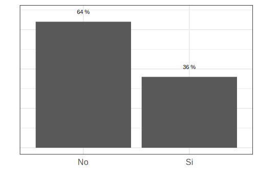
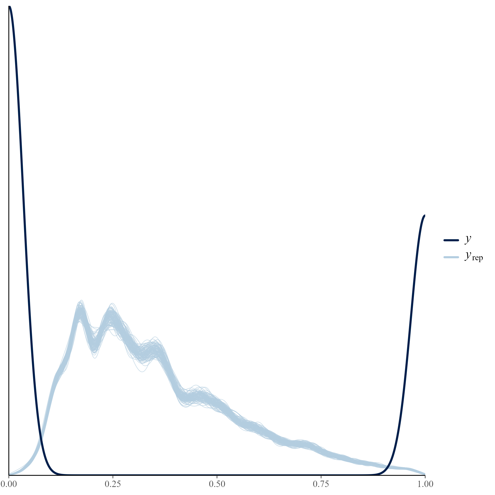
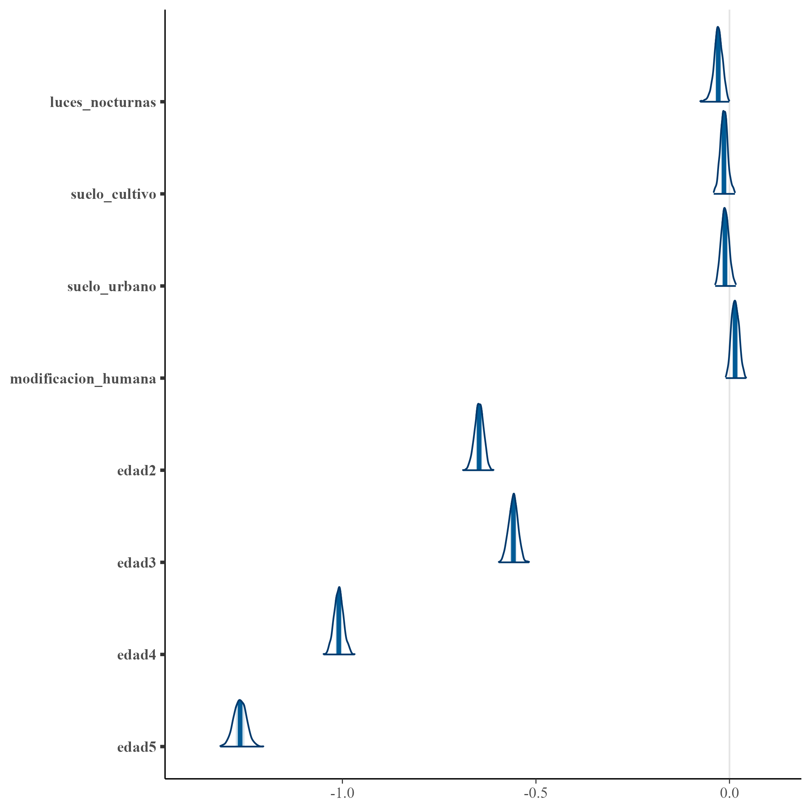
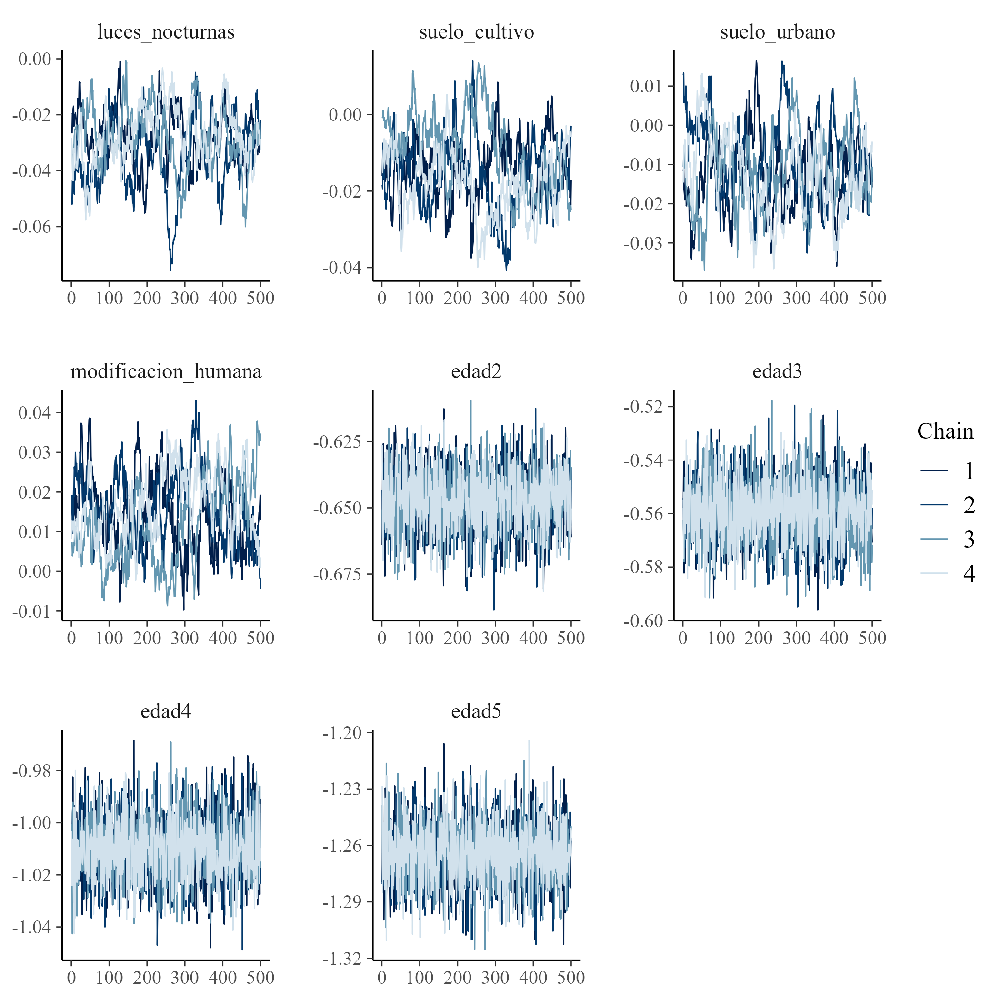

# Día 3 - Sesión 2- Modelo de unidad para la estimación de la pobreza 


Lo primero a tener en cuenta, es que no se debe usar una regresión lineal cuando se tiene una variable de tipo  binario como variable dependiente, ya que no es posible estimar la probabilidad del evento estudiado de manera directa, por esta razón se emplea una regresión logística, en la que para obtener las estimaciones          de la probabilidad del evento estudiado se debe realizar una transformación (logit), lo cual consiste en          tomar el logaritmo de la probabilidad de éxito entre la probabilidad de fracaso, de la siguiente manera:  

$$
\ln \frac{\theta}{1-\theta}
$$
donde $\theta$ representa la probabilidad de éxito del evento.  

## Modelo de regresión logistica. 

Sea 
$$
y_{ji}=\begin{cases}
1 & ingreso_{ji}\le lp\\
0 & e.o.c.
\end{cases}
$$ 
donde $ingreso_{ji}$ representa el ingreso de la $i$-ésima persona en el $j$-ésimo post-estrato y $lp$ es un valor limite, en particular la linea de pobreza. Empleando un modelo de regresión logística de efecto aleatorios pretende establecer la relación entre la expectativa $\theta_{ji}$  de la variable dicotómica con las covariables de información auxiliar disponibles para ser incluidas. El procedimiento correspondiente a este proceso, modela el logaritmo del cociente entre la probabilidad de estar por debajo de la linea de pobreza  a su complemento en relación al conjunto de covariables a nivel de unidad, $x_{ji}$, y el efecto aleatorio $u_d$.     

$$
\begin{eqnarray*}
\ln\left(\frac{\theta_{ji}}{1-\theta_{ji}}\right)=\boldsymbol{x}_{ji}^{T}\boldsymbol{\beta}+u_d
\end{eqnarray*}
$$

Donde los coeficientes $\boldsymbol{\beta}$ hacen referencia a los efectos fijos de las variables $x_{ji}^T$  sobre las probabilidades de que la $i$-ésima persona este por debajo de la linea de pobreza; por otro lado, $u_d$ son los efectos fijos aleatorios, donde $u_{d}\sim N\left(0,\sigma^2_{u}\right)$. 

Para este caso se asumen las distribuciones previas

$$
\begin{eqnarray*}
\beta_k & \sim   & N(0, 1000)\\
\sigma^2_u &\sim & IG(0.0001,0.0001)
\end{eqnarray*}
$$ las cuales se toman no informativas.


#### Obejtivo {-}

Estimar la proporción de personas que están por debajo de la linea pobreza, es decir, 
$$
P_d = \frac{\sum_{U_d}y_{di}}{N_d}
$$
donde $y_{di}$ toma el valor de 1 cuando el ingreso de la persona es menor a la linea de pobreza 0 en caso contrario. 

Note que, 

$$
\begin{equation*}
\bar{Y}_d = P_d =  \frac{\sum_{s_d}y_{di} + \sum_{s^c_d}y_{di}}{N_d} 
\end{equation*}
$$

Ahora, el estimador de $P$ esta dado por: 

$$
\hat{P} = \frac{\sum_{s_d}y_{di} + \sum_{s^c_d}\hat{y}_{di}}{N_d}
$$

donde

$$\hat{y}_{di}=E_{\mathscr{M}}\left(y_{di}\mid\boldsymbol{x}_{d},\boldsymbol{\beta}\right)$$,

donde $\mathscr{M}$ hace referencia a la medida de probabilidad inducida por el modelamiento. 
De esta forma se tiene que, 

$$
\hat{P} = \frac{\sum_{U_{d}}\hat{y}_{di}}{N_d}
$$


A continuación se muestra el proceso realizado para la obtención de la predicción de la tasa de pobreza.

## Proceso de estimación en `R`

Para desarrollar la metodología se hace uso de las siguientes librerías.


```r
# Interprete de STAN en R
library(rstan)
library(rstanarm)
# Manejo de bases de datos.
library(tidyverse)
# Gráficas de los modelos. 
library(bayesplot)
library(patchwork)
# Organizar la presentación de las tablas
library(kableExtra)
library(printr)
```

Un conjunto de funciones desarrolladas para realizar de forma simplificada los procesos están consignadas en la siguiente rutina.


```r
source("Recursos/Día3/Sesion2/0Recursos/funciones_mrp.R")
```

Entre las funciones incluidas en el archivo encuentra

-   *plot_interaction*: Esta crea un diagrama de lineas donde se estudia la interacción entre las variables, en el caso de presentar un traslape de las lineas se recomienda incluir el interacción en el modelo.

-   *Plot_Compare* Puesto que es necesario realizar una homologar la información del censo y la encuesta es conveniente llevar a cabo una validación de las variables que han sido homologadas, por tanto, se espera que las proporciones resultantes del censo y la encuesta estén cercanas entre sí.

-   *Aux_Agregado*: Esta es función permite obtener estimaciones a diferentes niveles de agregación, toma mucha relevancia cuando se realiza un proceso repetitivo.

**Las funciones están diseñada específicamente  para este  proceso**

### Encuesta de hogares

Los datos empleados en esta ocasión corresponden a la ultima encuesta de hogares, la cual ha sido estandarizada por *CEPAL* y se encuentra disponible en *BADEHOG*


```r
encuesta <- readRDS("Recursos/Día3/Sesion2/Data/encuestaMEX20N1.rds")

encuesta_mrp <- encuesta %>% 
  transmute(
    dam, dam2,  
    ingreso = ingcorte,lp,li,
    pobreza = ifelse(ingcorte<=lp,1,0),
    area = case_when(haven::as_factor(areageo2,"value") == 1 ~ "1", TRUE ~ "0"),
  sexo = case_when(sexo == "Mujer" ~ "1", TRUE ~ "2"),
  
anoest = case_when(
    edad < 2 | anoest == -1   ~ "98"  , #No aplica
    anoest == 99 ~ "99", #NS/NR
    anoest == 0  ~ "1", # Sin educacion
    anoest %in% c(1:6) ~ "2",       # 1 - 6
    anoest %in% c(7:12) ~ "3",      # 7 - 12
    anoest > 12 ~ "4",      # mas de 12
    TRUE ~ "Error"  ),
  
  

  edad = case_when(
    edad < 15 ~ "1",
    edad < 30 ~ "2",
    edad < 45 ~ "3",
    edad < 65 ~ "4",
    TRUE ~ "5"),
  discapacidad,
  etnia = etnia_ee,
  fep
) 

tba(encuesta_mrp %>% head(10)) 
```

<table class="table table-striped lightable-classic" style="width: auto !important; margin-left: auto; margin-right: auto; font-family: Arial Narrow; width: auto !important; margin-left: auto; margin-right: auto;">
 <thead>
  <tr>
   <th style="text-align:left;"> dam </th>
   <th style="text-align:left;"> dam2 </th>
   <th style="text-align:right;"> ingreso </th>
   <th style="text-align:right;"> lp </th>
   <th style="text-align:right;"> li </th>
   <th style="text-align:right;"> pobreza </th>
   <th style="text-align:left;"> area </th>
   <th style="text-align:left;"> sexo </th>
   <th style="text-align:left;"> anoest </th>
   <th style="text-align:left;"> edad </th>
   <th style="text-align:left;"> discapacidad </th>
   <th style="text-align:left;"> etnia </th>
   <th style="text-align:right;"> fep </th>
  </tr>
 </thead>
<tbody>
  <tr>
   <td style="text-align:left;"> 01 </td>
   <td style="text-align:left;"> 01001 </td>
   <td style="text-align:right;"> 1803.277 </td>
   <td style="text-align:right;"> 2787 </td>
   <td style="text-align:right;"> 1342 </td>
   <td style="text-align:right;"> 1 </td>
   <td style="text-align:left;"> 1 </td>
   <td style="text-align:left;"> 1 </td>
   <td style="text-align:left;"> 4 </td>
   <td style="text-align:left;"> 4 </td>
   <td style="text-align:left;"> 0 </td>
   <td style="text-align:left;"> 3 </td>
   <td style="text-align:right;"> 190 </td>
  </tr>
  <tr>
   <td style="text-align:left;"> 01 </td>
   <td style="text-align:left;"> 01001 </td>
   <td style="text-align:right;"> 1803.277 </td>
   <td style="text-align:right;"> 2787 </td>
   <td style="text-align:right;"> 1342 </td>
   <td style="text-align:right;"> 1 </td>
   <td style="text-align:left;"> 1 </td>
   <td style="text-align:left;"> 1 </td>
   <td style="text-align:left;"> 3 </td>
   <td style="text-align:left;"> 2 </td>
   <td style="text-align:left;"> 0 </td>
   <td style="text-align:left;"> 3 </td>
   <td style="text-align:right;"> 190 </td>
  </tr>
  <tr>
   <td style="text-align:left;"> 01 </td>
   <td style="text-align:left;"> 01001 </td>
   <td style="text-align:right;"> 1803.277 </td>
   <td style="text-align:right;"> 2787 </td>
   <td style="text-align:right;"> 1342 </td>
   <td style="text-align:right;"> 1 </td>
   <td style="text-align:left;"> 1 </td>
   <td style="text-align:left;"> 2 </td>
   <td style="text-align:left;"> 3 </td>
   <td style="text-align:left;"> 1 </td>
   <td style="text-align:left;"> 0 </td>
   <td style="text-align:left;"> 3 </td>
   <td style="text-align:right;"> 190 </td>
  </tr>
  <tr>
   <td style="text-align:left;"> 01 </td>
   <td style="text-align:left;"> 01001 </td>
   <td style="text-align:right;"> 2618.807 </td>
   <td style="text-align:right;"> 2787 </td>
   <td style="text-align:right;"> 1342 </td>
   <td style="text-align:right;"> 1 </td>
   <td style="text-align:left;"> 1 </td>
   <td style="text-align:left;"> 2 </td>
   <td style="text-align:left;"> 3 </td>
   <td style="text-align:left;"> 4 </td>
   <td style="text-align:left;"> 0 </td>
   <td style="text-align:left;"> 3 </td>
   <td style="text-align:right;"> 190 </td>
  </tr>
  <tr>
   <td style="text-align:left;"> 01 </td>
   <td style="text-align:left;"> 01001 </td>
   <td style="text-align:right;"> 2618.807 </td>
   <td style="text-align:right;"> 2787 </td>
   <td style="text-align:right;"> 1342 </td>
   <td style="text-align:right;"> 1 </td>
   <td style="text-align:left;"> 1 </td>
   <td style="text-align:left;"> 1 </td>
   <td style="text-align:left;"> 3 </td>
   <td style="text-align:left;"> 3 </td>
   <td style="text-align:left;"> 0 </td>
   <td style="text-align:left;"> 3 </td>
   <td style="text-align:right;"> 190 </td>
  </tr>
  <tr>
   <td style="text-align:left;"> 01 </td>
   <td style="text-align:left;"> 01001 </td>
   <td style="text-align:right;"> 2618.807 </td>
   <td style="text-align:right;"> 2787 </td>
   <td style="text-align:right;"> 1342 </td>
   <td style="text-align:right;"> 1 </td>
   <td style="text-align:left;"> 1 </td>
   <td style="text-align:left;"> 2 </td>
   <td style="text-align:left;"> 3 </td>
   <td style="text-align:left;"> 2 </td>
   <td style="text-align:left;"> 0 </td>
   <td style="text-align:left;"> 3 </td>
   <td style="text-align:right;"> 190 </td>
  </tr>
  <tr>
   <td style="text-align:left;"> 01 </td>
   <td style="text-align:left;"> 01001 </td>
   <td style="text-align:right;"> 2618.807 </td>
   <td style="text-align:right;"> 2787 </td>
   <td style="text-align:right;"> 1342 </td>
   <td style="text-align:right;"> 1 </td>
   <td style="text-align:left;"> 1 </td>
   <td style="text-align:left;"> 2 </td>
   <td style="text-align:left;"> 2 </td>
   <td style="text-align:left;"> 1 </td>
   <td style="text-align:left;"> 0 </td>
   <td style="text-align:left;"> 3 </td>
   <td style="text-align:right;"> 190 </td>
  </tr>
  <tr>
   <td style="text-align:left;"> 01 </td>
   <td style="text-align:left;"> 01001 </td>
   <td style="text-align:right;"> 5663.193 </td>
   <td style="text-align:right;"> 2787 </td>
   <td style="text-align:right;"> 1342 </td>
   <td style="text-align:right;"> 0 </td>
   <td style="text-align:left;"> 1 </td>
   <td style="text-align:left;"> 2 </td>
   <td style="text-align:left;"> 4 </td>
   <td style="text-align:left;"> 2 </td>
   <td style="text-align:left;"> 0 </td>
   <td style="text-align:left;"> 3 </td>
   <td style="text-align:right;"> 189 </td>
  </tr>
  <tr>
   <td style="text-align:left;"> 01 </td>
   <td style="text-align:left;"> 01001 </td>
   <td style="text-align:right;"> 5663.193 </td>
   <td style="text-align:right;"> 2787 </td>
   <td style="text-align:right;"> 1342 </td>
   <td style="text-align:right;"> 0 </td>
   <td style="text-align:left;"> 1 </td>
   <td style="text-align:left;"> 1 </td>
   <td style="text-align:left;"> 4 </td>
   <td style="text-align:left;"> 2 </td>
   <td style="text-align:left;"> 0 </td>
   <td style="text-align:left;"> 3 </td>
   <td style="text-align:right;"> 189 </td>
  </tr>
  <tr>
   <td style="text-align:left;"> 01 </td>
   <td style="text-align:left;"> 01001 </td>
   <td style="text-align:right;"> 11926.229 </td>
   <td style="text-align:right;"> 2787 </td>
   <td style="text-align:right;"> 1342 </td>
   <td style="text-align:right;"> 0 </td>
   <td style="text-align:left;"> 1 </td>
   <td style="text-align:left;"> 2 </td>
   <td style="text-align:left;"> 4 </td>
   <td style="text-align:left;"> 2 </td>
   <td style="text-align:left;"> 0 </td>
   <td style="text-align:left;"> 3 </td>
   <td style="text-align:right;"> 189 </td>
  </tr>
</tbody>
</table>

La base de datos de la encuesta tiene la siguientes columnas: 

-   *dam*: Corresponde al código asignado a la división administrativa mayor del país.

-   *dam2*: Corresponde al código asignado a la segunda división administrativa del país.

-   *lp* y *li* lineas de pobreza y pobreza extrema definidas por CEPAL. 

-   *área* división geográfica (Urbano y Rural). 

-   *sexo* Hombre y Mujer. 

-   *etnia* En estas variable se definen tres grupos:  afrodescendientes, indígenas y Otros. 

-   Años de escolaridad (*anoest*) 

-   Rangos de edad (*edad*) 

-   Factor de expansión por persona (*fep*)


Ahora, inspeccionamos el comportamiento de la variable de interés: 


```r
tab <- encuesta_mrp %>% group_by(pobreza) %>% 
  tally() %>%
  mutate(prop = round(n/sum(n),2),
         pobreza = ifelse(pobreza == 1, "Si", "No"))

ggplot(data = tab, aes(x = pobreza, y = prop)) +
  geom_bar(stat = "identity") + 
  labs(y = "", x = "") +
  geom_text(aes(label = paste(prop*100,"%")), 
            nudge_y=0.05) +
  theme_bw(base_size = 20) +
  theme(axis.text.y = element_blank(),
        axis.ticks = element_blank())
```

<div class="figure">

<p class="caption">(\#fig:unnamed-chunk-4)Proporción de personas por debajo de la linea de pobreza</p>
</div>


La información auxiliar disponible ha sido extraída del censo  e imágenes satelitales


```r
statelevel_predictors_df <- 
  readRDS("Recursos/Día3/Sesion2/Data/predictors_satelital_dam2.rds") 
tba(statelevel_predictors_df  %>%  head(10))
```

<table class="table table-striped lightable-classic" style="width: auto !important; margin-left: auto; margin-right: auto; font-family: Arial Narrow; width: auto !important; margin-left: auto; margin-right: auto;">
 <thead>
  <tr>
   <th style="text-align:left;"> dam </th>
   <th style="text-align:left;"> dam2 </th>
   <th style="text-align:right;"> luces_nocturnas </th>
   <th style="text-align:right;"> suelo_cultivo </th>
   <th style="text-align:right;"> suelo_urbano </th>
   <th style="text-align:right;"> modificacion_humana </th>
   <th style="text-align:right;"> accesibilidad_hospitales </th>
   <th style="text-align:right;"> accesibilidad_hosp_caminado </th>
   <th style="text-align:right;"> area1 </th>
   <th style="text-align:right;"> etnia2 </th>
   <th style="text-align:right;"> sexo2 </th>
   <th style="text-align:right;"> edad2 </th>
   <th style="text-align:right;"> edad3 </th>
   <th style="text-align:right;"> edad4 </th>
   <th style="text-align:right;"> edad5 </th>
   <th style="text-align:right;"> anoest2 </th>
   <th style="text-align:right;"> anoest3 </th>
   <th style="text-align:right;"> anoest4 </th>
   <th style="text-align:right;"> discapacidad1 </th>
   <th style="text-align:right;"> etnia1 </th>
   <th style="text-align:right;"> tiene_sanitario </th>
   <th style="text-align:right;"> tiene_electricidad </th>
   <th style="text-align:right;"> tiene_acueducto </th>
   <th style="text-align:right;"> tiene_gas </th>
   <th style="text-align:right;"> eliminar_basura </th>
   <th style="text-align:right;"> tiene_internet </th>
   <th style="text-align:right;"> piso_tierra </th>
   <th style="text-align:right;"> material_paredes </th>
   <th style="text-align:right;"> material_techo </th>
   <th style="text-align:right;"> rezago_escolar </th>
   <th style="text-align:right;"> alfabeta </th>
   <th style="text-align:right;"> hacinamiento </th>
   <th style="text-align:right;"> tasa_desocupacion </th>
  </tr>
 </thead>
<tbody>
  <tr>
   <td style="text-align:left;"> 01 </td>
   <td style="text-align:left;"> 01001 </td>
   <td style="text-align:right;"> 127.0742 </td>
   <td style="text-align:right;"> 105.4925 </td>
   <td style="text-align:right;"> 128.6893 </td>
   <td style="text-align:right;"> 106.7313 </td>
   <td style="text-align:right;"> 99.2730 </td>
   <td style="text-align:right;"> 99.4086 </td>
   <td style="text-align:right;"> 0.9453 </td>
   <td style="text-align:right;"> 0.0116 </td>
   <td style="text-align:right;"> 0.5180 </td>
   <td style="text-align:right;"> 0.2656 </td>
   <td style="text-align:right;"> 0.2129 </td>
   <td style="text-align:right;"> 0.1962 </td>
   <td style="text-align:right;"> 0.0671 </td>
   <td style="text-align:right;"> 0.2101 </td>
   <td style="text-align:right;"> 0.4280 </td>
   <td style="text-align:right;"> 0.2258 </td>
   <td style="text-align:right;"> 0.0574 </td>
   <td style="text-align:right;"> 0.0595 </td>
   <td style="text-align:right;"> 0.0020 </td>
   <td style="text-align:right;"> 0.3925 </td>
   <td style="text-align:right;"> 0.0303 </td>
   <td style="text-align:right;"> 0.0301 </td>
   <td style="text-align:right;"> 0.0058 </td>
   <td style="text-align:right;"> 0.2946 </td>
   <td style="text-align:right;"> 0.0022 </td>
   <td style="text-align:right;"> 0.0211 </td>
   <td style="text-align:right;"> 0.0098 </td>
   <td style="text-align:right;"> 0.3419 </td>
   <td style="text-align:right;"> 0.0381 </td>
   <td style="text-align:right;"> 0.1690 </td>
   <td style="text-align:right;"> 0.0284 </td>
  </tr>
  <tr>
   <td style="text-align:left;"> 01 </td>
   <td style="text-align:left;"> 01002 </td>
   <td style="text-align:right;"> 103.2847 </td>
   <td style="text-align:right;"> 101.3865 </td>
   <td style="text-align:right;"> 101.7692 </td>
   <td style="text-align:right;"> 100.7418 </td>
   <td style="text-align:right;"> 99.2012 </td>
   <td style="text-align:right;"> 99.2972 </td>
   <td style="text-align:right;"> 0.4106 </td>
   <td style="text-align:right;"> 0.0030 </td>
   <td style="text-align:right;"> 0.5082 </td>
   <td style="text-align:right;"> 0.2690 </td>
   <td style="text-align:right;"> 0.1853 </td>
   <td style="text-align:right;"> 0.1703 </td>
   <td style="text-align:right;"> 0.0665 </td>
   <td style="text-align:right;"> 0.3188 </td>
   <td style="text-align:right;"> 0.4404 </td>
   <td style="text-align:right;"> 0.0666 </td>
   <td style="text-align:right;"> 0.0706 </td>
   <td style="text-align:right;"> 0.0318 </td>
   <td style="text-align:right;"> 0.0448 </td>
   <td style="text-align:right;"> 0.5895 </td>
   <td style="text-align:right;"> 0.4913 </td>
   <td style="text-align:right;"> 0.0650 </td>
   <td style="text-align:right;"> 0.1084 </td>
   <td style="text-align:right;"> 0.6548 </td>
   <td style="text-align:right;"> 0.0118 </td>
   <td style="text-align:right;"> 0.2598 </td>
   <td style="text-align:right;"> 0.1648 </td>
   <td style="text-align:right;"> 0.1003 </td>
   <td style="text-align:right;"> 0.0648 </td>
   <td style="text-align:right;"> 0.3137 </td>
   <td style="text-align:right;"> 0.0436 </td>
  </tr>
  <tr>
   <td style="text-align:left;"> 01 </td>
   <td style="text-align:left;"> 01003 </td>
   <td style="text-align:right;"> 102.5703 </td>
   <td style="text-align:right;"> 100.2905 </td>
   <td style="text-align:right;"> 100.6374 </td>
   <td style="text-align:right;"> 101.8864 </td>
   <td style="text-align:right;"> 99.4002 </td>
   <td style="text-align:right;"> 99.4182 </td>
   <td style="text-align:right;"> 0.5802 </td>
   <td style="text-align:right;"> 0.0039 </td>
   <td style="text-align:right;"> 0.5117 </td>
   <td style="text-align:right;"> 0.2438 </td>
   <td style="text-align:right;"> 0.1828 </td>
   <td style="text-align:right;"> 0.1920 </td>
   <td style="text-align:right;"> 0.0990 </td>
   <td style="text-align:right;"> 0.3647 </td>
   <td style="text-align:right;"> 0.4001 </td>
   <td style="text-align:right;"> 0.0665 </td>
   <td style="text-align:right;"> 0.0865 </td>
   <td style="text-align:right;"> 0.0387 </td>
   <td style="text-align:right;"> 0.0116 </td>
   <td style="text-align:right;"> 1.0000 </td>
   <td style="text-align:right;"> 0.0776 </td>
   <td style="text-align:right;"> 0.0909 </td>
   <td style="text-align:right;"> 0.0035 </td>
   <td style="text-align:right;"> 0.5350 </td>
   <td style="text-align:right;"> 0.0096 </td>
   <td style="text-align:right;"> 0.1028 </td>
   <td style="text-align:right;"> 0.0070 </td>
   <td style="text-align:right;"> 0.0996 </td>
   <td style="text-align:right;"> 0.0630 </td>
   <td style="text-align:right;"> 0.2553 </td>
   <td style="text-align:right;"> 0.0647 </td>
  </tr>
  <tr>
   <td style="text-align:left;"> 01 </td>
   <td style="text-align:left;"> 01004 </td>
   <td style="text-align:right;"> 99.2927 </td>
   <td style="text-align:right;"> 98.8613 </td>
   <td style="text-align:right;"> 98.8818 </td>
   <td style="text-align:right;"> 97.8499 </td>
   <td style="text-align:right;"> 99.1040 </td>
   <td style="text-align:right;"> 99.1727 </td>
   <td style="text-align:right;"> 0.5490 </td>
   <td style="text-align:right;"> 0.0042 </td>
   <td style="text-align:right;"> 0.5139 </td>
   <td style="text-align:right;"> 0.2730 </td>
   <td style="text-align:right;"> 0.2032 </td>
   <td style="text-align:right;"> 0.1587 </td>
   <td style="text-align:right;"> 0.0610 </td>
   <td style="text-align:right;"> 0.2666 </td>
   <td style="text-align:right;"> 0.4727 </td>
   <td style="text-align:right;"> 0.0785 </td>
   <td style="text-align:right;"> 0.0603 </td>
   <td style="text-align:right;"> 0.0585 </td>
   <td style="text-align:right;"> 0.0258 </td>
   <td style="text-align:right;"> 0.5185 </td>
   <td style="text-align:right;"> 0.1752 </td>
   <td style="text-align:right;"> 0.0544 </td>
   <td style="text-align:right;"> 0.0123 </td>
   <td style="text-align:right;"> 0.7144 </td>
   <td style="text-align:right;"> 0.0079 </td>
   <td style="text-align:right;"> 0.2572 </td>
   <td style="text-align:right;"> 0.0861 </td>
   <td style="text-align:right;"> 0.1261 </td>
   <td style="text-align:right;"> 0.0592 </td>
   <td style="text-align:right;"> 0.3578 </td>
   <td style="text-align:right;"> 0.0303 </td>
  </tr>
  <tr>
   <td style="text-align:left;"> 01 </td>
   <td style="text-align:left;"> 01005 </td>
   <td style="text-align:right;"> 107.6633 </td>
   <td style="text-align:right;"> 100.5877 </td>
   <td style="text-align:right;"> 104.8903 </td>
   <td style="text-align:right;"> 100.5953 </td>
   <td style="text-align:right;"> 99.1894 </td>
   <td style="text-align:right;"> 99.2677 </td>
   <td style="text-align:right;"> 0.7330 </td>
   <td style="text-align:right;"> 0.0255 </td>
   <td style="text-align:right;"> 0.5014 </td>
   <td style="text-align:right;"> 0.2524 </td>
   <td style="text-align:right;"> 0.2309 </td>
   <td style="text-align:right;"> 0.1629 </td>
   <td style="text-align:right;"> 0.0569 </td>
   <td style="text-align:right;"> 0.2359 </td>
   <td style="text-align:right;"> 0.3886 </td>
   <td style="text-align:right;"> 0.1761 </td>
   <td style="text-align:right;"> 0.0511 </td>
   <td style="text-align:right;"> 0.0525 </td>
   <td style="text-align:right;"> 0.0050 </td>
   <td style="text-align:right;"> 0.9308 </td>
   <td style="text-align:right;"> 0.2182 </td>
   <td style="text-align:right;"> 0.0302 </td>
   <td style="text-align:right;"> 0.0013 </td>
   <td style="text-align:right;"> 0.3709 </td>
   <td style="text-align:right;"> 0.0039 </td>
   <td style="text-align:right;"> 0.0329 </td>
   <td style="text-align:right;"> 0.0200 </td>
   <td style="text-align:right;"> 0.2858 </td>
   <td style="text-align:right;"> 0.0538 </td>
   <td style="text-align:right;"> 0.2565 </td>
   <td style="text-align:right;"> 0.0162 </td>
  </tr>
  <tr>
   <td style="text-align:left;"> 01 </td>
   <td style="text-align:left;"> 01006 </td>
   <td style="text-align:right;"> 101.2918 </td>
   <td style="text-align:right;"> 99.5395 </td>
   <td style="text-align:right;"> 99.7443 </td>
   <td style="text-align:right;"> 98.6083 </td>
   <td style="text-align:right;"> 99.0990 </td>
   <td style="text-align:right;"> 99.1562 </td>
   <td style="text-align:right;"> 0.7530 </td>
   <td style="text-align:right;"> 0.0111 </td>
   <td style="text-align:right;"> 0.5086 </td>
   <td style="text-align:right;"> 0.2595 </td>
   <td style="text-align:right;"> 0.1996 </td>
   <td style="text-align:right;"> 0.1806 </td>
   <td style="text-align:right;"> 0.0706 </td>
   <td style="text-align:right;"> 0.2497 </td>
   <td style="text-align:right;"> 0.4258 </td>
   <td style="text-align:right;"> 0.1650 </td>
   <td style="text-align:right;"> 0.0576 </td>
   <td style="text-align:right;"> 0.0210 </td>
   <td style="text-align:right;"> 0.0043 </td>
   <td style="text-align:right;"> 0.6154 </td>
   <td style="text-align:right;"> 0.0544 </td>
   <td style="text-align:right;"> 0.0303 </td>
   <td style="text-align:right;"> 0.0183 </td>
   <td style="text-align:right;"> 0.4093 </td>
   <td style="text-align:right;"> 0.0032 </td>
   <td style="text-align:right;"> 0.0464 </td>
   <td style="text-align:right;"> 0.0215 </td>
   <td style="text-align:right;"> 0.2584 </td>
   <td style="text-align:right;"> 0.0582 </td>
   <td style="text-align:right;"> 0.2585 </td>
   <td style="text-align:right;"> 0.0197 </td>
  </tr>
  <tr>
   <td style="text-align:left;"> 01 </td>
   <td style="text-align:left;"> 01007 </td>
   <td style="text-align:right;"> 102.6725 </td>
   <td style="text-align:right;"> 100.9469 </td>
   <td style="text-align:right;"> 100.5439 </td>
   <td style="text-align:right;"> 99.5256 </td>
   <td style="text-align:right;"> 99.1553 </td>
   <td style="text-align:right;"> 99.2049 </td>
   <td style="text-align:right;"> 0.7223 </td>
   <td style="text-align:right;"> 0.0028 </td>
   <td style="text-align:right;"> 0.5125 </td>
   <td style="text-align:right;"> 0.2738 </td>
   <td style="text-align:right;"> 0.1898 </td>
   <td style="text-align:right;"> 0.1566 </td>
   <td style="text-align:right;"> 0.0620 </td>
   <td style="text-align:right;"> 0.2593 </td>
   <td style="text-align:right;"> 0.4439 </td>
   <td style="text-align:right;"> 0.1062 </td>
   <td style="text-align:right;"> 0.0500 </td>
   <td style="text-align:right;"> 0.0373 </td>
   <td style="text-align:right;"> 0.0107 </td>
   <td style="text-align:right;"> 0.6809 </td>
   <td style="text-align:right;"> 0.0585 </td>
   <td style="text-align:right;"> 0.0444 </td>
   <td style="text-align:right;"> 0.0432 </td>
   <td style="text-align:right;"> 0.5551 </td>
   <td style="text-align:right;"> 0.0057 </td>
   <td style="text-align:right;"> 0.1440 </td>
   <td style="text-align:right;"> 0.0729 </td>
   <td style="text-align:right;"> 0.1765 </td>
   <td style="text-align:right;"> 0.0728 </td>
   <td style="text-align:right;"> 0.3470 </td>
   <td style="text-align:right;"> 0.0192 </td>
  </tr>
  <tr>
   <td style="text-align:left;"> 01 </td>
   <td style="text-align:left;"> 01008 </td>
   <td style="text-align:right;"> 99.7144 </td>
   <td style="text-align:right;"> 100.2844 </td>
   <td style="text-align:right;"> 98.6047 </td>
   <td style="text-align:right;"> 99.5866 </td>
   <td style="text-align:right;"> 99.6891 </td>
   <td style="text-align:right;"> 99.6227 </td>
   <td style="text-align:right;"> 0.4434 </td>
   <td style="text-align:right;"> 0.1588 </td>
   <td style="text-align:right;"> 0.5210 </td>
   <td style="text-align:right;"> 0.2681 </td>
   <td style="text-align:right;"> 0.1871 </td>
   <td style="text-align:right;"> 0.1591 </td>
   <td style="text-align:right;"> 0.0641 </td>
   <td style="text-align:right;"> 0.2909 </td>
   <td style="text-align:right;"> 0.4598 </td>
   <td style="text-align:right;"> 0.0736 </td>
   <td style="text-align:right;"> 0.0479 </td>
   <td style="text-align:right;"> 0.0382 </td>
   <td style="text-align:right;"> 0.0136 </td>
   <td style="text-align:right;"> 0.6316 </td>
   <td style="text-align:right;"> 0.1688 </td>
   <td style="text-align:right;"> 0.0853 </td>
   <td style="text-align:right;"> 0.0085 </td>
   <td style="text-align:right;"> 0.7140 </td>
   <td style="text-align:right;"> 0.0072 </td>
   <td style="text-align:right;"> 0.3095 </td>
   <td style="text-align:right;"> 0.0818 </td>
   <td style="text-align:right;"> 0.1224 </td>
   <td style="text-align:right;"> 0.0563 </td>
   <td style="text-align:right;"> 0.3412 </td>
   <td style="text-align:right;"> 0.0217 </td>
  </tr>
  <tr>
   <td style="text-align:left;"> 01 </td>
   <td style="text-align:left;"> 01009 </td>
   <td style="text-align:right;"> 100.4092 </td>
   <td style="text-align:right;"> 99.1593 </td>
   <td style="text-align:right;"> 99.8478 </td>
   <td style="text-align:right;"> 98.6020 </td>
   <td style="text-align:right;"> 99.1182 </td>
   <td style="text-align:right;"> 99.1724 </td>
   <td style="text-align:right;"> 0.4175 </td>
   <td style="text-align:right;"> 0.0026 </td>
   <td style="text-align:right;"> 0.5112 </td>
   <td style="text-align:right;"> 0.2794 </td>
   <td style="text-align:right;"> 0.1917 </td>
   <td style="text-align:right;"> 0.1578 </td>
   <td style="text-align:right;"> 0.0689 </td>
   <td style="text-align:right;"> 0.3231 </td>
   <td style="text-align:right;"> 0.4423 </td>
   <td style="text-align:right;"> 0.0661 </td>
   <td style="text-align:right;"> 0.0544 </td>
   <td style="text-align:right;"> 0.0264 </td>
   <td style="text-align:right;"> 0.0306 </td>
   <td style="text-align:right;"> 0.7288 </td>
   <td style="text-align:right;"> 0.3110 </td>
   <td style="text-align:right;"> 0.0362 </td>
   <td style="text-align:right;"> 0.0308 </td>
   <td style="text-align:right;"> 0.5720 </td>
   <td style="text-align:right;"> 0.0101 </td>
   <td style="text-align:right;"> 0.1213 </td>
   <td style="text-align:right;"> 0.0847 </td>
   <td style="text-align:right;"> 0.1039 </td>
   <td style="text-align:right;"> 0.0731 </td>
   <td style="text-align:right;"> 0.3582 </td>
   <td style="text-align:right;"> 0.0841 </td>
  </tr>
  <tr>
   <td style="text-align:left;"> 01 </td>
   <td style="text-align:left;"> 01010 </td>
   <td style="text-align:right;"> 101.4046 </td>
   <td style="text-align:right;"> 102.5622 </td>
   <td style="text-align:right;"> 99.7574 </td>
   <td style="text-align:right;"> 99.7674 </td>
   <td style="text-align:right;"> 99.1833 </td>
   <td style="text-align:right;"> 99.2439 </td>
   <td style="text-align:right;"> 0.2279 </td>
   <td style="text-align:right;"> 0.0128 </td>
   <td style="text-align:right;"> 0.5002 </td>
   <td style="text-align:right;"> 0.2671 </td>
   <td style="text-align:right;"> 0.1919 </td>
   <td style="text-align:right;"> 0.1627 </td>
   <td style="text-align:right;"> 0.0680 </td>
   <td style="text-align:right;"> 0.3292 </td>
   <td style="text-align:right;"> 0.4268 </td>
   <td style="text-align:right;"> 0.0533 </td>
   <td style="text-align:right;"> 0.0480 </td>
   <td style="text-align:right;"> 0.0353 </td>
   <td style="text-align:right;"> 0.0389 </td>
   <td style="text-align:right;"> 0.9180 </td>
   <td style="text-align:right;"> 0.1160 </td>
   <td style="text-align:right;"> 0.0563 </td>
   <td style="text-align:right;"> 0.0315 </td>
   <td style="text-align:right;"> 0.7420 </td>
   <td style="text-align:right;"> 0.0136 </td>
   <td style="text-align:right;"> 0.4060 </td>
   <td style="text-align:right;"> 0.3097 </td>
   <td style="text-align:right;"> 0.0851 </td>
   <td style="text-align:right;"> 0.0743 </td>
   <td style="text-align:right;"> 0.3758 </td>
   <td style="text-align:right;"> 0.0399 </td>
  </tr>
</tbody>
</table>


### Niveles de agregación para colapsar la encuesta

Después de realizar una investigación en la literatura especializada y realizar estudios de simulación fue posible evidenciar que las predicciones obtenidas con la muestra sin agregar y la muestra agregada convergen a la media del dominio. 


```r
byAgrega <- c("dam" ,"dam2",  "area",  "sexo",   "anoest", "edad")
```

### Creando base con la encuesta agregada

El resultado de agregar la base de dato se muestra a continuación:


```r
encuesta_df_agg <-
  encuesta_mrp %>%                    # Encuesta  
  group_by_at(all_of(byAgrega)) %>%   # Agrupar por el listado de variables
  summarise(n = n(),                  # Número de observaciones
  # conteo de personas con características similares.           
             pobreza = sum(pobreza),
             no_pobreza = n-pobreza,
            .groups = "drop") %>%     
  arrange(desc(pobreza))                    # Ordenar la base.
```

La tabla obtenida es la siguiente: 

<table class="table table-striped lightable-classic" style="width: auto !important; margin-left: auto; margin-right: auto; font-family: Arial Narrow; width: auto !important; margin-left: auto; margin-right: auto;">
 <thead>
  <tr>
   <th style="text-align:left;"> dam </th>
   <th style="text-align:left;"> dam2 </th>
   <th style="text-align:left;"> area </th>
   <th style="text-align:left;"> sexo </th>
   <th style="text-align:left;"> anoest </th>
   <th style="text-align:left;"> edad </th>
   <th style="text-align:right;"> n </th>
   <th style="text-align:right;"> pobreza </th>
   <th style="text-align:right;"> no_pobreza </th>
  </tr>
 </thead>
<tbody>
  <tr>
   <td style="text-align:left;"> 08 </td>
   <td style="text-align:left;"> 08037 </td>
   <td style="text-align:left;"> 1 </td>
   <td style="text-align:left;"> 1 </td>
   <td style="text-align:left;"> 3 </td>
   <td style="text-align:left;"> 2 </td>
   <td style="text-align:right;"> 491 </td>
   <td style="text-align:right;"> 142 </td>
   <td style="text-align:right;"> 349 </td>
  </tr>
  <tr>
   <td style="text-align:left;"> 01 </td>
   <td style="text-align:left;"> 01001 </td>
   <td style="text-align:left;"> 1 </td>
   <td style="text-align:left;"> 1 </td>
   <td style="text-align:left;"> 2 </td>
   <td style="text-align:left;"> 1 </td>
   <td style="text-align:right;"> 226 </td>
   <td style="text-align:right;"> 105 </td>
   <td style="text-align:right;"> 121 </td>
  </tr>
  <tr>
   <td style="text-align:left;"> 23 </td>
   <td style="text-align:left;"> 23005 </td>
   <td style="text-align:left;"> 1 </td>
   <td style="text-align:left;"> 1 </td>
   <td style="text-align:left;"> 3 </td>
   <td style="text-align:left;"> 2 </td>
   <td style="text-align:right;"> 272 </td>
   <td style="text-align:right;"> 105 </td>
   <td style="text-align:right;"> 167 </td>
  </tr>
  <tr>
   <td style="text-align:left;"> 23 </td>
   <td style="text-align:left;"> 23005 </td>
   <td style="text-align:left;"> 1 </td>
   <td style="text-align:left;"> 2 </td>
   <td style="text-align:left;"> 3 </td>
   <td style="text-align:left;"> 2 </td>
   <td style="text-align:right;"> 308 </td>
   <td style="text-align:right;"> 104 </td>
   <td style="text-align:right;"> 204 </td>
  </tr>
  <tr>
   <td style="text-align:left;"> 08 </td>
   <td style="text-align:left;"> 08037 </td>
   <td style="text-align:left;"> 1 </td>
   <td style="text-align:left;"> 2 </td>
   <td style="text-align:left;"> 2 </td>
   <td style="text-align:left;"> 1 </td>
   <td style="text-align:right;"> 244 </td>
   <td style="text-align:right;"> 102 </td>
   <td style="text-align:right;"> 142 </td>
  </tr>
  <tr>
   <td style="text-align:left;"> 01 </td>
   <td style="text-align:left;"> 01001 </td>
   <td style="text-align:left;"> 1 </td>
   <td style="text-align:left;"> 1 </td>
   <td style="text-align:left;"> 3 </td>
   <td style="text-align:left;"> 2 </td>
   <td style="text-align:right;"> 379 </td>
   <td style="text-align:right;"> 99 </td>
   <td style="text-align:right;"> 280 </td>
  </tr>
  <tr>
   <td style="text-align:left;"> 01 </td>
   <td style="text-align:left;"> 01001 </td>
   <td style="text-align:left;"> 1 </td>
   <td style="text-align:left;"> 2 </td>
   <td style="text-align:left;"> 3 </td>
   <td style="text-align:left;"> 2 </td>
   <td style="text-align:right;"> 379 </td>
   <td style="text-align:right;"> 98 </td>
   <td style="text-align:right;"> 281 </td>
  </tr>
  <tr>
   <td style="text-align:left;"> 12 </td>
   <td style="text-align:left;"> 12001 </td>
   <td style="text-align:left;"> 1 </td>
   <td style="text-align:left;"> 1 </td>
   <td style="text-align:left;"> 3 </td>
   <td style="text-align:left;"> 2 </td>
   <td style="text-align:right;"> 153 </td>
   <td style="text-align:right;"> 98 </td>
   <td style="text-align:right;"> 55 </td>
  </tr>
  <tr>
   <td style="text-align:left;"> 23 </td>
   <td style="text-align:left;"> 23005 </td>
   <td style="text-align:left;"> 1 </td>
   <td style="text-align:left;"> 2 </td>
   <td style="text-align:left;"> 2 </td>
   <td style="text-align:left;"> 1 </td>
   <td style="text-align:right;"> 163 </td>
   <td style="text-align:right;"> 96 </td>
   <td style="text-align:right;"> 67 </td>
  </tr>
  <tr>
   <td style="text-align:left;"> 10 </td>
   <td style="text-align:left;"> 10005 </td>
   <td style="text-align:left;"> 1 </td>
   <td style="text-align:left;"> 2 </td>
   <td style="text-align:left;"> 2 </td>
   <td style="text-align:left;"> 1 </td>
   <td style="text-align:right;"> 150 </td>
   <td style="text-align:right;"> 94 </td>
   <td style="text-align:right;"> 56 </td>
  </tr>
</tbody>
</table>
El paso a seguir es unificar las tablas creadas. 


```r
encuesta_df_agg <- inner_join(encuesta_df_agg, statelevel_predictors_df)
```

### Definiendo el modelo multinivel.

Después de haber ordenado la encuesta, podemos pasar a la definición del modelo.


```r
options(mc.cores = parallel::detectCores()) # Permite procesar en paralelo.
fit <- stan_glmer(
  cbind(pobreza, no_pobreza) ~
    (1 | dam2) +                          # Efecto aleatorio (ud)
    edad +                               # Efecto fijo (Variables X)
    sexo  +
    tasa_desocupacion +
    luces_nocturnas +
    suelo_cultivo +
    suelo_urbano +
    modificacion_humana  ,
  data = encuesta_df_agg, # Encuesta agregada
  verbose = TRUE,   # Muestre el avance del proceso
  chains = 4,   # Número de cadenas.
  iter = 1000,   # Número de realizaciones de la cadena
  cores = 4,
  family = binomial(link = "logit")
)
saveRDS(fit, file = "Recursos/Día3/Sesion2/Data/fit_pobreza2.rds")
```

Después de esperar un tiempo prudente se obtiene el siguiente modelo.


```r
fit <- readRDS("Recursos/Día3/Sesion2/Data/fit_pobreza2.rds")
```

Validación del modelo 


```r
library(posterior)
library(bayesplot)
encuesta_mrp2 <- inner_join(encuesta_mrp %>% filter(), statelevel_predictors_df)
y_pred_B <- posterior_epred(fit, newdata = encuesta_mrp2)
rowsrandom <- sample(nrow(y_pred_B), 100)
y_pred2 <- y_pred_B[rowsrandom, ]
p1 <- ppc_dens_overlay(y = as.numeric(encuesta_mrp2$pobreza), y_pred2) 

# ggsave(plot = p1,
#        filename = "Recursos/Día3/Sesion2/0Recursos/ppc_pobreza.PNG",
#        scale = 2)
```

<div class="figure" style="text-align: center">

<p class="caption">(\#fig:unnamed-chunk-13)Tasa de pobreza por dam2</p>
</div>


```r
var_names <- c("luces_nocturnas", "suelo_cultivo","suelo_urbano", 
               "modificacion_humana", "edad2","edad3","edad4","edad5")
p1 <- mcmc_areas(fit, pars = var_names)
ggsave(plot = p1,
       filename = "Recursos/Día3/Sesion2/0Recursos/pobreza1.PNG",
       scale = 2)
```




```r
p1 <- mcmc_trace(fit,pars = var_names)
ggsave(plot = p1,
       filename = "Recursos/Día3/Sesion2/0Recursos/pobreza2.PNG",
       scale = 2)
```




Los coeficientes del modelo para las primeras dam2 son: 

<table class="table table-striped lightable-classic" style="width: auto !important; margin-left: auto; margin-right: auto; font-family: Arial Narrow; width: auto !important; margin-left: auto; margin-right: auto;">
 <thead>
  <tr>
   <th style="text-align:left;">   </th>
   <th style="text-align:right;"> (Intercept) </th>
   <th style="text-align:right;"> edad2 </th>
   <th style="text-align:right;"> edad3 </th>
   <th style="text-align:right;"> edad4 </th>
   <th style="text-align:right;"> edad5 </th>
   <th style="text-align:right;"> sexo2 </th>
   <th style="text-align:right;"> tasa_desocupacion </th>
   <th style="text-align:right;"> luces_nocturnas </th>
   <th style="text-align:right;"> suelo_cultivo </th>
   <th style="text-align:right;"> suelo_urbano </th>
   <th style="text-align:right;"> modificacion_humana </th>
  </tr>
 </thead>
<tbody>
  <tr>
   <td style="text-align:left;"> 01001 </td>
   <td style="text-align:right;"> 4.4041 </td>
   <td style="text-align:right;"> -0.6468 </td>
   <td style="text-align:right;"> -0.5582 </td>
   <td style="text-align:right;"> -1.0093 </td>
   <td style="text-align:right;"> -1.2643 </td>
   <td style="text-align:right;"> -0.0843 </td>
   <td style="text-align:right;"> 4.6382 </td>
   <td style="text-align:right;"> -0.0291 </td>
   <td style="text-align:right;"> -0.0143 </td>
   <td style="text-align:right;"> -0.0117 </td>
   <td style="text-align:right;"> 0.0144 </td>
  </tr>
  <tr>
   <td style="text-align:left;"> 01002 </td>
   <td style="text-align:right;"> 3.3811 </td>
   <td style="text-align:right;"> -0.6468 </td>
   <td style="text-align:right;"> -0.5582 </td>
   <td style="text-align:right;"> -1.0093 </td>
   <td style="text-align:right;"> -1.2643 </td>
   <td style="text-align:right;"> -0.0843 </td>
   <td style="text-align:right;"> 4.6382 </td>
   <td style="text-align:right;"> -0.0291 </td>
   <td style="text-align:right;"> -0.0143 </td>
   <td style="text-align:right;"> -0.0117 </td>
   <td style="text-align:right;"> 0.0144 </td>
  </tr>
  <tr>
   <td style="text-align:left;"> 01003 </td>
   <td style="text-align:right;"> 3.8038 </td>
   <td style="text-align:right;"> -0.6468 </td>
   <td style="text-align:right;"> -0.5582 </td>
   <td style="text-align:right;"> -1.0093 </td>
   <td style="text-align:right;"> -1.2643 </td>
   <td style="text-align:right;"> -0.0843 </td>
   <td style="text-align:right;"> 4.6382 </td>
   <td style="text-align:right;"> -0.0291 </td>
   <td style="text-align:right;"> -0.0143 </td>
   <td style="text-align:right;"> -0.0117 </td>
   <td style="text-align:right;"> 0.0144 </td>
  </tr>
  <tr>
   <td style="text-align:left;"> 01004 </td>
   <td style="text-align:right;"> 3.0597 </td>
   <td style="text-align:right;"> -0.6468 </td>
   <td style="text-align:right;"> -0.5582 </td>
   <td style="text-align:right;"> -1.0093 </td>
   <td style="text-align:right;"> -1.2643 </td>
   <td style="text-align:right;"> -0.0843 </td>
   <td style="text-align:right;"> 4.6382 </td>
   <td style="text-align:right;"> -0.0291 </td>
   <td style="text-align:right;"> -0.0143 </td>
   <td style="text-align:right;"> -0.0117 </td>
   <td style="text-align:right;"> 0.0144 </td>
  </tr>
  <tr>
   <td style="text-align:left;"> 01005 </td>
   <td style="text-align:right;"> 3.6053 </td>
   <td style="text-align:right;"> -0.6468 </td>
   <td style="text-align:right;"> -0.5582 </td>
   <td style="text-align:right;"> -1.0093 </td>
   <td style="text-align:right;"> -1.2643 </td>
   <td style="text-align:right;"> -0.0843 </td>
   <td style="text-align:right;"> 4.6382 </td>
   <td style="text-align:right;"> -0.0291 </td>
   <td style="text-align:right;"> -0.0143 </td>
   <td style="text-align:right;"> -0.0117 </td>
   <td style="text-align:right;"> 0.0144 </td>
  </tr>
  <tr>
   <td style="text-align:left;"> 01006 </td>
   <td style="text-align:right;"> 3.5408 </td>
   <td style="text-align:right;"> -0.6468 </td>
   <td style="text-align:right;"> -0.5582 </td>
   <td style="text-align:right;"> -1.0093 </td>
   <td style="text-align:right;"> -1.2643 </td>
   <td style="text-align:right;"> -0.0843 </td>
   <td style="text-align:right;"> 4.6382 </td>
   <td style="text-align:right;"> -0.0291 </td>
   <td style="text-align:right;"> -0.0143 </td>
   <td style="text-align:right;"> -0.0117 </td>
   <td style="text-align:right;"> 0.0144 </td>
  </tr>
  <tr>
   <td style="text-align:left;"> 01007 </td>
   <td style="text-align:right;"> 3.6345 </td>
   <td style="text-align:right;"> -0.6468 </td>
   <td style="text-align:right;"> -0.5582 </td>
   <td style="text-align:right;"> -1.0093 </td>
   <td style="text-align:right;"> -1.2643 </td>
   <td style="text-align:right;"> -0.0843 </td>
   <td style="text-align:right;"> 4.6382 </td>
   <td style="text-align:right;"> -0.0291 </td>
   <td style="text-align:right;"> -0.0143 </td>
   <td style="text-align:right;"> -0.0117 </td>
   <td style="text-align:right;"> 0.0144 </td>
  </tr>
  <tr>
   <td style="text-align:left;"> 01008 </td>
   <td style="text-align:right;"> 3.9105 </td>
   <td style="text-align:right;"> -0.6468 </td>
   <td style="text-align:right;"> -0.5582 </td>
   <td style="text-align:right;"> -1.0093 </td>
   <td style="text-align:right;"> -1.2643 </td>
   <td style="text-align:right;"> -0.0843 </td>
   <td style="text-align:right;"> 4.6382 </td>
   <td style="text-align:right;"> -0.0291 </td>
   <td style="text-align:right;"> -0.0143 </td>
   <td style="text-align:right;"> -0.0117 </td>
   <td style="text-align:right;"> 0.0144 </td>
  </tr>
  <tr>
   <td style="text-align:left;"> 01009 </td>
   <td style="text-align:right;"> 2.8381 </td>
   <td style="text-align:right;"> -0.6468 </td>
   <td style="text-align:right;"> -0.5582 </td>
   <td style="text-align:right;"> -1.0093 </td>
   <td style="text-align:right;"> -1.2643 </td>
   <td style="text-align:right;"> -0.0843 </td>
   <td style="text-align:right;"> 4.6382 </td>
   <td style="text-align:right;"> -0.0291 </td>
   <td style="text-align:right;"> -0.0143 </td>
   <td style="text-align:right;"> -0.0117 </td>
   <td style="text-align:right;"> 0.0144 </td>
  </tr>
  <tr>
   <td style="text-align:left;"> 01010 </td>
   <td style="text-align:right;"> 3.8182 </td>
   <td style="text-align:right;"> -0.6468 </td>
   <td style="text-align:right;"> -0.5582 </td>
   <td style="text-align:right;"> -1.0093 </td>
   <td style="text-align:right;"> -1.2643 </td>
   <td style="text-align:right;"> -0.0843 </td>
   <td style="text-align:right;"> 4.6382 </td>
   <td style="text-align:right;"> -0.0291 </td>
   <td style="text-align:right;"> -0.0143 </td>
   <td style="text-align:right;"> -0.0117 </td>
   <td style="text-align:right;"> 0.0144 </td>
  </tr>
</tbody>
</table>

## Proceso de estimación y predicción

Obtener el modelo es solo un paso más, ahora se debe realizar la predicción en el censo, el cual fue estandarizado y homologado con la encuesta previamente. 


```r
poststrat_df <- readRDS("Recursos/Día3/Sesion2/Data/censo_mrp_dam2.rds") %>% 
     inner_join(statelevel_predictors_df) 
tba( poststrat_df %>% head(10))
```

<table class="table table-striped lightable-classic" style="width: auto !important; margin-left: auto; margin-right: auto; font-family: Arial Narrow; width: auto !important; margin-left: auto; margin-right: auto;">
 <thead>
  <tr>
   <th style="text-align:left;"> dam </th>
   <th style="text-align:left;"> dam2 </th>
   <th style="text-align:left;"> area </th>
   <th style="text-align:left;"> etnia </th>
   <th style="text-align:left;"> sexo </th>
   <th style="text-align:left;"> edad </th>
   <th style="text-align:left;"> anoest </th>
   <th style="text-align:left;"> discapacidad </th>
   <th style="text-align:right;"> n </th>
   <th style="text-align:right;"> luces_nocturnas </th>
   <th style="text-align:right;"> suelo_cultivo </th>
   <th style="text-align:right;"> suelo_urbano </th>
   <th style="text-align:right;"> modificacion_humana </th>
   <th style="text-align:right;"> accesibilidad_hospitales </th>
   <th style="text-align:right;"> accesibilidad_hosp_caminado </th>
   <th style="text-align:right;"> area1 </th>
   <th style="text-align:right;"> etnia2 </th>
   <th style="text-align:right;"> sexo2 </th>
   <th style="text-align:right;"> edad2 </th>
   <th style="text-align:right;"> edad3 </th>
   <th style="text-align:right;"> edad4 </th>
   <th style="text-align:right;"> edad5 </th>
   <th style="text-align:right;"> anoest2 </th>
   <th style="text-align:right;"> anoest3 </th>
   <th style="text-align:right;"> anoest4 </th>
   <th style="text-align:right;"> discapacidad1 </th>
   <th style="text-align:right;"> etnia1 </th>
   <th style="text-align:right;"> tiene_sanitario </th>
   <th style="text-align:right;"> tiene_electricidad </th>
   <th style="text-align:right;"> tiene_acueducto </th>
   <th style="text-align:right;"> tiene_gas </th>
   <th style="text-align:right;"> eliminar_basura </th>
   <th style="text-align:right;"> tiene_internet </th>
   <th style="text-align:right;"> piso_tierra </th>
   <th style="text-align:right;"> material_paredes </th>
   <th style="text-align:right;"> material_techo </th>
   <th style="text-align:right;"> rezago_escolar </th>
   <th style="text-align:right;"> alfabeta </th>
   <th style="text-align:right;"> hacinamiento </th>
   <th style="text-align:right;"> tasa_desocupacion </th>
  </tr>
 </thead>
<tbody>
  <tr>
   <td style="text-align:left;"> 01 </td>
   <td style="text-align:left;"> 01001 </td>
   <td style="text-align:left;"> 0 </td>
   <td style="text-align:left;"> 1 </td>
   <td style="text-align:left;"> 1 </td>
   <td style="text-align:left;"> 1 </td>
   <td style="text-align:left;"> 1 </td>
   <td style="text-align:left;"> 0 </td>
   <td style="text-align:right;"> 300 </td>
   <td style="text-align:right;"> 127.0742 </td>
   <td style="text-align:right;"> 105.4925 </td>
   <td style="text-align:right;"> 128.6893 </td>
   <td style="text-align:right;"> 106.7313 </td>
   <td style="text-align:right;"> 99.273 </td>
   <td style="text-align:right;"> 99.4086 </td>
   <td style="text-align:right;"> 0.9453 </td>
   <td style="text-align:right;"> 0.0116 </td>
   <td style="text-align:right;"> 0.518 </td>
   <td style="text-align:right;"> 0.2656 </td>
   <td style="text-align:right;"> 0.2129 </td>
   <td style="text-align:right;"> 0.1962 </td>
   <td style="text-align:right;"> 0.0671 </td>
   <td style="text-align:right;"> 0.2101 </td>
   <td style="text-align:right;"> 0.428 </td>
   <td style="text-align:right;"> 0.2258 </td>
   <td style="text-align:right;"> 0.0574 </td>
   <td style="text-align:right;"> 0.0595 </td>
   <td style="text-align:right;"> 0.002 </td>
   <td style="text-align:right;"> 0.3925 </td>
   <td style="text-align:right;"> 0.0303 </td>
   <td style="text-align:right;"> 0.0301 </td>
   <td style="text-align:right;"> 0.0058 </td>
   <td style="text-align:right;"> 0.2946 </td>
   <td style="text-align:right;"> 0.0022 </td>
   <td style="text-align:right;"> 0.0211 </td>
   <td style="text-align:right;"> 0.0098 </td>
   <td style="text-align:right;"> 0.3419 </td>
   <td style="text-align:right;"> 0.0381 </td>
   <td style="text-align:right;"> 0.169 </td>
   <td style="text-align:right;"> 0.0284 </td>
  </tr>
  <tr>
   <td style="text-align:left;"> 01 </td>
   <td style="text-align:left;"> 01001 </td>
   <td style="text-align:left;"> 0 </td>
   <td style="text-align:left;"> 1 </td>
   <td style="text-align:left;"> 1 </td>
   <td style="text-align:left;"> 1 </td>
   <td style="text-align:left;"> 2 </td>
   <td style="text-align:left;"> 0 </td>
   <td style="text-align:right;"> 151 </td>
   <td style="text-align:right;"> 127.0742 </td>
   <td style="text-align:right;"> 105.4925 </td>
   <td style="text-align:right;"> 128.6893 </td>
   <td style="text-align:right;"> 106.7313 </td>
   <td style="text-align:right;"> 99.273 </td>
   <td style="text-align:right;"> 99.4086 </td>
   <td style="text-align:right;"> 0.9453 </td>
   <td style="text-align:right;"> 0.0116 </td>
   <td style="text-align:right;"> 0.518 </td>
   <td style="text-align:right;"> 0.2656 </td>
   <td style="text-align:right;"> 0.2129 </td>
   <td style="text-align:right;"> 0.1962 </td>
   <td style="text-align:right;"> 0.0671 </td>
   <td style="text-align:right;"> 0.2101 </td>
   <td style="text-align:right;"> 0.428 </td>
   <td style="text-align:right;"> 0.2258 </td>
   <td style="text-align:right;"> 0.0574 </td>
   <td style="text-align:right;"> 0.0595 </td>
   <td style="text-align:right;"> 0.002 </td>
   <td style="text-align:right;"> 0.3925 </td>
   <td style="text-align:right;"> 0.0303 </td>
   <td style="text-align:right;"> 0.0301 </td>
   <td style="text-align:right;"> 0.0058 </td>
   <td style="text-align:right;"> 0.2946 </td>
   <td style="text-align:right;"> 0.0022 </td>
   <td style="text-align:right;"> 0.0211 </td>
   <td style="text-align:right;"> 0.0098 </td>
   <td style="text-align:right;"> 0.3419 </td>
   <td style="text-align:right;"> 0.0381 </td>
   <td style="text-align:right;"> 0.169 </td>
   <td style="text-align:right;"> 0.0284 </td>
  </tr>
  <tr>
   <td style="text-align:left;"> 01 </td>
   <td style="text-align:left;"> 01001 </td>
   <td style="text-align:left;"> 0 </td>
   <td style="text-align:left;"> 1 </td>
   <td style="text-align:left;"> 1 </td>
   <td style="text-align:left;"> 2 </td>
   <td style="text-align:left;"> 2 </td>
   <td style="text-align:left;"> 0 </td>
   <td style="text-align:right;"> 38 </td>
   <td style="text-align:right;"> 127.0742 </td>
   <td style="text-align:right;"> 105.4925 </td>
   <td style="text-align:right;"> 128.6893 </td>
   <td style="text-align:right;"> 106.7313 </td>
   <td style="text-align:right;"> 99.273 </td>
   <td style="text-align:right;"> 99.4086 </td>
   <td style="text-align:right;"> 0.9453 </td>
   <td style="text-align:right;"> 0.0116 </td>
   <td style="text-align:right;"> 0.518 </td>
   <td style="text-align:right;"> 0.2656 </td>
   <td style="text-align:right;"> 0.2129 </td>
   <td style="text-align:right;"> 0.1962 </td>
   <td style="text-align:right;"> 0.0671 </td>
   <td style="text-align:right;"> 0.2101 </td>
   <td style="text-align:right;"> 0.428 </td>
   <td style="text-align:right;"> 0.2258 </td>
   <td style="text-align:right;"> 0.0574 </td>
   <td style="text-align:right;"> 0.0595 </td>
   <td style="text-align:right;"> 0.002 </td>
   <td style="text-align:right;"> 0.3925 </td>
   <td style="text-align:right;"> 0.0303 </td>
   <td style="text-align:right;"> 0.0301 </td>
   <td style="text-align:right;"> 0.0058 </td>
   <td style="text-align:right;"> 0.2946 </td>
   <td style="text-align:right;"> 0.0022 </td>
   <td style="text-align:right;"> 0.0211 </td>
   <td style="text-align:right;"> 0.0098 </td>
   <td style="text-align:right;"> 0.3419 </td>
   <td style="text-align:right;"> 0.0381 </td>
   <td style="text-align:right;"> 0.169 </td>
   <td style="text-align:right;"> 0.0284 </td>
  </tr>
  <tr>
   <td style="text-align:left;"> 01 </td>
   <td style="text-align:left;"> 01001 </td>
   <td style="text-align:left;"> 0 </td>
   <td style="text-align:left;"> 1 </td>
   <td style="text-align:left;"> 1 </td>
   <td style="text-align:left;"> 2 </td>
   <td style="text-align:left;"> 3 </td>
   <td style="text-align:left;"> 0 </td>
   <td style="text-align:right;"> 224 </td>
   <td style="text-align:right;"> 127.0742 </td>
   <td style="text-align:right;"> 105.4925 </td>
   <td style="text-align:right;"> 128.6893 </td>
   <td style="text-align:right;"> 106.7313 </td>
   <td style="text-align:right;"> 99.273 </td>
   <td style="text-align:right;"> 99.4086 </td>
   <td style="text-align:right;"> 0.9453 </td>
   <td style="text-align:right;"> 0.0116 </td>
   <td style="text-align:right;"> 0.518 </td>
   <td style="text-align:right;"> 0.2656 </td>
   <td style="text-align:right;"> 0.2129 </td>
   <td style="text-align:right;"> 0.1962 </td>
   <td style="text-align:right;"> 0.0671 </td>
   <td style="text-align:right;"> 0.2101 </td>
   <td style="text-align:right;"> 0.428 </td>
   <td style="text-align:right;"> 0.2258 </td>
   <td style="text-align:right;"> 0.0574 </td>
   <td style="text-align:right;"> 0.0595 </td>
   <td style="text-align:right;"> 0.002 </td>
   <td style="text-align:right;"> 0.3925 </td>
   <td style="text-align:right;"> 0.0303 </td>
   <td style="text-align:right;"> 0.0301 </td>
   <td style="text-align:right;"> 0.0058 </td>
   <td style="text-align:right;"> 0.2946 </td>
   <td style="text-align:right;"> 0.0022 </td>
   <td style="text-align:right;"> 0.0211 </td>
   <td style="text-align:right;"> 0.0098 </td>
   <td style="text-align:right;"> 0.3419 </td>
   <td style="text-align:right;"> 0.0381 </td>
   <td style="text-align:right;"> 0.169 </td>
   <td style="text-align:right;"> 0.0284 </td>
  </tr>
  <tr>
   <td style="text-align:left;"> 01 </td>
   <td style="text-align:left;"> 01001 </td>
   <td style="text-align:left;"> 0 </td>
   <td style="text-align:left;"> 1 </td>
   <td style="text-align:left;"> 1 </td>
   <td style="text-align:left;"> 2 </td>
   <td style="text-align:left;"> 4 </td>
   <td style="text-align:left;"> 0 </td>
   <td style="text-align:right;"> 38 </td>
   <td style="text-align:right;"> 127.0742 </td>
   <td style="text-align:right;"> 105.4925 </td>
   <td style="text-align:right;"> 128.6893 </td>
   <td style="text-align:right;"> 106.7313 </td>
   <td style="text-align:right;"> 99.273 </td>
   <td style="text-align:right;"> 99.4086 </td>
   <td style="text-align:right;"> 0.9453 </td>
   <td style="text-align:right;"> 0.0116 </td>
   <td style="text-align:right;"> 0.518 </td>
   <td style="text-align:right;"> 0.2656 </td>
   <td style="text-align:right;"> 0.2129 </td>
   <td style="text-align:right;"> 0.1962 </td>
   <td style="text-align:right;"> 0.0671 </td>
   <td style="text-align:right;"> 0.2101 </td>
   <td style="text-align:right;"> 0.428 </td>
   <td style="text-align:right;"> 0.2258 </td>
   <td style="text-align:right;"> 0.0574 </td>
   <td style="text-align:right;"> 0.0595 </td>
   <td style="text-align:right;"> 0.002 </td>
   <td style="text-align:right;"> 0.3925 </td>
   <td style="text-align:right;"> 0.0303 </td>
   <td style="text-align:right;"> 0.0301 </td>
   <td style="text-align:right;"> 0.0058 </td>
   <td style="text-align:right;"> 0.2946 </td>
   <td style="text-align:right;"> 0.0022 </td>
   <td style="text-align:right;"> 0.0211 </td>
   <td style="text-align:right;"> 0.0098 </td>
   <td style="text-align:right;"> 0.3419 </td>
   <td style="text-align:right;"> 0.0381 </td>
   <td style="text-align:right;"> 0.169 </td>
   <td style="text-align:right;"> 0.0284 </td>
  </tr>
  <tr>
   <td style="text-align:left;"> 01 </td>
   <td style="text-align:left;"> 01001 </td>
   <td style="text-align:left;"> 0 </td>
   <td style="text-align:left;"> 1 </td>
   <td style="text-align:left;"> 1 </td>
   <td style="text-align:left;"> 3 </td>
   <td style="text-align:left;"> 2 </td>
   <td style="text-align:left;"> 0 </td>
   <td style="text-align:right;"> 112 </td>
   <td style="text-align:right;"> 127.0742 </td>
   <td style="text-align:right;"> 105.4925 </td>
   <td style="text-align:right;"> 128.6893 </td>
   <td style="text-align:right;"> 106.7313 </td>
   <td style="text-align:right;"> 99.273 </td>
   <td style="text-align:right;"> 99.4086 </td>
   <td style="text-align:right;"> 0.9453 </td>
   <td style="text-align:right;"> 0.0116 </td>
   <td style="text-align:right;"> 0.518 </td>
   <td style="text-align:right;"> 0.2656 </td>
   <td style="text-align:right;"> 0.2129 </td>
   <td style="text-align:right;"> 0.1962 </td>
   <td style="text-align:right;"> 0.0671 </td>
   <td style="text-align:right;"> 0.2101 </td>
   <td style="text-align:right;"> 0.428 </td>
   <td style="text-align:right;"> 0.2258 </td>
   <td style="text-align:right;"> 0.0574 </td>
   <td style="text-align:right;"> 0.0595 </td>
   <td style="text-align:right;"> 0.002 </td>
   <td style="text-align:right;"> 0.3925 </td>
   <td style="text-align:right;"> 0.0303 </td>
   <td style="text-align:right;"> 0.0301 </td>
   <td style="text-align:right;"> 0.0058 </td>
   <td style="text-align:right;"> 0.2946 </td>
   <td style="text-align:right;"> 0.0022 </td>
   <td style="text-align:right;"> 0.0211 </td>
   <td style="text-align:right;"> 0.0098 </td>
   <td style="text-align:right;"> 0.3419 </td>
   <td style="text-align:right;"> 0.0381 </td>
   <td style="text-align:right;"> 0.169 </td>
   <td style="text-align:right;"> 0.0284 </td>
  </tr>
  <tr>
   <td style="text-align:left;"> 01 </td>
   <td style="text-align:left;"> 01001 </td>
   <td style="text-align:left;"> 0 </td>
   <td style="text-align:left;"> 1 </td>
   <td style="text-align:left;"> 1 </td>
   <td style="text-align:left;"> 3 </td>
   <td style="text-align:left;"> 3 </td>
   <td style="text-align:left;"> 0 </td>
   <td style="text-align:right;"> 151 </td>
   <td style="text-align:right;"> 127.0742 </td>
   <td style="text-align:right;"> 105.4925 </td>
   <td style="text-align:right;"> 128.6893 </td>
   <td style="text-align:right;"> 106.7313 </td>
   <td style="text-align:right;"> 99.273 </td>
   <td style="text-align:right;"> 99.4086 </td>
   <td style="text-align:right;"> 0.9453 </td>
   <td style="text-align:right;"> 0.0116 </td>
   <td style="text-align:right;"> 0.518 </td>
   <td style="text-align:right;"> 0.2656 </td>
   <td style="text-align:right;"> 0.2129 </td>
   <td style="text-align:right;"> 0.1962 </td>
   <td style="text-align:right;"> 0.0671 </td>
   <td style="text-align:right;"> 0.2101 </td>
   <td style="text-align:right;"> 0.428 </td>
   <td style="text-align:right;"> 0.2258 </td>
   <td style="text-align:right;"> 0.0574 </td>
   <td style="text-align:right;"> 0.0595 </td>
   <td style="text-align:right;"> 0.002 </td>
   <td style="text-align:right;"> 0.3925 </td>
   <td style="text-align:right;"> 0.0303 </td>
   <td style="text-align:right;"> 0.0301 </td>
   <td style="text-align:right;"> 0.0058 </td>
   <td style="text-align:right;"> 0.2946 </td>
   <td style="text-align:right;"> 0.0022 </td>
   <td style="text-align:right;"> 0.0211 </td>
   <td style="text-align:right;"> 0.0098 </td>
   <td style="text-align:right;"> 0.3419 </td>
   <td style="text-align:right;"> 0.0381 </td>
   <td style="text-align:right;"> 0.169 </td>
   <td style="text-align:right;"> 0.0284 </td>
  </tr>
  <tr>
   <td style="text-align:left;"> 01 </td>
   <td style="text-align:left;"> 01001 </td>
   <td style="text-align:left;"> 0 </td>
   <td style="text-align:left;"> 1 </td>
   <td style="text-align:left;"> 1 </td>
   <td style="text-align:left;"> 3 </td>
   <td style="text-align:left;"> 3 </td>
   <td style="text-align:left;"> 1 </td>
   <td style="text-align:right;"> 38 </td>
   <td style="text-align:right;"> 127.0742 </td>
   <td style="text-align:right;"> 105.4925 </td>
   <td style="text-align:right;"> 128.6893 </td>
   <td style="text-align:right;"> 106.7313 </td>
   <td style="text-align:right;"> 99.273 </td>
   <td style="text-align:right;"> 99.4086 </td>
   <td style="text-align:right;"> 0.9453 </td>
   <td style="text-align:right;"> 0.0116 </td>
   <td style="text-align:right;"> 0.518 </td>
   <td style="text-align:right;"> 0.2656 </td>
   <td style="text-align:right;"> 0.2129 </td>
   <td style="text-align:right;"> 0.1962 </td>
   <td style="text-align:right;"> 0.0671 </td>
   <td style="text-align:right;"> 0.2101 </td>
   <td style="text-align:right;"> 0.428 </td>
   <td style="text-align:right;"> 0.2258 </td>
   <td style="text-align:right;"> 0.0574 </td>
   <td style="text-align:right;"> 0.0595 </td>
   <td style="text-align:right;"> 0.002 </td>
   <td style="text-align:right;"> 0.3925 </td>
   <td style="text-align:right;"> 0.0303 </td>
   <td style="text-align:right;"> 0.0301 </td>
   <td style="text-align:right;"> 0.0058 </td>
   <td style="text-align:right;"> 0.2946 </td>
   <td style="text-align:right;"> 0.0022 </td>
   <td style="text-align:right;"> 0.0211 </td>
   <td style="text-align:right;"> 0.0098 </td>
   <td style="text-align:right;"> 0.3419 </td>
   <td style="text-align:right;"> 0.0381 </td>
   <td style="text-align:right;"> 0.169 </td>
   <td style="text-align:right;"> 0.0284 </td>
  </tr>
  <tr>
   <td style="text-align:left;"> 01 </td>
   <td style="text-align:left;"> 01001 </td>
   <td style="text-align:left;"> 0 </td>
   <td style="text-align:left;"> 1 </td>
   <td style="text-align:left;"> 1 </td>
   <td style="text-align:left;"> 4 </td>
   <td style="text-align:left;"> 1 </td>
   <td style="text-align:left;"> 0 </td>
   <td style="text-align:right;"> 38 </td>
   <td style="text-align:right;"> 127.0742 </td>
   <td style="text-align:right;"> 105.4925 </td>
   <td style="text-align:right;"> 128.6893 </td>
   <td style="text-align:right;"> 106.7313 </td>
   <td style="text-align:right;"> 99.273 </td>
   <td style="text-align:right;"> 99.4086 </td>
   <td style="text-align:right;"> 0.9453 </td>
   <td style="text-align:right;"> 0.0116 </td>
   <td style="text-align:right;"> 0.518 </td>
   <td style="text-align:right;"> 0.2656 </td>
   <td style="text-align:right;"> 0.2129 </td>
   <td style="text-align:right;"> 0.1962 </td>
   <td style="text-align:right;"> 0.0671 </td>
   <td style="text-align:right;"> 0.2101 </td>
   <td style="text-align:right;"> 0.428 </td>
   <td style="text-align:right;"> 0.2258 </td>
   <td style="text-align:right;"> 0.0574 </td>
   <td style="text-align:right;"> 0.0595 </td>
   <td style="text-align:right;"> 0.002 </td>
   <td style="text-align:right;"> 0.3925 </td>
   <td style="text-align:right;"> 0.0303 </td>
   <td style="text-align:right;"> 0.0301 </td>
   <td style="text-align:right;"> 0.0058 </td>
   <td style="text-align:right;"> 0.2946 </td>
   <td style="text-align:right;"> 0.0022 </td>
   <td style="text-align:right;"> 0.0211 </td>
   <td style="text-align:right;"> 0.0098 </td>
   <td style="text-align:right;"> 0.3419 </td>
   <td style="text-align:right;"> 0.0381 </td>
   <td style="text-align:right;"> 0.169 </td>
   <td style="text-align:right;"> 0.0284 </td>
  </tr>
  <tr>
   <td style="text-align:left;"> 01 </td>
   <td style="text-align:left;"> 01001 </td>
   <td style="text-align:left;"> 0 </td>
   <td style="text-align:left;"> 1 </td>
   <td style="text-align:left;"> 1 </td>
   <td style="text-align:left;"> 4 </td>
   <td style="text-align:left;"> 2 </td>
   <td style="text-align:left;"> 0 </td>
   <td style="text-align:right;"> 75 </td>
   <td style="text-align:right;"> 127.0742 </td>
   <td style="text-align:right;"> 105.4925 </td>
   <td style="text-align:right;"> 128.6893 </td>
   <td style="text-align:right;"> 106.7313 </td>
   <td style="text-align:right;"> 99.273 </td>
   <td style="text-align:right;"> 99.4086 </td>
   <td style="text-align:right;"> 0.9453 </td>
   <td style="text-align:right;"> 0.0116 </td>
   <td style="text-align:right;"> 0.518 </td>
   <td style="text-align:right;"> 0.2656 </td>
   <td style="text-align:right;"> 0.2129 </td>
   <td style="text-align:right;"> 0.1962 </td>
   <td style="text-align:right;"> 0.0671 </td>
   <td style="text-align:right;"> 0.2101 </td>
   <td style="text-align:right;"> 0.428 </td>
   <td style="text-align:right;"> 0.2258 </td>
   <td style="text-align:right;"> 0.0574 </td>
   <td style="text-align:right;"> 0.0595 </td>
   <td style="text-align:right;"> 0.002 </td>
   <td style="text-align:right;"> 0.3925 </td>
   <td style="text-align:right;"> 0.0303 </td>
   <td style="text-align:right;"> 0.0301 </td>
   <td style="text-align:right;"> 0.0058 </td>
   <td style="text-align:right;"> 0.2946 </td>
   <td style="text-align:right;"> 0.0022 </td>
   <td style="text-align:right;"> 0.0211 </td>
   <td style="text-align:right;"> 0.0098 </td>
   <td style="text-align:right;"> 0.3419 </td>
   <td style="text-align:right;"> 0.0381 </td>
   <td style="text-align:right;"> 0.169 </td>
   <td style="text-align:right;"> 0.0284 </td>
  </tr>
</tbody>
</table>
Note que la información del censo esta agregada.

### Distribución posterior.

Para obtener una distribución posterior de cada observación se hace uso de la función *posterior_epred* de la siguiente forma.


```r
epred_mat <- posterior_epred(fit, newdata = poststrat_df, type = "response")
dim(epred_mat)
dim(poststrat_df)
```


### Estimación de la tasa de pobreza


```r
n_filtered <- poststrat_df$n
mrp_estimates <- epred_mat %*% n_filtered / sum(n_filtered)

(temp_ing <- data.frame(
  mrp_estimate = mean(mrp_estimates),
  mrp_estimate_se = sd(mrp_estimates)
) ) %>% tba()
```


<table class="table table-striped lightable-classic" style="width: auto !important; margin-left: auto; margin-right: auto; font-family: Arial Narrow; width: auto !important; margin-left: auto; margin-right: auto;">
 <thead>
  <tr>
   <th style="text-align:right;"> mrp_estimate </th>
   <th style="text-align:right;"> mrp_estimate_se </th>
  </tr>
 </thead>
<tbody>
  <tr>
   <td style="text-align:right;"> 0.3685 </td>
   <td style="text-align:right;"> 0.0261 </td>
  </tr>
</tbody>
</table>

El resultado nos indica que el ingreso medio nacional es 0.37 lineas de pobreza

### Estimación para el dam == "05".

Es importante siempre conservar el orden de la base, dado que relación entre la predicción y el censo en uno a uno.


```r
temp <- poststrat_df %>%  mutate( Posi = 1:n())
temp <- filter(temp, dam == "05") %>% select(n, Posi)
n_filtered <- temp$n
temp_epred_mat <- epred_mat[, temp$Posi]

## Estimando el CME
mrp_estimates <- temp_epred_mat %*% n_filtered / sum(n_filtered)

(temp_dam05 <- data.frame(
  mrp_estimate = mean(mrp_estimates),
  mrp_estimate_se = sd(mrp_estimates)
) ) %>% tba()
```


<table class="table table-striped lightable-classic" style="width: auto !important; margin-left: auto; margin-right: auto; font-family: Arial Narrow; width: auto !important; margin-left: auto; margin-right: auto;">
 <thead>
  <tr>
   <th style="text-align:right;"> mrp_estimate </th>
   <th style="text-align:right;"> mrp_estimate_se </th>
  </tr>
 </thead>
<tbody>
  <tr>
   <td style="text-align:right;"> 0.2787 </td>
   <td style="text-align:right;"> 0.0069 </td>
  </tr>
</tbody>
</table>

El resultado nos indica que la tasa de pobreza en la dam 05 es 0.28

### Estimación para la dam2 == "05001"


```r
temp <- poststrat_df %>%  mutate(Posi = 1:n())
temp <-
  filter(temp, dam2 == "05001") %>% select(n, Posi)
n_filtered <- temp$n
temp_epred_mat <- epred_mat[, temp$Posi]
## Estimando el CME
mrp_estimates <- temp_epred_mat %*% n_filtered / sum(n_filtered)

(temp_dam2_05001 <- data.frame(
  mrp_estimate = mean(mrp_estimates),
  mrp_estimate_se = sd(mrp_estimates)
) ) %>% tba()
```


<table class="table table-striped lightable-classic" style="width: auto !important; margin-left: auto; margin-right: auto; font-family: Arial Narrow; width: auto !important; margin-left: auto; margin-right: auto;">
 <thead>
  <tr>
   <th style="text-align:right;"> mrp_estimate </th>
   <th style="text-align:right;"> mrp_estimate_se </th>
  </tr>
 </thead>
<tbody>
  <tr>
   <td style="text-align:right;"> 0.4451 </td>
   <td style="text-align:right;"> 0.2022 </td>
  </tr>
</tbody>
</table>

El resultado nos indica que la tasa de pobreza en la dam2  05001 es 0.45

Después de comprender la forma en que se realiza la estimación de los dominios no observados procedemos el uso de la función *Aux_Agregado* que es desarrollada para este fin.


```r
(mrp_estimate_Ingresolp <-
  Aux_Agregado(poststrat = poststrat_df,
             epredmat = epred_mat,
             byMap = NULL)
) %>% tba()
```


<table class="table table-striped lightable-classic" style="width: auto !important; margin-left: auto; margin-right: auto; font-family: Arial Narrow; width: auto !important; margin-left: auto; margin-right: auto;">
 <thead>
  <tr>
   <th style="text-align:left;"> Nacional </th>
   <th style="text-align:right;"> mrp_estimate </th>
   <th style="text-align:right;"> mrp_estimate_se </th>
  </tr>
 </thead>
<tbody>
  <tr>
   <td style="text-align:left;"> Nacional </td>
   <td style="text-align:right;"> 0.3685 </td>
   <td style="text-align:right;"> 0.0261 </td>
  </tr>
</tbody>
</table>

De forma similar es posible obtener los resultados para las divisiones administrativas del país.  


```r
mrp_estimate_dam <-
  Aux_Agregado(poststrat = poststrat_df,
             epredmat = epred_mat,
             byMap = "dam")
tba(mrp_estimate_dam %>% head(10))
```


<table class="table table-striped lightable-classic" style="width: auto !important; margin-left: auto; margin-right: auto; font-family: Arial Narrow; width: auto !important; margin-left: auto; margin-right: auto;">
 <thead>
  <tr>
   <th style="text-align:left;"> dam </th>
   <th style="text-align:right;"> mrp_estimate </th>
   <th style="text-align:right;"> mrp_estimate_se </th>
  </tr>
 </thead>
<tbody>
  <tr>
   <td style="text-align:left;"> 01 </td>
   <td style="text-align:right;"> 0.2502 </td>
   <td style="text-align:right;"> 0.0044 </td>
  </tr>
  <tr>
   <td style="text-align:left;"> 02 </td>
   <td style="text-align:right;"> 0.1772 </td>
   <td style="text-align:right;"> 0.0072 </td>
  </tr>
  <tr>
   <td style="text-align:left;"> 03 </td>
   <td style="text-align:right;"> 0.1943 </td>
   <td style="text-align:right;"> 0.0042 </td>
  </tr>
  <tr>
   <td style="text-align:left;"> 04 </td>
   <td style="text-align:right;"> 0.4289 </td>
   <td style="text-align:right;"> 0.0057 </td>
  </tr>
  <tr>
   <td style="text-align:left;"> 05 </td>
   <td style="text-align:right;"> 0.2787 </td>
   <td style="text-align:right;"> 0.0069 </td>
  </tr>
  <tr>
   <td style="text-align:left;"> 06 </td>
   <td style="text-align:right;"> 0.2178 </td>
   <td style="text-align:right;"> 0.0041 </td>
  </tr>
  <tr>
   <td style="text-align:left;"> 07 </td>
   <td style="text-align:right;"> 0.6073 </td>
   <td style="text-align:right;"> 0.0613 </td>
  </tr>
  <tr>
   <td style="text-align:left;"> 08 </td>
   <td style="text-align:right;"> 0.2555 </td>
   <td style="text-align:right;"> 0.0049 </td>
  </tr>
  <tr>
   <td style="text-align:left;"> 09 </td>
   <td style="text-align:right;"> 0.2596 </td>
   <td style="text-align:right;"> 0.0050 </td>
  </tr>
  <tr>
   <td style="text-align:left;"> 10 </td>
   <td style="text-align:right;"> 0.3837 </td>
   <td style="text-align:right;"> 0.0146 </td>
  </tr>
</tbody>
</table>


```r
mrp_estimate_dam2 <-
  Aux_Agregado(poststrat = poststrat_df,
             epredmat = epred_mat,
             byMap = "dam2")

tba(mrp_estimate_dam2 %>% head(10) )
```

<table class="table table-striped lightable-classic" style="width: auto !important; margin-left: auto; margin-right: auto; font-family: Arial Narrow; width: auto !important; margin-left: auto; margin-right: auto;">
 <thead>
  <tr>
   <th style="text-align:left;"> dam2 </th>
   <th style="text-align:right;"> mrp_estimate </th>
   <th style="text-align:right;"> mrp_estimate_se </th>
  </tr>
 </thead>
<tbody>
  <tr>
   <td style="text-align:left;"> 01001 </td>
   <td style="text-align:right;"> 0.2383 </td>
   <td style="text-align:right;"> 0.0057 </td>
  </tr>
  <tr>
   <td style="text-align:left;"> 01002 </td>
   <td style="text-align:right;"> 0.2510 </td>
   <td style="text-align:right;"> 0.0194 </td>
  </tr>
  <tr>
   <td style="text-align:left;"> 01003 </td>
   <td style="text-align:right;"> 0.3606 </td>
   <td style="text-align:right;"> 0.0195 </td>
  </tr>
  <tr>
   <td style="text-align:left;"> 01004 </td>
   <td style="text-align:right;"> 0.2125 </td>
   <td style="text-align:right;"> 0.0395 </td>
  </tr>
  <tr>
   <td style="text-align:left;"> 01005 </td>
   <td style="text-align:right;"> 0.2404 </td>
   <td style="text-align:right;"> 0.0125 </td>
  </tr>
  <tr>
   <td style="text-align:left;"> 01006 </td>
   <td style="text-align:right;"> 0.2703 </td>
   <td style="text-align:right;"> 0.0174 </td>
  </tr>
  <tr>
   <td style="text-align:left;"> 01007 </td>
   <td style="text-align:right;"> 0.2834 </td>
   <td style="text-align:right;"> 0.0155 </td>
  </tr>
  <tr>
   <td style="text-align:left;"> 01008 </td>
   <td style="text-align:right;"> 0.3687 </td>
   <td style="text-align:right;"> 0.0491 </td>
  </tr>
  <tr>
   <td style="text-align:left;"> 01009 </td>
   <td style="text-align:right;"> 0.2075 </td>
   <td style="text-align:right;"> 0.0296 </td>
  </tr>
  <tr>
   <td style="text-align:left;"> 01010 </td>
   <td style="text-align:right;"> 0.3459 </td>
   <td style="text-align:right;"> 0.0516 </td>
  </tr>
</tbody>
</table>


El mapa resultante es el siguiente 


<div class="figure" style="text-align: center">

<p class="caption">(\#fig:unnamed-chunk-35)Tasa de pobreza por dam2</p>
</div>


```r
mrp_estimate_etnia_anoes <-
  Aux_Agregado(poststrat = poststrat_df,
             epredmat = epred_mat,
             byMap = c("dam","anoest","etnia"))

## Leer Shapefile del país
ShapeSAE <- read_sf("Recursos/Día3/Sesion2/Shape/MEX_dam.shp") %>% rename(depto = dam)
p1 <- Aux_Maps(
  Shape = ShapeSAE,
  dat_df =  mrp_estimate_etnia_anoes%>% rename(depto = dam),
  fnames = "etnia",
  cnames = "anoest",
  brks = brks_lp,
  outPaht = "Recursos/Día3/Sesion2/0Recursos/Mosaico.png"
)
```


