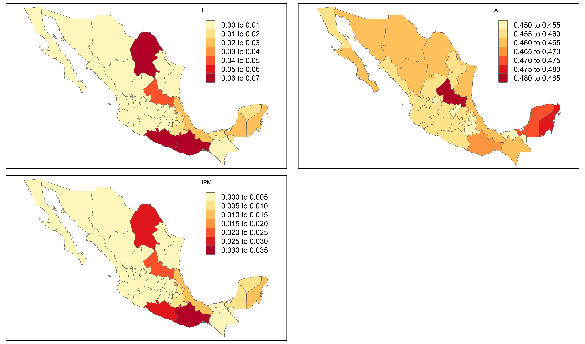
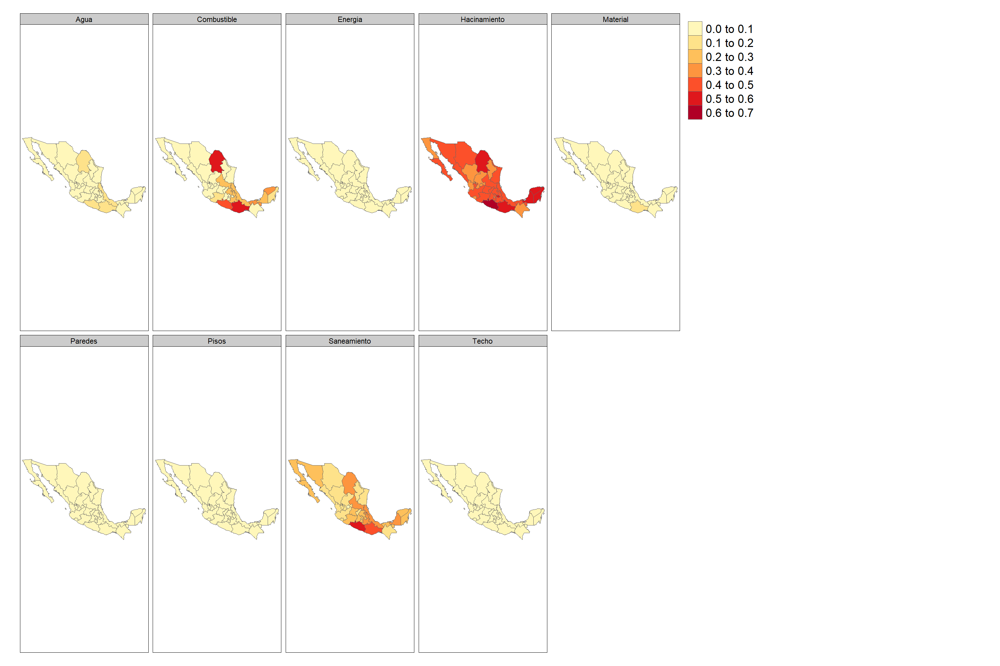

# Día 3 - Sesión 3- Estimación del Índice de Privación Multidimensional (IPM)


-   La pobreza es, y ha sido, uno de los temas principales en las agendas nacionales e internacionales de los países durante décadas. Un ejemplo reciente es el primer objetivo de la agenda **2030** para el Desarrollo Sostenible (ODS): __“Poner fin a la pobreza en todas sus formas en todo el mundo”__, así como su indicador 1.2.2 que mide __“la proporción de hombres, mujeres y niños de todas las edades que viven en pobreza en todas sus dimensiones según las definiciones nacionales”__

-   Tradicionalmente los organismos nacionales e internacionales exigen la medida de pobreza unidimensional basada en ingresos y/o gastos. 

-   La pobreza es un fenómeno complejo que debe ser analizado considerando un conjunto de factores y no solo el monetario. 

-   En está ocasión se aborda el problema multidimensional de la pobreza utilizando métodos de áreas pequeñas proporcionando una estimación del índice de privación multidimensional (IPM) en Colombia. 

## Índice de Pobreza Multidimensional

El Índice de Pobreza Multidimensional (IPM) es una medida que captura la pobreza desde múltiples dimensiones. Se calcula utilizando ponderaciones y umbrales en función de diferentes variables o indicadores que reflejan aspectos diversos de la calidad de vida.

Ahora el IPM es un caso particular de la metodología de la tasa de pobreza ajustada FGT (Foster, Greer y Thorbecke, 1984) de medidas de pobreza unidimensionales. Al igual que cada medida FGT se puede ver como la media de un vector apropiado construido a partir de los datos originales y censurado usando la línea de pobreza, la tasa de pobreza ajustada es la media del vector de puntuación de privación censurado. 

$$
IPM = \frac{1}{N}\sum_{i=1}^{N}c_i(z)
$$

donde,  $N$ es el número de individuos u hogares en la población y $c_i(z)$ es el puntaje de privación censurado de la observación $i$ que esta dado como: 

$$
c_{i}\left(z\right)=\begin{cases}
q_i & \text{si } q_i\ge z\\
0 & \text{si } q < z
\end{cases}
$$


con 
$$
      q_i =  \sum_{k=1}^{K} w_k \cdot y_{i}^{k}  
$$

Donde:

  -   $K$ es el número de dimensiones o indicadores de la privación.
  -   $w_k$ es el ponderador asociado a la dimensión $k$.
  -   $y_{i}^{k}$ es una variable binaria que toma el valor $1$ si el individuo $i$ esta privado  en la dimensión $k$ y $0$ en el caso contrario. 
  -   $z$ es el umbral para considerar a alguien con multiples privaciones.

Una segunda forma de ver  es en términos de índices parciales, es decir, medidas que proporcionan información básica sobre un solo aspecto de la pobreza. A continuación vemos cada uno de estos componentes:
  

1.    Headcount Ratio (H)

   Este componente mide la proporción de personas que están privadas en al menos una de las dimensiones consideradas. Matemáticamente, $H$ se calcula como la proporción entre el número de personas privadas y la población total:
   
$$
H = \frac{1}{N} \sum_{i=1}^{N} I\left( q_{i} \ge z \right)= \frac{N\left(z\right)}{N}
$$

donde $N\left(z\right) =  \sum_{i=1}^{N} I\left( q_{i} \ge z \right)$

2.    Intensity of Deprivation (A) 

Este componente mide la intensidad o gravedad promedio de la privación entre aquellos que están privados. Matemáticamente, $A$ se calcula como el promedio de los indicadoras $y_{i}^{k}$ para aquellos hogares o personas que están privados:   
  
$$ 
A=\sum_{i=1}^{N}\frac{c_{i}\left(z\right)}{N\left(z\right)}  
$$


Luego, el Índice de Pobreza Multidimensional (IPM) se expresa como:

$$
IPM = H \times A
$$
reemplazando las $H$ y $A$ por sus respectivas ecuaciones se tiene que: 

$$
IPM=\frac{N\left(z\right)}{N}\times\sum_{i=1}^{N}\frac{c_{i}\left(z\right)}{N\left(z\right)}=\frac{1}{N}\sum_{i=1}^{N}c_{i}\left(z\right)
$$


## Estimación del modelo de unidad para variables Binarias

En muchas aplicaciones, la variable de interés en áreas pequeñas puede ser binaria, esto es $y_{dj} = 0$ o $1$ que representa la ausencia (o no) de una característica específica. Para este caso, la estimación objetivo en cada dominio $d = 1,\cdots , D$ es la proporción $\bar{Y}_d = \pi_d =\frac{1}{N_d}\sum_{i=1}^{N_d}y_{di}$ de la población que tiene esta característica, donde $N=\sum_{d=1}^{D}N_d$ y siendo $\pi_{di}$ la probabilidad de que una determinada unidad $i$ en el dominio $d$ obtenga el valor $1$. Bajo este escenario, el $\theta_{di}$ con una función de enlace logit se define como: 

$$
logit(\pi_{di}) = \log \left(\frac{\pi_{di}}{1-\pi_{di}}\right) = \eta_{di} =  \boldsymbol{x}_{di}^{T}\boldsymbol{\beta} + u_{d}
$$
con $i=1,\cdots,N_d$, $d=1,\cdots,D$, $\boldsymbol{\beta}$  un vector de parámetros de efecto fijo, y $u_d$ el efecto aleatorio especifico del área para el dominio $d$ con $u_d \sim N\left(0,\sigma^2_u \right)$.  $u_d$ son independiente y $y_{di}\mid u_d \sim Bernoulli(\pi_{di})$ con $E(y_{di}\mid u_d)=\pi_{di}$ y $Var(y_{di}\mid u_d)=\sigma_{di}^2=\pi_{di}(1-\pi_{di})$. Además,  $\boldsymbol{x}_{di}^T$ representa el vector $p\times 1$ de valores de $p$ variables auxiliares. Entonces, $\pi_{di}$ se puede escribir como 

$$
\pi_{di} = \frac{\exp(\boldsymbol{x}_{di}^T\boldsymbol{\beta} + u_{d})}{1+ \exp(\boldsymbol{x}_{di}^T\boldsymbol{\beta} + u_{d})}
$$
De está forma podemos definir distribuciones previas 

$$
\begin{eqnarray*}
\beta_k & \sim   & N(0, 10000)\\
\sigma^2_u &\sim & IG(0.0001,0.0001)
\end{eqnarray*}
$$
**El modelo se debe estimar para cada una de las dimensiones**. 
  
### Obejtivo {-}


Estimar la proporción de personas que presentan la $k-$ésima carencia, es decir, 

$$ 
P_d = \frac{\sum_{U_d}c_{di}(z)}{N_d}
$$

Note que, 

$$
\begin{equation*}
\bar{Y}_d = P_d =  \frac{\sum_{s_d}c_{di}(z) + \sum_{s^c_d}c_{di}(z)}{N_d} 
\end{equation*}
$$

Ahora, el estimador de $P$ esta dado por: 

$$
\hat{P}_d = \frac{\sum_{s_d}c_{di}(z) + \sum_{s^c_d}\hat{c}_{di}(z)}{N_d}
$$

donde

$$
\hat{c}_{di}\left(z\right)=\begin{cases}
\hat{q}_{di} & \text{si } \hat{q}_{di}\ge z\\
0 & \text{si } \hat{q}_{di} < z
\end{cases}
$$


con 
$$
\hat{q}_{di} =  \sum_{k=1}^{K} w_k \cdot \hat{y}_{di}^{k}
$$
$$
  \hat{y}_{di}^{k}  =  E_{\mathscr{M}}\left(y_{di}^{k}\mid\boldsymbol{x}_{d},\boldsymbol{\beta}\right)
$$,

con $\mathscr{M}$  la medida de probabilidad inducida por el modelamiento. 

De esta forma se tiene que, 

$$
\hat{P}_d = \frac{\sum_{U_{d}}\hat{q}_{di}}{N_d}
$$


## Estimación de $\pi^{k}_{di}$

La estimación de $\pi^{k}_{di}$ refleja la probabilidad de que una unidad específica $i$ en el dominio $d$ obtenga el valor 1 en la dimensión $k$. Para llevar a cabo esta estimación, seguimos el siguiente procedimiento:

$$
\bar{Y}^{k}_d = \pi^{k}_d = \frac{1}{N_d} \sum_{i=1}^{N_d} y^{k}_{di}
$$

Aquí, $y^{k}_{di}$ puede tomar los valores 0 ó 1, representando la ausencia (o no) de una característica específica. Ahora, podemos dividir la suma en dos partes: $s_d$, que representa las unidades observadas en una muestra, y $s_d^c$, que son las unidades no observados. Por lo tanto,

$$
\begin{equation*}
\bar{Y}^{k}_d = \pi^{k}_d =  \frac{1}{N_d}\left(\sum_{s_d}y^{k}_{di} + \sum_{s^c_d}y^{k}_{di} \right) 
\end{equation*}
$$
Ahora, suponga que mediante un modelo de unidad es posible realizar la predicción de  $y^{k}_{di}$ para las unidades no observadas. De esta manera, el estimador de $\pi^{k}_d$ se expresa como:

$$
\hat{\pi}^{k}_d = \frac{1}{N_d}\left( \sum_{s_d}y^{k}_{di} + \sum_{s^c_d}\hat{y}^{k}_{di} \right)
$$

Donde,

$$\hat{y}^{k}_{di}=E_{\mathscr{M}}\left(y^{k}_{di}\mid\boldsymbol{x}_{d},\boldsymbol{\beta}\right)$$

Aquí, $\mathscr{M}$ hace referencia a la medida de probabilidad inducida por el modelo. Sin embargo, en la práctica, individualizar a las unidades observadas  y no observadas en una encuesta de hogares puede ser difícil. Por lo tanto, una alternativa es realizar la predicción $\hat{y}^{k}_{di}$ para todas las observaciones en el universo. De esta manera, la estimación $\hat{\pi}^{k}_d$ se simplifica a:

$$
\hat{\pi}^{k}_d = \frac{1}{N_d}\sum_{i=1}^{N_d}\hat{y}^{k}_{di}
$$

Este enfoque permite estimar la probabilidad $\pi^{k}_d$ en el dominio $d$ en la dimensión $k$ utilizando predicciones y datos disponibles en lugar de contar con información individual detallada para todos los casos.

## Pedicción de los Hard estimates  

Hobza y Morales (2016) definen los "hard estimates" como valores binarios (0 o 1) que indican de manera precisa si un individuo tiene o no una característica específica en relación con cada indicador de pobreza multidimensional. Estas estimaciones reflejan la naturaleza binaria de la información, facilitando el cálculo de indicadores y tasas de incidencia de pobreza. Estas estimaciones desempeñan un papel clave en la determinación de la incidencia de la pobreza multidimensional, ya que indican la presencia o ausencia de privaciones en indicadores específicos para cada individuo. Esto plantea un desafío en la estimación, ya que no se trata solo de obtener valores finales, sino de precisar si las características están presentes o no en indicadores faltantes. Con la definición de los *hard estimates*, y sabiendo que la estimación de $\pi^{k}_{di}$ refleja la probabilidad de que una unidad específica $i$ en el dominio $d$ obtenga el valor 1 en la dimensión $k$ se define $\hat{y}^{k}_{di} \sim Bernoulli(\hat{\pi}^{k}_{di})$


## Estimación Puntual del Índice de Pobreza Multidimensional (IPM)

Supongamos que el Índice de Pobreza Multidimensional está compuesto por $K$ dimensiones o indicadores para cada individuo $i$ en el censo. El procedimiento propuesto para estimar el IPM es el siguiente:

  1. Utilice los datos de la muestra para ajustar un modelo logit Bernoulli a nivel de unidad para cada indicador. Esto se logra mediante el uso del algoritmo de Markov Chain Monte Carlo (MCMC) con $L$ iteraciones.

  2. Para cada dimensión $k$ a la cual se le para ajustó un modelo logit Bernoulli a nivel de unidad con $L$ iteraciones, realice la predicción de los valores $\hat{y}^{k}_{di}$ para cada individuo en el censo. Esto generará $L$ realizaciones aleatorias de $\hat{y}^{k}_{di}$.

  3. Denotemos como $\hat{y}_{di}^{kl}$ a la $l$-ésima realización aleatoria de la dimensión $k$ para el individuo $i$ en el dominio $d$. Calculamos $q_{di}^{l} = \sum_{k=1}^{K} w_k \cdot y_{di}^{kl}$. Luego, podemos calcular $H_d^{l}$,  $A_d^{l}$ y $IPM_{d}^{l}$ utilizando las ecuaciones:

$$
IPM_{d}^{l} = \frac{1}{N_d}\sum_{i=1}^{N_{d}}c_{di}^{l}\left(z\right)
$$

$$
H_d^{l}=\frac{1}{N_{d}}\sum_{i=1}^{N_{d}}I\left(q_{di}^{l}\ge z\right)=\frac{N_{d}^{l}\left(z\right)}{N_{d}}
$$

y

$$ 
A_{d}^{l}=\sum_{i=1}^{N_{d}}\frac{c_{di}^{l}\left(z\right)}{N^{l}_{d}\left(z\right)}
$$


   4. La estimación puntual de $H_d$,  $A_{d}$ y $IPM_{d}$ en cada área pequeña $d$ se calcula tomando el promedio sobre cada una de las $L$ iteraciones: 
    
$$
    \hat{H}_d = \frac{1}{L}\sum_{l=1}^{L}H_d^l, 
$$
    
$$
        \hat{A}_d = \frac{1}{L}\sum_{l=1}^{L}A_d^l 
$$
  y  
$$
        \widehat{IPM}_d = \frac{1}{L}\sum_{l=1}^{L}IPM_d^l 
$$
    
  5. Dada que el modelo se estimó usando el algoritmo MCMC, es posible tener la estimación del error de estimación, de esta forma: 
  
$$
  \widehat{Var}(\hat{H}_d) = \frac{1}{L}\sum_{l=1}^{L}\left( H^{l}_{d} -\hat{H}_d \right)^2,
$$
  
$$
  \widehat{Var}(\hat{A}_d) = \frac{1}{L}\sum_{l=1}^{L}\left( A^{l}_{d} -\hat{A}_d \right)^2
$$ 
y

$$
  \widehat{Var}(\widehat{IPM}_d) = \frac{1}{L}\sum_{l=1}^{L}\left( IPM_d^{l} -\widehat{IPM}_d \right)^2
$$


## Aplicación: Índice de Pobreza Multidimensional en México. 

Nos centramos en la incidencia de la pobreza multidimensional descrito previamente. En este caso, requerimos $K = 9$ indicadores que se miden como privaciones: $y_{di}^{k} = 1$ si la persona tiene la privación y $y_{di}^{k} = 0$ si la persona no ha tenido la privación.

El índice requiere información para cada individuo $i = 1, \ldots, N_d$ en los dominios $d = 1, \ldots, D$, donde $N_d$ denota el tamaño de la población del dominio $d$.

La función indicadora $I(\cdot)$ es igual a 1 cuando se cumple la condición $q_{di} \ge z$. Para este estudio, utilizamos el valor de 0.4 para $z$, es decir, $I(\cdot)$ es igual a 1 cuando $q_{di} \ge 0.4$. $q_{di}$ es una cantidad ponderada que considera los $K = 9$ indicadores que conforman el índice. El valor de $q_{di}$ el dominio $d$ se calcula como:

  
$$
  q_{di} = \frac{1}{9}(y_{di}^{1} + y_{di}^{2} + y_{di}^{3} + y_{di}^{4} + y_{di}^{5} + y_{di}^{6} + y_{di}^{7} + y_{di}^{8} + y_{di}^{9}) 
$$
  
  Donde: 
  
  a. $y_{di}^{1}$ = Privación en material de construcción de la vivienda

  b. $y_{di}^{2}$ = Hacinamiento en el hogar. 

  c. $y_{di}^{3}$ = Privación en material de pisos.
  
  d. $y_{di}^{3}$ = Privación en material de techos.
  
  e. $y_{di}^{3}$ = Privación en el combustible.

  f. $y_{di}^{4}$ = Privación en el servicio energía eléctrica. 

  g. $y_{di}^{5}$ = Privación en saneamiento.

  h. $y_{di}^{6}$ = Privación de acceso al agua potable. 
  
  i. $y_{di}^{8}$ = Privación de la educación. 
  
  j. $y_{di}^{9}$ = Privación en paredes. 

     

### Procesamiento del modelo en `R`. 
El proceso inicia con el cargue de las librerías. 


```r
library(patchwork)
library(lme4)
library(tidyverse)
library(rstan)
library(rstanarm)
library(magrittr)
library(bayesplot)
library(posterior)
```

Los datos de la encuesta y el censo han sido preparados previamente, la información sobre la cual realizaremos la predicción corresponde a Colombia en el 2019 


```r
encuesta_ipm <- readRDS("Recursos/Día3/Sesion3/Data/encuestaMEX20_nbi.Rds")
statelevel_predictors_df <-
  readRDS("Recursos/Día3/Sesion3/Data/predictors_satelital_dam.rds") 
byAgrega <- c("dam", "area", "sexo", "etnia", 
              "anoest", "edad" )
```


```r
names_ipm <- grep(pattern = "nbi", names(encuesta_ipm),value = TRUE)

encuesta_df <- map(setNames(names_ipm,names_ipm),
    function(y){
  encuesta_ipm$temp <- encuesta_ipm[[y]]
  encuesta_ipm %>% 
  group_by_at(all_of(byAgrega)) %>%
  summarise(n = n(),
            yno = sum(temp),
            ysi = n - yno, .groups = "drop") %>% 
    inner_join(statelevel_predictors_df)
})
```


### Privación en material de construcción de la vivienda {-} 

<table class="table table-striped lightable-classic" style="width: auto !important; margin-left: auto; margin-right: auto; font-family: Arial Narrow; width: auto !important; margin-left: auto; margin-right: auto;">
<caption>(\#tab:unnamed-chunk-5)nbi_matviv_ee</caption>
 <thead>
  <tr>
   <th style="text-align:left;"> dam </th>
   <th style="text-align:left;"> area </th>
   <th style="text-align:left;"> sexo </th>
   <th style="text-align:left;"> etnia </th>
   <th style="text-align:left;"> anoest </th>
   <th style="text-align:left;"> edad </th>
   <th style="text-align:right;"> n </th>
   <th style="text-align:right;"> yno </th>
   <th style="text-align:right;"> ysi </th>
   <th style="text-align:right;"> luces_nocturnas </th>
   <th style="text-align:right;"> suelo_cultivo </th>
   <th style="text-align:right;"> suelo_urbano </th>
   <th style="text-align:right;"> modificacion_humana </th>
   <th style="text-align:right;"> accesibilidad_hospitales </th>
   <th style="text-align:right;"> accesibilidad_hosp_caminado </th>
   <th style="text-align:right;"> area1 </th>
   <th style="text-align:right;"> etnia2 </th>
   <th style="text-align:right;"> sexo2 </th>
   <th style="text-align:right;"> edad2 </th>
   <th style="text-align:right;"> edad3 </th>
   <th style="text-align:right;"> edad4 </th>
   <th style="text-align:right;"> edad5 </th>
   <th style="text-align:right;"> anoest2 </th>
   <th style="text-align:right;"> anoest3 </th>
   <th style="text-align:right;"> anoest4 </th>
   <th style="text-align:right;"> discapacidad1 </th>
   <th style="text-align:right;"> etnia1 </th>
   <th style="text-align:right;"> tiene_sanitario </th>
   <th style="text-align:right;"> tiene_electricidad </th>
   <th style="text-align:right;"> tiene_acueducto </th>
   <th style="text-align:right;"> tiene_gas </th>
   <th style="text-align:right;"> eliminar_basura </th>
   <th style="text-align:right;"> tiene_internet </th>
   <th style="text-align:right;"> piso_tierra </th>
   <th style="text-align:right;"> material_paredes </th>
   <th style="text-align:right;"> material_techo </th>
   <th style="text-align:right;"> rezago_escolar </th>
   <th style="text-align:right;"> alfabeta </th>
   <th style="text-align:right;"> hacinamiento </th>
   <th style="text-align:right;"> tasa_desocupacion </th>
  </tr>
 </thead>
<tbody>
  <tr>
   <td style="text-align:left;"> 05 </td>
   <td style="text-align:left;"> 1 </td>
   <td style="text-align:left;"> 1 </td>
   <td style="text-align:left;"> 3 </td>
   <td style="text-align:left;"> 3 </td>
   <td style="text-align:left;"> 2 </td>
   <td style="text-align:right;"> 825 </td>
   <td style="text-align:right;"> 2 </td>
   <td style="text-align:right;"> 823 </td>
   <td style="text-align:right;"> 100.0359 </td>
   <td style="text-align:right;"> 96.2598 </td>
   <td style="text-align:right;"> 101.1301 </td>
   <td style="text-align:right;"> 98.0690 </td>
   <td style="text-align:right;"> 126.5907 </td>
   <td style="text-align:right;"> 123.6785 </td>
   <td style="text-align:right;"> 0.9182 </td>
   <td style="text-align:right;"> 0.0085 </td>
   <td style="text-align:right;"> 0.5018 </td>
   <td style="text-align:right;"> 0.2467 </td>
   <td style="text-align:right;"> 0.2079 </td>
   <td style="text-align:right;"> 0.2061 </td>
   <td style="text-align:right;"> 0.0764 </td>
   <td style="text-align:right;"> 0.2274 </td>
   <td style="text-align:right;"> 0.4522 </td>
   <td style="text-align:right;"> 0.1677 </td>
   <td style="text-align:right;"> 0.0467 </td>
   <td style="text-align:right;"> 0.0189 </td>
   <td style="text-align:right;"> 0.0056 </td>
   <td style="text-align:right;"> 0.5310 </td>
   <td style="text-align:right;"> 0.0474 </td>
   <td style="text-align:right;"> 0.0326 </td>
   <td style="text-align:right;"> 0.0523 </td>
   <td style="text-align:right;"> 0.4265 </td>
   <td style="text-align:right;"> 0.0058 </td>
   <td style="text-align:right;"> 0.0948 </td>
   <td style="text-align:right;"> 0.0993 </td>
   <td style="text-align:right;"> 0.2523 </td>
   <td style="text-align:right;"> 0.0472 </td>
   <td style="text-align:right;"> 0.2140 </td>
   <td style="text-align:right;"> 0.0421 </td>
  </tr>
  <tr>
   <td style="text-align:left;"> 05 </td>
   <td style="text-align:left;"> 1 </td>
   <td style="text-align:left;"> 2 </td>
   <td style="text-align:left;"> 3 </td>
   <td style="text-align:left;"> 3 </td>
   <td style="text-align:left;"> 2 </td>
   <td style="text-align:right;"> 819 </td>
   <td style="text-align:right;"> 9 </td>
   <td style="text-align:right;"> 810 </td>
   <td style="text-align:right;"> 100.0359 </td>
   <td style="text-align:right;"> 96.2598 </td>
   <td style="text-align:right;"> 101.1301 </td>
   <td style="text-align:right;"> 98.0690 </td>
   <td style="text-align:right;"> 126.5907 </td>
   <td style="text-align:right;"> 123.6785 </td>
   <td style="text-align:right;"> 0.9182 </td>
   <td style="text-align:right;"> 0.0085 </td>
   <td style="text-align:right;"> 0.5018 </td>
   <td style="text-align:right;"> 0.2467 </td>
   <td style="text-align:right;"> 0.2079 </td>
   <td style="text-align:right;"> 0.2061 </td>
   <td style="text-align:right;"> 0.0764 </td>
   <td style="text-align:right;"> 0.2274 </td>
   <td style="text-align:right;"> 0.4522 </td>
   <td style="text-align:right;"> 0.1677 </td>
   <td style="text-align:right;"> 0.0467 </td>
   <td style="text-align:right;"> 0.0189 </td>
   <td style="text-align:right;"> 0.0056 </td>
   <td style="text-align:right;"> 0.5310 </td>
   <td style="text-align:right;"> 0.0474 </td>
   <td style="text-align:right;"> 0.0326 </td>
   <td style="text-align:right;"> 0.0523 </td>
   <td style="text-align:right;"> 0.4265 </td>
   <td style="text-align:right;"> 0.0058 </td>
   <td style="text-align:right;"> 0.0948 </td>
   <td style="text-align:right;"> 0.0993 </td>
   <td style="text-align:right;"> 0.2523 </td>
   <td style="text-align:right;"> 0.0472 </td>
   <td style="text-align:right;"> 0.2140 </td>
   <td style="text-align:right;"> 0.0421 </td>
  </tr>
  <tr>
   <td style="text-align:left;"> 08 </td>
   <td style="text-align:left;"> 1 </td>
   <td style="text-align:left;"> 2 </td>
   <td style="text-align:left;"> 3 </td>
   <td style="text-align:left;"> 3 </td>
   <td style="text-align:left;"> 2 </td>
   <td style="text-align:right;"> 787 </td>
   <td style="text-align:right;"> 6 </td>
   <td style="text-align:right;"> 781 </td>
   <td style="text-align:right;"> 104.0508 </td>
   <td style="text-align:right;"> 107.8007 </td>
   <td style="text-align:right;"> 108.6009 </td>
   <td style="text-align:right;"> 112.2464 </td>
   <td style="text-align:right;"> 130.4471 </td>
   <td style="text-align:right;"> 133.5435 </td>
   <td style="text-align:right;"> 0.8727 </td>
   <td style="text-align:right;"> 0.0097 </td>
   <td style="text-align:right;"> 0.5057 </td>
   <td style="text-align:right;"> 0.2494 </td>
   <td style="text-align:right;"> 0.2098 </td>
   <td style="text-align:right;"> 0.2059 </td>
   <td style="text-align:right;"> 0.0748 </td>
   <td style="text-align:right;"> 0.2632 </td>
   <td style="text-align:right;"> 0.4235 </td>
   <td style="text-align:right;"> 0.1646 </td>
   <td style="text-align:right;"> 0.0501 </td>
   <td style="text-align:right;"> 0.0971 </td>
   <td style="text-align:right;"> 0.0153 </td>
   <td style="text-align:right;"> 0.8879 </td>
   <td style="text-align:right;"> 0.0852 </td>
   <td style="text-align:right;"> 0.0772 </td>
   <td style="text-align:right;"> 0.0555 </td>
   <td style="text-align:right;"> 0.4189 </td>
   <td style="text-align:right;"> 0.0171 </td>
   <td style="text-align:right;"> 0.1695 </td>
   <td style="text-align:right;"> 0.3581 </td>
   <td style="text-align:right;"> 0.2461 </td>
   <td style="text-align:right;"> 0.0579 </td>
   <td style="text-align:right;"> 0.2010 </td>
   <td style="text-align:right;"> 0.0323 </td>
  </tr>
  <tr>
   <td style="text-align:left;"> 08 </td>
   <td style="text-align:left;"> 1 </td>
   <td style="text-align:left;"> 1 </td>
   <td style="text-align:left;"> 3 </td>
   <td style="text-align:left;"> 3 </td>
   <td style="text-align:left;"> 2 </td>
   <td style="text-align:right;"> 697 </td>
   <td style="text-align:right;"> 9 </td>
   <td style="text-align:right;"> 688 </td>
   <td style="text-align:right;"> 104.0508 </td>
   <td style="text-align:right;"> 107.8007 </td>
   <td style="text-align:right;"> 108.6009 </td>
   <td style="text-align:right;"> 112.2464 </td>
   <td style="text-align:right;"> 130.4471 </td>
   <td style="text-align:right;"> 133.5435 </td>
   <td style="text-align:right;"> 0.8727 </td>
   <td style="text-align:right;"> 0.0097 </td>
   <td style="text-align:right;"> 0.5057 </td>
   <td style="text-align:right;"> 0.2494 </td>
   <td style="text-align:right;"> 0.2098 </td>
   <td style="text-align:right;"> 0.2059 </td>
   <td style="text-align:right;"> 0.0748 </td>
   <td style="text-align:right;"> 0.2632 </td>
   <td style="text-align:right;"> 0.4235 </td>
   <td style="text-align:right;"> 0.1646 </td>
   <td style="text-align:right;"> 0.0501 </td>
   <td style="text-align:right;"> 0.0971 </td>
   <td style="text-align:right;"> 0.0153 </td>
   <td style="text-align:right;"> 0.8879 </td>
   <td style="text-align:right;"> 0.0852 </td>
   <td style="text-align:right;"> 0.0772 </td>
   <td style="text-align:right;"> 0.0555 </td>
   <td style="text-align:right;"> 0.4189 </td>
   <td style="text-align:right;"> 0.0171 </td>
   <td style="text-align:right;"> 0.1695 </td>
   <td style="text-align:right;"> 0.3581 </td>
   <td style="text-align:right;"> 0.2461 </td>
   <td style="text-align:right;"> 0.0579 </td>
   <td style="text-align:right;"> 0.2010 </td>
   <td style="text-align:right;"> 0.0323 </td>
  </tr>
  <tr>
   <td style="text-align:left;"> 05 </td>
   <td style="text-align:left;"> 1 </td>
   <td style="text-align:left;"> 2 </td>
   <td style="text-align:left;"> 3 </td>
   <td style="text-align:left;"> 3 </td>
   <td style="text-align:left;"> 4 </td>
   <td style="text-align:right;"> 627 </td>
   <td style="text-align:right;"> 5 </td>
   <td style="text-align:right;"> 622 </td>
   <td style="text-align:right;"> 100.0359 </td>
   <td style="text-align:right;"> 96.2598 </td>
   <td style="text-align:right;"> 101.1301 </td>
   <td style="text-align:right;"> 98.0690 </td>
   <td style="text-align:right;"> 126.5907 </td>
   <td style="text-align:right;"> 123.6785 </td>
   <td style="text-align:right;"> 0.9182 </td>
   <td style="text-align:right;"> 0.0085 </td>
   <td style="text-align:right;"> 0.5018 </td>
   <td style="text-align:right;"> 0.2467 </td>
   <td style="text-align:right;"> 0.2079 </td>
   <td style="text-align:right;"> 0.2061 </td>
   <td style="text-align:right;"> 0.0764 </td>
   <td style="text-align:right;"> 0.2274 </td>
   <td style="text-align:right;"> 0.4522 </td>
   <td style="text-align:right;"> 0.1677 </td>
   <td style="text-align:right;"> 0.0467 </td>
   <td style="text-align:right;"> 0.0189 </td>
   <td style="text-align:right;"> 0.0056 </td>
   <td style="text-align:right;"> 0.5310 </td>
   <td style="text-align:right;"> 0.0474 </td>
   <td style="text-align:right;"> 0.0326 </td>
   <td style="text-align:right;"> 0.0523 </td>
   <td style="text-align:right;"> 0.4265 </td>
   <td style="text-align:right;"> 0.0058 </td>
   <td style="text-align:right;"> 0.0948 </td>
   <td style="text-align:right;"> 0.0993 </td>
   <td style="text-align:right;"> 0.2523 </td>
   <td style="text-align:right;"> 0.0472 </td>
   <td style="text-align:right;"> 0.2140 </td>
   <td style="text-align:right;"> 0.0421 </td>
  </tr>
  <tr>
   <td style="text-align:left;"> 25 </td>
   <td style="text-align:left;"> 1 </td>
   <td style="text-align:left;"> 1 </td>
   <td style="text-align:left;"> 3 </td>
   <td style="text-align:left;"> 3 </td>
   <td style="text-align:left;"> 2 </td>
   <td style="text-align:right;"> 622 </td>
   <td style="text-align:right;"> 9 </td>
   <td style="text-align:right;"> 613 </td>
   <td style="text-align:right;"> 100.8792 </td>
   <td style="text-align:right;"> 108.9958 </td>
   <td style="text-align:right;"> 99.5980 </td>
   <td style="text-align:right;"> 103.6310 </td>
   <td style="text-align:right;"> 97.6080 </td>
   <td style="text-align:right;"> 98.0501 </td>
   <td style="text-align:right;"> 0.7769 </td>
   <td style="text-align:right;"> 0.0099 </td>
   <td style="text-align:right;"> 0.5092 </td>
   <td style="text-align:right;"> 0.2489 </td>
   <td style="text-align:right;"> 0.2026 </td>
   <td style="text-align:right;"> 0.2094 </td>
   <td style="text-align:right;"> 0.0916 </td>
   <td style="text-align:right;"> 0.2618 </td>
   <td style="text-align:right;"> 0.3947 </td>
   <td style="text-align:right;"> 0.1984 </td>
   <td style="text-align:right;"> 0.0575 </td>
   <td style="text-align:right;"> 0.0861 </td>
   <td style="text-align:right;"> 0.0208 </td>
   <td style="text-align:right;"> 0.7730 </td>
   <td style="text-align:right;"> 0.0721 </td>
   <td style="text-align:right;"> 0.0885 </td>
   <td style="text-align:right;"> 0.1084 </td>
   <td style="text-align:right;"> 0.4526 </td>
   <td style="text-align:right;"> 0.0204 </td>
   <td style="text-align:right;"> 0.0328 </td>
   <td style="text-align:right;"> 0.0477 </td>
   <td style="text-align:right;"> 0.2889 </td>
   <td style="text-align:right;"> 0.0571 </td>
   <td style="text-align:right;"> 0.2744 </td>
   <td style="text-align:right;"> 0.0300 </td>
  </tr>
</tbody>
</table>

### Hacinamiento {-}

<table class="table table-striped lightable-classic" style="width: auto !important; margin-left: auto; margin-right: auto; font-family: Arial Narrow; width: auto !important; margin-left: auto; margin-right: auto;">
 <thead>
  <tr>
   <th style="text-align:left;"> dam </th>
   <th style="text-align:left;"> area </th>
   <th style="text-align:left;"> sexo </th>
   <th style="text-align:left;"> etnia </th>
   <th style="text-align:left;"> anoest </th>
   <th style="text-align:left;"> edad </th>
   <th style="text-align:right;"> n </th>
   <th style="text-align:right;"> yno </th>
   <th style="text-align:right;"> ysi </th>
   <th style="text-align:right;"> luces_nocturnas </th>
   <th style="text-align:right;"> suelo_cultivo </th>
   <th style="text-align:right;"> suelo_urbano </th>
   <th style="text-align:right;"> modificacion_humana </th>
   <th style="text-align:right;"> accesibilidad_hospitales </th>
   <th style="text-align:right;"> accesibilidad_hosp_caminado </th>
   <th style="text-align:right;"> area1 </th>
   <th style="text-align:right;"> etnia2 </th>
   <th style="text-align:right;"> sexo2 </th>
   <th style="text-align:right;"> edad2 </th>
   <th style="text-align:right;"> edad3 </th>
   <th style="text-align:right;"> edad4 </th>
   <th style="text-align:right;"> edad5 </th>
   <th style="text-align:right;"> anoest2 </th>
   <th style="text-align:right;"> anoest3 </th>
   <th style="text-align:right;"> anoest4 </th>
   <th style="text-align:right;"> discapacidad1 </th>
   <th style="text-align:right;"> etnia1 </th>
   <th style="text-align:right;"> tiene_sanitario </th>
   <th style="text-align:right;"> tiene_electricidad </th>
   <th style="text-align:right;"> tiene_acueducto </th>
   <th style="text-align:right;"> tiene_gas </th>
   <th style="text-align:right;"> eliminar_basura </th>
   <th style="text-align:right;"> tiene_internet </th>
   <th style="text-align:right;"> piso_tierra </th>
   <th style="text-align:right;"> material_paredes </th>
   <th style="text-align:right;"> material_techo </th>
   <th style="text-align:right;"> rezago_escolar </th>
   <th style="text-align:right;"> alfabeta </th>
   <th style="text-align:right;"> hacinamiento </th>
   <th style="text-align:right;"> tasa_desocupacion </th>
  </tr>
 </thead>
<tbody>
  <tr>
   <td style="text-align:left;"> 05 </td>
   <td style="text-align:left;"> 1 </td>
   <td style="text-align:left;"> 1 </td>
   <td style="text-align:left;"> 3 </td>
   <td style="text-align:left;"> 3 </td>
   <td style="text-align:left;"> 2 </td>
   <td style="text-align:right;"> 825 </td>
   <td style="text-align:right;"> 311 </td>
   <td style="text-align:right;"> 514 </td>
   <td style="text-align:right;"> 100.0359 </td>
   <td style="text-align:right;"> 96.2598 </td>
   <td style="text-align:right;"> 101.1301 </td>
   <td style="text-align:right;"> 98.0690 </td>
   <td style="text-align:right;"> 126.5907 </td>
   <td style="text-align:right;"> 123.6785 </td>
   <td style="text-align:right;"> 0.9182 </td>
   <td style="text-align:right;"> 0.0085 </td>
   <td style="text-align:right;"> 0.5018 </td>
   <td style="text-align:right;"> 0.2467 </td>
   <td style="text-align:right;"> 0.2079 </td>
   <td style="text-align:right;"> 0.2061 </td>
   <td style="text-align:right;"> 0.0764 </td>
   <td style="text-align:right;"> 0.2274 </td>
   <td style="text-align:right;"> 0.4522 </td>
   <td style="text-align:right;"> 0.1677 </td>
   <td style="text-align:right;"> 0.0467 </td>
   <td style="text-align:right;"> 0.0189 </td>
   <td style="text-align:right;"> 0.0056 </td>
   <td style="text-align:right;"> 0.5310 </td>
   <td style="text-align:right;"> 0.0474 </td>
   <td style="text-align:right;"> 0.0326 </td>
   <td style="text-align:right;"> 0.0523 </td>
   <td style="text-align:right;"> 0.4265 </td>
   <td style="text-align:right;"> 0.0058 </td>
   <td style="text-align:right;"> 0.0948 </td>
   <td style="text-align:right;"> 0.0993 </td>
   <td style="text-align:right;"> 0.2523 </td>
   <td style="text-align:right;"> 0.0472 </td>
   <td style="text-align:right;"> 0.2140 </td>
   <td style="text-align:right;"> 0.0421 </td>
  </tr>
  <tr>
   <td style="text-align:left;"> 05 </td>
   <td style="text-align:left;"> 1 </td>
   <td style="text-align:left;"> 2 </td>
   <td style="text-align:left;"> 3 </td>
   <td style="text-align:left;"> 3 </td>
   <td style="text-align:left;"> 2 </td>
   <td style="text-align:right;"> 819 </td>
   <td style="text-align:right;"> 357 </td>
   <td style="text-align:right;"> 462 </td>
   <td style="text-align:right;"> 100.0359 </td>
   <td style="text-align:right;"> 96.2598 </td>
   <td style="text-align:right;"> 101.1301 </td>
   <td style="text-align:right;"> 98.0690 </td>
   <td style="text-align:right;"> 126.5907 </td>
   <td style="text-align:right;"> 123.6785 </td>
   <td style="text-align:right;"> 0.9182 </td>
   <td style="text-align:right;"> 0.0085 </td>
   <td style="text-align:right;"> 0.5018 </td>
   <td style="text-align:right;"> 0.2467 </td>
   <td style="text-align:right;"> 0.2079 </td>
   <td style="text-align:right;"> 0.2061 </td>
   <td style="text-align:right;"> 0.0764 </td>
   <td style="text-align:right;"> 0.2274 </td>
   <td style="text-align:right;"> 0.4522 </td>
   <td style="text-align:right;"> 0.1677 </td>
   <td style="text-align:right;"> 0.0467 </td>
   <td style="text-align:right;"> 0.0189 </td>
   <td style="text-align:right;"> 0.0056 </td>
   <td style="text-align:right;"> 0.5310 </td>
   <td style="text-align:right;"> 0.0474 </td>
   <td style="text-align:right;"> 0.0326 </td>
   <td style="text-align:right;"> 0.0523 </td>
   <td style="text-align:right;"> 0.4265 </td>
   <td style="text-align:right;"> 0.0058 </td>
   <td style="text-align:right;"> 0.0948 </td>
   <td style="text-align:right;"> 0.0993 </td>
   <td style="text-align:right;"> 0.2523 </td>
   <td style="text-align:right;"> 0.0472 </td>
   <td style="text-align:right;"> 0.2140 </td>
   <td style="text-align:right;"> 0.0421 </td>
  </tr>
  <tr>
   <td style="text-align:left;"> 08 </td>
   <td style="text-align:left;"> 1 </td>
   <td style="text-align:left;"> 2 </td>
   <td style="text-align:left;"> 3 </td>
   <td style="text-align:left;"> 3 </td>
   <td style="text-align:left;"> 2 </td>
   <td style="text-align:right;"> 787 </td>
   <td style="text-align:right;"> 340 </td>
   <td style="text-align:right;"> 447 </td>
   <td style="text-align:right;"> 104.0508 </td>
   <td style="text-align:right;"> 107.8007 </td>
   <td style="text-align:right;"> 108.6009 </td>
   <td style="text-align:right;"> 112.2464 </td>
   <td style="text-align:right;"> 130.4471 </td>
   <td style="text-align:right;"> 133.5435 </td>
   <td style="text-align:right;"> 0.8727 </td>
   <td style="text-align:right;"> 0.0097 </td>
   <td style="text-align:right;"> 0.5057 </td>
   <td style="text-align:right;"> 0.2494 </td>
   <td style="text-align:right;"> 0.2098 </td>
   <td style="text-align:right;"> 0.2059 </td>
   <td style="text-align:right;"> 0.0748 </td>
   <td style="text-align:right;"> 0.2632 </td>
   <td style="text-align:right;"> 0.4235 </td>
   <td style="text-align:right;"> 0.1646 </td>
   <td style="text-align:right;"> 0.0501 </td>
   <td style="text-align:right;"> 0.0971 </td>
   <td style="text-align:right;"> 0.0153 </td>
   <td style="text-align:right;"> 0.8879 </td>
   <td style="text-align:right;"> 0.0852 </td>
   <td style="text-align:right;"> 0.0772 </td>
   <td style="text-align:right;"> 0.0555 </td>
   <td style="text-align:right;"> 0.4189 </td>
   <td style="text-align:right;"> 0.0171 </td>
   <td style="text-align:right;"> 0.1695 </td>
   <td style="text-align:right;"> 0.3581 </td>
   <td style="text-align:right;"> 0.2461 </td>
   <td style="text-align:right;"> 0.0579 </td>
   <td style="text-align:right;"> 0.2010 </td>
   <td style="text-align:right;"> 0.0323 </td>
  </tr>
  <tr>
   <td style="text-align:left;"> 08 </td>
   <td style="text-align:left;"> 1 </td>
   <td style="text-align:left;"> 1 </td>
   <td style="text-align:left;"> 3 </td>
   <td style="text-align:left;"> 3 </td>
   <td style="text-align:left;"> 2 </td>
   <td style="text-align:right;"> 697 </td>
   <td style="text-align:right;"> 270 </td>
   <td style="text-align:right;"> 427 </td>
   <td style="text-align:right;"> 104.0508 </td>
   <td style="text-align:right;"> 107.8007 </td>
   <td style="text-align:right;"> 108.6009 </td>
   <td style="text-align:right;"> 112.2464 </td>
   <td style="text-align:right;"> 130.4471 </td>
   <td style="text-align:right;"> 133.5435 </td>
   <td style="text-align:right;"> 0.8727 </td>
   <td style="text-align:right;"> 0.0097 </td>
   <td style="text-align:right;"> 0.5057 </td>
   <td style="text-align:right;"> 0.2494 </td>
   <td style="text-align:right;"> 0.2098 </td>
   <td style="text-align:right;"> 0.2059 </td>
   <td style="text-align:right;"> 0.0748 </td>
   <td style="text-align:right;"> 0.2632 </td>
   <td style="text-align:right;"> 0.4235 </td>
   <td style="text-align:right;"> 0.1646 </td>
   <td style="text-align:right;"> 0.0501 </td>
   <td style="text-align:right;"> 0.0971 </td>
   <td style="text-align:right;"> 0.0153 </td>
   <td style="text-align:right;"> 0.8879 </td>
   <td style="text-align:right;"> 0.0852 </td>
   <td style="text-align:right;"> 0.0772 </td>
   <td style="text-align:right;"> 0.0555 </td>
   <td style="text-align:right;"> 0.4189 </td>
   <td style="text-align:right;"> 0.0171 </td>
   <td style="text-align:right;"> 0.1695 </td>
   <td style="text-align:right;"> 0.3581 </td>
   <td style="text-align:right;"> 0.2461 </td>
   <td style="text-align:right;"> 0.0579 </td>
   <td style="text-align:right;"> 0.2010 </td>
   <td style="text-align:right;"> 0.0323 </td>
  </tr>
  <tr>
   <td style="text-align:left;"> 05 </td>
   <td style="text-align:left;"> 1 </td>
   <td style="text-align:left;"> 2 </td>
   <td style="text-align:left;"> 3 </td>
   <td style="text-align:left;"> 3 </td>
   <td style="text-align:left;"> 4 </td>
   <td style="text-align:right;"> 627 </td>
   <td style="text-align:right;"> 155 </td>
   <td style="text-align:right;"> 472 </td>
   <td style="text-align:right;"> 100.0359 </td>
   <td style="text-align:right;"> 96.2598 </td>
   <td style="text-align:right;"> 101.1301 </td>
   <td style="text-align:right;"> 98.0690 </td>
   <td style="text-align:right;"> 126.5907 </td>
   <td style="text-align:right;"> 123.6785 </td>
   <td style="text-align:right;"> 0.9182 </td>
   <td style="text-align:right;"> 0.0085 </td>
   <td style="text-align:right;"> 0.5018 </td>
   <td style="text-align:right;"> 0.2467 </td>
   <td style="text-align:right;"> 0.2079 </td>
   <td style="text-align:right;"> 0.2061 </td>
   <td style="text-align:right;"> 0.0764 </td>
   <td style="text-align:right;"> 0.2274 </td>
   <td style="text-align:right;"> 0.4522 </td>
   <td style="text-align:right;"> 0.1677 </td>
   <td style="text-align:right;"> 0.0467 </td>
   <td style="text-align:right;"> 0.0189 </td>
   <td style="text-align:right;"> 0.0056 </td>
   <td style="text-align:right;"> 0.5310 </td>
   <td style="text-align:right;"> 0.0474 </td>
   <td style="text-align:right;"> 0.0326 </td>
   <td style="text-align:right;"> 0.0523 </td>
   <td style="text-align:right;"> 0.4265 </td>
   <td style="text-align:right;"> 0.0058 </td>
   <td style="text-align:right;"> 0.0948 </td>
   <td style="text-align:right;"> 0.0993 </td>
   <td style="text-align:right;"> 0.2523 </td>
   <td style="text-align:right;"> 0.0472 </td>
   <td style="text-align:right;"> 0.2140 </td>
   <td style="text-align:right;"> 0.0421 </td>
  </tr>
  <tr>
   <td style="text-align:left;"> 25 </td>
   <td style="text-align:left;"> 1 </td>
   <td style="text-align:left;"> 1 </td>
   <td style="text-align:left;"> 3 </td>
   <td style="text-align:left;"> 3 </td>
   <td style="text-align:left;"> 2 </td>
   <td style="text-align:right;"> 622 </td>
   <td style="text-align:right;"> 330 </td>
   <td style="text-align:right;"> 292 </td>
   <td style="text-align:right;"> 100.8792 </td>
   <td style="text-align:right;"> 108.9958 </td>
   <td style="text-align:right;"> 99.5980 </td>
   <td style="text-align:right;"> 103.6310 </td>
   <td style="text-align:right;"> 97.6080 </td>
   <td style="text-align:right;"> 98.0501 </td>
   <td style="text-align:right;"> 0.7769 </td>
   <td style="text-align:right;"> 0.0099 </td>
   <td style="text-align:right;"> 0.5092 </td>
   <td style="text-align:right;"> 0.2489 </td>
   <td style="text-align:right;"> 0.2026 </td>
   <td style="text-align:right;"> 0.2094 </td>
   <td style="text-align:right;"> 0.0916 </td>
   <td style="text-align:right;"> 0.2618 </td>
   <td style="text-align:right;"> 0.3947 </td>
   <td style="text-align:right;"> 0.1984 </td>
   <td style="text-align:right;"> 0.0575 </td>
   <td style="text-align:right;"> 0.0861 </td>
   <td style="text-align:right;"> 0.0208 </td>
   <td style="text-align:right;"> 0.7730 </td>
   <td style="text-align:right;"> 0.0721 </td>
   <td style="text-align:right;"> 0.0885 </td>
   <td style="text-align:right;"> 0.1084 </td>
   <td style="text-align:right;"> 0.4526 </td>
   <td style="text-align:right;"> 0.0204 </td>
   <td style="text-align:right;"> 0.0328 </td>
   <td style="text-align:right;"> 0.0477 </td>
   <td style="text-align:right;"> 0.2889 </td>
   <td style="text-align:right;"> 0.0571 </td>
   <td style="text-align:right;"> 0.2744 </td>
   <td style="text-align:right;"> 0.0300 </td>
  </tr>
</tbody>
</table>

### Definiendo el modelo multinivel.

Para cada dimensión que compone el IPM se ajusta el siguiente modelo mostrado en el script. En este código se incluye el uso de la función `future_map` que permite procesar en paralelo cada modelo O puede compilar cada por separado.   


```r
library(rstanarm)

plan(multisession, workers = 4)

formula_mod <-
  formula(
    cbind(yno, ysi) ~
      (1 | dam) + (1 | etnia) + (1 | edad) +
      (1 | anoest) + sexo + area +
      tasa_desocupacion + luces_nocturnas +
      modificacion_humana
  )

for(xdat in names(encuesta_df)) {
  fit <- stan_glmer(
    formula =  formula_mod,
    family = binomial(link = "logit"),
    data = encuesta_df[[xdat]],
    cores = 4,
    chains = 4,
    iter = 1000
  )
  saveRDS(object = fit,
          paste0("/Recursos/Día3/Sesion3/Data/", xdat, ".rds"))
}
```

Terminado la compilación de los modelos después de realizar validaciones sobre esto, pasamos hacer las predicciones en el censo. 

### Proceso de estimación y predicción

Los modelos fueron compilados de manera separada, por tanto, disponemos de un objeto `.rds` por cada dimensión del IPM 


```r
fit_agua <-
  readRDS(file = "Recursos/Día3/Sesion3/Data/nbi_agua_ee.rds")
fit_combustible <-
  readRDS(file = "Recursos/Día3/Sesion3/Data/nbi_combus_ee.rds")
fit_techo <-
  readRDS(file = "Recursos/Día3/Sesion3/Data/nbi_techo_ee.rds")
fit_energia <-
  readRDS(file = "Recursos/Día3/Sesion3/Data/nbi_elect_ee.rds")
fit_hacinamiento <-
  readRDS(file = "Recursos/Día3/Sesion3/Data/nbi_hacina_ee.rds")
fit_paredes <-
  readRDS(file = "Recursos/Día3/Sesion3/Data/nbi_pared_ee.rds")
fit_material <-
  readRDS(file = "Recursos/Día3/Sesion3/Data/nbi_matviv_ee.rds")
fit_saneamiento <-
  readRDS(file = "Recursos/Día3/Sesion3/Data/nbi_saneamiento_ee.rds")
fit_piso <-
  readRDS(file = "Recursos/Día3/Sesion3/Data/nbi_piso_ee.rds")
```

Ahora, debemos leer la información del censo  y crear los **post-estrato **

```r
censo_ipm <- readRDS("Recursos/Día3/Sesion3/Data/censo_mrp_dam.rds")
poststrat_df <- censo_ipm %>%
   group_by_at(byAgrega) %>%
  summarise(n = sum(n), .groups = "drop") %>% 
  arrange(desc(n))
tba(head(poststrat_df))
```

<table class="table table-striped lightable-classic" style="width: auto !important; margin-left: auto; margin-right: auto; font-family: Arial Narrow; width: auto !important; margin-left: auto; margin-right: auto;">
 <thead>
  <tr>
   <th style="text-align:left;"> dam </th>
   <th style="text-align:left;"> area </th>
   <th style="text-align:left;"> sexo </th>
   <th style="text-align:left;"> etnia </th>
   <th style="text-align:left;"> anoest </th>
   <th style="text-align:left;"> edad </th>
   <th style="text-align:right;"> n </th>
  </tr>
 </thead>
<tbody>
  <tr>
   <td style="text-align:left;"> 15 </td>
   <td style="text-align:left;"> 1 </td>
   <td style="text-align:left;"> 1 </td>
   <td style="text-align:left;"> 3 </td>
   <td style="text-align:left;"> 3 </td>
   <td style="text-align:left;"> 2 </td>
   <td style="text-align:right;"> 1140651 </td>
  </tr>
  <tr>
   <td style="text-align:left;"> 15 </td>
   <td style="text-align:left;"> 1 </td>
   <td style="text-align:left;"> 2 </td>
   <td style="text-align:left;"> 3 </td>
   <td style="text-align:left;"> 3 </td>
   <td style="text-align:left;"> 2 </td>
   <td style="text-align:right;"> 1118896 </td>
  </tr>
  <tr>
   <td style="text-align:left;"> 15 </td>
   <td style="text-align:left;"> 1 </td>
   <td style="text-align:left;"> 2 </td>
   <td style="text-align:left;"> 3 </td>
   <td style="text-align:left;"> 3 </td>
   <td style="text-align:left;"> 3 </td>
   <td style="text-align:right;"> 890981 </td>
  </tr>
  <tr>
   <td style="text-align:left;"> 15 </td>
   <td style="text-align:left;"> 1 </td>
   <td style="text-align:left;"> 1 </td>
   <td style="text-align:left;"> 3 </td>
   <td style="text-align:left;"> 3 </td>
   <td style="text-align:left;"> 3 </td>
   <td style="text-align:right;"> 816829 </td>
  </tr>
  <tr>
   <td style="text-align:left;"> 15 </td>
   <td style="text-align:left;"> 1 </td>
   <td style="text-align:left;"> 2 </td>
   <td style="text-align:left;"> 3 </td>
   <td style="text-align:left;"> 3 </td>
   <td style="text-align:left;"> 4 </td>
   <td style="text-align:right;"> 748706 </td>
  </tr>
  <tr>
   <td style="text-align:left;"> 15 </td>
   <td style="text-align:left;"> 1 </td>
   <td style="text-align:left;"> 1 </td>
   <td style="text-align:left;"> 3 </td>
   <td style="text-align:left;"> 3 </td>
   <td style="text-align:left;"> 4 </td>
   <td style="text-align:right;"> 715064 </td>
  </tr>
</tbody>
</table>

Para realizar la predicción en el censo debemos incluir la información auxiliar 


```r
poststrat_df <- inner_join(poststrat_df, statelevel_predictors_df)
dim(poststrat_df)
```

```
## [1] 8755   38
```


-   Privación de acceso al agua potable. 


```r
temp <- poststrat_df 
epred_mat_agua <- posterior_epred(
  fit_agua,
  newdata = temp,
  type = "response",
  allow.new.levels = TRUE
)
```

-   Privación de acceso al combustible para cocinar.


```r
epred_mat_combustible <-
  posterior_epred(
    fit_combustible,
    newdata = temp,
    type = "response",
    allow.new.levels = TRUE
  )
```

-   Privación en material de los techo.


```r
epred_mat_techo <-
  posterior_epred(
    fit_techo,
    newdata = temp,
    type = "response",
    allow.new.levels = TRUE
  )
```

-   Acceso al servicio energía eléctrica.


```r
epred_mat_energia <-
  posterior_epred(
    fit_energia,
    newdata = temp,
    type = "response",
    allow.new.levels = TRUE
  )
```

-    Hacinamiento en el hogar.


```r
epred_mat_hacinamiento <-
  posterior_epred(
    fit_hacinamiento,
    newdata = temp,
    type = "response",
    allow.new.levels = TRUE
  )
```

-   Privación el material de las paredes.


```r
epred_mat_paredes <-
  posterior_epred(
    fit_paredes,
    newdata = temp,
    type = "response",
    allow.new.levels = TRUE
  )
```

-   Privación en material de construcción de la vivienda


```r
epred_mat_material <-
  posterior_epred(
    fit_material,
    newdata = temp,
    type = "response",
    allow.new.levels = TRUE
  )
```

-   Privación en piso


```r
epred_mat_piso <-
  posterior_epred(
    fit_piso,
    newdata = temp,
    type = "response",
    allow.new.levels = TRUE
  )
```

-   Privación en saneamiento.


```r
epred_mat_saneamiento <-
  posterior_epred(
    fit_saneamiento,
    newdata = temp,
    type = "response",
    allow.new.levels = TRUE
  )
```


Los resultados anteriores se deben procesarse en términos de carencia (1) y  no carencia (0) para la $k-esima$ dimensión . 

-    Privación de acceso al agua potable. 


```r
epred_mat_agua_dummy <-
  rbinom(n = nrow(epred_mat_agua) * ncol(epred_mat_agua) , 1,
         epred_mat_agua)

epred_mat_agua_dummy <- matrix(
  epred_mat_agua_dummy,
  nrow = nrow(epred_mat_agua),
  ncol = ncol(epred_mat_agua)
)
```

-   Privación de acceso al combustible para cocinar.


```r
epred_mat_combustible_dummy <-
  rbinom(n = nrow(epred_mat_combustible) * ncol(epred_mat_combustible) ,
         1,
         epred_mat_combustible)

epred_mat_combustible_dummy <- matrix(
  epred_mat_combustible_dummy,
  nrow = nrow(epred_mat_combustible),
  ncol = ncol(epred_mat_combustible)
)
```

-    Acceso al servicio energía eléctrica 


```r
epred_mat_energia_dummy <-
  rbinom(n = nrow(epred_mat_energia) * ncol(epred_mat_energia) ,
         1,
         epred_mat_energia)

epred_mat_energia_dummy <- matrix(
  epred_mat_energia_dummy,
  nrow = nrow(epred_mat_energia),
  ncol = ncol(epred_mat_energia)
)
```

-   Hacinamiento en el hogar.


```r
epred_mat_hacinamiento_dummy <-
  rbinom(
    n = nrow(epred_mat_hacinamiento) * ncol(epred_mat_hacinamiento) ,
    1,
    epred_mat_hacinamiento
  )

epred_mat_hacinamiento_dummy <-
  matrix(
    epred_mat_hacinamiento_dummy,
    nrow = nrow(epred_mat_hacinamiento),
    ncol = ncol(epred_mat_hacinamiento)
  )
```

-   Privación el material de las paredes.


```r
epred_mat_paredes_dummy <-
  rbinom(n = nrow(epred_mat_paredes) * ncol(epred_mat_paredes) ,
         1,
         epred_mat_paredes)

epred_mat_paredes_dummy <- matrix(
  epred_mat_paredes_dummy,
  nrow = nrow(epred_mat_paredes),
  ncol = ncol(epred_mat_paredes)
)
```

-   Privación en material de construcción de la vivienda 


```r
epred_mat_material_dummy <-
  rbinom(n = nrow(epred_mat_material) * ncol(epred_mat_material) ,
         1,
         epred_mat_material)

epred_mat_material_dummy <- matrix(
  epred_mat_material_dummy,
  nrow = nrow(epred_mat_material),
  ncol = ncol(epred_mat_material)
)
```

-   Privación en saneamiento. 


```r
epred_mat_saneamiento_dummy <-
  rbinom(n = nrow(epred_mat_saneamiento) * ncol(epred_mat_saneamiento) ,
         1,
         epred_mat_saneamiento)

epred_mat_saneamiento_dummy <- matrix(
  epred_mat_saneamiento_dummy,
  nrow = nrow(epred_mat_saneamiento),
  ncol = ncol(epred_mat_saneamiento)
)
```

-   Privación en material de los techo. 


```r
epred_mat_techo_dummy <-
  rbinom(n = nrow(epred_mat_techo) * ncol(epred_mat_techo) ,
         1,
         epred_mat_techo)

epred_mat_techo_dummy <- matrix(
  epred_mat_techo_dummy,
  nrow = nrow(epred_mat_techo),
  ncol = ncol(epred_mat_techo)
)
```

-   Privación en el material de piso


```r
epred_mat_piso_dummy <-
  rbinom(n = nrow(epred_mat_piso) * ncol(epred_mat_piso) ,
         1,
         epred_mat_piso)

epred_mat_piso_dummy <- matrix(
  epred_mat_techo_dummy,
  nrow = nrow(epred_mat_piso),
  ncol = ncol(epred_mat_piso)
)
```


Con las variables dummy creadas es posible estimar el IPM 


```r
chain_q  <-
  (1 / 9) * (
    epred_mat_material_dummy +
      epred_mat_combustible_dummy +
      epred_mat_techo_dummy +
      epred_mat_piso_dummy  +
      epred_mat_paredes_dummy +
      epred_mat_saneamiento_dummy +
      epred_mat_energia_dummy +
      epred_mat_agua_dummy +
      epred_mat_hacinamiento_dummy)
saveRDS(chain_q, "Recursos/Día3/Sesion3/Data/chain_q.rds")
```


Ahora, es posible tener el calculo de $I\left( q_{di}^{l} \ge z \right)$, tomando como umbral $z=0.4$. 


```r
chain_q <- readRDS("Recursos/Día3/Sesion3/Data/chain_q.rds")
chain_Ind <- chain_q
chain_Ind[chain_Ind < 0.4] <- 0
chain_Ind[chain_Ind != 0] <- 1
```

seguidamente calculamos $c_{di}^{l}\left(z\right)$ 


```r
chain_ci <- matrix(0,nrow = nrow(chain_q), ncol = ncol(chain_q))
chain_ci[chain_Ind == 1] <- chain_q[chain_Ind == 1]
```


```r
datos<-data.frame(t(chain_q[1:5,1:10]), t(chain_Ind[1:5,1:10]), t(chain_ci[1:5,1:10]),
                  N = censo_ipm$n[1:10] )
colnames(datos) <- c(paste0("q",1:5), paste0("Ind",1:5),paste0("c",1:5),"N")
tba(datos, "Cadenas obtenidas")
```

<table class="table table-striped lightable-classic" style="width: auto !important; margin-left: auto; margin-right: auto; font-family: Arial Narrow; width: auto !important; margin-left: auto; margin-right: auto;">
<caption>(\#tab:unnamed-chunk-34)Cadenas obtenidas</caption>
 <thead>
  <tr>
   <th style="text-align:right;"> q1 </th>
   <th style="text-align:right;"> q2 </th>
   <th style="text-align:right;"> q3 </th>
   <th style="text-align:right;"> q4 </th>
   <th style="text-align:right;"> q5 </th>
   <th style="text-align:right;"> Ind1 </th>
   <th style="text-align:right;"> Ind2 </th>
   <th style="text-align:right;"> Ind3 </th>
   <th style="text-align:right;"> Ind4 </th>
   <th style="text-align:right;"> Ind5 </th>
   <th style="text-align:right;"> c1 </th>
   <th style="text-align:right;"> c2 </th>
   <th style="text-align:right;"> c3 </th>
   <th style="text-align:right;"> c4 </th>
   <th style="text-align:right;"> c5 </th>
   <th style="text-align:right;"> N </th>
  </tr>
 </thead>
<tbody>
  <tr>
   <td style="text-align:right;"> 0.0000 </td>
   <td style="text-align:right;"> 0.0000 </td>
   <td style="text-align:right;"> 0.1111 </td>
   <td style="text-align:right;"> 0.0000 </td>
   <td style="text-align:right;"> 0.0000 </td>
   <td style="text-align:right;"> 0 </td>
   <td style="text-align:right;"> 0 </td>
   <td style="text-align:right;"> 0 </td>
   <td style="text-align:right;"> 0 </td>
   <td style="text-align:right;"> 0 </td>
   <td style="text-align:right;"> 0 </td>
   <td style="text-align:right;"> 0 </td>
   <td style="text-align:right;"> 0 </td>
   <td style="text-align:right;"> 0 </td>
   <td style="text-align:right;"> 0 </td>
   <td style="text-align:right;"> 590 </td>
  </tr>
  <tr>
   <td style="text-align:right;"> 0.0000 </td>
   <td style="text-align:right;"> 0.1111 </td>
   <td style="text-align:right;"> 0.2222 </td>
   <td style="text-align:right;"> 0.2222 </td>
   <td style="text-align:right;"> 0.0000 </td>
   <td style="text-align:right;"> 0 </td>
   <td style="text-align:right;"> 0 </td>
   <td style="text-align:right;"> 0 </td>
   <td style="text-align:right;"> 0 </td>
   <td style="text-align:right;"> 0 </td>
   <td style="text-align:right;"> 0 </td>
   <td style="text-align:right;"> 0 </td>
   <td style="text-align:right;"> 0 </td>
   <td style="text-align:right;"> 0 </td>
   <td style="text-align:right;"> 0 </td>
   <td style="text-align:right;"> 10 </td>
  </tr>
  <tr>
   <td style="text-align:right;"> 0.1111 </td>
   <td style="text-align:right;"> 0.1111 </td>
   <td style="text-align:right;"> 0.1111 </td>
   <td style="text-align:right;"> 0.1111 </td>
   <td style="text-align:right;"> 0.2222 </td>
   <td style="text-align:right;"> 0 </td>
   <td style="text-align:right;"> 0 </td>
   <td style="text-align:right;"> 0 </td>
   <td style="text-align:right;"> 0 </td>
   <td style="text-align:right;"> 0 </td>
   <td style="text-align:right;"> 0 </td>
   <td style="text-align:right;"> 0 </td>
   <td style="text-align:right;"> 0 </td>
   <td style="text-align:right;"> 0 </td>
   <td style="text-align:right;"> 0 </td>
   <td style="text-align:right;"> 442 </td>
  </tr>
  <tr>
   <td style="text-align:right;"> 0.0000 </td>
   <td style="text-align:right;"> 0.1111 </td>
   <td style="text-align:right;"> 0.2222 </td>
   <td style="text-align:right;"> 0.0000 </td>
   <td style="text-align:right;"> 0.1111 </td>
   <td style="text-align:right;"> 0 </td>
   <td style="text-align:right;"> 0 </td>
   <td style="text-align:right;"> 0 </td>
   <td style="text-align:right;"> 0 </td>
   <td style="text-align:right;"> 0 </td>
   <td style="text-align:right;"> 0 </td>
   <td style="text-align:right;"> 0 </td>
   <td style="text-align:right;"> 0 </td>
   <td style="text-align:right;"> 0 </td>
   <td style="text-align:right;"> 0 </td>
   <td style="text-align:right;"> 11 </td>
  </tr>
  <tr>
   <td style="text-align:right;"> 0.0000 </td>
   <td style="text-align:right;"> 0.0000 </td>
   <td style="text-align:right;"> 0.2222 </td>
   <td style="text-align:right;"> 0.0000 </td>
   <td style="text-align:right;"> 0.0000 </td>
   <td style="text-align:right;"> 0 </td>
   <td style="text-align:right;"> 0 </td>
   <td style="text-align:right;"> 0 </td>
   <td style="text-align:right;"> 0 </td>
   <td style="text-align:right;"> 0 </td>
   <td style="text-align:right;"> 0 </td>
   <td style="text-align:right;"> 0 </td>
   <td style="text-align:right;"> 0 </td>
   <td style="text-align:right;"> 0 </td>
   <td style="text-align:right;"> 0 </td>
   <td style="text-align:right;"> 65 </td>
  </tr>
  <tr>
   <td style="text-align:right;"> 0.0000 </td>
   <td style="text-align:right;"> 0.1111 </td>
   <td style="text-align:right;"> 0.0000 </td>
   <td style="text-align:right;"> 0.0000 </td>
   <td style="text-align:right;"> 0.0000 </td>
   <td style="text-align:right;"> 0 </td>
   <td style="text-align:right;"> 0 </td>
   <td style="text-align:right;"> 0 </td>
   <td style="text-align:right;"> 0 </td>
   <td style="text-align:right;"> 0 </td>
   <td style="text-align:right;"> 0 </td>
   <td style="text-align:right;"> 0 </td>
   <td style="text-align:right;"> 0 </td>
   <td style="text-align:right;"> 0 </td>
   <td style="text-align:right;"> 0 </td>
   <td style="text-align:right;"> 3 </td>
  </tr>
  <tr>
   <td style="text-align:right;"> 0.1111 </td>
   <td style="text-align:right;"> 0.1111 </td>
   <td style="text-align:right;"> 0.2222 </td>
   <td style="text-align:right;"> 0.1111 </td>
   <td style="text-align:right;"> 0.1111 </td>
   <td style="text-align:right;"> 0 </td>
   <td style="text-align:right;"> 0 </td>
   <td style="text-align:right;"> 0 </td>
   <td style="text-align:right;"> 0 </td>
   <td style="text-align:right;"> 0 </td>
   <td style="text-align:right;"> 0 </td>
   <td style="text-align:right;"> 0 </td>
   <td style="text-align:right;"> 0 </td>
   <td style="text-align:right;"> 0 </td>
   <td style="text-align:right;"> 0 </td>
   <td style="text-align:right;"> 68 </td>
  </tr>
  <tr>
   <td style="text-align:right;"> 0.0000 </td>
   <td style="text-align:right;"> 0.1111 </td>
   <td style="text-align:right;"> 0.2222 </td>
   <td style="text-align:right;"> 0.1111 </td>
   <td style="text-align:right;"> 0.1111 </td>
   <td style="text-align:right;"> 0 </td>
   <td style="text-align:right;"> 0 </td>
   <td style="text-align:right;"> 0 </td>
   <td style="text-align:right;"> 0 </td>
   <td style="text-align:right;"> 0 </td>
   <td style="text-align:right;"> 0 </td>
   <td style="text-align:right;"> 0 </td>
   <td style="text-align:right;"> 0 </td>
   <td style="text-align:right;"> 0 </td>
   <td style="text-align:right;"> 0 </td>
   <td style="text-align:right;"> 45 </td>
  </tr>
  <tr>
   <td style="text-align:right;"> 0.0000 </td>
   <td style="text-align:right;"> 0.1111 </td>
   <td style="text-align:right;"> 0.2222 </td>
   <td style="text-align:right;"> 0.0000 </td>
   <td style="text-align:right;"> 0.0000 </td>
   <td style="text-align:right;"> 0 </td>
   <td style="text-align:right;"> 0 </td>
   <td style="text-align:right;"> 0 </td>
   <td style="text-align:right;"> 0 </td>
   <td style="text-align:right;"> 0 </td>
   <td style="text-align:right;"> 0 </td>
   <td style="text-align:right;"> 0 </td>
   <td style="text-align:right;"> 0 </td>
   <td style="text-align:right;"> 0 </td>
   <td style="text-align:right;"> 0 </td>
   <td style="text-align:right;"> 559 </td>
  </tr>
  <tr>
   <td style="text-align:right;"> 0.1111 </td>
   <td style="text-align:right;"> 0.0000 </td>
   <td style="text-align:right;"> 0.2222 </td>
   <td style="text-align:right;"> 0.1111 </td>
   <td style="text-align:right;"> 0.1111 </td>
   <td style="text-align:right;"> 0 </td>
   <td style="text-align:right;"> 0 </td>
   <td style="text-align:right;"> 0 </td>
   <td style="text-align:right;"> 0 </td>
   <td style="text-align:right;"> 0 </td>
   <td style="text-align:right;"> 0 </td>
   <td style="text-align:right;"> 0 </td>
   <td style="text-align:right;"> 0 </td>
   <td style="text-align:right;"> 0 </td>
   <td style="text-align:right;"> 0 </td>
   <td style="text-align:right;"> 10 </td>
  </tr>
</tbody>
</table>

## Estimación de $H$, $A$ e $IPM$

Para este proceso debemos realizar sumas ponderadas, dado que cada registro de la base de datos representa  un grupo de observaciones con las mismas características.  


```r
numIPM <- t(chain_ci) %>%
  as.data.frame() %>%
  mutate_all(~ . * poststrat_df$n) %>%
  as.matrix()

chain_N <- t(chain_Ind) %>%
  as.data.frame() %>%
  mutate_all(~ . * poststrat_df$n) %>%
  as.matrix()


IPM_l <- colSums(numIPM)/sum(censo_ipm$n)
Nz_l <- colSums(chain_N)
H_l <- Nz_l/sum(censo_ipm$n)
A_l <- colSums(numIPM)/Nz_l
```

<table class="table table-striped lightable-classic" style="width: auto !important; margin-left: auto; margin-right: auto; font-family: Arial Narrow; width: auto !important; margin-left: auto; margin-right: auto;">
<caption>(\#tab:unnamed-chunk-36)l-iteraciones</caption>
 <thead>
  <tr>
   <th style="text-align:left;">   </th>
   <th style="text-align:right;"> IPM_l </th>
   <th style="text-align:right;"> H_l </th>
   <th style="text-align:right;"> A_l </th>
   <th style="text-align:right;"> HA_l </th>
  </tr>
 </thead>
<tbody>
  <tr>
   <td style="text-align:left;"> l = 1 </td>
   <td style="text-align:right;"> 0.0067 </td>
   <td style="text-align:right;"> 0.0147 </td>
   <td style="text-align:right;"> 0.4526 </td>
   <td style="text-align:right;"> 0.0067 </td>
  </tr>
  <tr>
   <td style="text-align:left;"> l = 2 </td>
   <td style="text-align:right;"> 0.0038 </td>
   <td style="text-align:right;"> 0.0083 </td>
   <td style="text-align:right;"> 0.4523 </td>
   <td style="text-align:right;"> 0.0038 </td>
  </tr>
  <tr>
   <td style="text-align:left;"> l = 3 </td>
   <td style="text-align:right;"> 0.0063 </td>
   <td style="text-align:right;"> 0.0136 </td>
   <td style="text-align:right;"> 0.4675 </td>
   <td style="text-align:right;"> 0.0063 </td>
  </tr>
  <tr>
   <td style="text-align:left;"> l = 4 </td>
   <td style="text-align:right;"> 0.0041 </td>
   <td style="text-align:right;"> 0.0086 </td>
   <td style="text-align:right;"> 0.4733 </td>
   <td style="text-align:right;"> 0.0041 </td>
  </tr>
  <tr>
   <td style="text-align:left;"> l = 5 </td>
   <td style="text-align:right;"> 0.0057 </td>
   <td style="text-align:right;"> 0.0122 </td>
   <td style="text-align:right;"> 0.4638 </td>
   <td style="text-align:right;"> 0.0057 </td>
  </tr>
  <tr>
   <td style="text-align:left;"> l = 6 </td>
   <td style="text-align:right;"> 0.0075 </td>
   <td style="text-align:right;"> 0.0162 </td>
   <td style="text-align:right;"> 0.4651 </td>
   <td style="text-align:right;"> 0.0075 </td>
  </tr>
  <tr>
   <td style="text-align:left;"> l = 7 </td>
   <td style="text-align:right;"> 0.0086 </td>
   <td style="text-align:right;"> 0.0190 </td>
   <td style="text-align:right;"> 0.4523 </td>
   <td style="text-align:right;"> 0.0086 </td>
  </tr>
  <tr>
   <td style="text-align:left;"> l = 8 </td>
   <td style="text-align:right;"> 0.0050 </td>
   <td style="text-align:right;"> 0.0106 </td>
   <td style="text-align:right;"> 0.4744 </td>
   <td style="text-align:right;"> 0.0050 </td>
  </tr>
  <tr>
   <td style="text-align:left;"> l = 9 </td>
   <td style="text-align:right;"> 0.0057 </td>
   <td style="text-align:right;"> 0.0125 </td>
   <td style="text-align:right;"> 0.4587 </td>
   <td style="text-align:right;"> 0.0057 </td>
  </tr>
  <tr>
   <td style="text-align:left;"> l = 10 </td>
   <td style="text-align:right;"> 0.0074 </td>
   <td style="text-align:right;"> 0.0161 </td>
   <td style="text-align:right;"> 0.4610 </td>
   <td style="text-align:right;"> 0.0074 </td>
  </tr>
</tbody>
</table>


Por último se realiza las estimaciones puntuales y varianza para $H$, $A$ y $IPM$, esto es:  


```r
estimacion <- data.frame(H = mean(H_l),
           H_sd = sd(H_l),
           A = mean(A_l),
           A_sd = sd(A_l),
           IPM = mean(IPM_l),
           IPM_sd = sd(IPM_l))
```


<table class="table table-striped lightable-classic" style="width: auto !important; margin-left: auto; margin-right: auto; font-family: Arial Narrow; width: auto !important; margin-left: auto; margin-right: auto;">
<caption>(\#tab:unnamed-chunk-38)Estimaciones Nacionales</caption>
 <thead>
  <tr>
   <th style="text-align:right;"> H </th>
   <th style="text-align:right;"> H_sd </th>
   <th style="text-align:right;"> A </th>
   <th style="text-align:right;"> A_sd </th>
   <th style="text-align:right;"> IPM </th>
   <th style="text-align:right;"> IPM_sd </th>
  </tr>
 </thead>
<tbody>
  <tr>
   <td style="text-align:right;"> 0.0128 </td>
   <td style="text-align:right;"> 0.0023 </td>
   <td style="text-align:right;"> 0.4639 </td>
   <td style="text-align:right;"> 0.0082 </td>
   <td style="text-align:right;"> 0.006 </td>
   <td style="text-align:right;"> 0.0011 </td>
  </tr>
</tbody>
</table>
## Estimaciones desagregadas del IPM

Para realizar las estimaciones desagregadas se desarrollo una función que facilita el calculo, la estructura general el proceso es repetir el proceso anterior por subgrupos, por ejemplo, departamento (*dam*)


```r
source("Recursos/Día3/Sesion3/0Recursos//Estimar_ipm.R")
ipm_dam <- estime_IPM(
  poststrat = poststrat_df,
  chain_ci = chain_ci,
  chain_ind = chain_ind,
  byMap = "dam"
) %>% data.frame()
```


<table class="table table-striped lightable-classic" style="width: auto !important; margin-left: auto; margin-right: auto; font-family: Arial Narrow; width: auto !important; margin-left: auto; margin-right: auto;">
<caption>(\#tab:unnamed-chunk-40)Estimaciones por estados</caption>
 <thead>
  <tr>
   <th style="text-align:left;"> dam </th>
   <th style="text-align:right;"> H </th>
   <th style="text-align:right;"> H_sd </th>
   <th style="text-align:right;"> A </th>
   <th style="text-align:right;"> A_sd </th>
   <th style="text-align:right;"> IPM </th>
   <th style="text-align:right;"> IPM_sd </th>
  </tr>
 </thead>
<tbody>
  <tr>
   <td style="text-align:left;"> 01 </td>
   <td style="text-align:right;"> 0.0002 </td>
   <td style="text-align:right;"> 0.0020 </td>
   <td style="text-align:right;"> 0.4533 </td>
   <td style="text-align:right;"> 0.0290 </td>
   <td style="text-align:right;"> 0.0001 </td>
   <td style="text-align:right;"> 0.0009 </td>
  </tr>
  <tr>
   <td style="text-align:left;"> 02 </td>
   <td style="text-align:right;"> 0.0004 </td>
   <td style="text-align:right;"> 0.0017 </td>
   <td style="text-align:right;"> 0.4562 </td>
   <td style="text-align:right;"> 0.0325 </td>
   <td style="text-align:right;"> 0.0002 </td>
   <td style="text-align:right;"> 0.0008 </td>
  </tr>
  <tr>
   <td style="text-align:left;"> 03 </td>
   <td style="text-align:right;"> 0.0024 </td>
   <td style="text-align:right;"> 0.0049 </td>
   <td style="text-align:right;"> 0.4646 </td>
   <td style="text-align:right;"> 0.0366 </td>
   <td style="text-align:right;"> 0.0011 </td>
   <td style="text-align:right;"> 0.0022 </td>
  </tr>
  <tr>
   <td style="text-align:left;"> 04 </td>
   <td style="text-align:right;"> 0.0207 </td>
   <td style="text-align:right;"> 0.0118 </td>
   <td style="text-align:right;"> 0.4719 </td>
   <td style="text-align:right;"> 0.0304 </td>
   <td style="text-align:right;"> 0.0097 </td>
   <td style="text-align:right;"> 0.0055 </td>
  </tr>
  <tr>
   <td style="text-align:left;"> 05 </td>
   <td style="text-align:right;"> 0.0003 </td>
   <td style="text-align:right;"> 0.0016 </td>
   <td style="text-align:right;"> 0.4606 </td>
   <td style="text-align:right;"> 0.0386 </td>
   <td style="text-align:right;"> 0.0001 </td>
   <td style="text-align:right;"> 0.0007 </td>
  </tr>
  <tr>
   <td style="text-align:left;"> 06 </td>
   <td style="text-align:right;"> 0.0019 </td>
   <td style="text-align:right;"> 0.0044 </td>
   <td style="text-align:right;"> 0.4613 </td>
   <td style="text-align:right;"> 0.0356 </td>
   <td style="text-align:right;"> 0.0009 </td>
   <td style="text-align:right;"> 0.0020 </td>
  </tr>
  <tr>
   <td style="text-align:left;"> 07 </td>
   <td style="text-align:right;"> 0.0646 </td>
   <td style="text-align:right;"> 0.0268 </td>
   <td style="text-align:right;"> 0.4628 </td>
   <td style="text-align:right;"> 0.0210 </td>
   <td style="text-align:right;"> 0.0299 </td>
   <td style="text-align:right;"> 0.0124 </td>
  </tr>
  <tr>
   <td style="text-align:left;"> 08 </td>
   <td style="text-align:right;"> 0.0017 </td>
   <td style="text-align:right;"> 0.0022 </td>
   <td style="text-align:right;"> 0.4572 </td>
   <td style="text-align:right;"> 0.0326 </td>
   <td style="text-align:right;"> 0.0008 </td>
   <td style="text-align:right;"> 0.0010 </td>
  </tr>
  <tr>
   <td style="text-align:left;"> 09 </td>
   <td style="text-align:right;"> 0.0003 </td>
   <td style="text-align:right;"> 0.0014 </td>
   <td style="text-align:right;"> 0.4523 </td>
   <td style="text-align:right;"> 0.0246 </td>
   <td style="text-align:right;"> 0.0001 </td>
   <td style="text-align:right;"> 0.0006 </td>
  </tr>
  <tr>
   <td style="text-align:left;"> 10 </td>
   <td style="text-align:right;"> 0.0017 </td>
   <td style="text-align:right;"> 0.0036 </td>
   <td style="text-align:right;"> 0.4604 </td>
   <td style="text-align:right;"> 0.0356 </td>
   <td style="text-align:right;"> 0.0008 </td>
   <td style="text-align:right;"> 0.0016 </td>
  </tr>
  <tr>
   <td style="text-align:left;"> 11 </td>
   <td style="text-align:right;"> 0.0020 </td>
   <td style="text-align:right;"> 0.0046 </td>
   <td style="text-align:right;"> 0.4567 </td>
   <td style="text-align:right;"> 0.0324 </td>
   <td style="text-align:right;"> 0.0009 </td>
   <td style="text-align:right;"> 0.0021 </td>
  </tr>
  <tr>
   <td style="text-align:left;"> 12 </td>
   <td style="text-align:right;"> 0.0637 </td>
   <td style="text-align:right;"> 0.0217 </td>
   <td style="text-align:right;"> 0.4596 </td>
   <td style="text-align:right;"> 0.0137 </td>
   <td style="text-align:right;"> 0.0293 </td>
   <td style="text-align:right;"> 0.0100 </td>
  </tr>
  <tr>
   <td style="text-align:left;"> 13 </td>
   <td style="text-align:right;"> 0.0057 </td>
   <td style="text-align:right;"> 0.0068 </td>
   <td style="text-align:right;"> 0.4559 </td>
   <td style="text-align:right;"> 0.0297 </td>
   <td style="text-align:right;"> 0.0026 </td>
   <td style="text-align:right;"> 0.0031 </td>
  </tr>
  <tr>
   <td style="text-align:left;"> 14 </td>
   <td style="text-align:right;"> 0.0006 </td>
   <td style="text-align:right;"> 0.0020 </td>
   <td style="text-align:right;"> 0.4558 </td>
   <td style="text-align:right;"> 0.0320 </td>
   <td style="text-align:right;"> 0.0003 </td>
   <td style="text-align:right;"> 0.0009 </td>
  </tr>
  <tr>
   <td style="text-align:left;"> 15 </td>
   <td style="text-align:right;"> 0.0031 </td>
   <td style="text-align:right;"> 0.0045 </td>
   <td style="text-align:right;"> 0.4590 </td>
   <td style="text-align:right;"> 0.0301 </td>
   <td style="text-align:right;"> 0.0014 </td>
   <td style="text-align:right;"> 0.0020 </td>
  </tr>
  <tr>
   <td style="text-align:left;"> 16 </td>
   <td style="text-align:right;"> 0.0068 </td>
   <td style="text-align:right;"> 0.0068 </td>
   <td style="text-align:right;"> 0.4564 </td>
   <td style="text-align:right;"> 0.0280 </td>
   <td style="text-align:right;"> 0.0031 </td>
   <td style="text-align:right;"> 0.0031 </td>
  </tr>
  <tr>
   <td style="text-align:left;"> 17 </td>
   <td style="text-align:right;"> 0.0048 </td>
   <td style="text-align:right;"> 0.0050 </td>
   <td style="text-align:right;"> 0.4550 </td>
   <td style="text-align:right;"> 0.0259 </td>
   <td style="text-align:right;"> 0.0022 </td>
   <td style="text-align:right;"> 0.0023 </td>
  </tr>
  <tr>
   <td style="text-align:left;"> 18 </td>
   <td style="text-align:right;"> 0.0032 </td>
   <td style="text-align:right;"> 0.0045 </td>
   <td style="text-align:right;"> 0.4599 </td>
   <td style="text-align:right;"> 0.0365 </td>
   <td style="text-align:right;"> 0.0015 </td>
   <td style="text-align:right;"> 0.0020 </td>
  </tr>
  <tr>
   <td style="text-align:left;"> 19 </td>
   <td style="text-align:right;"> 0.0005 </td>
   <td style="text-align:right;"> 0.0032 </td>
   <td style="text-align:right;"> 0.4579 </td>
   <td style="text-align:right;"> 0.0329 </td>
   <td style="text-align:right;"> 0.0002 </td>
   <td style="text-align:right;"> 0.0014 </td>
  </tr>
  <tr>
   <td style="text-align:left;"> 20 </td>
   <td style="text-align:right;"> 0.0700 </td>
   <td style="text-align:right;"> 0.0298 </td>
   <td style="text-align:right;"> 0.4674 </td>
   <td style="text-align:right;"> 0.0236 </td>
   <td style="text-align:right;"> 0.0327 </td>
   <td style="text-align:right;"> 0.0140 </td>
  </tr>
  <tr>
   <td style="text-align:left;"> 21 </td>
   <td style="text-align:right;"> 0.0131 </td>
   <td style="text-align:right;"> 0.0094 </td>
   <td style="text-align:right;"> 0.4530 </td>
   <td style="text-align:right;"> 0.0203 </td>
   <td style="text-align:right;"> 0.0059 </td>
   <td style="text-align:right;"> 0.0042 </td>
  </tr>
  <tr>
   <td style="text-align:left;"> 22 </td>
   <td style="text-align:right;"> 0.0013 </td>
   <td style="text-align:right;"> 0.0024 </td>
   <td style="text-align:right;"> 0.4533 </td>
   <td style="text-align:right;"> 0.0277 </td>
   <td style="text-align:right;"> 0.0006 </td>
   <td style="text-align:right;"> 0.0011 </td>
  </tr>
  <tr>
   <td style="text-align:left;"> 23 </td>
   <td style="text-align:right;"> 0.0269 </td>
   <td style="text-align:right;"> 0.0152 </td>
   <td style="text-align:right;"> 0.4792 </td>
   <td style="text-align:right;"> 0.0252 </td>
   <td style="text-align:right;"> 0.0128 </td>
   <td style="text-align:right;"> 0.0071 </td>
  </tr>
  <tr>
   <td style="text-align:left;"> 24 </td>
   <td style="text-align:right;"> 0.0418 </td>
   <td style="text-align:right;"> 0.0181 </td>
   <td style="text-align:right;"> 0.4835 </td>
   <td style="text-align:right;"> 0.0295 </td>
   <td style="text-align:right;"> 0.0202 </td>
   <td style="text-align:right;"> 0.0087 </td>
  </tr>
  <tr>
   <td style="text-align:left;"> 25 </td>
   <td style="text-align:right;"> 0.0011 </td>
   <td style="text-align:right;"> 0.0028 </td>
   <td style="text-align:right;"> 0.4583 </td>
   <td style="text-align:right;"> 0.0356 </td>
   <td style="text-align:right;"> 0.0005 </td>
   <td style="text-align:right;"> 0.0013 </td>
  </tr>
  <tr>
   <td style="text-align:left;"> 26 </td>
   <td style="text-align:right;"> 0.0020 </td>
   <td style="text-align:right;"> 0.0036 </td>
   <td style="text-align:right;"> 0.4627 </td>
   <td style="text-align:right;"> 0.0375 </td>
   <td style="text-align:right;"> 0.0009 </td>
   <td style="text-align:right;"> 0.0016 </td>
  </tr>
  <tr>
   <td style="text-align:left;"> 27 </td>
   <td style="text-align:right;"> 0.0100 </td>
   <td style="text-align:right;"> 0.0099 </td>
   <td style="text-align:right;"> 0.4545 </td>
   <td style="text-align:right;"> 0.0258 </td>
   <td style="text-align:right;"> 0.0046 </td>
   <td style="text-align:right;"> 0.0045 </td>
  </tr>
  <tr>
   <td style="text-align:left;"> 28 </td>
   <td style="text-align:right;"> 0.0009 </td>
   <td style="text-align:right;"> 0.0029 </td>
   <td style="text-align:right;"> 0.4607 </td>
   <td style="text-align:right;"> 0.0377 </td>
   <td style="text-align:right;"> 0.0004 </td>
   <td style="text-align:right;"> 0.0013 </td>
  </tr>
  <tr>
   <td style="text-align:left;"> 29 </td>
   <td style="text-align:right;"> 0.0007 </td>
   <td style="text-align:right;"> 0.0021 </td>
   <td style="text-align:right;"> 0.4505 </td>
   <td style="text-align:right;"> 0.0230 </td>
   <td style="text-align:right;"> 0.0003 </td>
   <td style="text-align:right;"> 0.0009 </td>
  </tr>
  <tr>
   <td style="text-align:left;"> 30 </td>
   <td style="text-align:right;"> 0.0299 </td>
   <td style="text-align:right;"> 0.0141 </td>
   <td style="text-align:right;"> 0.4640 </td>
   <td style="text-align:right;"> 0.0232 </td>
   <td style="text-align:right;"> 0.0139 </td>
   <td style="text-align:right;"> 0.0065 </td>
  </tr>
  <tr>
   <td style="text-align:left;"> 31 </td>
   <td style="text-align:right;"> 0.0142 </td>
   <td style="text-align:right;"> 0.0117 </td>
   <td style="text-align:right;"> 0.4719 </td>
   <td style="text-align:right;"> 0.0330 </td>
   <td style="text-align:right;"> 0.0067 </td>
   <td style="text-align:right;"> 0.0055 </td>
  </tr>
  <tr>
   <td style="text-align:left;"> 32 </td>
   <td style="text-align:right;"> 0.0007 </td>
   <td style="text-align:right;"> 0.0032 </td>
   <td style="text-align:right;"> 0.4567 </td>
   <td style="text-align:right;"> 0.0335 </td>
   <td style="text-align:right;"> 0.0003 </td>
   <td style="text-align:right;"> 0.0014 </td>
  </tr>
</tbody>
</table>

Otra estimación desagregada que es posible obtener es la combinación por departamento y sexo, para ellos se usa la sintaxis. 


```r
ipm_dam_sexo <- estime_IPM(
  poststrat = poststrat_df,
  chain_ci = chain_ci,
  chain_ind = chain_ind,
  byMap = c("dam", "sexo")
) %>% data.frame()
```


<table class="table table-striped lightable-classic" style="width: auto !important; margin-left: auto; margin-right: auto; font-family: Arial Narrow; width: auto !important; margin-left: auto; margin-right: auto;">
<caption>(\#tab:unnamed-chunk-42)Estimaciones por estado y sexo</caption>
 <thead>
  <tr>
   <th style="text-align:left;"> dam </th>
   <th style="text-align:left;"> sexo </th>
   <th style="text-align:right;"> H </th>
   <th style="text-align:right;"> H_sd </th>
   <th style="text-align:right;"> A </th>
   <th style="text-align:right;"> A_sd </th>
   <th style="text-align:right;"> IPM </th>
   <th style="text-align:right;"> IPM_sd </th>
  </tr>
 </thead>
<tbody>
  <tr>
   <td style="text-align:left;"> 01 </td>
   <td style="text-align:left;"> 1 </td>
   <td style="text-align:right;"> 0.0001 </td>
   <td style="text-align:right;"> 0.0008 </td>
   <td style="text-align:right;"> 0.4540 </td>
   <td style="text-align:right;"> 0.0304 </td>
   <td style="text-align:right;"> 0.0000 </td>
   <td style="text-align:right;"> 0.0004 </td>
  </tr>
  <tr>
   <td style="text-align:left;"> 01 </td>
   <td style="text-align:left;"> 2 </td>
   <td style="text-align:right;"> 0.0002 </td>
   <td style="text-align:right;"> 0.0039 </td>
   <td style="text-align:right;"> 0.4556 </td>
   <td style="text-align:right;"> 0.0341 </td>
   <td style="text-align:right;"> 0.0001 </td>
   <td style="text-align:right;"> 0.0017 </td>
  </tr>
  <tr>
   <td style="text-align:left;"> 02 </td>
   <td style="text-align:left;"> 1 </td>
   <td style="text-align:right;"> 0.0005 </td>
   <td style="text-align:right;"> 0.0029 </td>
   <td style="text-align:right;"> 0.4578 </td>
   <td style="text-align:right;"> 0.0366 </td>
   <td style="text-align:right;"> 0.0002 </td>
   <td style="text-align:right;"> 0.0013 </td>
  </tr>
  <tr>
   <td style="text-align:left;"> 02 </td>
   <td style="text-align:left;"> 2 </td>
   <td style="text-align:right;"> 0.0004 </td>
   <td style="text-align:right;"> 0.0019 </td>
   <td style="text-align:right;"> 0.4560 </td>
   <td style="text-align:right;"> 0.0344 </td>
   <td style="text-align:right;"> 0.0002 </td>
   <td style="text-align:right;"> 0.0010 </td>
  </tr>
  <tr>
   <td style="text-align:left;"> 03 </td>
   <td style="text-align:left;"> 1 </td>
   <td style="text-align:right;"> 0.0023 </td>
   <td style="text-align:right;"> 0.0056 </td>
   <td style="text-align:right;"> 0.4667 </td>
   <td style="text-align:right;"> 0.0438 </td>
   <td style="text-align:right;"> 0.0011 </td>
   <td style="text-align:right;"> 0.0025 </td>
  </tr>
  <tr>
   <td style="text-align:left;"> 03 </td>
   <td style="text-align:left;"> 2 </td>
   <td style="text-align:right;"> 0.0024 </td>
   <td style="text-align:right;"> 0.0080 </td>
   <td style="text-align:right;"> 0.4647 </td>
   <td style="text-align:right;"> 0.0416 </td>
   <td style="text-align:right;"> 0.0011 </td>
   <td style="text-align:right;"> 0.0036 </td>
  </tr>
  <tr>
   <td style="text-align:left;"> 04 </td>
   <td style="text-align:left;"> 1 </td>
   <td style="text-align:right;"> 0.0220 </td>
   <td style="text-align:right;"> 0.0176 </td>
   <td style="text-align:right;"> 0.4717 </td>
   <td style="text-align:right;"> 0.0379 </td>
   <td style="text-align:right;"> 0.0104 </td>
   <td style="text-align:right;"> 0.0083 </td>
  </tr>
  <tr>
   <td style="text-align:left;"> 04 </td>
   <td style="text-align:left;"> 2 </td>
   <td style="text-align:right;"> 0.0194 </td>
   <td style="text-align:right;"> 0.0159 </td>
   <td style="text-align:right;"> 0.4723 </td>
   <td style="text-align:right;"> 0.0397 </td>
   <td style="text-align:right;"> 0.0091 </td>
   <td style="text-align:right;"> 0.0075 </td>
  </tr>
  <tr>
   <td style="text-align:left;"> 05 </td>
   <td style="text-align:left;"> 1 </td>
   <td style="text-align:right;"> 0.0003 </td>
   <td style="text-align:right;"> 0.0026 </td>
   <td style="text-align:right;"> 0.4622 </td>
   <td style="text-align:right;"> 0.0429 </td>
   <td style="text-align:right;"> 0.0001 </td>
   <td style="text-align:right;"> 0.0012 </td>
  </tr>
  <tr>
   <td style="text-align:left;"> 05 </td>
   <td style="text-align:left;"> 2 </td>
   <td style="text-align:right;"> 0.0002 </td>
   <td style="text-align:right;"> 0.0018 </td>
   <td style="text-align:right;"> 0.4599 </td>
   <td style="text-align:right;"> 0.0388 </td>
   <td style="text-align:right;"> 0.0001 </td>
   <td style="text-align:right;"> 0.0008 </td>
  </tr>
  <tr>
   <td style="text-align:left;"> 06 </td>
   <td style="text-align:left;"> 1 </td>
   <td style="text-align:right;"> 0.0022 </td>
   <td style="text-align:right;"> 0.0069 </td>
   <td style="text-align:right;"> 0.4628 </td>
   <td style="text-align:right;"> 0.0410 </td>
   <td style="text-align:right;"> 0.0010 </td>
   <td style="text-align:right;"> 0.0031 </td>
  </tr>
  <tr>
   <td style="text-align:left;"> 06 </td>
   <td style="text-align:left;"> 2 </td>
   <td style="text-align:right;"> 0.0016 </td>
   <td style="text-align:right;"> 0.0056 </td>
   <td style="text-align:right;"> 0.4621 </td>
   <td style="text-align:right;"> 0.0403 </td>
   <td style="text-align:right;"> 0.0007 </td>
   <td style="text-align:right;"> 0.0025 </td>
  </tr>
  <tr>
   <td style="text-align:left;"> 07 </td>
   <td style="text-align:left;"> 1 </td>
   <td style="text-align:right;"> 0.0651 </td>
   <td style="text-align:right;"> 0.0389 </td>
   <td style="text-align:right;"> 0.4631 </td>
   <td style="text-align:right;"> 0.0295 </td>
   <td style="text-align:right;"> 0.0301 </td>
   <td style="text-align:right;"> 0.0180 </td>
  </tr>
  <tr>
   <td style="text-align:left;"> 07 </td>
   <td style="text-align:left;"> 2 </td>
   <td style="text-align:right;"> 0.0641 </td>
   <td style="text-align:right;"> 0.0366 </td>
   <td style="text-align:right;"> 0.4630 </td>
   <td style="text-align:right;"> 0.0297 </td>
   <td style="text-align:right;"> 0.0297 </td>
   <td style="text-align:right;"> 0.0170 </td>
  </tr>
  <tr>
   <td style="text-align:left;"> 08 </td>
   <td style="text-align:left;"> 1 </td>
   <td style="text-align:right;"> 0.0018 </td>
   <td style="text-align:right;"> 0.0034 </td>
   <td style="text-align:right;"> 0.4578 </td>
   <td style="text-align:right;"> 0.0355 </td>
   <td style="text-align:right;"> 0.0008 </td>
   <td style="text-align:right;"> 0.0015 </td>
  </tr>
  <tr>
   <td style="text-align:left;"> 08 </td>
   <td style="text-align:left;"> 2 </td>
   <td style="text-align:right;"> 0.0016 </td>
   <td style="text-align:right;"> 0.0028 </td>
   <td style="text-align:right;"> 0.4580 </td>
   <td style="text-align:right;"> 0.0371 </td>
   <td style="text-align:right;"> 0.0007 </td>
   <td style="text-align:right;"> 0.0013 </td>
  </tr>
  <tr>
   <td style="text-align:left;"> 09 </td>
   <td style="text-align:left;"> 1 </td>
   <td style="text-align:right;"> 0.0003 </td>
   <td style="text-align:right;"> 0.0020 </td>
   <td style="text-align:right;"> 0.4537 </td>
   <td style="text-align:right;"> 0.0292 </td>
   <td style="text-align:right;"> 0.0001 </td>
   <td style="text-align:right;"> 0.0009 </td>
  </tr>
  <tr>
   <td style="text-align:left;"> 09 </td>
   <td style="text-align:left;"> 2 </td>
   <td style="text-align:right;"> 0.0003 </td>
   <td style="text-align:right;"> 0.0019 </td>
   <td style="text-align:right;"> 0.4534 </td>
   <td style="text-align:right;"> 0.0273 </td>
   <td style="text-align:right;"> 0.0001 </td>
   <td style="text-align:right;"> 0.0009 </td>
  </tr>
  <tr>
   <td style="text-align:left;"> 10 </td>
   <td style="text-align:left;"> 1 </td>
   <td style="text-align:right;"> 0.0018 </td>
   <td style="text-align:right;"> 0.0054 </td>
   <td style="text-align:right;"> 0.4620 </td>
   <td style="text-align:right;"> 0.0403 </td>
   <td style="text-align:right;"> 0.0008 </td>
   <td style="text-align:right;"> 0.0024 </td>
  </tr>
  <tr>
   <td style="text-align:left;"> 10 </td>
   <td style="text-align:left;"> 2 </td>
   <td style="text-align:right;"> 0.0016 </td>
   <td style="text-align:right;"> 0.0044 </td>
   <td style="text-align:right;"> 0.4616 </td>
   <td style="text-align:right;"> 0.0390 </td>
   <td style="text-align:right;"> 0.0007 </td>
   <td style="text-align:right;"> 0.0020 </td>
  </tr>
  <tr>
   <td style="text-align:left;"> 11 </td>
   <td style="text-align:left;"> 1 </td>
   <td style="text-align:right;"> 0.0022 </td>
   <td style="text-align:right;"> 0.0064 </td>
   <td style="text-align:right;"> 0.4564 </td>
   <td style="text-align:right;"> 0.0331 </td>
   <td style="text-align:right;"> 0.0010 </td>
   <td style="text-align:right;"> 0.0029 </td>
  </tr>
  <tr>
   <td style="text-align:left;"> 11 </td>
   <td style="text-align:left;"> 2 </td>
   <td style="text-align:right;"> 0.0018 </td>
   <td style="text-align:right;"> 0.0065 </td>
   <td style="text-align:right;"> 0.4568 </td>
   <td style="text-align:right;"> 0.0338 </td>
   <td style="text-align:right;"> 0.0008 </td>
   <td style="text-align:right;"> 0.0029 </td>
  </tr>
  <tr>
   <td style="text-align:left;"> 12 </td>
   <td style="text-align:left;"> 1 </td>
   <td style="text-align:right;"> 0.0657 </td>
   <td style="text-align:right;"> 0.0306 </td>
   <td style="text-align:right;"> 0.4601 </td>
   <td style="text-align:right;"> 0.0191 </td>
   <td style="text-align:right;"> 0.0302 </td>
   <td style="text-align:right;"> 0.0141 </td>
  </tr>
  <tr>
   <td style="text-align:left;"> 12 </td>
   <td style="text-align:left;"> 2 </td>
   <td style="text-align:right;"> 0.0617 </td>
   <td style="text-align:right;"> 0.0281 </td>
   <td style="text-align:right;"> 0.4595 </td>
   <td style="text-align:right;"> 0.0192 </td>
   <td style="text-align:right;"> 0.0283 </td>
   <td style="text-align:right;"> 0.0129 </td>
  </tr>
  <tr>
   <td style="text-align:left;"> 13 </td>
   <td style="text-align:left;"> 1 </td>
   <td style="text-align:right;"> 0.0057 </td>
   <td style="text-align:right;"> 0.0098 </td>
   <td style="text-align:right;"> 0.4563 </td>
   <td style="text-align:right;"> 0.0319 </td>
   <td style="text-align:right;"> 0.0026 </td>
   <td style="text-align:right;"> 0.0045 </td>
  </tr>
  <tr>
   <td style="text-align:left;"> 13 </td>
   <td style="text-align:left;"> 2 </td>
   <td style="text-align:right;"> 0.0057 </td>
   <td style="text-align:right;"> 0.0095 </td>
   <td style="text-align:right;"> 0.4557 </td>
   <td style="text-align:right;"> 0.0328 </td>
   <td style="text-align:right;"> 0.0026 </td>
   <td style="text-align:right;"> 0.0043 </td>
  </tr>
  <tr>
   <td style="text-align:left;"> 14 </td>
   <td style="text-align:left;"> 1 </td>
   <td style="text-align:right;"> 0.0007 </td>
   <td style="text-align:right;"> 0.0035 </td>
   <td style="text-align:right;"> 0.4572 </td>
   <td style="text-align:right;"> 0.0349 </td>
   <td style="text-align:right;"> 0.0003 </td>
   <td style="text-align:right;"> 0.0016 </td>
  </tr>
  <tr>
   <td style="text-align:left;"> 14 </td>
   <td style="text-align:left;"> 2 </td>
   <td style="text-align:right;"> 0.0005 </td>
   <td style="text-align:right;"> 0.0020 </td>
   <td style="text-align:right;"> 0.4564 </td>
   <td style="text-align:right;"> 0.0329 </td>
   <td style="text-align:right;"> 0.0002 </td>
   <td style="text-align:right;"> 0.0009 </td>
  </tr>
  <tr>
   <td style="text-align:left;"> 15 </td>
   <td style="text-align:left;"> 1 </td>
   <td style="text-align:right;"> 0.0033 </td>
   <td style="text-align:right;"> 0.0066 </td>
   <td style="text-align:right;"> 0.4603 </td>
   <td style="text-align:right;"> 0.0363 </td>
   <td style="text-align:right;"> 0.0015 </td>
   <td style="text-align:right;"> 0.0030 </td>
  </tr>
  <tr>
   <td style="text-align:left;"> 15 </td>
   <td style="text-align:left;"> 2 </td>
   <td style="text-align:right;"> 0.0029 </td>
   <td style="text-align:right;"> 0.0062 </td>
   <td style="text-align:right;"> 0.4600 </td>
   <td style="text-align:right;"> 0.0366 </td>
   <td style="text-align:right;"> 0.0013 </td>
   <td style="text-align:right;"> 0.0028 </td>
  </tr>
  <tr>
   <td style="text-align:left;"> 16 </td>
   <td style="text-align:left;"> 1 </td>
   <td style="text-align:right;"> 0.0076 </td>
   <td style="text-align:right;"> 0.0101 </td>
   <td style="text-align:right;"> 0.4573 </td>
   <td style="text-align:right;"> 0.0323 </td>
   <td style="text-align:right;"> 0.0034 </td>
   <td style="text-align:right;"> 0.0046 </td>
  </tr>
  <tr>
   <td style="text-align:left;"> 16 </td>
   <td style="text-align:left;"> 2 </td>
   <td style="text-align:right;"> 0.0061 </td>
   <td style="text-align:right;"> 0.0091 </td>
   <td style="text-align:right;"> 0.4577 </td>
   <td style="text-align:right;"> 0.0328 </td>
   <td style="text-align:right;"> 0.0028 </td>
   <td style="text-align:right;"> 0.0041 </td>
  </tr>
  <tr>
   <td style="text-align:left;"> 17 </td>
   <td style="text-align:left;"> 1 </td>
   <td style="text-align:right;"> 0.0052 </td>
   <td style="text-align:right;"> 0.0075 </td>
   <td style="text-align:right;"> 0.4553 </td>
   <td style="text-align:right;"> 0.0308 </td>
   <td style="text-align:right;"> 0.0023 </td>
   <td style="text-align:right;"> 0.0034 </td>
  </tr>
  <tr>
   <td style="text-align:left;"> 17 </td>
   <td style="text-align:left;"> 2 </td>
   <td style="text-align:right;"> 0.0044 </td>
   <td style="text-align:right;"> 0.0066 </td>
   <td style="text-align:right;"> 0.4564 </td>
   <td style="text-align:right;"> 0.0304 </td>
   <td style="text-align:right;"> 0.0020 </td>
   <td style="text-align:right;"> 0.0030 </td>
  </tr>
  <tr>
   <td style="text-align:left;"> 18 </td>
   <td style="text-align:left;"> 1 </td>
   <td style="text-align:right;"> 0.0034 </td>
   <td style="text-align:right;"> 0.0070 </td>
   <td style="text-align:right;"> 0.4609 </td>
   <td style="text-align:right;"> 0.0406 </td>
   <td style="text-align:right;"> 0.0016 </td>
   <td style="text-align:right;"> 0.0031 </td>
  </tr>
  <tr>
   <td style="text-align:left;"> 18 </td>
   <td style="text-align:left;"> 2 </td>
   <td style="text-align:right;"> 0.0030 </td>
   <td style="text-align:right;"> 0.0058 </td>
   <td style="text-align:right;"> 0.4601 </td>
   <td style="text-align:right;"> 0.0396 </td>
   <td style="text-align:right;"> 0.0014 </td>
   <td style="text-align:right;"> 0.0027 </td>
  </tr>
  <tr>
   <td style="text-align:left;"> 19 </td>
   <td style="text-align:left;"> 1 </td>
   <td style="text-align:right;"> 0.0004 </td>
   <td style="text-align:right;"> 0.0027 </td>
   <td style="text-align:right;"> 0.4583 </td>
   <td style="text-align:right;"> 0.0346 </td>
   <td style="text-align:right;"> 0.0002 </td>
   <td style="text-align:right;"> 0.0012 </td>
  </tr>
  <tr>
   <td style="text-align:left;"> 19 </td>
   <td style="text-align:left;"> 2 </td>
   <td style="text-align:right;"> 0.0006 </td>
   <td style="text-align:right;"> 0.0058 </td>
   <td style="text-align:right;"> 0.4582 </td>
   <td style="text-align:right;"> 0.0367 </td>
   <td style="text-align:right;"> 0.0003 </td>
   <td style="text-align:right;"> 0.0026 </td>
  </tr>
  <tr>
   <td style="text-align:left;"> 20 </td>
   <td style="text-align:left;"> 1 </td>
   <td style="text-align:right;"> 0.0724 </td>
   <td style="text-align:right;"> 0.0434 </td>
   <td style="text-align:right;"> 0.4678 </td>
   <td style="text-align:right;"> 0.0317 </td>
   <td style="text-align:right;"> 0.0339 </td>
   <td style="text-align:right;"> 0.0204 </td>
  </tr>
  <tr>
   <td style="text-align:left;"> 20 </td>
   <td style="text-align:left;"> 2 </td>
   <td style="text-align:right;"> 0.0677 </td>
   <td style="text-align:right;"> 0.0406 </td>
   <td style="text-align:right;"> 0.4675 </td>
   <td style="text-align:right;"> 0.0320 </td>
   <td style="text-align:right;"> 0.0317 </td>
   <td style="text-align:right;"> 0.0192 </td>
  </tr>
  <tr>
   <td style="text-align:left;"> 21 </td>
   <td style="text-align:left;"> 1 </td>
   <td style="text-align:right;"> 0.0138 </td>
   <td style="text-align:right;"> 0.0136 </td>
   <td style="text-align:right;"> 0.4534 </td>
   <td style="text-align:right;"> 0.0244 </td>
   <td style="text-align:right;"> 0.0062 </td>
   <td style="text-align:right;"> 0.0062 </td>
  </tr>
  <tr>
   <td style="text-align:left;"> 21 </td>
   <td style="text-align:left;"> 2 </td>
   <td style="text-align:right;"> 0.0125 </td>
   <td style="text-align:right;"> 0.0127 </td>
   <td style="text-align:right;"> 0.4532 </td>
   <td style="text-align:right;"> 0.0245 </td>
   <td style="text-align:right;"> 0.0056 </td>
   <td style="text-align:right;"> 0.0057 </td>
  </tr>
  <tr>
   <td style="text-align:left;"> 22 </td>
   <td style="text-align:left;"> 1 </td>
   <td style="text-align:right;"> 0.0015 </td>
   <td style="text-align:right;"> 0.0037 </td>
   <td style="text-align:right;"> 0.4552 </td>
   <td style="text-align:right;"> 0.0317 </td>
   <td style="text-align:right;"> 0.0007 </td>
   <td style="text-align:right;"> 0.0017 </td>
  </tr>
  <tr>
   <td style="text-align:left;"> 22 </td>
   <td style="text-align:left;"> 2 </td>
   <td style="text-align:right;"> 0.0012 </td>
   <td style="text-align:right;"> 0.0030 </td>
   <td style="text-align:right;"> 0.4535 </td>
   <td style="text-align:right;"> 0.0295 </td>
   <td style="text-align:right;"> 0.0005 </td>
   <td style="text-align:right;"> 0.0013 </td>
  </tr>
  <tr>
   <td style="text-align:left;"> 23 </td>
   <td style="text-align:left;"> 1 </td>
   <td style="text-align:right;"> 0.0278 </td>
   <td style="text-align:right;"> 0.0218 </td>
   <td style="text-align:right;"> 0.4804 </td>
   <td style="text-align:right;"> 0.0334 </td>
   <td style="text-align:right;"> 0.0133 </td>
   <td style="text-align:right;"> 0.0101 </td>
  </tr>
  <tr>
   <td style="text-align:left;"> 23 </td>
   <td style="text-align:left;"> 2 </td>
   <td style="text-align:right;"> 0.0260 </td>
   <td style="text-align:right;"> 0.0212 </td>
   <td style="text-align:right;"> 0.4804 </td>
   <td style="text-align:right;"> 0.0355 </td>
   <td style="text-align:right;"> 0.0124 </td>
   <td style="text-align:right;"> 0.0099 </td>
  </tr>
  <tr>
   <td style="text-align:left;"> 24 </td>
   <td style="text-align:left;"> 1 </td>
   <td style="text-align:right;"> 0.0441 </td>
   <td style="text-align:right;"> 0.0268 </td>
   <td style="text-align:right;"> 0.4852 </td>
   <td style="text-align:right;"> 0.0401 </td>
   <td style="text-align:right;"> 0.0213 </td>
   <td style="text-align:right;"> 0.0129 </td>
  </tr>
  <tr>
   <td style="text-align:left;"> 24 </td>
   <td style="text-align:left;"> 2 </td>
   <td style="text-align:right;"> 0.0396 </td>
   <td style="text-align:right;"> 0.0254 </td>
   <td style="text-align:right;"> 0.4834 </td>
   <td style="text-align:right;"> 0.0412 </td>
   <td style="text-align:right;"> 0.0190 </td>
   <td style="text-align:right;"> 0.0121 </td>
  </tr>
  <tr>
   <td style="text-align:left;"> 25 </td>
   <td style="text-align:left;"> 1 </td>
   <td style="text-align:right;"> 0.0012 </td>
   <td style="text-align:right;"> 0.0035 </td>
   <td style="text-align:right;"> 0.4595 </td>
   <td style="text-align:right;"> 0.0391 </td>
   <td style="text-align:right;"> 0.0005 </td>
   <td style="text-align:right;"> 0.0016 </td>
  </tr>
  <tr>
   <td style="text-align:left;"> 25 </td>
   <td style="text-align:left;"> 2 </td>
   <td style="text-align:right;"> 0.0011 </td>
   <td style="text-align:right;"> 0.0044 </td>
   <td style="text-align:right;"> 0.4597 </td>
   <td style="text-align:right;"> 0.0403 </td>
   <td style="text-align:right;"> 0.0005 </td>
   <td style="text-align:right;"> 0.0020 </td>
  </tr>
  <tr>
   <td style="text-align:left;"> 26 </td>
   <td style="text-align:left;"> 1 </td>
   <td style="text-align:right;"> 0.0022 </td>
   <td style="text-align:right;"> 0.0049 </td>
   <td style="text-align:right;"> 0.4633 </td>
   <td style="text-align:right;"> 0.0403 </td>
   <td style="text-align:right;"> 0.0010 </td>
   <td style="text-align:right;"> 0.0022 </td>
  </tr>
  <tr>
   <td style="text-align:left;"> 26 </td>
   <td style="text-align:left;"> 2 </td>
   <td style="text-align:right;"> 0.0017 </td>
   <td style="text-align:right;"> 0.0051 </td>
   <td style="text-align:right;"> 0.4634 </td>
   <td style="text-align:right;"> 0.0424 </td>
   <td style="text-align:right;"> 0.0008 </td>
   <td style="text-align:right;"> 0.0023 </td>
  </tr>
  <tr>
   <td style="text-align:left;"> 27 </td>
   <td style="text-align:left;"> 1 </td>
   <td style="text-align:right;"> 0.0102 </td>
   <td style="text-align:right;"> 0.0141 </td>
   <td style="text-align:right;"> 0.4547 </td>
   <td style="text-align:right;"> 0.0278 </td>
   <td style="text-align:right;"> 0.0046 </td>
   <td style="text-align:right;"> 0.0064 </td>
  </tr>
  <tr>
   <td style="text-align:left;"> 27 </td>
   <td style="text-align:left;"> 2 </td>
   <td style="text-align:right;"> 0.0099 </td>
   <td style="text-align:right;"> 0.0137 </td>
   <td style="text-align:right;"> 0.4559 </td>
   <td style="text-align:right;"> 0.0318 </td>
   <td style="text-align:right;"> 0.0045 </td>
   <td style="text-align:right;"> 0.0063 </td>
  </tr>
  <tr>
   <td style="text-align:left;"> 28 </td>
   <td style="text-align:left;"> 1 </td>
   <td style="text-align:right;"> 0.0010 </td>
   <td style="text-align:right;"> 0.0048 </td>
   <td style="text-align:right;"> 0.4604 </td>
   <td style="text-align:right;"> 0.0394 </td>
   <td style="text-align:right;"> 0.0004 </td>
   <td style="text-align:right;"> 0.0022 </td>
  </tr>
  <tr>
   <td style="text-align:left;"> 28 </td>
   <td style="text-align:left;"> 2 </td>
   <td style="text-align:right;"> 0.0009 </td>
   <td style="text-align:right;"> 0.0034 </td>
   <td style="text-align:right;"> 0.4619 </td>
   <td style="text-align:right;"> 0.0414 </td>
   <td style="text-align:right;"> 0.0004 </td>
   <td style="text-align:right;"> 0.0016 </td>
  </tr>
  <tr>
   <td style="text-align:left;"> 29 </td>
   <td style="text-align:left;"> 1 </td>
   <td style="text-align:right;"> 0.0007 </td>
   <td style="text-align:right;"> 0.0031 </td>
   <td style="text-align:right;"> 0.4500 </td>
   <td style="text-align:right;"> 0.0226 </td>
   <td style="text-align:right;"> 0.0003 </td>
   <td style="text-align:right;"> 0.0014 </td>
  </tr>
  <tr>
   <td style="text-align:left;"> 29 </td>
   <td style="text-align:left;"> 2 </td>
   <td style="text-align:right;"> 0.0006 </td>
   <td style="text-align:right;"> 0.0028 </td>
   <td style="text-align:right;"> 0.4522 </td>
   <td style="text-align:right;"> 0.0279 </td>
   <td style="text-align:right;"> 0.0003 </td>
   <td style="text-align:right;"> 0.0013 </td>
  </tr>
  <tr>
   <td style="text-align:left;"> 30 </td>
   <td style="text-align:left;"> 1 </td>
   <td style="text-align:right;"> 0.0317 </td>
   <td style="text-align:right;"> 0.0215 </td>
   <td style="text-align:right;"> 0.4649 </td>
   <td style="text-align:right;"> 0.0324 </td>
   <td style="text-align:right;"> 0.0147 </td>
   <td style="text-align:right;"> 0.0099 </td>
  </tr>
  <tr>
   <td style="text-align:left;"> 30 </td>
   <td style="text-align:left;"> 2 </td>
   <td style="text-align:right;"> 0.0282 </td>
   <td style="text-align:right;"> 0.0190 </td>
   <td style="text-align:right;"> 0.4650 </td>
   <td style="text-align:right;"> 0.0334 </td>
   <td style="text-align:right;"> 0.0131 </td>
   <td style="text-align:right;"> 0.0088 </td>
  </tr>
  <tr>
   <td style="text-align:left;"> 31 </td>
   <td style="text-align:left;"> 1 </td>
   <td style="text-align:right;"> 0.0147 </td>
   <td style="text-align:right;"> 0.0168 </td>
   <td style="text-align:right;"> 0.4727 </td>
   <td style="text-align:right;"> 0.0408 </td>
   <td style="text-align:right;"> 0.0069 </td>
   <td style="text-align:right;"> 0.0079 </td>
  </tr>
  <tr>
   <td style="text-align:left;"> 31 </td>
   <td style="text-align:left;"> 2 </td>
   <td style="text-align:right;"> 0.0138 </td>
   <td style="text-align:right;"> 0.0158 </td>
   <td style="text-align:right;"> 0.4714 </td>
   <td style="text-align:right;"> 0.0402 </td>
   <td style="text-align:right;"> 0.0065 </td>
   <td style="text-align:right;"> 0.0075 </td>
  </tr>
  <tr>
   <td style="text-align:left;"> 32 </td>
   <td style="text-align:left;"> 1 </td>
   <td style="text-align:right;"> 0.0007 </td>
   <td style="text-align:right;"> 0.0041 </td>
   <td style="text-align:right;"> 0.4585 </td>
   <td style="text-align:right;"> 0.0361 </td>
   <td style="text-align:right;"> 0.0003 </td>
   <td style="text-align:right;"> 0.0019 </td>
  </tr>
  <tr>
   <td style="text-align:left;"> 32 </td>
   <td style="text-align:left;"> 2 </td>
   <td style="text-align:right;"> 0.0007 </td>
   <td style="text-align:right;"> 0.0048 </td>
   <td style="text-align:right;"> 0.4564 </td>
   <td style="text-align:right;"> 0.0346 </td>
   <td style="text-align:right;"> 0.0003 </td>
   <td style="text-align:right;"> 0.0021 </td>
  </tr>
</tbody>
</table>

## Estimaciones por dimension del IPM 
Dado que el Índice de Pobreza Multidimensional (IPM) está compuesto por diversas dimensiones, resulta fundamental analizar cada una de estas dimensiones de manera individual. Esto permite comprender la naturaleza compleja y multifacética de la pobreza, lo cual a su vez posibilita diseñar estrategias de reducción efectivas. Esta aproximación garantiza una toma de decisiones fundamentada, la distribución eficiente de recursos y un impacto más profundo en la mejora de las condiciones de vida de las personas vulnerables. En este contexto, los "hard estimates" previamente obtenidos para cada dimensión resultan esenciales para obtener las estimaciones correspondientes a cada una de ellas.

El proceso de cálculo se basa en una media ponderada y se aplica a la dimensión de **Hacinamiento**, siguiendo una lógica similar para las demás dimensiones del IPM. 
Con el objetivo de agilizar el proceso de calculo se define crea la función **agregado_dim_ipm** que hace los cálculos. La forma de uso es la siguiente. 


```r
source("Recursos/Día3/Sesion3/0Recursos/agregado_dim_ipm.r")
epred_mat_hacinamiento_dummy <- readRDS( "Recursos/Día3/Sesion3/Data/epred_mat_hacinamiento_dummy.rds")

datos_dam_haci <- agregado_dim_ipm(poststrat = poststrat_df,
           epredmat = epred_mat_hacinamiento_dummy,
           byMap = "dam")
```


<table class="table table-striped lightable-classic" style="width: auto !important; margin-left: auto; margin-right: auto; font-family: Arial Narrow; width: auto !important; margin-left: auto; margin-right: auto;">
<caption>(\#tab:unnamed-chunk-44)Estimaciones por departamento para Hacinamiento</caption>
 <thead>
  <tr>
   <th style="text-align:left;"> dam </th>
   <th style="text-align:right;"> estimate </th>
   <th style="text-align:right;"> estimate_se </th>
  </tr>
 </thead>
<tbody>
  <tr>
   <td style="text-align:left;"> 01 </td>
   <td style="text-align:right;"> 0.3502 </td>
   <td style="text-align:right;"> 0.0809 </td>
  </tr>
  <tr>
   <td style="text-align:left;"> 02 </td>
   <td style="text-align:right;"> 0.3810 </td>
   <td style="text-align:right;"> 0.0900 </td>
  </tr>
  <tr>
   <td style="text-align:left;"> 03 </td>
   <td style="text-align:right;"> 0.4902 </td>
   <td style="text-align:right;"> 0.0835 </td>
  </tr>
  <tr>
   <td style="text-align:left;"> 04 </td>
   <td style="text-align:right;"> 0.5150 </td>
   <td style="text-align:right;"> 0.0551 </td>
  </tr>
  <tr>
   <td style="text-align:left;"> 05 </td>
   <td style="text-align:right;"> 0.3243 </td>
   <td style="text-align:right;"> 0.0887 </td>
  </tr>
  <tr>
   <td style="text-align:left;"> 06 </td>
   <td style="text-align:right;"> 0.4429 </td>
   <td style="text-align:right;"> 0.0816 </td>
  </tr>
  <tr>
   <td style="text-align:left;"> 07 </td>
   <td style="text-align:right;"> 0.5795 </td>
   <td style="text-align:right;"> 0.0555 </td>
  </tr>
  <tr>
   <td style="text-align:left;"> 08 </td>
   <td style="text-align:right;"> 0.3132 </td>
   <td style="text-align:right;"> 0.0797 </td>
  </tr>
  <tr>
   <td style="text-align:left;"> 09 </td>
   <td style="text-align:right;"> 0.3925 </td>
   <td style="text-align:right;"> 0.0868 </td>
  </tr>
  <tr>
   <td style="text-align:left;"> 10 </td>
   <td style="text-align:right;"> 0.3920 </td>
   <td style="text-align:right;"> 0.0760 </td>
  </tr>
  <tr>
   <td style="text-align:left;"> 11 </td>
   <td style="text-align:right;"> 0.4842 </td>
   <td style="text-align:right;"> 0.0759 </td>
  </tr>
  <tr>
   <td style="text-align:left;"> 12 </td>
   <td style="text-align:right;"> 0.6018 </td>
   <td style="text-align:right;"> 0.0514 </td>
  </tr>
  <tr>
   <td style="text-align:left;"> 13 </td>
   <td style="text-align:right;"> 0.4216 </td>
   <td style="text-align:right;"> 0.0552 </td>
  </tr>
  <tr>
   <td style="text-align:left;"> 14 </td>
   <td style="text-align:right;"> 0.4072 </td>
   <td style="text-align:right;"> 0.0808 </td>
  </tr>
  <tr>
   <td style="text-align:left;"> 15 </td>
   <td style="text-align:right;"> 0.4301 </td>
   <td style="text-align:right;"> 0.0811 </td>
  </tr>
  <tr>
   <td style="text-align:left;"> 16 </td>
   <td style="text-align:right;"> 0.4502 </td>
   <td style="text-align:right;"> 0.0638 </td>
  </tr>
  <tr>
   <td style="text-align:left;"> 17 </td>
   <td style="text-align:right;"> 0.4554 </td>
   <td style="text-align:right;"> 0.0684 </td>
  </tr>
  <tr>
   <td style="text-align:left;"> 18 </td>
   <td style="text-align:right;"> 0.3933 </td>
   <td style="text-align:right;"> 0.0680 </td>
  </tr>
  <tr>
   <td style="text-align:left;"> 19 </td>
   <td style="text-align:right;"> 0.3629 </td>
   <td style="text-align:right;"> 0.0898 </td>
  </tr>
  <tr>
   <td style="text-align:left;"> 20 </td>
   <td style="text-align:right;"> 0.5435 </td>
   <td style="text-align:right;"> 0.0528 </td>
  </tr>
  <tr>
   <td style="text-align:left;"> 21 </td>
   <td style="text-align:right;"> 0.4974 </td>
   <td style="text-align:right;"> 0.0592 </td>
  </tr>
  <tr>
   <td style="text-align:left;"> 22 </td>
   <td style="text-align:right;"> 0.4149 </td>
   <td style="text-align:right;"> 0.0719 </td>
  </tr>
  <tr>
   <td style="text-align:left;"> 23 </td>
   <td style="text-align:right;"> 0.5770 </td>
   <td style="text-align:right;"> 0.0753 </td>
  </tr>
  <tr>
   <td style="text-align:left;"> 24 </td>
   <td style="text-align:right;"> 0.4086 </td>
   <td style="text-align:right;"> 0.0665 </td>
  </tr>
  <tr>
   <td style="text-align:left;"> 25 </td>
   <td style="text-align:right;"> 0.4516 </td>
   <td style="text-align:right;"> 0.0733 </td>
  </tr>
  <tr>
   <td style="text-align:left;"> 26 </td>
   <td style="text-align:right;"> 0.4289 </td>
   <td style="text-align:right;"> 0.0816 </td>
  </tr>
  <tr>
   <td style="text-align:left;"> 27 </td>
   <td style="text-align:right;"> 0.4282 </td>
   <td style="text-align:right;"> 0.0602 </td>
  </tr>
  <tr>
   <td style="text-align:left;"> 28 </td>
   <td style="text-align:right;"> 0.4135 </td>
   <td style="text-align:right;"> 0.0843 </td>
  </tr>
  <tr>
   <td style="text-align:left;"> 29 </td>
   <td style="text-align:right;"> 0.5095 </td>
   <td style="text-align:right;"> 0.0741 </td>
  </tr>
  <tr>
   <td style="text-align:left;"> 30 </td>
   <td style="text-align:right;"> 0.4739 </td>
   <td style="text-align:right;"> 0.0559 </td>
  </tr>
  <tr>
   <td style="text-align:left;"> 31 </td>
   <td style="text-align:right;"> 0.5015 </td>
   <td style="text-align:right;"> 0.0624 </td>
  </tr>
  <tr>
   <td style="text-align:left;"> 32 </td>
   <td style="text-align:right;"> 0.3717 </td>
   <td style="text-align:right;"> 0.0717 </td>
  </tr>
</tbody>
</table>


El resultado por dam y para todas las dimensiones es calculando usando el siguiente código.


```r
epred_mat_dim <- list(
  Material = epred_mat_material_dummy,
  Hacinamiento =    epred_mat_hacinamiento_dummy ,
  Agua =  epred_mat_agua_dummy,
  Saneamiento =  epred_mat_saneamiento_dummy,
  Energia = epred_mat_energia_dummy ,
  Techo = epred_mat_techo_dummy,
  Pisos = epred_mat_piso_dummy ,
  Paredes =  epred_mat_paredes_dummy,
  Combustible =  epred_mat_combustible_dummy
)

estimacion_dam_dim <- aux_agregado(epred_mat_dim,
                                   byx = "dam", 
                                   censo = poststrat_df) %>%
  data.frame()
saveRDS(estimacion_dam_dim,"Recursos/Día3/Sesion3/0Recursos/estimacion_dam_dim.Rds")
```


<table class="table table-striped lightable-classic" style="width: auto !important; margin-left: auto; margin-right: auto; font-family: Arial Narrow; width: auto !important; margin-left: auto; margin-right: auto;">
<caption>(\#tab:unnamed-chunk-46)Estimacion puntual por estado y dimension</caption>
 <thead>
  <tr>
   <th style="text-align:left;"> dam </th>
   <th style="text-align:right;"> Agua </th>
   <th style="text-align:right;"> Combustible </th>
   <th style="text-align:right;"> Energia </th>
   <th style="text-align:right;"> Hacinamiento </th>
   <th style="text-align:right;"> Material </th>
   <th style="text-align:right;"> Paredes </th>
   <th style="text-align:right;"> Pisos </th>
   <th style="text-align:right;"> Saneamiento </th>
   <th style="text-align:right;"> Techo </th>
  </tr>
 </thead>
<tbody>
  <tr>
   <td style="text-align:left;"> 01 </td>
   <td style="text-align:right;"> 0.0085 </td>
   <td style="text-align:right;"> 0.0093 </td>
   <td style="text-align:right;"> 0.0022 </td>
   <td style="text-align:right;"> 0.3502 </td>
   <td style="text-align:right;"> 0.0070 </td>
   <td style="text-align:right;"> 0.0026 </td>
   <td style="text-align:right;"> 0.0010 </td>
   <td style="text-align:right;"> 0.0957 </td>
   <td style="text-align:right;"> 0.0010 </td>
  </tr>
  <tr>
   <td style="text-align:left;"> 02 </td>
   <td style="text-align:right;"> 0.0312 </td>
   <td style="text-align:right;"> 0.0032 </td>
   <td style="text-align:right;"> 0.0049 </td>
   <td style="text-align:right;"> 0.3810 </td>
   <td style="text-align:right;"> 0.0130 </td>
   <td style="text-align:right;"> 0.0035 </td>
   <td style="text-align:right;"> 0.0019 </td>
   <td style="text-align:right;"> 0.2294 </td>
   <td style="text-align:right;"> 0.0019 </td>
  </tr>
  <tr>
   <td style="text-align:left;"> 03 </td>
   <td style="text-align:right;"> 0.0428 </td>
   <td style="text-align:right;"> 0.0235 </td>
   <td style="text-align:right;"> 0.0033 </td>
   <td style="text-align:right;"> 0.4902 </td>
   <td style="text-align:right;"> 0.0285 </td>
   <td style="text-align:right;"> 0.0026 </td>
   <td style="text-align:right;"> 0.0069 </td>
   <td style="text-align:right;"> 0.2098 </td>
   <td style="text-align:right;"> 0.0069 </td>
  </tr>
  <tr>
   <td style="text-align:left;"> 04 </td>
   <td style="text-align:right;"> 0.0314 </td>
   <td style="text-align:right;"> 0.2971 </td>
   <td style="text-align:right;"> 0.0045 </td>
   <td style="text-align:right;"> 0.5150 </td>
   <td style="text-align:right;"> 0.0371 </td>
   <td style="text-align:right;"> 0.0014 </td>
   <td style="text-align:right;"> 0.0206 </td>
   <td style="text-align:right;"> 0.3337 </td>
   <td style="text-align:right;"> 0.0206 </td>
  </tr>
  <tr>
   <td style="text-align:left;"> 05 </td>
   <td style="text-align:right;"> 0.0154 </td>
   <td style="text-align:right;"> 0.0121 </td>
   <td style="text-align:right;"> 0.0050 </td>
   <td style="text-align:right;"> 0.3243 </td>
   <td style="text-align:right;"> 0.0099 </td>
   <td style="text-align:right;"> 0.0018 </td>
   <td style="text-align:right;"> 0.0025 </td>
   <td style="text-align:right;"> 0.1425 </td>
   <td style="text-align:right;"> 0.0025 </td>
  </tr>
  <tr>
   <td style="text-align:left;"> 06 </td>
   <td style="text-align:right;"> 0.0045 </td>
   <td style="text-align:right;"> 0.0694 </td>
   <td style="text-align:right;"> 0.0031 </td>
   <td style="text-align:right;"> 0.4429 </td>
   <td style="text-align:right;"> 0.0223 </td>
   <td style="text-align:right;"> 0.0049 </td>
   <td style="text-align:right;"> 0.0043 </td>
   <td style="text-align:right;"> 0.1818 </td>
   <td style="text-align:right;"> 0.0043 </td>
  </tr>
  <tr>
   <td style="text-align:left;"> 07 </td>
   <td style="text-align:right;"> 0.1256 </td>
   <td style="text-align:right;"> 0.5679 </td>
   <td style="text-align:right;"> 0.0090 </td>
   <td style="text-align:right;"> 0.5795 </td>
   <td style="text-align:right;"> 0.0958 </td>
   <td style="text-align:right;"> 0.0056 </td>
   <td style="text-align:right;"> 0.0076 </td>
   <td style="text-align:right;"> 0.3970 </td>
   <td style="text-align:right;"> 0.0076 </td>
  </tr>
  <tr>
   <td style="text-align:left;"> 08 </td>
   <td style="text-align:right;"> 0.0350 </td>
   <td style="text-align:right;"> 0.0557 </td>
   <td style="text-align:right;"> 0.0113 </td>
   <td style="text-align:right;"> 0.3132 </td>
   <td style="text-align:right;"> 0.0223 </td>
   <td style="text-align:right;"> 0.0014 </td>
   <td style="text-align:right;"> 0.0005 </td>
   <td style="text-align:right;"> 0.1520 </td>
   <td style="text-align:right;"> 0.0005 </td>
  </tr>
  <tr>
   <td style="text-align:left;"> 09 </td>
   <td style="text-align:right;"> 0.0983 </td>
   <td style="text-align:right;"> 0.0031 </td>
   <td style="text-align:right;"> 0.0056 </td>
   <td style="text-align:right;"> 0.3925 </td>
   <td style="text-align:right;"> 0.0063 </td>
   <td style="text-align:right;"> 0.0010 </td>
   <td style="text-align:right;"> 0.0004 </td>
   <td style="text-align:right;"> 0.1915 </td>
   <td style="text-align:right;"> 0.0004 </td>
  </tr>
  <tr>
   <td style="text-align:left;"> 10 </td>
   <td style="text-align:right;"> 0.0121 </td>
   <td style="text-align:right;"> 0.0632 </td>
   <td style="text-align:right;"> 0.0066 </td>
   <td style="text-align:right;"> 0.3920 </td>
   <td style="text-align:right;"> 0.0186 </td>
   <td style="text-align:right;"> 0.0039 </td>
   <td style="text-align:right;"> 0.0040 </td>
   <td style="text-align:right;"> 0.1787 </td>
   <td style="text-align:right;"> 0.0040 </td>
  </tr>
  <tr>
   <td style="text-align:left;"> 11 </td>
   <td style="text-align:right;"> 0.0414 </td>
   <td style="text-align:right;"> 0.0662 </td>
   <td style="text-align:right;"> 0.0038 </td>
   <td style="text-align:right;"> 0.4842 </td>
   <td style="text-align:right;"> 0.0155 </td>
   <td style="text-align:right;"> 0.0008 </td>
   <td style="text-align:right;"> 0.0016 </td>
   <td style="text-align:right;"> 0.2377 </td>
   <td style="text-align:right;"> 0.0016 </td>
  </tr>
  <tr>
   <td style="text-align:left;"> 12 </td>
   <td style="text-align:right;"> 0.1240 </td>
   <td style="text-align:right;"> 0.4642 </td>
   <td style="text-align:right;"> 0.0067 </td>
   <td style="text-align:right;"> 0.6018 </td>
   <td style="text-align:right;"> 0.0946 </td>
   <td style="text-align:right;"> 0.0082 </td>
   <td style="text-align:right;"> 0.0025 </td>
   <td style="text-align:right;"> 0.5064 </td>
   <td style="text-align:right;"> 0.0025 </td>
  </tr>
  <tr>
   <td style="text-align:left;"> 13 </td>
   <td style="text-align:right;"> 0.0356 </td>
   <td style="text-align:right;"> 0.2135 </td>
   <td style="text-align:right;"> 0.0110 </td>
   <td style="text-align:right;"> 0.4216 </td>
   <td style="text-align:right;"> 0.0288 </td>
   <td style="text-align:right;"> 0.0048 </td>
   <td style="text-align:right;"> 0.0015 </td>
   <td style="text-align:right;"> 0.2277 </td>
   <td style="text-align:right;"> 0.0015 </td>
  </tr>
  <tr>
   <td style="text-align:left;"> 14 </td>
   <td style="text-align:right;"> 0.0101 </td>
   <td style="text-align:right;"> 0.0407 </td>
   <td style="text-align:right;"> 0.0030 </td>
   <td style="text-align:right;"> 0.4072 </td>
   <td style="text-align:right;"> 0.0149 </td>
   <td style="text-align:right;"> 0.0016 </td>
   <td style="text-align:right;"> 0.0014 </td>
   <td style="text-align:right;"> 0.1534 </td>
   <td style="text-align:right;"> 0.0014 </td>
  </tr>
  <tr>
   <td style="text-align:left;"> 15 </td>
   <td style="text-align:right;"> 0.0394 </td>
   <td style="text-align:right;"> 0.0667 </td>
   <td style="text-align:right;"> 0.0042 </td>
   <td style="text-align:right;"> 0.4301 </td>
   <td style="text-align:right;"> 0.0157 </td>
   <td style="text-align:right;"> 0.0031 </td>
   <td style="text-align:right;"> 0.0021 </td>
   <td style="text-align:right;"> 0.2868 </td>
   <td style="text-align:right;"> 0.0021 </td>
  </tr>
  <tr>
   <td style="text-align:left;"> 16 </td>
   <td style="text-align:right;"> 0.0313 </td>
   <td style="text-align:right;"> 0.1837 </td>
   <td style="text-align:right;"> 0.0044 </td>
   <td style="text-align:right;"> 0.4502 </td>
   <td style="text-align:right;"> 0.0467 </td>
   <td style="text-align:right;"> 0.0039 </td>
   <td style="text-align:right;"> 0.0024 </td>
   <td style="text-align:right;"> 0.2689 </td>
   <td style="text-align:right;"> 0.0024 </td>
  </tr>
  <tr>
   <td style="text-align:left;"> 17 </td>
   <td style="text-align:right;"> 0.0746 </td>
   <td style="text-align:right;"> 0.0901 </td>
   <td style="text-align:right;"> 0.0018 </td>
   <td style="text-align:right;"> 0.4554 </td>
   <td style="text-align:right;"> 0.0214 </td>
   <td style="text-align:right;"> 0.0016 </td>
   <td style="text-align:right;"> 0.0012 </td>
   <td style="text-align:right;"> 0.2894 </td>
   <td style="text-align:right;"> 0.0012 </td>
  </tr>
  <tr>
   <td style="text-align:left;"> 18 </td>
   <td style="text-align:right;"> 0.0242 </td>
   <td style="text-align:right;"> 0.0895 </td>
   <td style="text-align:right;"> 0.0110 </td>
   <td style="text-align:right;"> 0.3933 </td>
   <td style="text-align:right;"> 0.0305 </td>
   <td style="text-align:right;"> 0.0037 </td>
   <td style="text-align:right;"> 0.0031 </td>
   <td style="text-align:right;"> 0.1833 </td>
   <td style="text-align:right;"> 0.0031 </td>
  </tr>
  <tr>
   <td style="text-align:left;"> 19 </td>
   <td style="text-align:right;"> 0.0202 </td>
   <td style="text-align:right;"> 0.0226 </td>
   <td style="text-align:right;"> 0.0022 </td>
   <td style="text-align:right;"> 0.3629 </td>
   <td style="text-align:right;"> 0.0154 </td>
   <td style="text-align:right;"> 0.0016 </td>
   <td style="text-align:right;"> 0.0015 </td>
   <td style="text-align:right;"> 0.1582 </td>
   <td style="text-align:right;"> 0.0015 </td>
  </tr>
  <tr>
   <td style="text-align:left;"> 20 </td>
   <td style="text-align:right;"> 0.1127 </td>
   <td style="text-align:right;"> 0.5029 </td>
   <td style="text-align:right;"> 0.0079 </td>
   <td style="text-align:right;"> 0.5435 </td>
   <td style="text-align:right;"> 0.1315 </td>
   <td style="text-align:right;"> 0.0091 </td>
   <td style="text-align:right;"> 0.0153 </td>
   <td style="text-align:right;"> 0.4595 </td>
   <td style="text-align:right;"> 0.0153 </td>
  </tr>
  <tr>
   <td style="text-align:left;"> 21 </td>
   <td style="text-align:right;"> 0.0654 </td>
   <td style="text-align:right;"> 0.2427 </td>
   <td style="text-align:right;"> 0.0036 </td>
   <td style="text-align:right;"> 0.4974 </td>
   <td style="text-align:right;"> 0.0304 </td>
   <td style="text-align:right;"> 0.0021 </td>
   <td style="text-align:right;"> 0.0004 </td>
   <td style="text-align:right;"> 0.3689 </td>
   <td style="text-align:right;"> 0.0004 </td>
  </tr>
  <tr>
   <td style="text-align:left;"> 22 </td>
   <td style="text-align:right;"> 0.0284 </td>
   <td style="text-align:right;"> 0.0657 </td>
   <td style="text-align:right;"> 0.0048 </td>
   <td style="text-align:right;"> 0.4149 </td>
   <td style="text-align:right;"> 0.0107 </td>
   <td style="text-align:right;"> 0.0009 </td>
   <td style="text-align:right;"> 0.0007 </td>
   <td style="text-align:right;"> 0.1787 </td>
   <td style="text-align:right;"> 0.0007 </td>
  </tr>
  <tr>
   <td style="text-align:left;"> 23 </td>
   <td style="text-align:right;"> 0.0143 </td>
   <td style="text-align:right;"> 0.1856 </td>
   <td style="text-align:right;"> 0.0047 </td>
   <td style="text-align:right;"> 0.5770 </td>
   <td style="text-align:right;"> 0.0641 </td>
   <td style="text-align:right;"> 0.0029 </td>
   <td style="text-align:right;"> 0.0509 </td>
   <td style="text-align:right;"> 0.2139 </td>
   <td style="text-align:right;"> 0.0509 </td>
  </tr>
  <tr>
   <td style="text-align:left;"> 24 </td>
   <td style="text-align:right;"> 0.0862 </td>
   <td style="text-align:right;"> 0.2215 </td>
   <td style="text-align:right;"> 0.0083 </td>
   <td style="text-align:right;"> 0.4086 </td>
   <td style="text-align:right;"> 0.0792 </td>
   <td style="text-align:right;"> 0.0356 </td>
   <td style="text-align:right;"> 0.0380 </td>
   <td style="text-align:right;"> 0.3499 </td>
   <td style="text-align:right;"> 0.0380 </td>
  </tr>
  <tr>
   <td style="text-align:left;"> 25 </td>
   <td style="text-align:right;"> 0.0129 </td>
   <td style="text-align:right;"> 0.0622 </td>
   <td style="text-align:right;"> 0.0036 </td>
   <td style="text-align:right;"> 0.4516 </td>
   <td style="text-align:right;"> 0.0187 </td>
   <td style="text-align:right;"> 0.0026 </td>
   <td style="text-align:right;"> 0.0029 </td>
   <td style="text-align:right;"> 0.1254 </td>
   <td style="text-align:right;"> 0.0029 </td>
  </tr>
  <tr>
   <td style="text-align:left;"> 26 </td>
   <td style="text-align:right;"> 0.0159 </td>
   <td style="text-align:right;"> 0.0482 </td>
   <td style="text-align:right;"> 0.0056 </td>
   <td style="text-align:right;"> 0.4289 </td>
   <td style="text-align:right;"> 0.0218 </td>
   <td style="text-align:right;"> 0.0044 </td>
   <td style="text-align:right;"> 0.0031 </td>
   <td style="text-align:right;"> 0.2273 </td>
   <td style="text-align:right;"> 0.0031 </td>
  </tr>
  <tr>
   <td style="text-align:left;"> 27 </td>
   <td style="text-align:right;"> 0.0694 </td>
   <td style="text-align:right;"> 0.3314 </td>
   <td style="text-align:right;"> 0.0029 </td>
   <td style="text-align:right;"> 0.4282 </td>
   <td style="text-align:right;"> 0.0153 </td>
   <td style="text-align:right;"> 0.0035 </td>
   <td style="text-align:right;"> 0.0022 </td>
   <td style="text-align:right;"> 0.2868 </td>
   <td style="text-align:right;"> 0.0022 </td>
  </tr>
  <tr>
   <td style="text-align:left;"> 28 </td>
   <td style="text-align:right;"> 0.0214 </td>
   <td style="text-align:right;"> 0.0432 </td>
   <td style="text-align:right;"> 0.0030 </td>
   <td style="text-align:right;"> 0.4135 </td>
   <td style="text-align:right;"> 0.0132 </td>
   <td style="text-align:right;"> 0.0016 </td>
   <td style="text-align:right;"> 0.0024 </td>
   <td style="text-align:right;"> 0.1926 </td>
   <td style="text-align:right;"> 0.0024 </td>
  </tr>
  <tr>
   <td style="text-align:left;"> 29 </td>
   <td style="text-align:right;"> 0.0059 </td>
   <td style="text-align:right;"> 0.0703 </td>
   <td style="text-align:right;"> 0.0026 </td>
   <td style="text-align:right;"> 0.5095 </td>
   <td style="text-align:right;"> 0.0106 </td>
   <td style="text-align:right;"> 0.0015 </td>
   <td style="text-align:right;"> 0.0003 </td>
   <td style="text-align:right;"> 0.2803 </td>
   <td style="text-align:right;"> 0.0003 </td>
  </tr>
  <tr>
   <td style="text-align:left;"> 30 </td>
   <td style="text-align:right;"> 0.1123 </td>
   <td style="text-align:right;"> 0.2999 </td>
   <td style="text-align:right;"> 0.0060 </td>
   <td style="text-align:right;"> 0.4739 </td>
   <td style="text-align:right;"> 0.0558 </td>
   <td style="text-align:right;"> 0.0062 </td>
   <td style="text-align:right;"> 0.0087 </td>
   <td style="text-align:right;"> 0.3649 </td>
   <td style="text-align:right;"> 0.0087 </td>
  </tr>
  <tr>
   <td style="text-align:left;"> 31 </td>
   <td style="text-align:right;"> 0.0057 </td>
   <td style="text-align:right;"> 0.3546 </td>
   <td style="text-align:right;"> 0.0063 </td>
   <td style="text-align:right;"> 0.5015 </td>
   <td style="text-align:right;"> 0.0314 </td>
   <td style="text-align:right;"> 0.0020 </td>
   <td style="text-align:right;"> 0.0203 </td>
   <td style="text-align:right;"> 0.2487 </td>
   <td style="text-align:right;"> 0.0203 </td>
  </tr>
  <tr>
   <td style="text-align:left;"> 32 </td>
   <td style="text-align:right;"> 0.0227 </td>
   <td style="text-align:right;"> 0.0515 </td>
   <td style="text-align:right;"> 0.0045 </td>
   <td style="text-align:right;"> 0.3717 </td>
   <td style="text-align:right;"> 0.0104 </td>
   <td style="text-align:right;"> 0.0006 </td>
   <td style="text-align:right;"> 0.0023 </td>
   <td style="text-align:right;"> 0.1606 </td>
   <td style="text-align:right;"> 0.0023 </td>
  </tr>
</tbody>
</table>


<table class="table table-striped lightable-classic" style="width: auto !important; margin-left: auto; margin-right: auto; font-family: Arial Narrow; width: auto !important; margin-left: auto; margin-right: auto;">
<caption>(\#tab:unnamed-chunk-47)Error de estimacion por estado y dimension</caption>
 <thead>
  <tr>
   <th style="text-align:left;"> dam </th>
   <th style="text-align:right;"> Agua_se </th>
   <th style="text-align:right;"> Combustible_se </th>
   <th style="text-align:right;"> Energia_se </th>
   <th style="text-align:right;"> Hacinamiento_se </th>
   <th style="text-align:right;"> Material_se </th>
   <th style="text-align:right;"> Paredes_se </th>
   <th style="text-align:right;"> Pisos_se </th>
   <th style="text-align:right;"> Saneamiento_se </th>
   <th style="text-align:right;"> Techo_se </th>
  </tr>
 </thead>
<tbody>
  <tr>
   <td style="text-align:left;"> 01 </td>
   <td style="text-align:right;"> 0.0135 </td>
   <td style="text-align:right;"> 0.0125 </td>
   <td style="text-align:right;"> 0.0058 </td>
   <td style="text-align:right;"> 0.0809 </td>
   <td style="text-align:right;"> 0.0127 </td>
   <td style="text-align:right;"> 0.0076 </td>
   <td style="text-align:right;"> 0.0048 </td>
   <td style="text-align:right;"> 0.0505 </td>
   <td style="text-align:right;"> 0.0048 </td>
  </tr>
  <tr>
   <td style="text-align:left;"> 02 </td>
   <td style="text-align:right;"> 0.0304 </td>
   <td style="text-align:right;"> 0.0085 </td>
   <td style="text-align:right;"> 0.0114 </td>
   <td style="text-align:right;"> 0.0900 </td>
   <td style="text-align:right;"> 0.0187 </td>
   <td style="text-align:right;"> 0.0096 </td>
   <td style="text-align:right;"> 0.0060 </td>
   <td style="text-align:right;"> 0.0768 </td>
   <td style="text-align:right;"> 0.0060 </td>
  </tr>
  <tr>
   <td style="text-align:left;"> 03 </td>
   <td style="text-align:right;"> 0.0311 </td>
   <td style="text-align:right;"> 0.0195 </td>
   <td style="text-align:right;"> 0.0070 </td>
   <td style="text-align:right;"> 0.0835 </td>
   <td style="text-align:right;"> 0.0258 </td>
   <td style="text-align:right;"> 0.0080 </td>
   <td style="text-align:right;"> 0.0113 </td>
   <td style="text-align:right;"> 0.0700 </td>
   <td style="text-align:right;"> 0.0113 </td>
  </tr>
  <tr>
   <td style="text-align:left;"> 04 </td>
   <td style="text-align:right;"> 0.0171 </td>
   <td style="text-align:right;"> 0.0434 </td>
   <td style="text-align:right;"> 0.0064 </td>
   <td style="text-align:right;"> 0.0551 </td>
   <td style="text-align:right;"> 0.0187 </td>
   <td style="text-align:right;"> 0.0042 </td>
   <td style="text-align:right;"> 0.0132 </td>
   <td style="text-align:right;"> 0.0532 </td>
   <td style="text-align:right;"> 0.0132 </td>
  </tr>
  <tr>
   <td style="text-align:left;"> 05 </td>
   <td style="text-align:right;"> 0.0217 </td>
   <td style="text-align:right;"> 0.0162 </td>
   <td style="text-align:right;"> 0.0117 </td>
   <td style="text-align:right;"> 0.0887 </td>
   <td style="text-align:right;"> 0.0176 </td>
   <td style="text-align:right;"> 0.0076 </td>
   <td style="text-align:right;"> 0.0082 </td>
   <td style="text-align:right;"> 0.0680 </td>
   <td style="text-align:right;"> 0.0082 </td>
  </tr>
  <tr>
   <td style="text-align:left;"> 06 </td>
   <td style="text-align:right;"> 0.0092 </td>
   <td style="text-align:right;"> 0.0309 </td>
   <td style="text-align:right;"> 0.0075 </td>
   <td style="text-align:right;"> 0.0816 </td>
   <td style="text-align:right;"> 0.0212 </td>
   <td style="text-align:right;"> 0.0102 </td>
   <td style="text-align:right;"> 0.0085 </td>
   <td style="text-align:right;"> 0.0619 </td>
   <td style="text-align:right;"> 0.0085 </td>
  </tr>
  <tr>
   <td style="text-align:left;"> 07 </td>
   <td style="text-align:right;"> 0.0359 </td>
   <td style="text-align:right;"> 0.0454 </td>
   <td style="text-align:right;"> 0.0104 </td>
   <td style="text-align:right;"> 0.0555 </td>
   <td style="text-align:right;"> 0.0330 </td>
   <td style="text-align:right;"> 0.0083 </td>
   <td style="text-align:right;"> 0.0098 </td>
   <td style="text-align:right;"> 0.0556 </td>
   <td style="text-align:right;"> 0.0098 </td>
  </tr>
  <tr>
   <td style="text-align:left;"> 08 </td>
   <td style="text-align:right;"> 0.0261 </td>
   <td style="text-align:right;"> 0.0261 </td>
   <td style="text-align:right;"> 0.0133 </td>
   <td style="text-align:right;"> 0.0797 </td>
   <td style="text-align:right;"> 0.0210 </td>
   <td style="text-align:right;"> 0.0055 </td>
   <td style="text-align:right;"> 0.0028 </td>
   <td style="text-align:right;"> 0.0597 </td>
   <td style="text-align:right;"> 0.0028 </td>
  </tr>
  <tr>
   <td style="text-align:left;"> 09 </td>
   <td style="text-align:right;"> 0.0548 </td>
   <td style="text-align:right;"> 0.0090 </td>
   <td style="text-align:right;"> 0.0123 </td>
   <td style="text-align:right;"> 0.0868 </td>
   <td style="text-align:right;"> 0.0133 </td>
   <td style="text-align:right;"> 0.0048 </td>
   <td style="text-align:right;"> 0.0029 </td>
   <td style="text-align:right;"> 0.0720 </td>
   <td style="text-align:right;"> 0.0029 </td>
  </tr>
  <tr>
   <td style="text-align:left;"> 10 </td>
   <td style="text-align:right;"> 0.0145 </td>
   <td style="text-align:right;"> 0.0264 </td>
   <td style="text-align:right;"> 0.0095 </td>
   <td style="text-align:right;"> 0.0760 </td>
   <td style="text-align:right;"> 0.0174 </td>
   <td style="text-align:right;"> 0.0093 </td>
   <td style="text-align:right;"> 0.0077 </td>
   <td style="text-align:right;"> 0.0612 </td>
   <td style="text-align:right;"> 0.0077 </td>
  </tr>
  <tr>
   <td style="text-align:left;"> 11 </td>
   <td style="text-align:right;"> 0.0279 </td>
   <td style="text-align:right;"> 0.0294 </td>
   <td style="text-align:right;"> 0.0078 </td>
   <td style="text-align:right;"> 0.0759 </td>
   <td style="text-align:right;"> 0.0164 </td>
   <td style="text-align:right;"> 0.0037 </td>
   <td style="text-align:right;"> 0.0049 </td>
   <td style="text-align:right;"> 0.0678 </td>
   <td style="text-align:right;"> 0.0049 </td>
  </tr>
  <tr>
   <td style="text-align:left;"> 12 </td>
   <td style="text-align:right;"> 0.0330 </td>
   <td style="text-align:right;"> 0.0467 </td>
   <td style="text-align:right;"> 0.0096 </td>
   <td style="text-align:right;"> 0.0514 </td>
   <td style="text-align:right;"> 0.0298 </td>
   <td style="text-align:right;"> 0.0126 </td>
   <td style="text-align:right;"> 0.0055 </td>
   <td style="text-align:right;"> 0.0551 </td>
   <td style="text-align:right;"> 0.0055 </td>
  </tr>
  <tr>
   <td style="text-align:left;"> 13 </td>
   <td style="text-align:right;"> 0.0185 </td>
   <td style="text-align:right;"> 0.0370 </td>
   <td style="text-align:right;"> 0.0104 </td>
   <td style="text-align:right;"> 0.0552 </td>
   <td style="text-align:right;"> 0.0171 </td>
   <td style="text-align:right;"> 0.0071 </td>
   <td style="text-align:right;"> 0.0036 </td>
   <td style="text-align:right;"> 0.0469 </td>
   <td style="text-align:right;"> 0.0036 </td>
  </tr>
  <tr>
   <td style="text-align:left;"> 14 </td>
   <td style="text-align:right;"> 0.0148 </td>
   <td style="text-align:right;"> 0.0244 </td>
   <td style="text-align:right;"> 0.0079 </td>
   <td style="text-align:right;"> 0.0808 </td>
   <td style="text-align:right;"> 0.0179 </td>
   <td style="text-align:right;"> 0.0060 </td>
   <td style="text-align:right;"> 0.0050 </td>
   <td style="text-align:right;"> 0.0616 </td>
   <td style="text-align:right;"> 0.0050 </td>
  </tr>
  <tr>
   <td style="text-align:left;"> 15 </td>
   <td style="text-align:right;"> 0.0270 </td>
   <td style="text-align:right;"> 0.0293 </td>
   <td style="text-align:right;"> 0.0083 </td>
   <td style="text-align:right;"> 0.0811 </td>
   <td style="text-align:right;"> 0.0170 </td>
   <td style="text-align:right;"> 0.0076 </td>
   <td style="text-align:right;"> 0.0051 </td>
   <td style="text-align:right;"> 0.0740 </td>
   <td style="text-align:right;"> 0.0051 </td>
  </tr>
  <tr>
   <td style="text-align:left;"> 16 </td>
   <td style="text-align:right;"> 0.0196 </td>
   <td style="text-align:right;"> 0.0381 </td>
   <td style="text-align:right;"> 0.0067 </td>
   <td style="text-align:right;"> 0.0638 </td>
   <td style="text-align:right;"> 0.0235 </td>
   <td style="text-align:right;"> 0.0066 </td>
   <td style="text-align:right;"> 0.0048 </td>
   <td style="text-align:right;"> 0.0543 </td>
   <td style="text-align:right;"> 0.0048 </td>
  </tr>
  <tr>
   <td style="text-align:left;"> 17 </td>
   <td style="text-align:right;"> 0.0319 </td>
   <td style="text-align:right;"> 0.0286 </td>
   <td style="text-align:right;"> 0.0050 </td>
   <td style="text-align:right;"> 0.0684 </td>
   <td style="text-align:right;"> 0.0164 </td>
   <td style="text-align:right;"> 0.0045 </td>
   <td style="text-align:right;"> 0.0038 </td>
   <td style="text-align:right;"> 0.0609 </td>
   <td style="text-align:right;"> 0.0038 </td>
  </tr>
  <tr>
   <td style="text-align:left;"> 18 </td>
   <td style="text-align:right;"> 0.0173 </td>
   <td style="text-align:right;"> 0.0282 </td>
   <td style="text-align:right;"> 0.0109 </td>
   <td style="text-align:right;"> 0.0680 </td>
   <td style="text-align:right;"> 0.0203 </td>
   <td style="text-align:right;"> 0.0067 </td>
   <td style="text-align:right;"> 0.0059 </td>
   <td style="text-align:right;"> 0.0522 </td>
   <td style="text-align:right;"> 0.0059 </td>
  </tr>
  <tr>
   <td style="text-align:left;"> 19 </td>
   <td style="text-align:right;"> 0.0249 </td>
   <td style="text-align:right;"> 0.0238 </td>
   <td style="text-align:right;"> 0.0073 </td>
   <td style="text-align:right;"> 0.0898 </td>
   <td style="text-align:right;"> 0.0218 </td>
   <td style="text-align:right;"> 0.0067 </td>
   <td style="text-align:right;"> 0.0065 </td>
   <td style="text-align:right;"> 0.0688 </td>
   <td style="text-align:right;"> 0.0065 </td>
  </tr>
  <tr>
   <td style="text-align:left;"> 20 </td>
   <td style="text-align:right;"> 0.0364 </td>
   <td style="text-align:right;"> 0.0448 </td>
   <td style="text-align:right;"> 0.0104 </td>
   <td style="text-align:right;"> 0.0528 </td>
   <td style="text-align:right;"> 0.0384 </td>
   <td style="text-align:right;"> 0.0115 </td>
   <td style="text-align:right;"> 0.0147 </td>
   <td style="text-align:right;"> 0.0545 </td>
   <td style="text-align:right;"> 0.0147 </td>
  </tr>
  <tr>
   <td style="text-align:left;"> 21 </td>
   <td style="text-align:right;"> 0.0251 </td>
   <td style="text-align:right;"> 0.0401 </td>
   <td style="text-align:right;"> 0.0056 </td>
   <td style="text-align:right;"> 0.0592 </td>
   <td style="text-align:right;"> 0.0174 </td>
   <td style="text-align:right;"> 0.0050 </td>
   <td style="text-align:right;"> 0.0018 </td>
   <td style="text-align:right;"> 0.0572 </td>
   <td style="text-align:right;"> 0.0018 </td>
  </tr>
  <tr>
   <td style="text-align:left;"> 22 </td>
   <td style="text-align:right;"> 0.0203 </td>
   <td style="text-align:right;"> 0.0248 </td>
   <td style="text-align:right;"> 0.0084 </td>
   <td style="text-align:right;"> 0.0719 </td>
   <td style="text-align:right;"> 0.0129 </td>
   <td style="text-align:right;"> 0.0036 </td>
   <td style="text-align:right;"> 0.0027 </td>
   <td style="text-align:right;"> 0.0576 </td>
   <td style="text-align:right;"> 0.0027 </td>
  </tr>
  <tr>
   <td style="text-align:left;"> 23 </td>
   <td style="text-align:right;"> 0.0153 </td>
   <td style="text-align:right;"> 0.0503 </td>
   <td style="text-align:right;"> 0.0076 </td>
   <td style="text-align:right;"> 0.0753 </td>
   <td style="text-align:right;"> 0.0313 </td>
   <td style="text-align:right;"> 0.0076 </td>
   <td style="text-align:right;"> 0.0274 </td>
   <td style="text-align:right;"> 0.0624 </td>
   <td style="text-align:right;"> 0.0274 </td>
  </tr>
  <tr>
   <td style="text-align:left;"> 24 </td>
   <td style="text-align:right;"> 0.0309 </td>
   <td style="text-align:right;"> 0.0403 </td>
   <td style="text-align:right;"> 0.0097 </td>
   <td style="text-align:right;"> 0.0665 </td>
   <td style="text-align:right;"> 0.0304 </td>
   <td style="text-align:right;"> 0.0206 </td>
   <td style="text-align:right;"> 0.0196 </td>
   <td style="text-align:right;"> 0.0654 </td>
   <td style="text-align:right;"> 0.0196 </td>
  </tr>
  <tr>
   <td style="text-align:left;"> 25 </td>
   <td style="text-align:right;"> 0.0139 </td>
   <td style="text-align:right;"> 0.0255 </td>
   <td style="text-align:right;"> 0.0073 </td>
   <td style="text-align:right;"> 0.0733 </td>
   <td style="text-align:right;"> 0.0168 </td>
   <td style="text-align:right;"> 0.0063 </td>
   <td style="text-align:right;"> 0.0060 </td>
   <td style="text-align:right;"> 0.0484 </td>
   <td style="text-align:right;"> 0.0060 </td>
  </tr>
  <tr>
   <td style="text-align:left;"> 26 </td>
   <td style="text-align:right;"> 0.0179 </td>
   <td style="text-align:right;"> 0.0252 </td>
   <td style="text-align:right;"> 0.0088 </td>
   <td style="text-align:right;"> 0.0816 </td>
   <td style="text-align:right;"> 0.0217 </td>
   <td style="text-align:right;"> 0.0093 </td>
   <td style="text-align:right;"> 0.0072 </td>
   <td style="text-align:right;"> 0.0702 </td>
   <td style="text-align:right;"> 0.0072 </td>
  </tr>
  <tr>
   <td style="text-align:left;"> 27 </td>
   <td style="text-align:right;"> 0.0283 </td>
   <td style="text-align:right;"> 0.0486 </td>
   <td style="text-align:right;"> 0.0057 </td>
   <td style="text-align:right;"> 0.0602 </td>
   <td style="text-align:right;"> 0.0136 </td>
   <td style="text-align:right;"> 0.0066 </td>
   <td style="text-align:right;"> 0.0052 </td>
   <td style="text-align:right;"> 0.0557 </td>
   <td style="text-align:right;"> 0.0052 </td>
  </tr>
  <tr>
   <td style="text-align:left;"> 28 </td>
   <td style="text-align:right;"> 0.0229 </td>
   <td style="text-align:right;"> 0.0280 </td>
   <td style="text-align:right;"> 0.0083 </td>
   <td style="text-align:right;"> 0.0843 </td>
   <td style="text-align:right;"> 0.0178 </td>
   <td style="text-align:right;"> 0.0056 </td>
   <td style="text-align:right;"> 0.0069 </td>
   <td style="text-align:right;"> 0.0683 </td>
   <td style="text-align:right;"> 0.0069 </td>
  </tr>
  <tr>
   <td style="text-align:left;"> 29 </td>
   <td style="text-align:right;"> 0.0101 </td>
   <td style="text-align:right;"> 0.0288 </td>
   <td style="text-align:right;"> 0.0066 </td>
   <td style="text-align:right;"> 0.0741 </td>
   <td style="text-align:right;"> 0.0136 </td>
   <td style="text-align:right;"> 0.0050 </td>
   <td style="text-align:right;"> 0.0016 </td>
   <td style="text-align:right;"> 0.0660 </td>
   <td style="text-align:right;"> 0.0016 </td>
  </tr>
  <tr>
   <td style="text-align:left;"> 30 </td>
   <td style="text-align:right;"> 0.0316 </td>
   <td style="text-align:right;"> 0.0406 </td>
   <td style="text-align:right;"> 0.0071 </td>
   <td style="text-align:right;"> 0.0559 </td>
   <td style="text-align:right;"> 0.0231 </td>
   <td style="text-align:right;"> 0.0082 </td>
   <td style="text-align:right;"> 0.0090 </td>
   <td style="text-align:right;"> 0.0549 </td>
   <td style="text-align:right;"> 0.0090 </td>
  </tr>
  <tr>
   <td style="text-align:left;"> 31 </td>
   <td style="text-align:right;"> 0.0087 </td>
   <td style="text-align:right;"> 0.0570 </td>
   <td style="text-align:right;"> 0.0090 </td>
   <td style="text-align:right;"> 0.0624 </td>
   <td style="text-align:right;"> 0.0212 </td>
   <td style="text-align:right;"> 0.0057 </td>
   <td style="text-align:right;"> 0.0153 </td>
   <td style="text-align:right;"> 0.0554 </td>
   <td style="text-align:right;"> 0.0153 </td>
  </tr>
  <tr>
   <td style="text-align:left;"> 32 </td>
   <td style="text-align:right;"> 0.0207 </td>
   <td style="text-align:right;"> 0.0271 </td>
   <td style="text-align:right;"> 0.0087 </td>
   <td style="text-align:right;"> 0.0717 </td>
   <td style="text-align:right;"> 0.0135 </td>
   <td style="text-align:right;"> 0.0030 </td>
   <td style="text-align:right;"> 0.0064 </td>
   <td style="text-align:right;"> 0.0567 </td>
   <td style="text-align:right;"> 0.0064 </td>
  </tr>
</tbody>
</table>


El siguiente paso es realizar el mapa de los resultados 


```r
library(sf)
library(tmap)
ShapeSAE <- read_sf("Recursos/Día3/Sesion3/Shape/MEX_dam.shp")  
```

Los resultados nacionales son mostrados en el mapa. 


```r
maps3 <- tm_shape(ShapeSAE %>%
                    left_join(ipm_dam,  by = "dam"))

tema_map <- tm_layout(legend.only = FALSE,
                       legend.height = -0.5,
                       legend.width = -0.3,
                       asp = 1.5,
                       legend.text.size = 5,
                       legend.title.size = 4)

Mapa_H <-
  maps3 + tm_polygons(
    "H",
    title = "H",
    palette = "YlOrRd",
    colorNA = "white"
  ) + tema_map

Mapa_A <-
  maps3 + tm_polygons(
    "A",
     title = "A",
    palette = "YlOrRd",
    colorNA = "white"
  ) + tema_map
Mapa_ipm <-
  maps3 + tm_polygons(
    "IPM",
    title = "IPM",
    palette = "YlOrRd",
    colorNA = "white"
  ) + tema_map


Mapas <- tmap_arrange(Mapa_H, Mapa_A, Mapa_ipm)

tmap_save(
  Mapas,
  "Recursos/Día3/Sesion3/0Recursos/MEX_IPM.jpeg",
  width = 6920,
  height = 4080,
  asp = 0
)
```



Los resultado para cada componente puede ser mapeado de forma similar. 

Para obtener el resultado por municipio procedemos así: 



